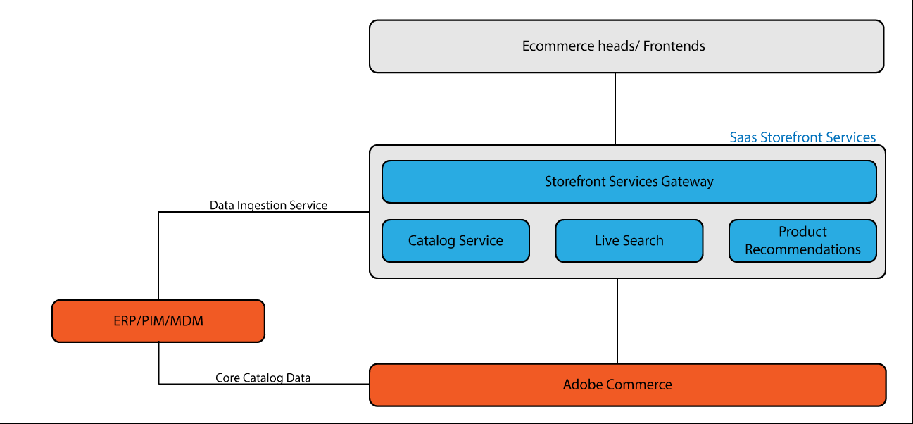

# Feed Ingestion Service

>[!NOTE]
>
>The Feed Ingestion Service is currently in private beta. It is not yet available for general use.

The Feed Ingestion Service decreases the time it takes to process product changes (price updates, adding new attributes) by bypassing the Adobe Commerce instance and moving catalog data from a third-party Enterprise Resource Planning (ERP) directly to Adobe Commerce services.

This service is for customers that store and manage their product catalog in a system external to the core Adobe Commerce application.

Customers with large, complex catalogs, or catalogs that get frequent updates are concerned that the new data could take longer than desired to appear in the live store. Since the Catalog Service knows what data it needs to process these updates, there is no need to send the data through the core Commerce product, only to be forwarded to Catalog Service. Removing this intermediate step is where efficiency gains are found.

## Feed ingestion flows

Depending on the Adobe Commerce configuration, data storage and data flows can take different paths.

* In a standard Adobe Commerce instance, the product catalog is stored within the core database.
* When using Adobe Commerce Services, catalog data is copied from the core database to the service and is processed and delivered from there.
* When storing catalog data in a third-party system (ERP, MDM, PIM), data flows through the core Commerce application and then to the Commerce services.
* With the Feed Ingestion Service, product data goes directly from the third-party system to the Commerce services infrastructure. 

By bypassing the core Commerce application and moving data directly to the Commerce services, product updates are reflected in the store quicker. Core catalog data, such as SKUs, are sent to the core Commerce application for separate processing.

## Join the beta

The Feed Ingestion Service is designed for:

* Mid-enterprise customers with headless implementations
* Customers with large, complex catalogs
* Catalogs with 100 million+ eSKUs
* Catalogs with multiple daily catalog updates
* Customers not using the Adobe Commerce Admin to manage catalog data, instead using an ERP or third-party system to manage catalog data

If you are interested in joining the beta program, contact the team at XXXXX@adobe.com.
