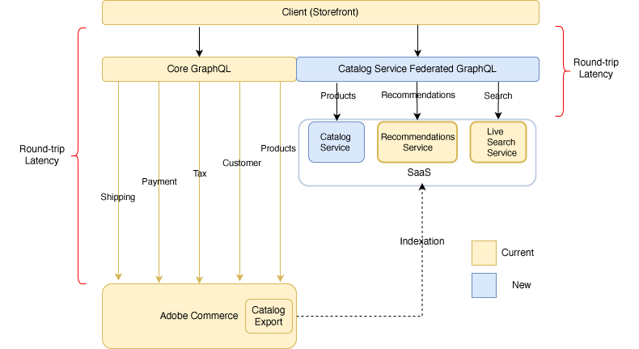

# [!DNL Catalog Service] for Adobe Commerce

The [!DNL Catalog Service] for Adobe Commerce extension provides rich view-model (read-only) catalog data to quickly and fully render product-related storefront experiences, including:

* Product detail pages
* Product list and category pages
* Search result pages
* Product carousels
* Product comparison pages
* Any other pages that render product data, such as cart, order, and wish list pages

The [!DNL Catalog Service] uses [GraphQL](https://graphql.org/) to request and receive product data. GraphQL is a query language that a frontend client uses to communicate with the application programming interface (API) defined on a backend such as Adobe Commerce. GraphQL is a popular method of communication because it is lightweight and allows a system integrator to specify the contents and order of each response.

Adobe Commerce has two GraphQL systems. The core GraphQL system provides a wide range of queries (read operations) and mutations (write operations) that allow a shopper to interact with many types of pages, including product, customer account, cart, checkout, and more. However, the queries that return product information are not optimized for speed. The services GraphQL system can only perform queries on products and related information. These queries are more performant than similar core queries.

Catalog Service customers can use the new [SaaS price indexer](../price-index/index.md).

## Architecture

The following diagram shows the two GraphQL systems:

In the core GraphQL system, the PWA sends a request to the Commerce application, which receives each request, processes it, possibly sending a request through multiple subsystems, then returns a response to the storefront. This round trip can cause slow page load times, potentially leading to lower conversion rates.

[!DNL Catalog Service] is a Storefront Services Gateway. The service accesses a separate database that contains product details and related information, such as product attributes, variants, prices, and categories. The service keeps the database in sync with the Adobe Commerce through indexation.
Because the service bypasses direct communication with the application, it is able to reduce the latency of the request and response cycle.

>[!NOTE]
>
>The gateway is for future integration with Product Recommendations. In this release, you can access the [!DNL Catalog Service GraphQL] and the [!DNL Live Search] queries from the same endpoint if you have a valid license key for both products.

The core and service GraphQL systems do not directly communicate with each other. You access each system from a different URL, and calls require different header information. The two GraphQL systems are designed to be used together. The [!DNL Catalog Service] GraphQL system augments the core system to make product storefront experiences faster.

You can optionally implement [API Mesh for Adobe Developer App Builder](https://developer.adobe.com/graphql-mesh-gateway/) to integrate the two Adobe Commerce GraphQL systems with private and third-party APIs and other software interfaces using Adobe Developer. The mesh can be configured to ensure calls routed to each endpoint contain the correct authorization information in the headers.

## Architectural details

The following sections describe some of the differences between the two GraphQL systems.

### Schema management

Since Catalog Service operates as a service, integrators do not need to be concerned about the underlying version of Commerce. The syntax of the queries is the same for all versions. In addition, the schema is consistent for all merchants. This consistency makes it easier to establish best practices, and increase reuse of storefront widgets significantly.

### Simplification of product types

The schema reduces the diversity of product types to two use cases:

* Simple products are those that are defined with a single price and quantity. Catalog Service maps the simple, virtual, downloadable, and gift card product types to `simpleProductViews`.

* Complex products are comprised of multiple simple products. The component simple products can have different prices. A complex product can also be defined so that the shopper can specify the quantity of component simple products. Catalog Service maps the configurable, bundle, and grouped product types to `complexProductViews`.

Complex product options are unified and distinguished by their behavior, not type. Each option value represents a simple product. This option value has access to the simple product attributes, including price. When the shopper selects all the options for a complex product, the combination of selected options points to a specific simple product. The simple product remains ambiguous until the shopper selects a value for all the available options.

### Prices

Simple products represent the base selling unit that has a price. Catalog Service calculates the regular price before discounts as well as the final price after discounts. Pricing calculations can include fixed product taxes. They exclude personalized promotions.

A complex product does not have a set price. Instead, Catalog Service returns the prices of linked simples. As an example, a merchant can initially assign the same prices to all the variants of a configurable product. If certain sizes or colors are unpopular, the merchant can reduce the prices of those variants. Thus, the price of the complex (configurable) product at first shows a price range, reflecting the price of both standard and unpopular variants. After the shopper has selected a value for all the available options, the storefront displays a single price.

>[!NOTE]
>
> Commerce customers with [!DNL Catalog Service] can take advantage of faster price changes updates and synchornization time on their websites with the [SaaS price indexer](../price-index/index.md).

## Implementation

The installation process requires configuration of the [Commerce Services Connector](../landing/saas.md). Once that is accomplished, the next step is for a systems integrator to update the storefront code to incorporate the [!DNL Catalog Service] queries. All [!DNL Catalog Service] queries are routed to the GraphQL gateway. The URL is provided during the onboarding process.
