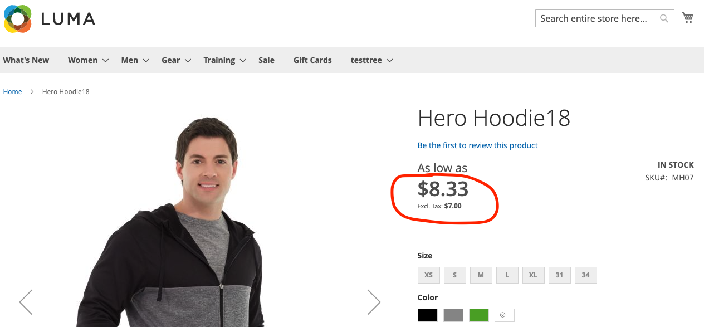

# Display taxed prices with API Mesh for Adobe Developer App Builder

[API Mesh](https://developer.adobe.com/graphql-mesh-gateway/gateway/overview/) enables developers to integrate private or third-party APIs and other interfaces with Adobe products using Adobe I/O Runtime.

In this topic, the API Mesh is used to display product prices on a Product Detail Page with taxes figured in.

## Connect to API Mesh

If not already done, connect the API Mesh with Catalog Service to your instance. See detailed instructions in [Create a Mesh](https://developer.adobe.com/graphql-mesh-gateway/gateway/create-mesh/).

To complete the setup, install the [Adobe Developer CLI package](https://developer.adobe.com/runtime/docs/guides/tools/cli_install/).

After API Mesh is configured on Adobe I/O Runtime, add a `CommerceCatalogServiceGraph` source to your mesh by running the following command.

```bash
aio api-mesh:source:install "CommerceCatalogServiceGraph" -f variables.json
```

Where `variables.json` is a separate file that stores values for your installation. For this command, your Catalog Service API key is required:

```json
{
    "CATALOG_SERVICE_API_KEY":"your_api_key"
}
```

After running this command, your mesh is now connected to your Catalog Service. Run the `aio api-mesh:get` command to view the configuration of your mesh.

## Set up tax rates

You must have taxes configured for them to display on the Product Detail Page.

1. [Set up tax rates](https://experienceleague.adobe.com/docs/commerce-admin/stores-sales/site-store/taxes/tax-rules.html).
1. Enable taxes to be [displayed in the catalog](https://experienceleague.adobe.com/docs/commerce-admin/stores-sales/site-store/taxes/display-settings.html#step-1%3A-configure-catalog-prices-display-settings), and set it to either `Including and Excluding Tax` or `Including Tax`.

Verify that the API mesh with Catalog Service is working by checking a Product Detail Page.



## Configure API Mesh

In this `mesh.json` file, the API Mesh is used to connect to the Adobe Commerce instance.
Replace the `name `, `endpoint`, and `x-api-key` values.

```json
{
    "meshConfig": {
      "sources": [
        {
          "name": "<NAME OF MESH>",
          "handler": {
            "graphql": {
              "endpoint": "<COMMERCE INSTANCE GQL ENDPOINT URL>"
            }
          },
          "transforms": [
              {
                  "prefix": {
                      "includeRootOperations": true,
                        "value": "Core_"
                  }
              }
          ]
        },
        {
          "name": "CommerceCatalogServiceGraph",
          "handler": {
            "graphql": {
              "endpoint": "https://catalog-service-sandbox.adobe.io/graphql/",
              "operationHeaders": {
                "Magento-Store-View-Code": "{context.headers['magento-store-view-code']}",
                "Magento-Website-Code": "{context.headers['magento-website-code']}",
                "Magento-Store-Code": "{context.headers['magento-store-code']}",
                "Magento-Environment-Id": "{context.headers['magento-environment-id']}",
                "x-api-key": "API_KEY",
                "Magento-Customer-Group": "{context.headers['magento-customer-group']}"
              },
              "schemaHeaders": {
                "x-api-key": "<YOUR API_KEY>"
              }
            }
          }
        }
      ],
      "additionalTypeDefs": "extend type ComplexProductView {\n  priceWithTaxes: Core_PriceRange\n}\n extend type SimpleProductView {\n  priceWithTaxes: Core_PriceRange\n}\n",
      "additionalResolvers": [
            {  
              "targetTypeName": "ComplexProductView",
              "targetFieldName": "priceWithTaxes",
              "sourceName": "MagentoQACore",
              "sourceTypeName": "Query",
              "sourceFieldName": "Core_products",
              "requiredSelectionSet": "{\n items {\n sku, \n price_range {\n minimum_price {\n final_price {\n value\n currency\n }\n }\n }\n }\n }",
                "sourceArgs": {
                    "filter.sku.eq": "{root.sku}"
                },
                "result": "items[0].price_range"
            },
            {  
              "targetTypeName": "SimpleProductView",
              "targetFieldName": "priceWithTaxes",
              "sourceName": "MagentoQACore",
              "sourceTypeName": "Query",
              "sourceFieldName": "Core_products",
              "requiredSelectionSet": "{\n items {\n sku, \n price_range {\n minimum_price {\n final_price {\n value\n currency\n }\n }\n }\n }\n }",
                "sourceArgs": {
                    "filter.sku.eq": "{root.sku}"
                },
                "result": "items[0].price_range"
            }
        ]
     }
  }
```

This does a couple things:

* The `transform` block prepends 'Core_' to any queries and types coming from the Commerce core application. This prevents possible naming clashes with Catalog Service.
* Extends the `ComplexProductView` and `SimpleProductView`types with a new field called `priceWithTaxes`. 
* Adds a custom resolver for the new field.

### GraphQL query

You can retrieve the new `priceWithTaxes` data provided by API mesh using GraphQL.

Query example:


```json
query {
    products(skus:[MH07]) {
        __typename
        id
        sku
        name
        description
        shortDescription
        addToCartAllowed
        url
        ... on ComplexProductView {
            priceWithTaxes {
              minimum_price {
                final_price {
                  value
                }
              }
              maximum_price {
                final_price {
                  value
                }
              }
            }
            priceRange {
                maximum {
                    final {
                        amount {
                            value
                            currency
                        }
                    }
                    regular {
                        amount {
                            value
                            currency
                        }
                    }
                    roles
                }
                minimum {
                    final {
                        amount {
                            value
                            currency
                        }
                    }
                    regular {
                        amount {
                            value
                            currency
                        }
                    }
                    roles
                }
            }
        }
    }
}
```

Query response:

```json
{
  "data": {
    "products": [
      {
        "__typename": "ComplexProductView",
        "id": "VFVnd053AFpHVm1ZWFZzZEEAWkRWa09Ua3hNVFl0WTJJd015MDBaRGMwTFRnME16a3RNak01TVRVNE9ESTBOemd4AGJXRnBibDkzWldKemFYUmxYM04wYjNKbABZbUZ6WlEAVFVGSE1EQTFPRFEyTVRjeA",
        "sku": "MH07",
        "name": "Hero Hoodie13",
        "description": "<p>Gray and black color blocking sets you apart as the Hero Hoodie keeps you warm on the bus, campus or cold mean streets. Slanted outsize front pockets keep your style real . . . convenient.</p>\r\n<p>* Full-zip gray and black hoodie.<br />* Ribbed hem.<br />* Standard fit.<br />* Drawcord hood cinch.<br />* Water-resistant coating.</p>",
        "shortDescription": "",
        "addToCartAllowed": true,
        "url": "http://commerce_url/hero-hoodie.html",
        "priceWithTaxes": {
          "minimum_price": {
            "final_price": {
              "value": 8.330001
            }
          },
          "maximum_price": {
            "final_price": {
              "value": 13355.524701
            }
          }
        },
        "priceRange": {
          "maximum": {
            "final": {
              "amount": {
                "value": 39.02,
                "currency": "USD"
              }
            },
            "regular": {
              "amount": {
                "value": 54,
                "currency": "USD"
              }
            },
            "roles": [
              "visible"
            ]
          },
          "minimum": {
            "final": {
              "amount": {
                "value": 39.02,
                "currency": "USD"
              }
            },
            "regular": {
              "amount": {
                "value": 54,
                "currency": "USD"
              }
            },
            "roles": [
              "visible"
            ]
          }
        }
      }
    ]
  },
  "extensions": {}
}
```
