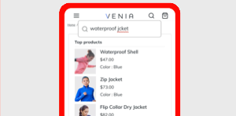

# Services for Adobe Commerce documentation {#commerce-services-documentation}

Adobe provides a collection of hosted services to help merchants support key components of their business. 

## Connect to services

The [Commerce Services Connector](https://docs.magento.com/user-guide/system/saas.html) provides the integration for your Adobe Commerce or Magento Open Source instance using an API key and a private key. For data services (Adobe Commerce only), you can also specify the data space in the configuration. You only need to set this up once.

## Available services

<table>
<tr>
   <td valign="top">
       
    
<a href="https://docs.magento.com/user-guide/recommendations/overview.html">
    <strong>Product recommendations</strong></a>
    

    
(Adobe Commerce only) <em>Add AI-fueled recommendations based on shopper behavior, popular trends, product similarity, and more.</em>

     
  </td>
  <td valign="top">
    
    

    <a href="live-search/guide-overview.md"><strong>Live Search</strong></a>
    

    
(Adobe Commerce only) <em>Implement this AI-powered search tool that delivers smarter, faster and relevant results for B2C shoppers.</em>

     
  </td>
</tr>
<tr>
  <td valign="top">
    
    

    <a href="payment-services/guide-overview.md"><strong>Payment Services</strong></a>
    

    <em>Drive customer satisfaction by easily offering various payment methods, including interest-free payment installments, and a single view into payment processing, orders, and invoices right in your Admin dashboard.</em>
     
  </td>
    <td valign="top">
       
    
<a href="https://experienceleague.adobe.com/docs/commerce-channels/amazon/guide-overview.html">
    <strong>Amazon sales channel</strong></a>
    

    
<em>Build multi-channel commerce experiences for B2B and B2C customers on a single platform. From catalog to payment to fulfillment, our future-proof technology gives you a commerce platform that’s endlessly flexible, extensible, and scalable.</em>

     
  </td>
</tr>
</table>

## What's new

These are recent changes that we think you’d like to know about. We exclude proofreading, spelling corrections, and insignificant updates from this list.

* Updated the [!DNL Live Search] release notes for the [1.3.1 release](live-search/release-notes.md).
* Added a new section, _Boundaries and thresholds_, to the [Install [!DNL Live Search]](live-search/install.md) topic.
* Added [[!DNL Payment Services] guide](payment-services/guide-overview.md) with the latest information of the new marketplace extension and hosted service v1.0.0.
* The [!DNL Live Search] [Performance reporting dashboard](live-search/performance.md) provides insight into the effectiveness of search terms that shoppers use.
* Added B2B support in [[!DNL Product Recommendations]](https://docs.magento.com/user-guide/recommendations/overview.html).
