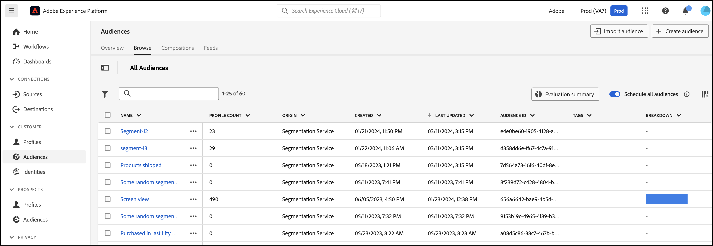
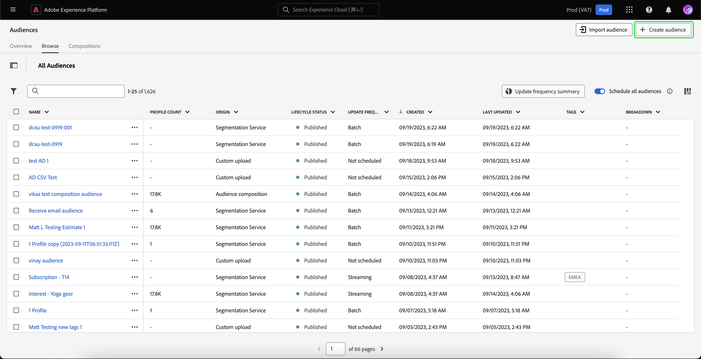
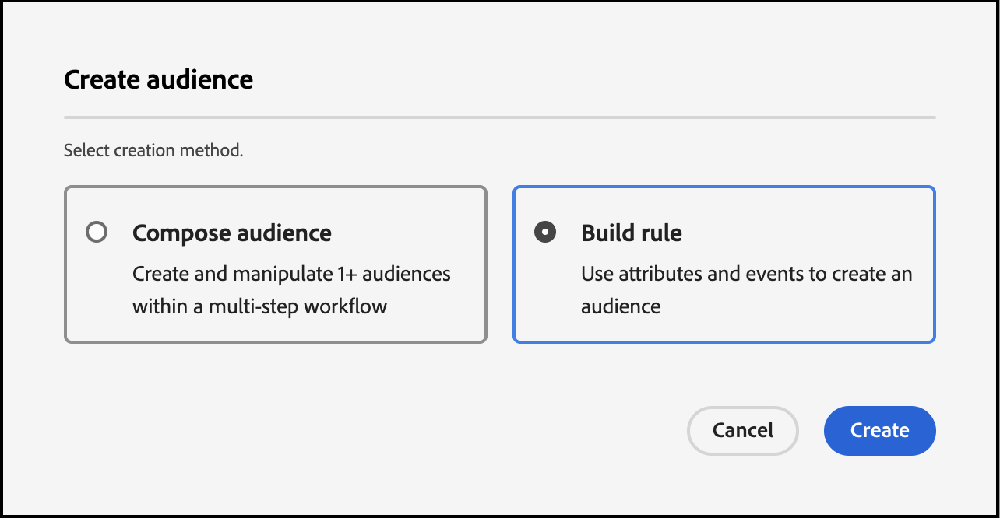
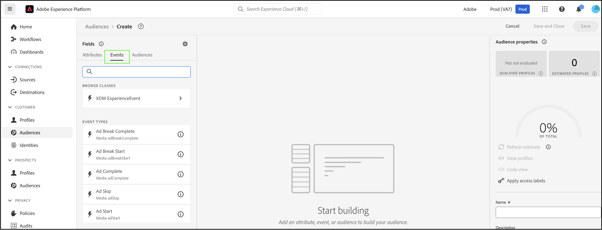
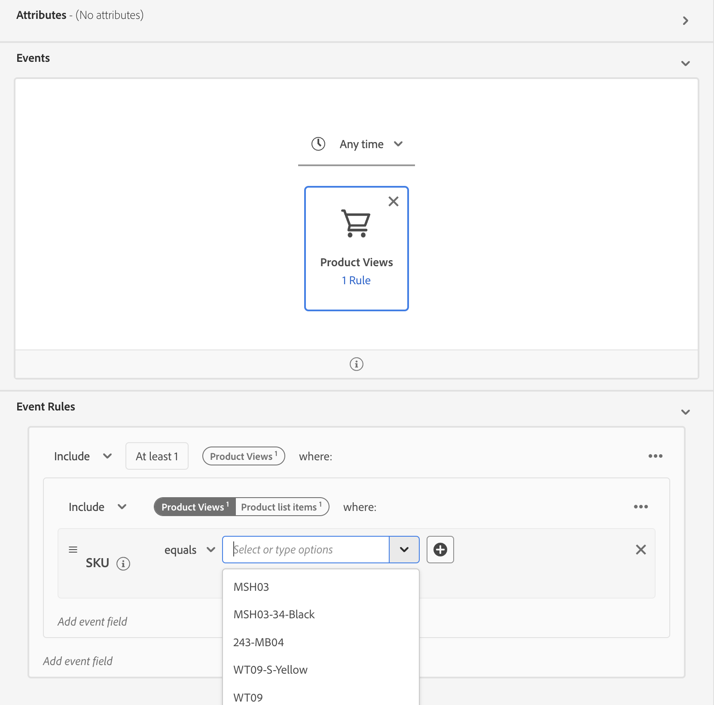

# Create Audiences in Real-Time CDP using [!DNL Commerce] Event Data

Use event data captured from your [!DNL Commerce] store to create audiences in Real-Time CDP. The data captured is based on browsing behavior, past purchases, profile attributes, propensities to convert or to churn, loyalty status, high and low customer value, and more.

## What data should I consider using?

Create audiences in Real-Time CDP using data from storefront, back office, and profile events.

|Data Types|Storefront Data (Behavioral Events)|Back office Data (Server-Side Events)|Customer Profile and Segment Data|
|---|---|---|---|
|**Definition**|Clicks or actions customers take on your site.|Information on the lifecycle and details of each order (past and current).|Who your shoppers are and what segments do they qualify for.| 
|**Events Captured by Adobe Commerce**|[productPageView](events.md#productpageview) [addToCart](events.md#addtocart)|[placeOrder](events.md#completecheckout) [orderplaced](events-backoffice.md#orderplaced) [orderLineItemRefunded](events-backoffice.md#orderlineitemrefunded) [order Canceled](events-backoffice.md#ordercancelled) [order history](connect-data.md#send-historical-order-data)|[createAccount](events.md#createaccount) [editAccount](events.md#editaccount) [Profile Record](events-profilerecord.md)|

## What have other customers achieved?

Adobe [!DNL Commerce] customers have achieved significant business impacts from activating audiences built in Real-Time CDP and deploying them to their [!DNL Commerce] instance.

A global, multi-brand apparel retailer achieved:

- One source of truth with 10s of millions of unified customer profiles
- Created 40+ unique audiences of "high intent customers" to engage across channels

A global beverage company collected:

- 98 million customer profiles from over 100 countries

## Let's get started

In this article, you learn how to:

- Create an audience in Real-Time CDP based on the [!DNL Commerce] data the events collect
- Activate that audience for your [!DNL Commerce] store
- Use the audience in [!DNL Commerce] to inform a cart price rule

>[!IMPORTANT]
>
>Complete the tasks described in this article using your [!DNL Commerce] sandbox environment. This ensures that the storefront and back office event data you send to Experience Platform does not dilute your production event data.

### Prerequisites

Before you begin, ensure:

- You are provisioned to use Real-Time CDP. If you are not sure, check with your systems integrator or the development team that manages projects and environments.
- You [installed](install.md) and [configured](connect-data.md) the [!DNL Data Connection] extension in [!DNL Commerce].
- You [confirmed](connect-data.md#confirm-that-event-data-is-collected) that your [!DNL Commerce] event data is arriving at the Experience Platform edge.

### 1. Create an audience

An audience is a set of customers that share similar behavior or characteristics. In this exercise, you create an audience that qualifies people that are interested in a particular product from your store.

To simplify this exercise, you use event data from the [productPageView](events.md#productpageview) event. This event captures details about the product that was viewed, such as product name, SKU, price, and so on.

Use this event data to specify that the audience includes individuals who have at least one "Product Views" event where the SKU (product identifier) equals a specific product on your site and the event occurs within the last day. ​

1. Open Experience Platform and select **[!UICONTROL Audiences]** from the left navigation menu.

    

1. Click **[!UICONTROL Create Audience]**.

    

    The **Segment Builder** workspace displays.

1. In the **Segment Builder** workspace, select the **Build rule** creation method.

    

    The **Segment Builder** workspace is where you define the rules and conditions for your audience.​ These rules and conditions are based on event and profile data from your Commerce store and define the criteria that determine whether a user qualifies for the audience. For example, you might create a rule that includes users who have viewed a specific product, or users that have made a purchase within a certain time frame. Learn more about [Segment Builder](https://experienceleague.adobe.com/en/docs/experience-platform/segmentation/ui/segment-builder) and rules and conditions.
    
1. Select the [Events](https://experienceleague.adobe.com/en/docs/experience-platform/segmentation/ui/segment-builder#events) tab.

    

1. Search for the "Product Views" event type. Then, drag and drop it into the **Segment Builder** workspace.

1. Return to the **Events** tab and search for "SKU", which is data field under the `productListItems` field. Drag and drop it to the **Segment Builder** workspace on top of the **Product View** event.

    The **Event Rules** section displays where you can specify the specific product you want to build your audience off of.

    

1. Set the time interval to one day by clicking on **Any Time** and selecting *In last* with a value of *1*.

    When building an audience, you can specify a time interval to capture recent activity. Setting a time interval allows you to target users based on their recent interactions or behaviors within a specific timeframe.

1. In the **Audience Properties** section on the right-hand side of the workspace, set the audience properties by providing a name, description, and evaluation method for the audience.

1. To save the audience, click **[!UICONTROL Save and Close]**.

    The details of your audience displays on the **Audience** dashboard.

### 2. Activate the audience to the [!DNL Commerce] destination

You make an audience available in [!DNL Commerce] by activating it for the [!DNL Commerce] destination.

>[!IMPORTANT]
>
>If you have not already set [!DNL Commerce] as an available destination to receive data, see the [Adobe [!DNL Commerce] Connection](https://experienceleague.adobe.com/en/docs/experience-platform/destinations/catalog/personalization/adobe-commerce) topic.

1. In the **Details** tab of your audience, click **Activate to destination**.

1. Select your [!DNL Commerce] destination. Then, click **Next**.

1. Complete the activation process by clicking **[!UICONTROL Finish]**. 

## 3. View the audience in the Audiences Dashboard

In [!DNL Commerce], you can view all [active](https://experienceleague.adobe.com/en/docs/experience-platform/destinations/ui/activate/activate-edge-personalization-destinations) audiences that can be personalized for your [!DNL Commerce] instance using the **Real-Time CDP Audiences** dashboard.

To access the **Real-Time CDP Audiences** dashboard, go to the _Admin_ sidebar, then go to **[!UICONTROL Customers]** > **[!UICONTROL Real-time CDP Audience]**.

In the dashboard, look for the audience you created. Notice it is not being used in a cart price rule or dynamic block. In the next section, you link the audience to a cart price rule. 

### 4. Create a cart price rule based on the audience

This section shows you how to create a cart price rule based on your new audience.

1. Confirm that your new audience is displayed in the **Real-Time CDP Audiences** dashboard.
1. [Create a cart price rule](https://experienceleague.adobe.com/en/docs/commerce-admin/marketing/promotions/cart-rules/price-rules-cart-create).
1. [Set the condition](https://experienceleague.adobe.com/en/docs/commerce-admin/marketing/promotions/cart-rules/price-rules-cart-create#use-real-time-cdp-audiences-to-set-a-condition) of the cart price rule using your new audience.
1. [Set the action](https://experienceleague.adobe.com/en/docs/commerce-admin/marketing/promotions/cart-rules/price-rules-cart-create#step-3-define-the-actions) that you want to occur when the product is added to the cart.
1. Continue to configure your cart price rule.
1. Go to the customer view of your sandbox instance.
1. Add the product you based the audience off of to the cart. Notice that the cart price rule is enabled.

## Wrap up

In this exercise, you created an audience in Real-Time CDP and activated it to the [!DNL Commerce] destination. Then, in the [!DNL Commerce] admin, you created a cart price rule based on that audience and enabled the rule in your sandbox environment.
