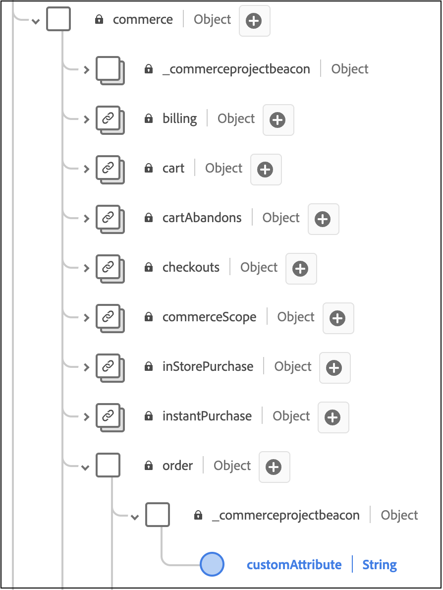
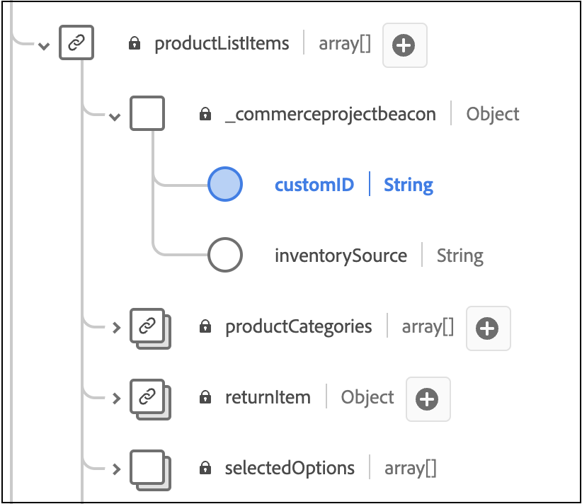

# Add Custom Order Attributes

In this article, you learn how to add custom attributes to back office events. With custom attributes, you can capture rich data insights to enhance analytics and further create personalized experiences for your shoppers.

Custom attributes are supported at two levels:

- Order level 
- Order item level

>[!NOTE]
>
>Adobe [!DNL Commerce] supports custom attributes that have a datatype of string, Boolean, or date.

Adding custom attributes to back office events requires that you:

1. Create a project in your [!DNL Commerce] installation.
1. Update your schema so that the new custom attributes can be properly ingested into Experience Platform.
1. In the Admin, confirm that the custom attributes are being captured and sent to Experience Platform.

>[!IMPORTANT]
>
>The directory structure and code samples below illustrate how you can implement custom attributes. The actual directory structure and code required depends on your store configuration and environment.

## Step 1: Create the directory structure

1. Navigate to the `app/code` directory in your [!DNL Commerce] installation and create a module directory. For example: `Magento/AepCustomAttributes`. This directory contains the files necessary for your custom attributes.
1. In the module directory, create a subdirectory called `etc`. The `etc` directory contains the `module.xml`, `query.xml`, `di.xml`, and `et_schema.xml` files.

## Step 2: Define the dependencies and the setup version

Create a `module.xml` file that defines the dependencies and the setup version. For example:

  ```xml
  <?xml version="1.0"?>
  <config xmlns:xsi="http://www.w3.org/2001/XMLSchema-instance" xsi:noNamespaceSchemaLocation="urn:magento:framework:Module/etc/module.xsd">
      <module name="Magento_AepCustomAttributes">
          <sequence>
              <module name="Magento_SalesOrderDataExporter"/>
          </sequence>
      </module>
  </config>
  ```

## Step 3: Retrieve sales order data

Create a `query.xml` file that retrieves sales order data. For example:

  ```xml
  <?xml version="1.0"?>
  <config xmlns:xsi="http://www.w3.org/2001/XMLSchema-instance" xsi:noNamespaceSchemaLocation="urn:magento:Module:Magento_QueryXml:etc/query.xsd">
    <query name="salesOrdersV2">
      <source name="sales_order">
        <link-source name="sales_order_inventory_source" link-type="inner">
          <attribute name="inventory_source_code" alias="inventory_source" />
          <using glue="and">
            <condition attribute="order_id" operator="eq" type="identifier">entity_id</condition>
           </using> 
          </link-source>
      </source>
    </query>
    </config>
  ```

## Step 4: Set up the dependency injection

Create a `di.xml` file that sets up the dependency injection. For example:

  ```xml
    <?xml version="1.0"?>
    <config xmlns:xsi="http://www.w3.org/2001/XMLSchema-instance" xsi:noNamespaceSchemaLocation="urn:magento:framework:ObjectManager/etc/config.xsd">
        <type name="Magento\AepCustomAttributes\Model\Provider\CustomAttribute">
            <arguments>
                <argument name="usingField" xsi:type="string">commerceOrderId</argument>
            </arguments>
        </type>
        <type name="Magento\AepCustomAttributes\Model\Provider\OrderItemCustomAttribute">
            <arguments>
                <argument name="usingField" xsi:type="string">entityId</argument>
            </arguments>
        </type>
        <type name="Magento\DataServices\Model\ProductContext">
            <plugin name="product-context-plugin" type="Magento\AepCustomAttributes\Plugin\Model\ProductContext"/>
        </type>
    </config>
  ```

## Step 5: Define the services used for the dependency injection

Create a `et_schema.xml` file that defines the services used for the dependency injection. For example:

  ```xml
    <?xml version="1.0"?>
    <config xmlns:xsi="http://www.w3.org/2001/XMLSchema-instance" xsi:noNamespaceSchemaLocation="urn:magento:module:Magento_DataExporter:etc/et_schema.xsd">
        <record name="OrderV2">
            <field name="additionalInformation" type="CustomAttribute" repeated="true" provider="Magento\AepCustomAttributes\Model\Provider\CustomAttribute">
                <using field="commerceOrderId"/>
            </field>
        </record>
        <record name="OrderItemV2">
            <field name="additionalInformation" type="CustomAttribute" repeated="true" provider="Magento\AepCustomAttributes\Model\Provider\OrderItemCustomAttribute">
                <using field="entityId"/>
            </field>
        </record>
    </config>
  ```

## Step 6: Create a directory for the PHP files

At the same level as the `etc` directory, create a directory called `Module/Provider`. This directory contains the `OrderCustomAttributes` and `OrderItemCustomAttributes` PHP files.

## Step 7: Define the OrderCustomAttributes

Create a `OrderCustomAttributes.php` file that defines the order custom attributes. For example:

  ```php
  declare(strict_types=1);

  namespace Magento\AepCustomAttributes\Model\Provider;

  use Magento\Framework\Serialize\Serializer\Json;

  class CustomAttribute
  {
    /**
     * @var Json
     */
    private Json $jsonSerializer;

    /**
     * @var string
     */
    private string $usingField = '';

    /**
     * @param string $usingField
     * @param Json $jsonSerializer
     */
    public function __construct(
        string $usingField,
        Json $jsonSerializer
    ) {
        $this->usingField = $usingField;
        $this->jsonSerializer = $jsonSerializer;
    }

    /**
     * @param array $values
     * @return array
     */
    public function get(array $values): array
    {
        $output = [];

        /**
         * Entity IDs
         */
        $ids = array_column($values, $this->usingField);

        foreach ($this->flatten($values) as $row) {
            $info = \is_string($row['additionalInformation']) ? $row['additionalInformation'] : '{}';
            $unserializedData = $this->jsonSerializer->unserialize($info) ?? [];

            if (isset($row)) {
                $unserializedData['order_channel'] = 'order_channel';
                $unserializedData['order_status'] = 'order_status';

                $additionalInformation = [];
                foreach ($unserializedData as $name => $value) {
                    $additionalInformation[] = [
                        'name' => $name,
                        'value' => \is_string($value) ? $value : $this->jsonSerializer->serialize($value)
                    ];
                }
                foreach ($additionalInformation as $information) {
                    $output[] = [
                        'additionalInformation' => $information,
                        $this->usingField => $row[$this->usingField],
                    ];
                }
            }
        }
        return $output;
    }

    /**
     * @param $values
     * @return array
     */
    private function flatten($values): array
    {
        if (isset(current($values)[0])) {
            return array_merge([], ...array_values($values));
        }
        return $values;
    }
  }
  ```

## Step 8: Define the OrderItemCustomAttributes

Create an `OrderItemCustomAttributes.php` file that defines the order item custom attributes. For example:

  ```php
  declare(strict_types=1);

  namespace Magento\AepCustomAttributes\Model\Provider;

  use Magento\Framework\Serialize\Serializer\Json;

  class OrderItemCustomAttribute
  {
    /**
     * @var Json
     */
    private Json $jsonSerializer;

    /**
     * @var string
     */
    private string $usingField = '';

    /**
     * @param Json $jsonSerializer
     * @param string $usingField
     */
    public function __construct(
        Json $jsonSerializer,
        string $usingField
    ) {
        $this->jsonSerializer = $jsonSerializer;
        $this->usingField = $usingField;
    }

    /**
     * Getting additional attributes data.
     *
     * @param array $values
     * @return array
     */
    public function get(array $values): array
    {
        $output = [];
        $values = $this->flatten($values);

        foreach ($values as $row) {
            $info = \is_string($row['additionalInformation']) ? $row['additionalInformation'] : '{}';
            $unserializedData = $this->jsonSerializer->unserialize($info) ?? [];
            $unserializedData['product_brand'] = implode(',', ['label 1', 'label 2']);

            $additionalInformation = [];
            foreach ($unserializedData as $name => $value) {
                $additionalInformation[] = [
                    'name' => $name,
                    'value' => \is_string($value) ? $value : $this->jsonSerializer->serialize($value)
                ];
            }
            foreach ($additionalInformation as $information) {
                $output[] = [
                    'additionalInformation' => $information,
                    $this->usingField => $row[$this->usingField],
                ];
            }
        }
        return $output;
    }

    /**
     * @param $values
     * @return array
     */
    private function flatten($values): array
    {
        if (isset(current($values)[0])) {
            return array_merge([], ...array_values($values));
        }
        return $values;
    }
  }
  ```

## Step 9: Create a directory for the productContext file

At the same level as the `etc` directory, create a directory called `Plugin/Module`. This directory contains the `ProductContext.php` file.

## Step 10: Define the ProductContext class

Create a file called `ProductContext.php`that defines the `ProductContext` class. For example:

  ```php
  <?php>
  namespace Magento\AepCustomAttributes\Plugin\Model;
  use Magento\Catalog\Model\Product;
  use Magento\DataServices\Model\ProductContext as Subject;
  use Magento\Framework\App\ResourceConnection;

  class ProductContext
  {
      private ?array $brandCache = [];
      public function __construct(
          private ResourceConnection $resourceConnection ) {
      }  

      public function afterGetContextData(Subject $subject, array $result Product $product)
      {
          $brand = $product->getCustomAttribute('cust_attr1');
          if (!empty($brand) && $brand->getValue()) {
              $result['brands'] = ['brand_label_1', 'brand_label_2'];
              }
              return $result;
        }
    }
  ```

## Step 11: Register the module
 
 At the same level as the `etc` directory, create a `registration.php` file that registers the module. For example:

  ```php
  <?php>
  declare(strict_types=1);

  use \Magento\Framework\Component\ComponentRegistrar;

  ComponentRegistrar::register(
      ComponentRegistrar::MODULE,
      'Magento_AepCustomAttributes',
      __DIR__
  );
  ```

## Step 12: Extend your existing XDM schema

To ensure that the new custom order attributes can be ingested by your [!DNL Commerce] schema in Experience Platform, you need to extend the schema to include these custom fields.

To learn how to extend an existing XDM schema to include these custom fields, see the [Create and edit schemas in the UI](https://experienceleague.adobe.com/en/docs/experience-platform/xdm/ui/resources/schemas#custom-fields-for-standard-groups) article in the Experience Platform documentation. The Tenant ID field is dynamically generated; however, the field structure should resemble the example provided in the Experience Platform documentation.

>[!IMPORTANT]
>
>XDM custom attributes must match the attributes sent from [!DNL Commerce].

To `commerce.order`, add a field for Order level:



To `productListItems`, add fields for Order item level:



## Step 12: Confirm that data is being captured

View the [Data Customization](connect-data.md#data-customization) tab in the Admin to confirm that custom attribute data is being captured and sent to the Experience Platform.

### Troubleshooting

If you see the message `No custom order attributes found.` on the **[!UICONTROL Data Customization]** tab, confirm the following:

1. You have completed the prerequisites to enable the [Data Connector extension](overview.md#prerequisites).
1. You have configured [custom order attributes](#add-custom-order-attributes).
1. At least one order event has been generated.
