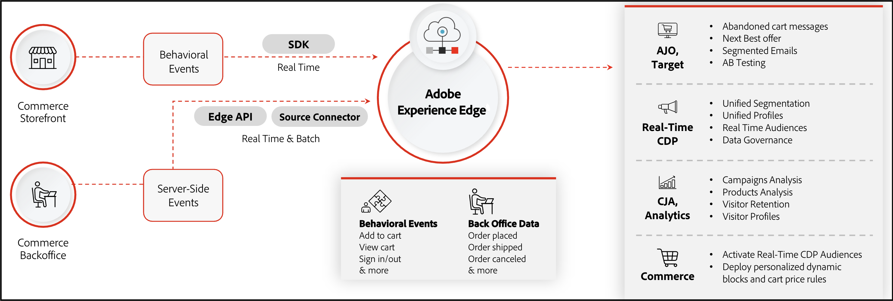

# [!DNL Data Connection] Introduction

>[!IMPORTANT]
>
>The Experience Platform connector has been renamed to [!DNL Data Connection].

The [!DNL Data Connection] extension connects your Adobe Commerce web instance to the Adobe Experience Platform and the Edge Network. For mobile app developers, you use the Adobe Experience Platform Mobile SDK with Commerce to capture and send Commerce data to the Experience Platform. [Learn more](./mobile-sdk-epc.md).

Your Commerce store contains a wealth of data. Information about how your shoppers browse, view, and ultimately purchase the products on your site can reveal opportunities to create a more personalized shopping experience. While that data can inform native Commerce features such as cart price rules and dynamic blocks, the data remains siloed in your Commerce instance. 

The Adobe Experience Platform provides a suite of technologies, that when hydrated with data from your Commerce store, can distribute that data through the Edge Network to other Adobe DX products to unlock insights into your shopper's buying behavior. With these deep insights, you can create a more personalized shopping experience across all channels.

The following image shows how your Commerce data flows from your store to other Adobe DX products when the [!DNL Data Connection] extension is installed and configured.

In the above image, your behavioral, back office, and customer profile data is sent to the Experience Platform edge using an SDK, API, and a source connector. You do not need to fully understand how those pieces work as the extension handles the data sharing complexity for you. When the event data is at the edge, you can pull that data into other Experience Platform applications. For example:

|Application|Purpose|Use Cases|
|---|---|---|
|[Adobe [!DNL Real-Time CDP]](https://experienceleague.adobe.com/docs/experience-platform/rtcdp/intro/rtcdp-intro/overview.html)| Profile management and segmentation service|**Purchase history segmentation**: Merchants can identify customers who purchase an item based on a specific time period (monthly, quarterly, yearly, and so on). Merchants can then create segments for these customers and target them for promotions, campaigns, and as _top of the funnel_ data for leads for subscription services.  **Category-based segmentation**: Merchants can see which category of products were purchased.  **Offering-based segmentation**: Merchants can identify customers who consistently return products. The offers and discounts given to them can now be more intelligent. For example, free shipping can be removed for a customer who returns products all the time.  **Lookalike targeting**: A _Lookalike Audience_ is a methodology taken by a merchant for their promotions to reach new people who are likely to be interested in their business because they share similar characteristics to your existing customers. Lookalike segments can be created based on behavioral and transactional data.  **Customer Propensity**: Changes in customer behavior can be identified as a result of the deeper customer profiles which can be created from the transactional data. There will be a higher confidence in the propensity score as there is more data flowing into the calculations such as product returns and product configurations.  **Cross-sell**: A merchant can identify strong cross-sell and up-sell opportunities from the granular information captured in Commerce.|
|[Customer [!DNL Journey Analytics]](https://experienceleague.adobe.com/docs/analytics-platform/using/cja-overview/cja-overview.html)|Deep analysis of the full Commerce journey|**Seasonal trends**: A merchant can identify seasonal trends, which helps them prepare for the periodic change in demand for particular products. Also, merchants can identify changes in overall popularity of any product across years.  **Conversion analysis**: By knowing when a product was purchased, coupled with access to storefront impression events, merchants can generate a rich profile of the customer to perform conversion analysis.|
|[Adobe [!DNL Analytics]](https://experienceleague.adobe.com/docs/analytics/analyze/admin-overview/analytics-overview.html)|Deep analysis of customer behavior and campaign performance| **Order Returns**: Merchants can identify customers and the larger customer segments who have a pattern of returning products. This helps the merchants improve their commerce strategy as they understand what their customer base behavior looks like.  **Order Address**: Based on the shipping address, a merchant can understand if the orders are being placed by the customers themselves or if it is for another individual or entity.  **Seasonality trends**: A merchant can identify seasonal trends, which helps them prepare for the periodic change in demand for particular products. Also, merchants can identify changes in overall popularity of any product across years.  **Conversion analysis**: By knowing when a product was purchased, coupled with access to storefront impression events, merchants can generate a rich profile of the customer to perform conversion analysis. **Note** Adobe Analytics supports only behavioral (storefront) event data. Adobe Analytics does not support transactional (backoffice) event data.|
|[Adobe [!DNL Journey Optimizer]](https://experienceleague.adobe.com/docs/journey-optimizer/using/get-started/get-started.html)|Campaign orchestration across channels|**Behavior-based journeys**: Merchants can target a customer who bought a mobile phone two years ago by suggesting they purchase the new model. Merchants can create personalized campaigns and promotions for these customers and use email and SMS functionality to reach out. Also, merchants can use historical order and behavioral data to identify trends. For example, a customer who purchased an item with a particular configuration in the past and is now looking at purchasing the same product again, can have their purchase journey enhanced by giving them visibility and access to the same product configurations.  **Personalization**: With access to customer profile information, [!DNL Journey Optimizer] can unlock highly personalized journeys allowing merchants to reach out to the customers on multiple different channels.  **New profile created**: Welcome emails and promotional activities can encourage and influence new customers in their shopping journeys.  **Profile deleted**: Merchants can choose to stop sending promotional emails to clients who have closed their account. Alternatively, merchants can also build campaigns to win back lost customers.|

## Pull Experience Platform data back into Commerce

Sending your Commerce data to the Experience Platform using the [!DNL Data Connection] extension is one side of Commerce's data sharing capabilities. The other side, which is an optional extension, is called [Audience Activation](https://experienceleague.adobe.com/docs/commerce-admin/customers/audience-activation.html). This extension allows you to build audiences in Real-Time CDP and deploy those audiences to your Commerce store to inform cart price rules, related product rules, and dynamic blocks.

At a high level, the flow of data from your Commerce store to the Experience Platform and back through the Audience Activation extension looks like the following:

![[!DNL Data Connection] flow](assets/data-connection.png)

After you set up the connection between Commerce to Experience Platform and Experience Platform to Commerce, the data continues to flow. You do not need to reconnect, unless required to do so by an upgrade.

## Concepts

Sharing data between these two systems requires that you understand several concepts.

* **Data** - The data that gets shared with the Experience Platform is data collected from browser events on your storefront, back office events on the server, and profile record data. Storefront events are captured from shoppers' interactions on the site and include events such as [`addToCart`](events.md#addtocart), [`pageView`](events.md#pageview), [`createAccount`](events.md#createaccount), [`editAccount`](events.md#editaccount), [`startCheckout`](events.md#startcheckout), [`completeCheckout`](events.md#completecheckout), [`signIn`](events.md#signin), [`signOut`](events.md#signout), and so on. See [storefront events](events.md#storefront-events) for the full list of storefront events. Server-side, or back office events, include [order status](events-backoffice.md#order-status) information, such as [`orderPlaced`](events-backoffice.md#orderplaced), [`orderReturned`](events-backoffice.md#orderitemreturncompleted), [`orderShipped`](events-backoffice.md#ordershipmentcompleted), [`orderCancelled`](events-backoffice.md#ordercancelled), and so on. See [back office events](events-backoffice.md) for the full list of back office events. Profile record data contains information when a new profile is created, updated, or deleted. See [profile record data](events-profilerecord.md) to learn more.

* **Experience Platform and Edge Network** - The data warehouse for most Adobe DX products. Data sent to the Experience Platform is then propagated to the Adobe DX products through the Experience Platform Edge Network. For example, you can launch Journey Optimizer, retrieve your specific Commerce event data from the edge, and build an abandoned cart email in Journey Optimizer. Journey Optimizer can then send that email if there are any abandoned carts in your Commerce store. Learn more about the [Experience Platform and the Edge Network](https://experienceleague.adobe.com/docs/platform-learn/data-collection/web-sdk/overview.html).

* **Schema** - The schema is what describes the structure of the data that is being sent. Before Experience Platform can ingest your Commerce data, you must compose a schema to describe the data's structure and provide constraints to the type of data that can be contained within each field. Schemas consist of a base class and zero or more schema field groups. The schema uses the XDM structure, which all Adobe DX products can read. So when you send your data to the Experience Platform you can be sure that your data is understood across all DX products. Learn more about [schemas](https://experienceleague.adobe.com/docs/experience-platform/xdm/home.html).

* **Dataset** - A storage and management construct for a collection of data, typically a table that contains a schema (columns) and fields (rows). Datasets also contain metadata that describes various aspects of the data they store. All data that is successfully ingested into Adobe Experience Platform is contained within datasets. Learn more about [datasets](https://experienceleague.adobe.com/docs/experience-platform/catalog/datasets/overview.html).

* **Datastream** - ID that allows data to flow from Adobe Experience Platform to other Adobe DX products. This ID must be associated to a specific website within your specific Adobe Commerce instance. When you create this datastream, specify the XDM schema you created above. Learn more about [datastreams](https://experienceleague.adobe.com/docs/experience-platform/datastreams/overview.html).

## Supported architecture

The [!DNL Data Connection] extension is available on the following architectures:

* PHP/Luma
* [PWA Studio](https://developer.adobe.com/commerce/pwa-studio/integrations/adobe-commerce/aep/)
* [AEM](https://experienceleague.adobe.com/docs/experience-manager-cloud-service/content/content-and-commerce/integrations/aep.html)

>[!BEGINSHADEBOX]

## Prerequisites

To use the [!DNL Data Connection] extension, you must have the following:

* Adobe Commerce 2.4.4 or newer
* Adobe ID and Organization ID
* [Adobe Client Data Layer (ACDL)](https://experienceleague.adobe.com/docs/experience-platform/tags/extensions/client/client-data-layer/overview.html), which is required to collect storefront event data
* Entitlements to other Adobe DX products.

>[!ENDSHADEBOX]

## Onboarding steps

At a high level, enabling the [!DNL Data Connection] extension involves the following steps: 

1. [Install](install.md) the [!DNL Data Connection] extension.
1. [Sign in](https://helpx.adobe.com/manage-account/using/access-adobe-id-account.html) to your Adobe account and [view to confirm](https://experienceleague.adobe.com/docs/core-services/interface/administration/organizations.html#concept_EA8AEE5B02CF46ACBDAD6A8508646255) your organization ID. The organization ID is the ID associated with your provisioned Experience Cloud company. This ID is a 24-character alphanumeric string, followed by (and must include) `@AdobeOrg`.
1. Ensure you have [permission for data collection in Experience Platform](https://experienceleague.adobe.com/docs/experience-platform/collection/permissions.html).
1. Review the [types of data](data-ingestion.md) you can collect and send.
1. Create or update your [time series event schema](update-xdm.md) or [profile record data schema](profile-data.md) with Commerce-specific field groups.
1. [Create a dataset](https://experienceleague.adobe.com/docs/platform-learn/implement-mobile-sdk/experience-cloud/platform.html#create-a-dataset) based off the schema you created or updated. This dataset contains the Commerce data sent to the Experience Platform Edge.
1. [Create a datastream](https://experienceleague.adobe.com/docs/experience-platform/datastreams/overview.html) and select the XDM schema that contains the Commerce-specific field groups.
1. [Connect to Commerce Services](../landing/saas.md).
1. [Connect to Adobe Experience Platform](connect-data.md).

The remainder of this guide walks you through all of these steps in more detail so you can get to up to speed and begin using the power of Adobe DX products in your Commerce store.

>[!NOTE]
>
>For mobile developers, learn how to [integrate](./mobile-sdk-epc.md) the Adobe Experience Platform Mobile SDK with Commerce.

## Audience

This guide is designed for the Adobe Commerce merchant who wants to enrich and personalize their Commerce store to enhance the shopping experience for their customers.

## Support

If you need information or have questions that are not covered in this guide, use the following resources:

* [Help center](https://experienceleague.adobe.com/docs/commerce-knowledge-base/kb/overview.html){target="_blank"}
* [Support tickets](https://experienceleague.adobe.com/docs/commerce-knowledge-base/kb/help-center-guide/magento-help-center-user-guide.html#submit-ticket){target="_blank"}---Submit a ticket to receive additional help.
