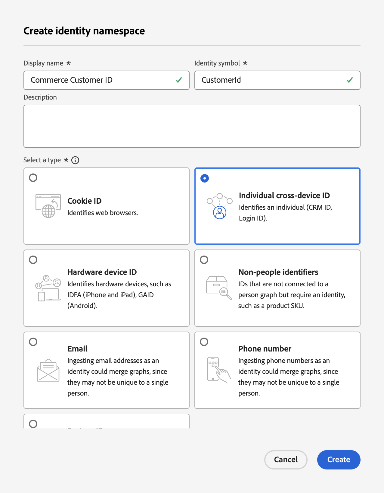

# Update Profile Record Schema for Commerce Data Ingestion (Beta)

When your shoppers create a profile in your Commerce site, a profile record is created and data is captured. You must create a schema and dataset specific to that profile record before you can stream that profile data to the Experience Platform.

1. [Create](https://experienceleague.adobe.com/en/docs/experience-platform/xdm/ui/resources/schemas) a schema and set the class to **Individual Profile**.

1. [Add](https://experienceleague.adobe.com/en/docs/experience-platform/xdm/ui/resources/schemas) the following profile-specific field groups:
    
    - identityMap
    - Demographic Details
    - Personal Contact Details
    - User Account Details

1. [Enable](https://experienceleague.adobe.com/en/docs/experience-platform/xdm/ui/resources/schemas) the schema for Profile.

    When a schema is enabled for Profile, any datasets created from this schema participate in Real-Time CDP, which merges data from disparate sources to construct a complete view of each customer.

1. [Create a dataset](https://experienceleague.adobe.com/en/docs/platform-learn/implement-mobile-sdk/experience-cloud/platform) based on the schema you created or updated.

    A dataset is a storage and management construct for a collection of data, typically a table that contains a schema (columns) and fields (rows). Datasets also contain metadata that describes various aspects of the data they store.

1. Create a [custom name space](https://experienceleague.adobe.com/en/docs/experience-platform/identity/features/namespaces#create-namespaces) in Experience Platform with the following values:

    - **Display Name**: _Commerce Customer ID_
    - **Identity Symbol**: _CustomerId_
    - **Type**: _Individual cross-device ID_

    {width="700" zoomable="yes"}

    Click **[!UICONTROL Create]**. A custom namespace is used by the Unified Profile Service for stitching together profile fragments.

With the schema, dataset, and custom name space configured for customer profile record data, you can [configure](connect-data.md#data-collection) your Commerce instance to collect and send that data to Experience Platform.

To create a schema, dataset, and datastream for behavioral and back office event data, see [update time series event schemas for Commerce data ingestion](update-xdm.md).
