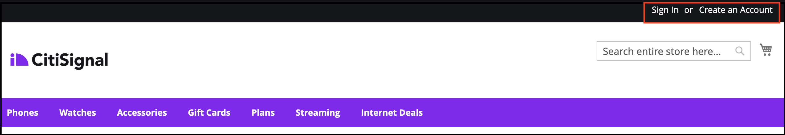
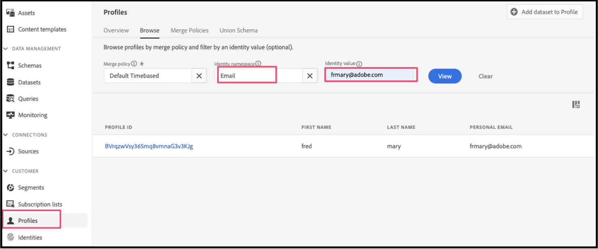
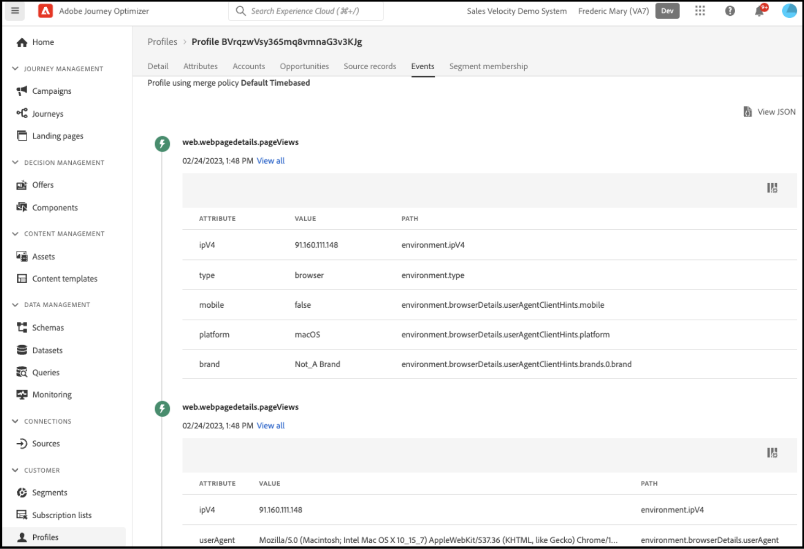
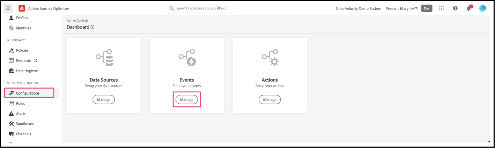
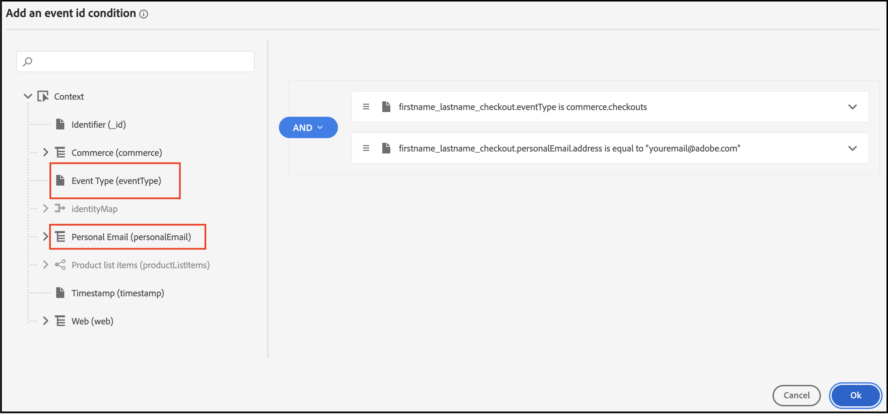
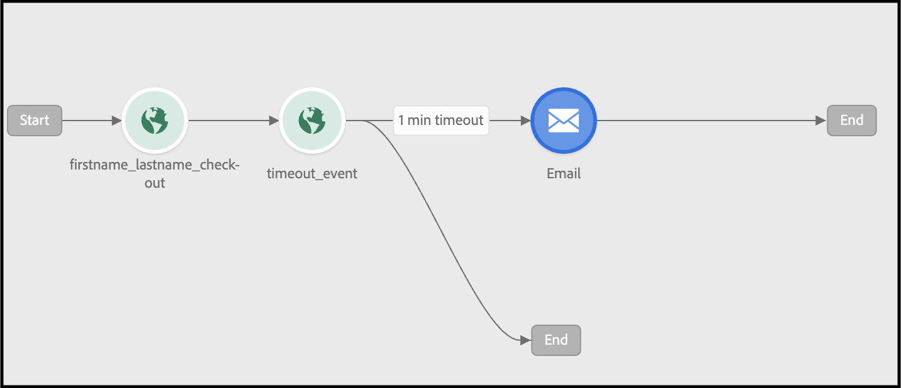
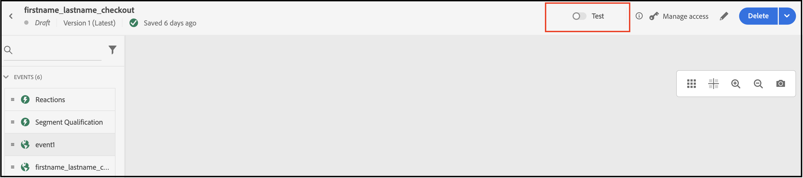

# Use Adobe Journey Optimizer to Send an Abandoned Cart Email

Learn how to deliver a personalized re-engagement email or notification if a cart or browser session has been abandoned. In this article, you use data generated from customers that have viewed a number of products and categories, engaged with a product, or spent time on a page.

## What data should I consider using?

Build an abandoned cart, browse email, or notification using data from storefront and back office events.

|Data Types|Storefront Data (Behavioral Events)|Back office Data (Server-Side Events)|
|---|---|---|
|**Definition**|Clicks or actions customers take on your site.|Information on the lifecycle and details of each order (past and current).|
|**Events Captured by Adobe Commerce**|[pageView](https://experienceleague.adobe.com/en/docs/commerce-merchant-services/data-connection/event-forwarding/events#pageview)<br>[productPageView](https://experienceleague.adobe.com/en/docs/commerce-merchant-services/data-connection/event-forwarding/events)<br>[addToCart](https://experienceleague.adobe.com/en/docs/commerce-merchant-services/data-connection/event-forwarding/events#addtocart)<br>[openCart](https://experienceleague.adobe.com/en/docs/commerce-merchant-services/data-connection/event-forwarding/events#opencart)<br>[startCheckout](https://experienceleague.adobe.com/en/docs/commerce-merchant-services/data-connection/event-forwarding/events#startcheckout)<br>[completeCheckout](https://experienceleague.adobe.com/en/docs/commerce-merchant-services/data-connection/event-forwarding/events#completecheckout)|[orderPlaced](https://experienceleague.adobe.com/en/docs/commerce-merchant-services/data-connection/event-forwarding/events-backoffice#orderplaced)<br>[Order history](https://experienceleague.adobe.com/en/docs/commerce-merchant-services/data-connection/fundamentals/connect-data#send-historical-order-data)|

### What can I do with just Adobe Commerce? 

Use Adobe [!DNL Commerce] to set up rules-based email reminders, which can serve as cart or browse abandonment emails. Learn how here.  

### What can I do with Adobe [!DNL Commerce] and Experience Cloud? 

- **Adobe [!DNL Commerce] with Adobe Journey Optimizer** - Using Adobe [!DNL Commerce] with Adobe Journey Optimizer lets you use [!DNL Commerce] data as the trigger for an omni-channel abandonment journey. You can personalize that journey based on customer attributes, items they abandoned, other shopping behaviors, and past purchase behaviors.  

- **Adobe Commerce, Adobe Journey Optimizer, and Adobe Real-Time CDP** - Adding Real-Time CDP allows you to further refine abandonment campaigns based on unified customer profiles and centrally managed rules-based or AI-powered audiences. For example, you could create:  

   - A "strong converters" audience that has a low abandonment rate
   - A "high consideration" audience that has revisited certain categories multiple times
   - A "high potential" audience that has high spend and loyalty but has recently abandoned 

### What have other customers achieved?

Adobe [!DNL Commerce] customers have achieved significant business impacts by implementing personalized abandonment campaigns using Adobe [!DNL Commerce], Adobe [!DNL Journey Optimizer], and Adobe [!DNL Real-Time CDP].

A global, multi-brand apparel retailer achieved:

- 1.9x conversion on click from new campaigns
- 57% increase in revenue flowing from omni-channel abandonment journeys
- 41% increase in conversion rate of re-engagement campaigns
- 1000+ new shoppers engaged per week

A global beverage company achieved:

- 36% re-engagement email open rates
- 21% lift in clickthrough rates
- 8.5% lift in conversion rate
- 89% of re-engaged abandoners convert

## Let's get started

This particular use-case focuses on creating an abandoned cart email using data from your [!DNL Commerce] instance and sending it to Adobe [!DNL Journey Optimizer].

### What is Adobe Journey Optimizer?

[Adobe Journey Optimizer](https://experienceleague.adobe.com/docs/journey-optimizer/using/get-started/get-started.html) helps you personalize the commerce experience for your shoppers. For example, you can use Journey Optimizer to create and deliver scheduled marketing campaigns, such as weekly promotions for a retail store, or generate an abandoned cart email if a customer added a product to a cart but then did not complete the checkout process.

In this topic, you learn to build an abandoned cart email by listening to a `checkout` event generated from your [!DNL Commerce] instance and responding to that event in Journey Optimizer.

>[!IMPORTANT]
>
>For demonstration purposes, use your [!DNL Commerce] sandbox environment so you do not dilute your production event data with the the storefront and back office event data that you send to Experience Platform.

### Prerequisites

Before you begin with these steps, ensure:

- You are provisioned to use Adobe [!DNL Journey Optimizer]. If you are not sure, check with your systems integrator or the development team that manages projects and environments.
- You [installed](install.md) and [configured](connect-data.md) the [!DNL Data Connection] extension in [!DNL Commerce].
- You [confirmed](connect-data.md#confirm-that-event-data-is-collected) that your [!DNL Commerce] event data is arriving at the Experience Platform edge.

## Step 1: Create a user in your [!DNL Commerce] sandbox environment

Create a user in your sandbox environment and confirm that that user account information appears in Experience Platform. Ensure the email you specified is valid as that is used later in this section to send the abandoned cart email.

1. Sign in or create an account in your [!DNL Commerce] sandbox environment.

    {width="700" zoomable="yes"}
    
    With the [!DNL Data Connection] extension installed and configured, this account information is sent to the Experience Platform as a profile.

1. Confirm that your user account information appears in the **[!UICONTROL Profile]** section of Experience Platform.

    Go to **[!UICONTROL Profiles]** in the Adobe Experience Platform. Click **[!UICONTROL Detail]** in the profile to see the profile you created.

    {width="700" zoomable="yes"}

## Step 2: View events in Journey Optimizer

In your [!DNL Commerce] sandbox environment, trigger events on your storefront by viewing product pages, adding items to a cart, and completing various other activities that a shopper would perform. Then, confirm that these events are flowing to Journey Optimizer.

1. Launch [Adobe Journey Optimizer](https://experienceleague.adobe.com/docs/journey-optimizer/using/get-started/user-interface.html).
1. Select **[!UICONTROL Profiles]**.
1. Set **[!UICONTROL Identity namespace]** to `Email`.
1. Set the **[!UICONTROL Identity value]** to your email address.
1. Select your profile, then select the **[!UICONTROL Events]** tab.

    {width="700" zoomable="yes"}

    Look for the `commerce.checkouts` event and examine the event payload:

    ```json
    "personID": "84281643067178465783746543501073369488", 
    "eventType": "commerce.checkouts", 
    "_id": "4b41703f-e42e-485b-8d63-7001e3580856-0", 
    "commerce": { 
        "cart": {}, 
        "checkouts": { 
            "value": 1 
        } 
    ```

    As you can see, the full event payload contains rich event data. In the next section, you will configure events in Journey Optimizer to listen for and respond to the `commerce.checkouts` event generated from your [!DNL Commerce] storefront.

## Step 3: Configure events in Journey Optimizer

Configure two events in Journey Optimizer: one event listens for the `commerce.checkouts` event from Commerce, and the other is a basic timeout event that waits for a specific amount of time to pass before triggering an abandoned cart email.

### Create a listener event

1. Launch [Adobe Journey Optimizer](https://experienceleague.adobe.com/docs/journey-optimizer/using/get-started/user-interface.html).

1. Click **[!UICONTROL Configurations]** under the **[!UICONTROL Administration]** section of the left pane. 

1. In the **[!UICONTROL Events]** tile, click **[!UICONTROL Manage]**.

    {width="700" zoomable="yes"}

1. On the **[!UICONTROL Events]** page, click **[!UICONTROL Create Event]**.

1. In the right navigation, set up your event as follows:

    1. Set the **[!UICONTROL Name]** to: `firstname_lastname_checkout`.
    1. Set **[!UICONTROL Type]** to **[!UICONTROL Unitary]**.
    1. Set **[!UICONTROL Event id typ]e** to **[!UICONTROL Rule based]**.
    1. Set **[!UICONTROL Schema]** to your [!DNL Commerce] [schema](update-xdm.md).
    1. Select **[!UICONTROL Fields]** to open the **[!UICONTROL Fields]** page. Then, select the fields that are useful for this event. For example, select all fields under the **[!UICONTROL Product list items]**, **[!UICONTROL Commerce]**, **[!UICONTROL eventType]**, and **[!UICONTROL Web]**.
    1. Click **[!UICONTROL OK]** to save the selected fields.
    1. Click inside the **[!UICONTROL Event id condition]** field. Then, create a condition: `eventType` is equal to `commerce.checkouts` AND `personalEmail.address` is equal to the email address you used when you created the profile in the previous section.

        {width="700" zoomable="yes"}
    
    1. Click **[!UICONTROL OK]**.
    1. Click **[!UICONTROL Save]** to save your event.

### Create a timeout event

1. Create an event in Journey Optimizer as you did before.

1. In the right navigation, set up your event as follows:

    1. Set the **[!UICONTROL Name]** to: `firstname_lastname_timeout`.
    1. Set **[!UICONTROL Type]** to **[!UICONTROL Unitary]**.
    1. Set **[!UICONTROL Event id type]** to **[!UICONTROL Rule based]**.
    1. Set **[!UICONTROL Schema]** to your [!DNL Commerce] [schema](update-xdm.md).
    1. Set the **[!UICONTROL Schema]**, **[!UICONTROL Fields]**, and **[!UICONTROL Event id condition]** to the same as above.
    1. Click **[!UICONTROL Save]** to save your event.

With these two events configured, create a journey that sends an abandoned cart email.

## Step 4: Build a checkout journey

Create a journey that listens for the `commerce.checkouts` event and then sends an abandoned cart email after a specified amount of time has passed.

1. In Journey Optimizer, select **[!UICONTROL Journeys]** under **J[!UICONTROL OURNEY MANAGEMENT]**.
1. Click **[!UICONTROL Create Journey]**.
1. Specify the name of your journey.
1. Click **[!UICONTROL OK]** to save the journey.  
1. In the left navigation under the **[!UICONTROL EVENTS]** section, search for the checkout event you previously created: `firstname_lastname_checkout` and drag and drop it on the canvas.  

    >[!TIP]
    >
    >Double-clicking the event automatically adds it to the canvas. 

1. Search for the timeout event and add it to the canvas. 
1. Double-click the timeout event.

    1. In the **[!UICONTROL Timeout]** section, select the **[!UICONTROL Define the event time]** checkbox.
    1. In the **[!UICONTROL Wait for]** field enter `1` and `Minute`.
    1. Select the **[!UICONTROL Set a timeout path]** checkbox.
    
    With this timeout configuration, a shopper that performs a checkout but does not complete the order within one minute triggers this timeout branch. In an actual production environment, you would set this for a longer period, like 24 hours.

1. In the left navigation under **[!UICONTROL ACTIONS]**, add the **[!UICONTROL Email]** action to the timeout branch. Your journey should look like the following:

    {width="700" zoomable="yes"}

### Create an abandoned cart email

Create an abandoned cart email that is sent when an abandoned cart is detected.

1. In the journey you created above, double-click the **[!UICONTROL Email]** icon on the canvas.

1. Follow the [steps](https://experienceleague.adobe.com/docs/journey-optimizer/using/content-management/personalization/personalization-use-cases/personalization-use-case-helper-functions.html#configure-email) in the Journey Optimizer guide to create the abandoned cart email.

You now have a journey in Journey Optimizer that listens for the `commerce.checkouts` event from your [!DNL Commerce] store and an abandoned cart email that is sent after a period of time has passed. The next section shows you how to test the journey.

## Step 5: Trigger the checkout event in real time

In this section, you test the event in real time.

1. In Journey Optimizer, toggle on Test mode.

    {width="700" zoomable="yes"}

1. To test this journey in real time, open another browser tab and go to the [!DNL Commerce] website in your sandbox environment.

    1. Add a product to your cart.
    1. Go to the checkout page.
    1. From the checkout page, abandon the cart by going back to the main page or closing your tab.
    
        The journey is now triggered. To confirm, open the tab that has your journey in Journey Optimizer. You should see a green arrow that shows the path that your user went through.

1. Check your inbox for the email.
