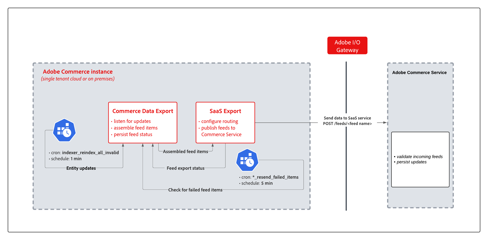

# Synchronize data with SaaS Data Export

When you install a Commerce Service that requires data export such as Catalog Service, Live Search, or Product Recommendations, a collection of Saas data export modules is installed to manage the data collection and synchronization process.

SaaS data export moves product data from an Adobe Commerce instance to the Commerce Services platform on an ongoing basis to keep the data up to date. For example, Product Recommendations requires current catalog information to accurately return recommendations with correct names, pricing, and availability. Use the [Data Management dashboard](https://experienceleague.adobe.com/en/docs/commerce-merchant-services/user-guides/data-services/catalog-sync) to observe and manage the synchronization process, or the command-line interface to trigger a sync and to reindex product data for consumption by Commerce Services.

 The following diagram shows the SaaS data export flow.

{width="900" zoomable="yes"}

The main components of the SaaS data export flow include:

- SaaS data export modules that collect the data for feeds from Adobe Commerce, assemble feed items, listen for updates, and persist feed status.
- SaaS export modules that export data, configure routing, and publish the feeds to connected services.
- The Adobe Commerce Service manages the data ingestion process to validate incoming feeds and persist updates to connected services.

## Synchronization modes

SaaS data export has two modes to process entity feeds:

- **Immediate export mode**—In this mode, data is collected and sent immediately to the Commerce Service in a single iteration. This mode speeds up delivery of entity updates to the Commerce Service and reduces the storage size of the feed tables.

- **Legacy export mode**—In this mode, data is collected in a single process. Then, a cron job sends the collected data to the connected commerce services. In data export log entries, feeds that use the legacy mode are labeled `(legacy)`.

## Synchronization types

SaaS data export supports three synchronization types–full sync, partial sync, and retry failed items sync.

### Full Sync

After connecting an Adobe Commerce instance to Commerce Service, perform a full sync to send entity feed data from Adobe Commerce to the connected service.

>[!NOTE]
>
>Full sync is mainly for the onboarding phase. Avoid regular use to prevent database overload. After the initial synchronization, ongoing changes are synched automatically using partial sync.

### Partial sync

With partial sync, SaaS data export automatically sends updates from the Commerce application, such as product name changes or price updates, to connected commerce services.

The data export process uses the following cron jobs to automate the partial sync operation.

- "index" cron group jobs:
    - The `indexer_reindex_all_invalid` job reindexes all invalid feeds. It is a standard Adobe Commerce cron job.
    - The `saas_data_exporter` job is for legacy export feeds.
    - The `sales_data_exporter` job is specific to the sales data export feed.

These jobs run every minute.

For partial sync to work, the Commerce application requires the following configuration:

- [Task scheduling is enabled via cron jobs](https://experienceleague.adobe.com/docs/commerce-operations/installation-guide/next-steps/configuration.html)

- All SaaS data export indexers are configured in `Update by Schedule` mode.

  In SaaS data export version 103.1.0 and later, `Update by Schedule` mode is enabled by default. You can verify index configuration on the server using the Commerce CLI command, `bin/magento indexer:show-mode | grep -i feed`

### Retry Failed Items sync

The Retry failed items sync uses a separate process to resend items that failed to sync due to errors during the synchronization process, for example an application error, network disruption, or SaaS service error. Implementation for this sync is also based on cron jobs.

- `resync_failed_feeds_data_exporter` cron group jobs:
    - The `<feed name>_feed_resend_failed_feeds_items` job resends items that failed to sync, for example `products_feed_resend_failed_items`.

### View and manage the synchronization process

Most synchronization activities are processed automatically based on the application configuration. However, SaaS data export also provides tools to manage the process.

- Admin users can view and track synchronization progress and get information about the data from the [Data Management dashboard](https://experienceleague.adobe.com/en/docs/commerce-admin/systems/data-transfer/data-dashboard).

- Developers, system integrators, or administrators with access to the Commerce application server can manage the synchronization process and data feeds using the Adobe Commerce command-line tool (CLI). See [Data Export Command Reference](data-export-cli-commands.md).

### Verify Commerce application configuration

Partial sync and Retry failed items sync work only if the Commerce instance has been configured correctly. Typically, the configuration is completed when setting up the Commerce Service. If the data export is not working correctly, check the following configuration.

- [Confirm that cron jobs are running](https://experienceleague.adobe.com/en/docs/commerce-knowledge-base/kb/troubleshooting/miscellaneous/cron-readiness-check-issues).

- Verify that the indexers are running from the [Admin](https://experienceleague.adobe.com/en/docs/commerce-admin/systems/tools/index-management) or by using the Commerce CLI command `bin/magento indexer:info`.

- Verify that the indexers for the following feeds are set to `Update by Schedule`: Catalog Attributes, Product, Product Overrides, and Product Variant. You can check the indexers from [Index Management](https://experienceleague.adobe.com/en/docs/commerce-admin/systems/tools/index-management) in the Admin or using the CLI (`bin/magento indexer:show-mode | grep -i feed`).

### Event manager notifications for data transfer logging

In version 103.3.4 and later, SaaS Data Export dispatches the `data_sent_outside` event when data is sent from the Commerce instance to Adobe Commerce services.

```php
$this->eventManager->dispatch(
   "data_sent_outside",
   [
       "timestamp" => time(),
       "type" => $metadata->getFeedName(),
       "data" => $data
   ]
);
```

>[!NOTE]
>
>For information about events and how to subscribe to them, see [Events and Observers](https://developer.adobe.com/commerce/php/development/components/events-and-observers) in the Adobe Commerce Developer documentation.