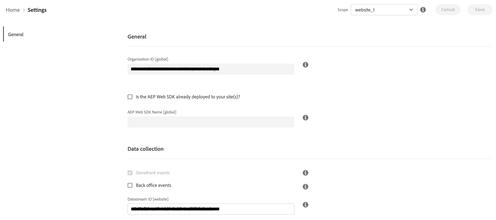

# Connect Commerce data to Adobe Experience Platform {#connectaep}

To connect your Adobe Commerce instance to the Adobe Experience Platform, you must provide an organization ID and a datastream ID.

## General

1. Sign in to your Adobe account in the [Commerce Services Connector](../landing/saas.md#organizationid) and select your organization ID.

1. In the Admin, go to **System** > Services > **Experience Platform Connector**.

1. In the **Scope** drop-down, set the context to **Website**.

1. In the **Organization ID** field, you see the ID associated with your Adobe Experience Platform account, as configured in the [Commerce Services Connector](../landing/saas.md#organizationid). The organization ID is global. Only one organization ID can be associated per Adobe Commerce instance.

1. (Optional) If you already have an AEP Web SDK deployed to your site, enable the checkbox and add the name of your AEP Web SDK. Otherwise, leave these fields blank and the Experience Platform connector deploys one for you.

    >[!NOTE]
    >
    >If you specify your own Experience Platform Web SDK, the Experience Platform connector uses the datastream ID associated with that SDK and not the datastream ID specified on this page (if any).

## Data collection

In the **Data collection** section you specify what types of data to collect and send to the Experience Platform edge. By default, storefront events are automatically sent as long as the AEP Web SDK and Organization ID are valid. See the events topic to learn more about [storefront](events.md#storefront-events) and [back office](events.md#beta-order-status-events) events.

1. Select **Back office events** if you want to send order status information, such as if an order was placed, cancelled, refunded, or shipped.

1. [Create](https://experienceleague.adobe.com/docs/experience-platform/edge/datastreams/configure.html#create) a new datastream in the Adobe Experience Platform or select an existing datastream you want to use for collection.

1. In the **Datastream ID** field, paste the ID of that new or existing datastream.

    >[!NOTE]
    >
    >The scope of the datastream ID must be set at the website level or higher. At that level, the same datastream ID is used for each website in the hierarchy. You cannot set the datastream ID scope at the storeview level.

## Field descriptions

| Field | Description |
|--- |--- |
| Scope | Specific website where you want the configuration settings to apply. |
| Organization ID (Global)| ID that belongs to the organization that purchased the Adobe DX product. This ID links your Adobe Commerce instance to Adobe Experience Platform. |
| Datastream ID (Website) | ID that allows data to flow from Adobe Experience Platform to other Adobe DX products. This ID must be associated to a specific website within your specific Adobe Commerce instance. |
|AEP Web SDK Name (Global)| If you do not have an Experience Platform Web SDK deployed to your site, leave this field blank and the Experience Platform connector deploys one for you. If you already have an Experience Platform Web SDK deployed to your site, specify the name of that SDK in this field. This allows the Storefront Event Collector and Storefront Event SDK to use your Experience Platform Web SDK rather than the version deployed by the Experience Platform connector.|

With the Experience Platform connector extension installed, the link between Adobe Commerce and Adobe Experience Platform created, and the Datastream ID specified, Commerce data begins to flow to the Adobe Experience Platform edge and to other Adobe DX products. 

>[!NOTE]
>
> The amount of time it takes for data to flow from the edge to other Adobe DX products can vary.

## Commerce data at the edge

When Commerce data is sent to the Adobe Experience Platform edge, you can build reports like the following:

_Commerce Data in Adobe Experience Manager_
