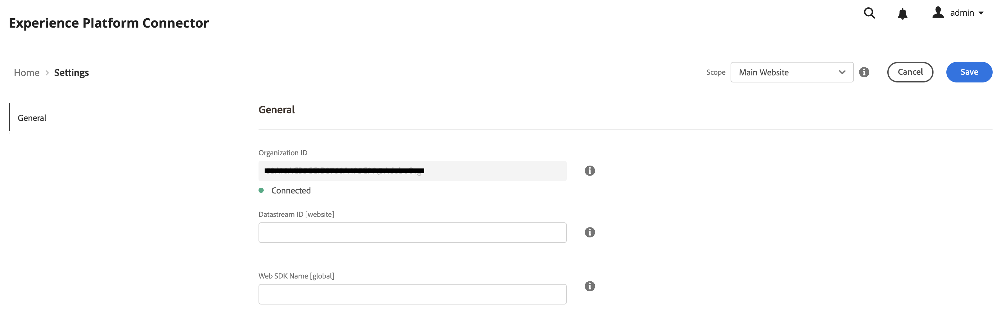

# Connect Commerce data to Adobe Experience Platform {#connectaep}

To connect your Adobe Commerce instance to the Adobe Experience Platform, you must provide an organization ID and a datastream ID.

1. Sign in to your Adobe account in the [Commerce Services Connector](../landing/saas.md#organizationid) and select your organization ID.

1. In the Admin, go to **System** > Services > **Experience Platform Connector**.

1. In the **Scope** drop-down, set the context to Website.

1. In the **Organization ID** field, you see the ID associated with your Adobe Experience Platform account, as configured in the [Commerce Services Connector](../landing/saas.md#organizationid). The organization ID is global. Only one organization ID can be associated per Adobe Commerce instance.

1. In the **Datastream ID** field, paste the ID of the datastream you [created](https://experienceleague.adobe.com/docs/experience-platform/edge/datastreams/overview.html) in the Adobe Experience Platform.

1. (Optional) In the **Web SDK name** field, paste the name of the Web SDK already deployed to your site. If you do not have a Web SDK deployed to your site, the Experience Platform connector installs one for you. In that case, you can leave this field blank.

## Relationship of datastream ID and your Commerce instance website

CLARIFY that certain fields are global while the datastream is per website!!!

The datastream ID enables event forwarding from Adobe Experience Platform to other Adobe DX products and must be associated to a specific website within your specific Adobe Commerce instance. You can also associate multiple websites to the same datastream ID. It depends on what makes the most sense for your business. [Learn more](https://experienceleague.adobe.com/docs/experience-platform/edge/datastreams/overview.html?lang=en#event-forwarding-settings) about event forwarding.

## Field descriptions

| Field | Description |
|--- |--- |
| Scope | Specific website where you want the configuration settings to apply. |
| Organization ID (Global)| ID that belongs to the organization that purchased the Adobe DX product. This ID links your Adobe Commerce instance to Adobe Experience Platform. |
| Datastream ID (Website) | ID that allows data to flow from Adobe Experience Platform to other Adobe DX products. This ID must be associated to a specific website within your specific Adobe Commerce instance. |
|Web SDK name| If you already have a Web SDK deployed to your site, specify the name of that SDK in this field. This allows the Storefront Event Collector and Storefront Event SDK to use your Web SDK rather than the version installed by the Experience Platform connector.|

With the Experience Platform connector extension installed, the link between Adobe Commerce and Adobe Experience Platform created, and the Datastream ID specified, Commerce data begins to flow to the Adobe Experience Platform edge and to other Adobe DX products. 

>[!NOTE]
>
> The amount of time it takes for data to flow from the edge to other Adobe DX products can vary.

## Commerce data at the edge

When Commerce data is sent to the Adobe Experience Platform edge, you can build reports like the following:

_Commerce Data in Adobe Experience Manager_
