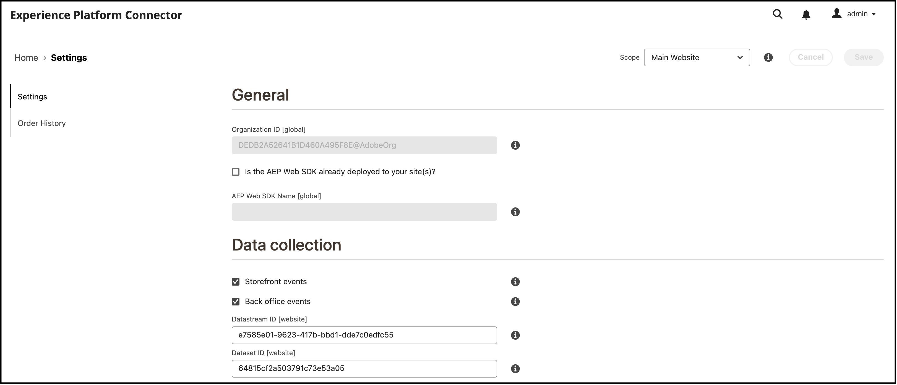

# Connect Commerce data to Adobe Experience Platform

When you install the Experience Platform connector, two new configuration pages appear in the **System** menu under **Services** in the Commerce _Admin_.

- Commerce Services Connector
- Experience Platform Connector

To connect your Adobe Commerce instance to the Adobe Experience platform, you must configure both connectors, starting with the Commerce Services connector then finishing with the Experience Platform connector.

## Update the Commerce Services connector

If you have previously installed an Adobe Commerce service, you probably have already configured the Commerce Services connector. If not, then you must complete the following tasks on the [Commerce Services connector](../landing/saas.md) page:

1. Log in to your Commerce account to [retrieve your production and sandbox API keys](../landing/saas.md#credentials).
1. Select a [SaaS data space](../landing/saas.md#saas-configuration).
1. Log in to your Adobe account to [retrieve your Organization ID](../landing/saas.md#ims-organization-optional).

After you configure the Commerce Services connector, you then configure the Experience Platform connector.

## Update the Experience Platform connector

In this section, you connect your Adobe Commerce instance to the Adobe Experience Platform using your organization ID. You can then specify the type of data - storefront or back office - to send to the Experience Platform edge.



## General

1. Sign in to your Adobe account in the [Commerce Services Connector](../landing/saas.md#organizationid) and select your organization ID.

    >[!NOTE]
    >
    >If you previously configured the Commerce Services connector, you can skip this step as your organization ID has already been selected.

1. In the Admin, go to **System** > Services > **Experience Platform Connector**.

1. In the **Scope** drop-down, set the context to **Website**.

1. In the **Organization ID** field, verify the ID associated with your Adobe Experience Platform account, as configured in the [Commerce Services Connector](../landing/saas.md#organizationid). The organization ID is global. Only one organization ID can be associated per Adobe Commerce instance.

1. (Optional) If you already have an [AEP Web SDK (alloy)](https://experienceleague.adobe.com/docs/experience-platform/edge/home.html) deployed to your site, enable the checkbox and add the name of your AEP Web SDK. Otherwise, leave these fields blank and the Experience Platform connector deploys one for you.

    >[!NOTE]
    >
    >If you specify your own AEP Web SDK, the Experience Platform connector uses the datastream ID associated with that SDK and not the datastream ID specified on this page (if any).

## Data collection

In the **Data collection** section, select storefront and/or back office data to send to the Experience Platform edge. To ensure your Adobe Commerce instance can begin data collection, review the [prerequisites](overview.md#prerequisites).

See the events topic to learn more about [storefront](events.md#storefront-events) and [back office](events.md#back-office-events) events.

>[!NOTE]
>
>All fields in the **Data collection** section apply to the **Website** scope or higher.

1. Select **Storefront events** if you want to send storefront behavioral data.

    >[!NOTE]
    >
    >The **Storefront events** checkbox is automatically enabled if the AEP Web SDK and Organization ID are valid.

1. Select **Back office events** if you want to send order status information, such as if an order was placed, canceled, refunded, or shipped.

    >[!NOTE]
    >
    >If you select **Back office events**, all back office data is sent to the Experience Platform edge. If a shopper chooses to opt out of data collection, you must explicitly set the shopper's privacy preference in the Experience Platform. This is different from storefront events where the collector already handles consent based on shopper preferences. [Learn more](https://experienceleague.adobe.com/docs/experience-platform/landing/governance-privacy-security/consent/adobe/dataset.html) about setting a shopper's privacy preference in the Experience Platform.

1. To ensure back office event data updates based on a schedule according to a [cron](https://experienceleague.adobe.com/docs/commerce-admin/systems/tools/cron.html) job, you must change the `Sales Orders Feed` index to `Update by Schedule`.

    1. On the _Admin_ sidebar, go to **[!UICONTROL System]** > _[!UICONTROL Tools]_ > **[!UICONTROL Index Management]**.

    1. Select the checkbox for the `Sales Orders Feed` indexer.

    1. Set **[!UICONTROL Actions]** to `Update by Schedule`.

    1. If you are enabling back office data for the first time, run the following commands to reindex and trigger a resync. Subsequent resyncs occur automatically as long as the [cron](https://experienceleague.adobe.com/docs/commerce-admin/systems/tools/cron.html) job is set up correctly.

        ```bash
        bin/magento index:reindex sales_order_data_exporter_v2
        ```

        ```bash
        bin/magento saas:resync --feed orders
        ```

1. (Skip this step if you are using your own AEP Web SDK.) [Create](https://experienceleague.adobe.com/docs/experience-platform/edge/datastreams/configure.html#create) a datastream in the Adobe Experience Platform or select an existing datastream you want to use for collection.

1. (Skip this step if you are using your own AEP Web SDK.) In the **Datastream ID** field, paste the ID of that new or existing datastream.

## Field descriptions

| Field | Description |
|--- |--- |
| Scope | Specific website where you want the configuration settings to apply. |
| Organization ID (Global)| ID that belongs to the organization that purchased the Adobe DX product. This ID links your Adobe Commerce instance to Adobe Experience Platform. |
|Is the AEP Web SDK already deployed to your site|Select this checkbox if you have deployed your own AEP Web SDK to your site|
|AEP Web SDK Name (Global)| If you already have an Experience Platform Web SDK deployed to your site, specify the name of that SDK in this field. This allows the Storefront Event Collector and Storefront Event SDK to use your Experience Platform Web SDK rather than the version deployed by the Experience Platform connector. If you do not have an Experience Platform Web SDK deployed to your site, leave this field blank and the Experience Platform connector deploys one for you.|
|Storefront events|Is checked by default as long as the Organization ID and datastream ID are valid. Storefront events collect anonymized behavioral data from your shoppers as they browse your site.|
|Back Office events| If checked, event payload contains anonymized order status information, such as if an order was placed, canceled, refunded, or shipped. |
| Datastream ID (Website) | ID that allows data to flow from Adobe Experience Platform to other Adobe DX products. This ID must be associated to a specific website within your specific Adobe Commerce instance. If you specify your own Experience Platform Web SDK, do not specify a datastream ID in this field. The Experience Platform connector uses the datastream ID associated with that SDK and ignores any datastream ID specified in this field (if any).|

## Verify that data is being sent to Experience Platform

After onboarding, storefront data begins to flow to the Experience Platform edge. Back office data, however, takes about 5 minutes for the data to appear at the edge. Subsequent updates are visible immediately at the edge.

When Commerce data is sent to the Experience Platform edge, you can build reports like the following:


_Commerce Data in Adobe Experience Platform_
