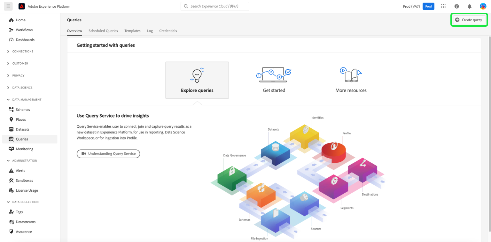
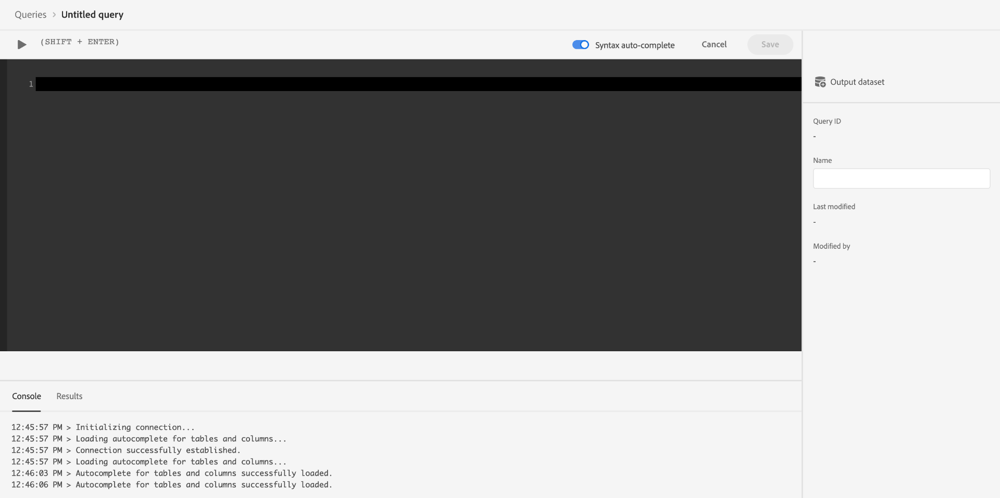
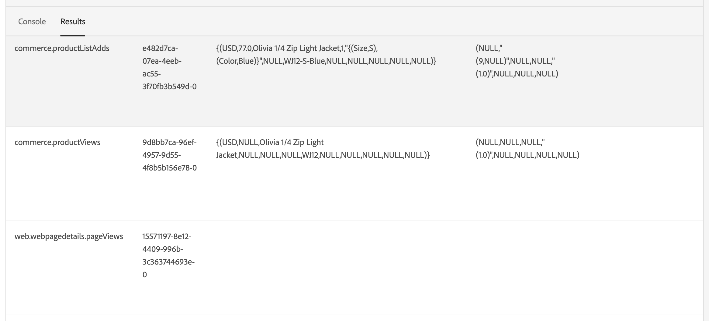

# Connect Commerce data to Adobe Experience Platform

When you install the Experience Platform connector, two new configuration pages appear in the **System** menu under **Services** in the Commerce _Admin_.

- Commerce Services Connector
- Experience Platform Connector

To connect your Adobe Commerce instance to the Adobe Experience Platform, you must configure both connectors, starting with the Commerce Services connector then finishing with the Experience Platform connector.

## Update the Commerce Services connector

If you have previously installed an Adobe Commerce service, you probably have already configured the Commerce Services connector. If not, then you must complete the following tasks on the [Commerce Services connector](../landing/saas.md) page:

1. Log in to your Commerce account to [retrieve your production and sandbox API keys](../landing/saas.md#credentials).
1. Select a [SaaS data space](../landing/saas.md#saas-configuration).
1. Log in to your Adobe account to [retrieve your Organization ID](../landing/saas.md#ims-organization-optional).

After you configure the Commerce Services connector, you then configure the Experience Platform connector.

## Update the Experience Platform connector

In this section, you connect your Adobe Commerce instance to the Adobe Experience Platform using your organization ID. You can then specify the type of data - storefront and back office - to send to the Experience Platform edge.


## General

1. In the Admin, go to **System** > Services > **Experience Platform Connector**.

1. On the **Settings** tab under **General**, verify the ID associated with your Adobe Experience Platform account, as configured in the [Commerce Services Connector](../landing/saas.md#organizationid). The organization ID is global. Only one organization ID can be associated per Adobe Commerce instance.

1. In the **Scope** drop-down, set the context to **Website**.

1. (Optional) If you already have an [AEP Web SDK (alloy)](https://experienceleague.adobe.com/docs/experience-platform/edge/home.html) deployed to your site, enable the checkbox and add the name of your AEP Web SDK. Otherwise, leave these fields blank and the Experience Platform connector deploys one for you.

    >[!NOTE]
    >
    >If you specify your own AEP Web SDK, the Experience Platform connector uses the datastream ID associated with that SDK and not the datastream ID specified on this page (if any).

## Data collection

In this section, you specify the type of data you want to send to the Experience Platform edge. There are two types of data: client-side and server-side.

Client-side data is data captured on the storefront. This includes shopper interactions, such as `View Page`, `View Product`, `Add to Cart`, and [requisition list](events.md#b2b-events) information (for B2B merchants). Server-side data, or back office data, is data captured in the Commerce servers. This includes information about the status of an order, such as if an order was placed, canceled, refunded, shipped, or completed. 

To ensure that your Adobe Commerce instance can begin data collection, review the [prerequisites](overview.md#prerequisites).

See the events topic to learn more about [storefront](events.md#storefront-events) and [back office](events.md#back-office-events) events.

>[!NOTE]
>
>All fields in the **Data collection** section apply to the **Website** scope or higher.

1. Select **Storefront events** if you want to send storefront behavioral data.

1. Select **Back office events** if you want to send order status information, such as if an order was placed, canceled, refunded, or shipped.

    >[!NOTE]
    >
    >If you select **Back office events**, all back office data is sent to the Experience Platform edge. If a shopper chooses to opt out of data collection, you must explicitly set the shopper's privacy preference in the Experience Platform. This is different from storefront events where the collector already handles consent based on shopper preferences. [Learn more](https://experienceleague.adobe.com/docs/experience-platform/landing/governance-privacy-security/consent/adobe/dataset.html) about setting a shopper's privacy preference in the Experience Platform.

1. (Skip this step if you are using your own AEP Web SDK.) [Create](https://experienceleague.adobe.com/docs/experience-platform/datastreams/configure.html#create) a datastream in the Adobe Experience Platform or select an existing datastream you want to use for collection. Enter that datastream ID in the **Datastream ID** field.

1. Enter the **Dataset ID** that you want to contain your Commerce data. To find the dataset ID:

    1. Open the Experience Platform UI and select **Datasets** in the left-navigation to open the **Datasets** dashboard. The dashboard lists all available datasets for your organization. Details are displayed for each listed dataset, including its name, the schema the dataset adheres to, and status of the most recent ingestion run.
    1. Open the dataset associated with your datastream.
    1. In the right-hand pane, view the details about the dataset. Copy the dataset ID.

    {width="700" zoomable="yes"}

1. To ensure back office event data updates based on a schedule according to a [cron](https://experienceleague.adobe.com/docs/commerce-admin/systems/tools/cron.html) job, you must change the `Sales Orders Feed` index to `Update by Schedule`.

    1. On the _Admin_ sidebar, go to **[!UICONTROL System]** > _[!UICONTROL Tools]_ > **[!UICONTROL Index Management]**.

    1. Select the checkbox for the `Sales Orders Feed` indexer.

    1. Set **[!UICONTROL Actions]** to `Update by Schedule`.

    1. If you are enabling back office data for the first time, run the following commands to reindex and trigger a resync. Subsequent resyncs occur automatically as long as the [cron](https://experienceleague.adobe.com/docs/commerce-admin/systems/tools/cron.html) job is set up correctly.

        ```bash
        bin/magento index:reindex sales_order_data_exporter_v2
        ```

        ```bash
        bin/magento saas:resync --feed orders
        ```

## Field descriptions

| Field | Description |
|--- |--- |
| Scope | Specific website where you want the configuration settings to apply. |
| Organization ID (global)| ID that belongs to the organization that purchased the Adobe DX product. This ID links your Adobe Commerce instance to Adobe Experience Platform. |
|Is the AEP Web SDK already deployed to your site|Select this checkbox if you have deployed your own AEP Web SDK to your site|
|AEP Web SDK Name (global)| If you already have an Experience Platform Web SDK deployed to your site, specify the name of that SDK in this field. This allows the Storefront Event Collector and Storefront Event SDK to use your Experience Platform Web SDK rather than the version deployed by the Experience Platform connector. If you do not have an Experience Platform Web SDK deployed to your site, leave this field blank, and the Experience Platform connector deploys one for you.|
|Storefront events|Is checked by default as long as the Organization ID and datastream ID are valid. Storefront events collect anonymized behavioral data from your shoppers as they browse your site.|
|Back office events| If checked, event payload contains anonymized order status information, such as if an order was placed, canceled, refunded, or shipped. |
|Datastream ID (website) | ID that allows data to flow from Adobe Experience Platform to other Adobe DX products. This ID must be associated to a specific website within your specific Adobe Commerce instance. If you specify your own Experience Platform Web SDK, do not specify a datastream ID in this field. The Experience Platform connector uses the datastream ID associated with that SDK and ignores any datastream ID specified in this field (if any).|
|Dataset ID (website) | ID of the dataset that contains your Commerce data. This field is required unless you have deselected the **Storefront events** or **Back office events** checkboxes. Also, if you are using your own Experience Platform Web SDK and therefore did not specify a datastream ID, you must still add the dataset ID associated with your datastream. Otherwise, you cannot save this form.|

>[!NOTE]
>
>After onboarding, storefront data begins to flow to the Experience Platform edge. Back office data takes about five minutes to appear at the edge. Subsequent updates are visible at the edge based on the cron schedule.

## Send historical order data

Adobe Commerce collects up to five years of [historical order data and status](events.md#back-office-events). You can use the Experience Platform connector to send that historical data to the Experience Platform to enrich your customer profiles based on those past orders. The data is stored in a dataset within Experience Platform.

While Commerce already collects the historical order data, there are several steps you must complete to send that data to Experience Platform.

### Step 1: Install historical order data collection

To enable historical order data collection, you must update the project's root [!DNL Composer] `.json` file as follows:

1. Open the root `composer.json` file and search for `magento/experience-platform-connector`.

1. In the `require` section, update the version number as follows:

   ```json
   "require": {
      ...
      "magento/experience-platform-connector": "^3.0.0",
      ...
    }
   ```

1. For B2B merchants, update the `.json` file as follows:

    ```json
    "require": {
      ...
      "magento/experience-platform-connector-b2b": "^2.0.0"
      ...
    }
    ```

1. **Save** `composer.json`. Then, run the following from the command line:

   ```bash
   composer update magento/experience-platform-connector –-with-dependencies
   ```

   or, for B2B merchants:

   ```bash
   composer update magento/experience-platform-connector-b2b --with-dependencies
   ```

### Step 2: Create a project in Adobe Developer Console

>[!NOTE]
>
>If you have already installed and enabled the [Audience Activation](https://experienceleague.adobe.com/docs/commerce-admin/customers/audience-activation.html) extension, you already completed steps 2 and 3.

Create a project in the Adobe Developer Console that authenticates Commerce so it can make Experience Platform API calls.

To create the project, follow the steps outlined in the [Authenticate and access Experience Platform APIs](https://experienceleague.adobe.com/docs/experience-platform/landing/platform-apis/api-authentication.html) tutorial.

As you go through the tutorial, ensure that your project has the following:

- Access to the following [product profiles](https://experienceleague.adobe.com/docs/experience-platform/landing/platform-apis/api-authentication.html#select-product-profiles): **Default production all access** and **AEP Default all access**.
- The correct [roles and permissions are configured](https://experienceleague.adobe.com/docs/experience-platform/landing/platform-apis/api-authentication.html#assign-api-to-a-role).
- If you decided to use JSON Web Tokens (JWT) as your server-to-server authentication method, you must also upload a private key.

The result of this step creates a configuration file that you use in the next step.

### Step 3: Download configuration file

Download the [workspace configuration file](https://developer.adobe.com/commerce/extensibility/events/project-setup/#download-the-workspace-configuration-file). Copy and paste the contents of this file into the **Service Account/Credential details** page of the Commerce Admin.

1. In the Commerce Admin, navigate to **Stores** > Settings > **Configuration** > **Services** > **Experience Platform Connector**.

1. Select the server-to-server authorization method that you implemented from the **Adobe I/O Authorization Type** menu. Adobe recommends using OAuth. JWT has been deprecated. [Learn more](https://developer.adobe.com/developer-console/docs/guides/authentication/ServerToServerAuthentication/migration/).

1. (JWT only) Copy and paste the contents of your `private.key` file into the **Client Secret** field. Use the following command to copy the contents.

   ```bash
   cat config/private.key | pbcopy
   ```

   See [Service Account (JWT) Authentication](https://developer.adobe.com/developer-console/docs/guides/authentication/JWT/) for more information about the `private.key` file.

1. Copy the contents of the `<workspace-name>.json` file into the **Service Account/Credential details** field.

    {width="700" zoomable="yes"}

1. Click **Save Config**.

### Step 4: Set up the Order Sync service

After you enter the developer credentials, set up the order sync service. The order sync service uses the [Message Queue Framework](https://developer.adobe.com/commerce/php/development/components/message-queues/) and RabbitMQ. After you complete these steps, order status data can sync to SaaS, which is required before it is sent to Experience Platform.

1. [Enable](https://experienceleague.adobe.com/docs/commerce-cloud-service/user-guide/configure/service/rabbitmq.html) RabbitMQ.

    >[!NOTE]
    >
    >RabbitMQ is already set up for Commerce versions 2.4.7 and newer, but you must enable consumers.

1. Enable message queue consumers by cron job in `.magento.env.yaml` using `CRON_CONSUMERS_RUNNER` environment variable.

    ```yaml
       stage:
         deploy:
           CRON_CONSUMERS_RUNNER:
             cron_run: true
    ```

    >[!NOTE]
    >
    >See the [deploy variables documentation](https://experienceleague.adobe.com/docs/commerce-cloud-service/user-guide/configure/env/stage/variables-deploy.html#cron_consumers_runner) to learn about all the available configuration options.

With the order sync service enabled, you can then specify the historical order date range in the Experience Platform connector page.

### Step 5: Specify order history date range

Specify the date range for the historical orders that you want to send to Experience Platform.

{width="700" zoomable="yes"}

1. In the Admin, go to **System** > Services > **Experience Platform Connector**.

1. Select the **Order History** tab.

1. Under **Order History Sync**, the **Copy Dataset ID from Settings** checkbox is already enabled. This ensures you are using the same dataset specified in the **Settings** tab.

1. In the **From** and **To** fields, specify the date range for the historical order data you want to send. You cannot select a date range that exceeds five years.

1. Select **[!UICONTROL Start Sync]** to trigger the sync to begin. Historical order data is batched data as opposed to storefront and back office data that is streaming data. Batched data takes about 45 minutes to arrive in Experience Platform.

| Field | Description |
|--- |--- |
| Copy Dataset ID from Settings | Copies the dataset ID you entered on the **Settings** tab.|
|Dataset ID (website) | ID of the dataset that contains your Commerce data. This field is required unless you have deselected the **Storefront events** or **Back office events** checkboxes. Also, if you are using your own Experience Platform Web SDK and therefore did not specify a datastream ID, you must still add the dataset ID associated with your datastream. Otherwise, you cannot save this form.|
| From | Date from which you want to begin collecting order history data.|
| To |  Date from which you want to end collecting order history data.|
| Start Sync | Begins the process of syncing the order history data to the Experience Platform edge. This button is disabled if the **[!UICONTROL Dataset ID]** field is blank or the dataset ID is invalid.|

### Historical order demo

Watch this video to learn more about historical orders:

>[!VIDEO](https://video.tv.adobe.com/v/3424672)

## Confirm that event data is collected

To confirm that data is being collected from your Commerce store, use the [Adobe Experience Platform debugger](https://experienceleague.adobe.com/docs/experience-platform/debugger/home.html) to examine your Commerce site. After you confirm that data is being collected, you can verify that your storefront and back office event data appears at the edge by running a query that returns data from the [dataset you created](overview.md#prerequisites).

1. Select **Queries** in the left navigation of Experience Platform and click [!UICONTROL Create Query].
    
    

1. When the Query Editor opens, enter a query that selects data from the dataset.

    

    For example, your query might look like the following:

    ```sql
    SELECT * from `your_dataset_name` ORDER by TIMESTAMP DESC
    ```

1. After the query runs, the results are displayed in the **Results** tab, next to the **Console** tab. This view shows the tabular output of your query.

    

In this example, you see event data from the [`commerce.productListAdds`](events.md#addtocart), [`commerce.productViews`](events.md#productpageview), [`web.webpagedetails.pageViews`](events.md#pageview), and so on. This view allows you to verify that your Commerce data arrived at the edge.

If the results are not what you expect, open your dataset and look for any failed batches imports. Learn more about [troubleshooting batch imports](https://experienceleague.adobe.com/docs/experience-platform/ingestion/batch/troubleshooting.html).

## Next steps

When Commerce data is sent to the Experience Platform edge, other Adobe Experience Cloud products, such as Adobe Journey Optimizer, can use that data. For example, you can configure Journey Optimizer to listen to certain events, and based on that event data, trigger an email for a first time user or if there is an abandoned cart. Learn how you can extend your Commerce platform by [creating customer journeys](using-ajo.md) in Journey Optimizer.
