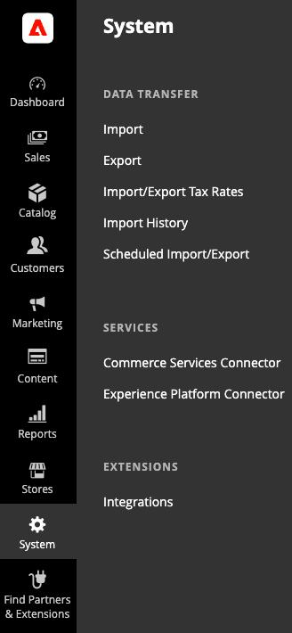

# Experience Platform connector overview

The Experience Platform connector extension allows Adobe Commerce merchants to send data to the Adobe Experience Platform edge so other Adobe Experience Cloud products, such as Adobe Analytics and Adobe Target, can use that Commerce data. By connecting your Commerce data to other products in the Adobe Experience Cloud, you can perform tasks, such as analyze user behavior on your site, perform AB testing, and create personalized campaigns.

Storefront events capture shopper interactions, such as `View Page`, `View Product`, `Add to Cart`, and so on. Captured data does not include personally identifiable information (PII). All user identifiers, such as cookie IDs and IP addresses, are strictly anonymized. [Learn more](https://www.adobe.com/privacy/experience-cloud.html). See the complete list of [storefront events](events.md).

The Experience Platform connector appears in the Commerce Admin under **System** > Services > **Experience Platform Connector**. 

## Prerequisites for using the Experience Platform connector {#prereqs}

To use the Experience Platform connector, you must first:

- Fill out the following [form](https://forms.office.com/pages/responsepage.aspx?id=Wht7-jR7h0OUrtLBeN7O4VH_dtG9hJVAk_TqGkZC2DxUM1FSWkdJOE41UVpUWUw0M1JWV0RKS1VXQi4u) and Adobe will provision you with access to Datastreams and the Adobe Experience Platform (if needed).

When access is granted:

1. [Sign in](https://helpx.adobe.com/manage-account/using/access-adobe-id-account.html) to your Adobe account.
1. Look at your [organization](https://experienceleague.adobe.com/docs/core-services/interface/administration/organizations.html?lang=en#concept_EA8AEE5B02CF46ACBDAD6A8508646255). The organization ID is the ID associated with your provisioned Experience Cloud company. This ID is a 24-character alphanumeric string, followed by (and must include) `@AdobeOrg`.
1. Create or update your [XDM schema](update-xdm.md) with Commerce-specific field groups.
1. [Create a datastream](https://experienceleague.adobe.com/docs/experience-platform/edge/datastreams/overview.html?lang=en) and select the XDM schema that contains the Commerce-specific **Field Groups**.

>[!NOTE]
>
> The organization ID and datastream is used to connect your Adobe Commerce instance to the Adobe Experience Platform.

## Next steps

- Install the [Experience Platform connector extension](install.md).

    The Experience Platform connector extension is installed from the command line of the server and connects to your Adobe Commerce installation as a [service](../landing/saas.md). When the process is complete, Experience Platform connector appears on the **System** menu under **Services** in the Commerce _Admin_.
- [Upload shopper profiles](profile.md) to Adobe Experience Platform so storefront data can be attributed to specific shoppers to enhance their shopping experience.

## Audience

This guide is designed for the Adobe Commerce merchant who must connect their Adobe Commerce storefront data to other Adobe DX products.

### PWA Studio support

See the [PWA Studio](https://developer.adobe.com/commerce/pwa-studio/integrations/adobe-commerce/aep/) documentation for information about how to use the Experience Platform connector in a PWA Studio storefront.

## Known issues

Currently, the Experience Platform connector has the following known issues:

- Search events are not supported on an Adobe Commerce Enterprise Edition with the B2B module installed.
- Storefront data takes about an hour to get from Adobe Commerce to the various destinations after connecting to the Adobe Experience Platform edge.

If you need information or have questions that are not covered in this guide, use the following resources:

- [Help center](https://support.magento.com/hc/en-us){target="_blank"}
- [Support tickets](https://support.magento.com/hc/en-us/articles/360000913794#submit-ticket){target="_blank"}---Submit a ticket to receive additional help.
