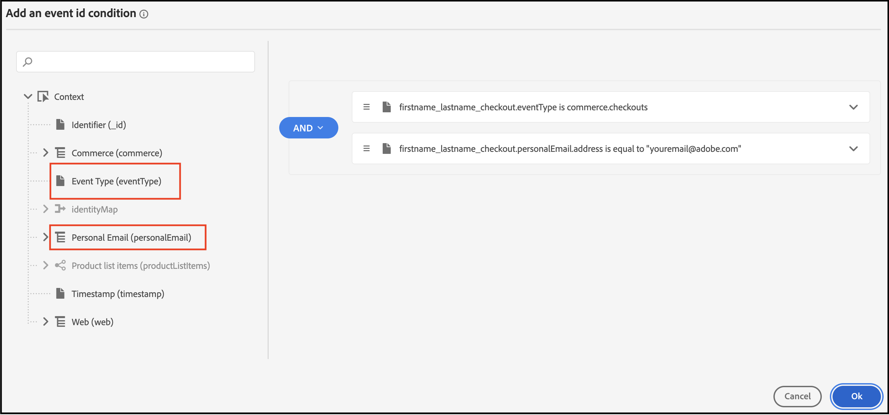

# Use Adobe Journey Optimizer to Send an Abandoned Cart Email

[Adobe Journey Optimizer](https://experienceleague.adobe.com/docs/journey-optimizer/using/get-started/get-started.html) helps you personalize the commerce experience for your shoppers. For example, you can use Journey Optimizer to create and deliver scheduled marketing campaigns, such as weekly promotions for a retail store; or, you can generate an abandoned cart email if a customer added a product to a cart but then did not complete the checkout process.

In this tutorial, you will learn how to listen to a `checkout` event generated from your Commerce instance and respond to that event in Journey Optimizer to build an abandoned cart email.

>[!IMPORTANT]
>
>For demonstration purposes, make sure you are using your Commerce sandbox environment as you go through this tutorial. This ensures that the storefront and back office event data you send to Experience Platform does not dilute your production event data.

## Prerequisits

Before you begin working on this tutorial, you must ensure the following:

- You are provisioned to use Adobe Journey Optimizer
- You have [configured](connect-data.md) the Experience Platform Connector
- You have [confirmed](connect-data.md#confirm-that-event-data-is-collected) your Commerce event data is arriving at the Experience Platform edge

### Step 1: Create a user in your Commerce sandbox environment

You need to create a user in your sandbox environment and confirm that user account information appears in Experience Platform. Make sure the email you specified is valid as that is used later in this tutorial to send the abandoned cart email.

1. Sign in or create an account in your Commerce sandbox environment.

    With the Experience Platform Connector installed and configured, this account information is sent to the Experience Platform as a profile.

    

1. Confirm your user account information in the Profile section of Experience Platform.

    ???? With the Experience Platform Connector configured, storefront and back office event data from your Commerce site are already being sent to the Experience Platform. Go to Profiles in the Adobe Experience Platform. Click on Detail in the profile. You will now see the profile that you created. 

### Step 2: Trigger the checkout event

Before you can create an abandoned cart email, you need to add an item to the cart and begin the checkout process to trigger the `commerce.checkouts` event.

1. Open your Commerce sandbox environment.
1. Add a product to the cart.
1. Click the [!UICONTROL Checkout] button.

    This action triggers the `commerce.checkouts` event. However, because you did not complete the checkout, your cart is essentially abandoned.

1. Confirm the events are flowing to Journey Optimizer.

    1. Launch Adobe Journey Optimizer.
    1. Select **Profiles**.
    1. Set [!UICONTROL Identity namespace] to `Email`.
    1. Set [!UICONTROL Identity value] to your email address.

        For example:

        

    1. Select your profile, then select the [!UICONTROL Events] tab.

        

        Look for the `commerce.checkouts` event and examine the event payload:

            ```json
            "personID": "84281643067178465783746543501073369488", 
            "eventType": "commerce.checkouts", 
            "_id": "4b41703f-e42e-485b-8d63-7001e3580856-0", 
            "commerce": { 
                "cart": {}, 
                "checkouts": { 
                    "value": 1 
                } 
            ```

        Notice there is a `checkouts` value of `1`, which indicates that the checkout process has begun. In the next section, you will configure a checkout event in Journey Optimizer to listen for that `commerce.checkouts` event from Commerce.

### Step 3: Configure events in Journey Optimizer

In this section, you will configure two events in Journey Optimizer: one event listens for the `commerce.checkouts` event from Commerce, and the other is a basic timeout event that waits for a specific amount of time to pass before triggering an abandoned cart email.

#### Create listener event

1. Log into Journey Optimizer.

1. Click on **Configurations** under the **Administration** section of the left pane. 

1. In the **Events** tile, click **[!UICONTROL Manage]**.

    

1. On the **Events** page, click the **[!UICONTROL Create Event]** button.

1. In the right rail configuration, setup your event as follows:

    1. Set the **Name** to: `firstname_lastname_checkout`.
    1. Set **Type** to **Unitary**.
    1. Set **Event id type** to **Rule based**.
    1. Set **Schema** to your Commerce [schema](update-xdm.md).
    1. Select **Fields** and in the **Fields** page that appears, select the fields that are useful for this event. For example, select all fields under the **Product list items**, **Commerce**, **eventType**, and **Web**.
    1. Click the **[!UICONTROL OK]** button to save the selected fields.
    1. Click into the **Event id condition** field and create a condition of `eventType` is equal to `commerce.checkouts` AND `personalEmail.address` is equal to the email address you used when you created the profile in the previous section.

        

    1. Click **[!UICONTROL Save]** to save your event.

#### Create timeout event

1. Create a new event in Journey Optimizer as you did before.

1. In the right rail configuration, setup your event as follows:

    1. Set the **Name** to: `firstname_lastname_timeout`.
    1. Set **Type** to **Unitary**.
    1. Set **Event id type** to **Rule based**.
    1. Set **Schema** to your Commerce [schema](update-xdm.md).
    1. Set the **Schema**, **Fields**, and **Event id condition** to the same as above.
    1. Click **[!UICONTROL Save]** to save your event.

With these two events configured, you can now build an abandoned cart journey. 

### Step 4: Build a checkout journey

???? In this section, you will create an abandoned cart journey that sends an email after a specified amount of time has passed.

1. Go to Journeys from the left menu and click on Create Journey 
1. Set the name of your journey by prefixing it with your firstname_lastname checkout journey and click ok.  
1. In the left rail under section **EVENTS**, search for the checkout event you previously created: `firstname_lastname_checkout` and drag and drop it on the canvas.  

>[!NOTE]
>
>Double-clicking on the event automatically adds it to the canvas. 

1. Search for the timeout event and add it to the canvas. 
1. Double-click the timeout event.

    1. In the **Timeout** section, add a checkmark to the **Define the event time** checkbox.
    1. In the **Wait for** field enter `1` and `Minute`.
    1. Place a checkmark in the **Set a timeout path**.
    
    With this timeout configuration, a shopper that performs a checkout but does not complete the order within one minute triggers this timeout branch. In an actual production environment, you would set this for a longer period of time, like 24 hours.

1. In the left rail under **ACTIONS**, add the **Email** action to the timeout branch. Your journey should look like the following:

    

#### Create an abandoned cart email

In this section, you create an abandoned cart email that is sent when an abandoned cart is detected.

1. In the journey you created above, double-click the **Email** icon on the canvas.

1. Follow the [steps](https://experienceleague.adobe.com/docs/journey-optimizer/using/personalized-dynamic-content/personalization/personalization-use-cases/personalization-use-case-helper-functions.html#configure-email) in the Journey Optimizer guide to create the abandoned cart email.

???? ADD text that ties this section with the next.

### Step 5: Trigger the checkout event

???? 
1. You are now ready to test this journey. Enable test mode.

Next to it, you can see an icon that will be orange if you have warnings or red if you have errors. In the latter case, test option will be greyed out. You have to fix the error first. You can learn more by clicking on that icon. 

1. Now let's test this journey in real-time. Open another browser tab and Go to the CitiSignal website . 
1. Add a product to your cart  
1. Go to checkout.
1. From the checkout page, you can now abandon. This means you can go back to the main page or close your tab.
1. The journey will now be triggered. You can check that by going to your browser tab where you have your journey.

    You should see a green arrow showing where your user went through. 

1. Now check your inbox. You should have received an email.
