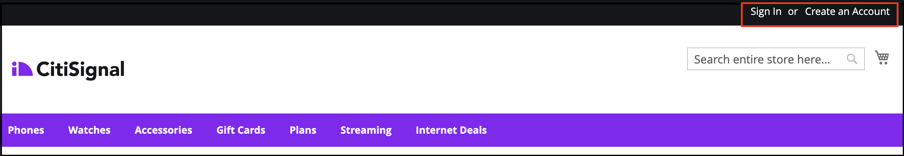
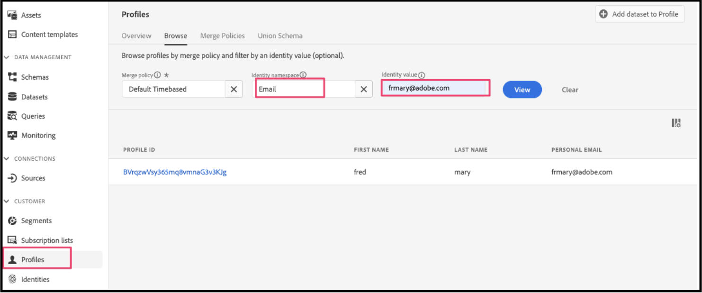
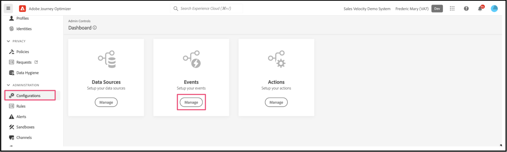

# Use Adobe Journey Optimizer to Send an Abandoned Cart Email

[Adobe Journey Optimizer](https://experienceleague.adobe.com/docs/journey-optimizer/using/get-started/get-started.html) helps you personalize the commerce experience for your shoppers. For example, you can use Journey Optimizer to create and deliver scheduled marketing campaigns, such as weekly promotions for a retail store, or generate an abandoned cart email if a customer added a product to a cart but then did not complete the checkout process.

By following these steps, you will learn how to listen to a `checkout` event generated from your Commerce instance and respond to that event in Journey Optimizer to build an abandoned cart email.

>[!IMPORTANT]
>
>For demonstration purposes, make sure you are using your Commerce sandbox environment. This ensures that the storefront and back office event data you send to Experience Platform does not dilute your production event data.

## Prerequisites

Before you begin with these steps, you must ensure the following:

- You are provisioned to use Adobe Journey Optimizer
- You have [configured](connect-data.md) the Experience Platform Connector
- You have [confirmed](connect-data.md#confirm-that-event-data-is-collected) your Commerce event data is arriving at the Experience Platform edge

## Step 1: Create a user in your Commerce sandbox environment

Create a user in your sandbox environment and confirm that user account information appears in Experience Platform. Ensure the email you specified is valid as that is used later in this section to send the abandoned cart email.

1. Sign in or create an account in your Commerce sandbox environment.

    {width="700" zoomable="yes"}
    
    With the Experience Platform Connector installed and configured, this account information is sent to the Experience Platform as a profile.

1. Confirm that your user account information appears in the **Profile** section of Experience Platform.

    Go to **Profiles** in the Adobe Experience Platform. Click **Detail** in the profile to see the profile you created.

    {width="700" zoomable="yes"}

## Step 2: View events in Journey Optimizer

In your Commerce sandbox environment, view product pages, add items to a cart, and various other activities a shopper would perform. These activities trigger events on your storefront. You can now confirm that these events are flowing to Journey Optimizer.

1. Launch [Adobe Journey Optimizer](https://experienceleague.adobe.com/docs/journey-optimizer/using/get-started/user-interface.html).
1. Select **Profiles**.
1. Set **[!UICONTROL Identity namespace]** to `Email`.
1. Set the **[!UICONTROL Identity value]** to your email address.
1. Select your profile, then select the **[!UICONTROL Events]** tab.

    {width="700" zoomable="yes"}

    Look for the `commerce.checkouts` event and examine the event payload:

        ```json
        "personID": "84281643067178465783746543501073369488", 
        "eventType": "commerce.checkouts", 
        "_id": "4b41703f-e42e-485b-8d63-7001e3580856-0", 
        "commerce": { 
            "cart": {}, 
            "checkouts": { 
                "value": 1 
            } 
        ```
            
    As you can see, the full event payload contains rich event data. In the next section, you will configure events in Journey Optimizer to listen for and respond to the `commerce.checkouts` event generated from your Commerce storefront.

## Step 3: Configure events in Journey Optimizer

Configure two events in Journey Optimizer: one event listens for the `commerce.checkouts` event from Commerce, and the other is a basic timeout event that waits for a specific amount of time to pass before triggering an abandoned cart email.

### Create a listener event

1. Launch [Adobe Journey Optimizer](https://experienceleague.adobe.com/docs/journey-optimizer/using/get-started/user-interface.html).

1. Click **[!UICONTROL Configurations]** under the **[!UICONTROL Administration]** section of the left pane. 

1. In the **[!UICONTROL Events]** tile, click **[!UICONTROL Manage]**.

    {width="700" zoomable="yes"}

1. On the **[!UICONTROL Events]** page, click the **[!UICONTROL Create Event]** button.

1. In the right rail configuration, set up your event as follows:

    1. Set the **Name** to: `firstname_lastname_checkout`.
    1. Set **Type** to **Unitary**.
    1. Set **Event id type** to **Rule based**.
    1. Set **Schema** to your Commerce [schema](update-xdm.md).
    1. Select **Fields** and in the **Fields** page that appears, select the fields that are useful for this event. For example, select all fields under the **Product list items**, **Commerce**, **eventType**, and **Web**.
    1. Click **[!UICONTROL OK]** to save the selected fields.
    1. Click into the **Event id condition** field and create a condition of `eventType` is equal to `commerce.checkouts` AND `personalEmail.address` is equal to the email address you used when you created the profile in the previous section.

        {width="700" zoomable="yes"}
    
    1. Click **[!UICONTROL OK]**.
    1. Click **[!UICONTROL Save]** to save your event.

### Create a timeout event

1. Create an event in Journey Optimizer as you did before.

1. In the right rail configuration, set up your event as follows:

    1. Set the **Name** to: `firstname_lastname_timeout`.
    1. Set **Type** to **Unitary**.
    1. Set **Event id type** to **Rule based**.
    1. Set **Schema** to your Commerce [schema](update-xdm.md).
    1. Set the **Schema**, **Fields**, and **Event id condition** to the same as above.
    1. Click **[!UICONTROL Save]** to save your event.

With these two events configured, create a journey that sends an abandoned cart email.

## Step 4: Build a checkout journey

Create a journey that listens for the `commerce.checkouts` event and then sends an abandoned cart email after a specified amount of time has passed.

1. In Journey Optimizer, select **Journeys** under **JOURNEY MANAGEMENT**.
1. Click **[!UICONTROL Create Journey]**.
1. Specify the name of your journey.
1. Click **[!UICONTROL OK]** to save the journey.  
1. In the left rail under the **EVENTS** section, search for the checkout event you previously created: `firstname_lastname_checkout` and drag and drop it on the canvas.  

    >[!NOTE]
    >
    >Double-clicking the event automatically adds it to the canvas. 

1. Search for the timeout event and add it to the canvas. 
1. Double-click the timeout event.

    1. In the **Timeout** section, add a checkmark to the **Define the event time** checkbox.
    1. In the **Wait for** field enter `1` and `Minute`.
    1. Place a checkmark in the **Set a timeout path**.
    
    With this timeout configuration, a shopper that performs a checkout but does not complete the order within one minute triggers this timeout branch. In an actual production environment, you would set this for a longer period, like 24 hours.

1. In the left rail under **ACTIONS**, add the **Email** action to the timeout branch. Your journey should look like the following:

    {width="700" zoomable="yes"}

### Create an abandoned cart email

Create an abandoned cart email that is sent when an abandoned cart is detected.

1. In the journey you created above, double-click the **Email** icon on the canvas.

1. Follow the [steps](https://experienceleague.adobe.com/docs/journey-optimizer/using/content-management/personalization/personalization-use-cases/personalization-use-case-helper-functions.html#configure-email) in the Journey Optimizer guide to create the abandoned cart email.

You now have a journey in Journey Optimizer that listens for the `commerce.checkouts` event from your Commerce store and an abandoned cart email that is sent after a period of time has passed. In the next section, you will test the journey.

## Step 5: Trigger the checkout event in real time

In this section, you test the event in real time.

1. In Journey Optimizer, toggle on Test mode.

    {width="700" zoomable="yes"}

1. To test this journey in real time, open another browser tab and go to your sandbox Commerce website.

    1. Add a product to your cart.
    1. Go to the checkout page.
    1. From the checkout page, abandon the cart by going back to the main page or closing your tab.
    
        The journey is now triggered. To confirm, open the tab that has your journey in Journey Optimizer. You should see a green arrow that shows the path that your user went through.

1. Check your inbox. You should have received an email.
