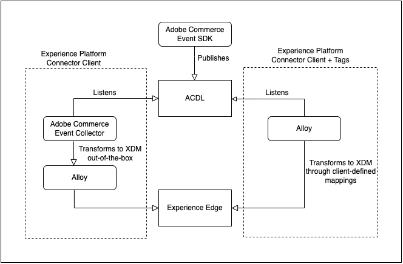
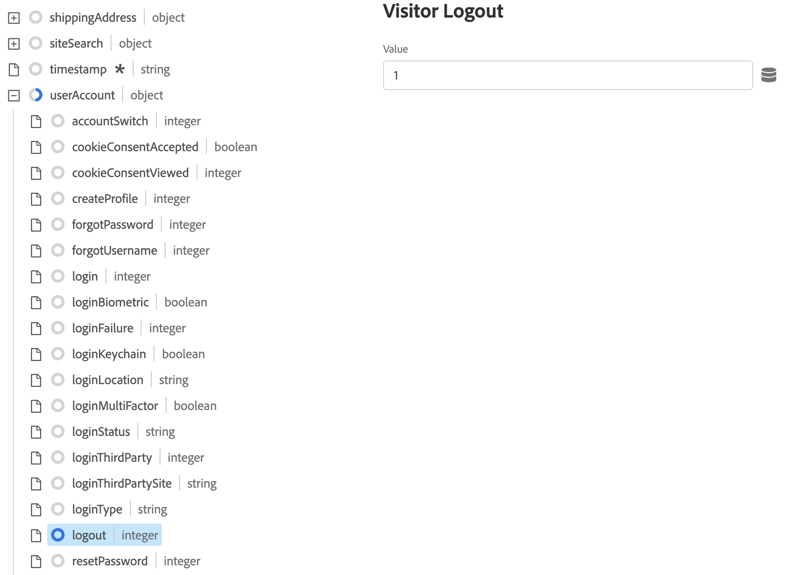
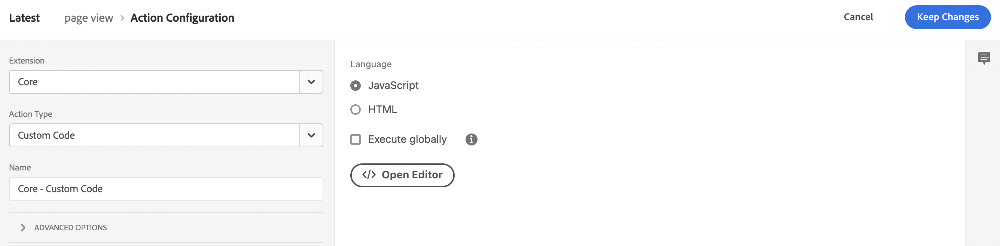
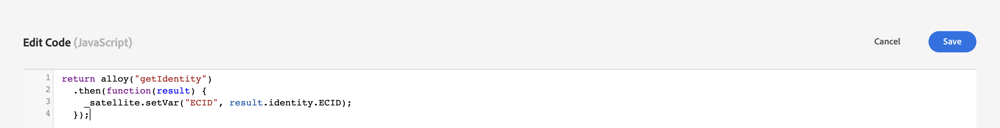
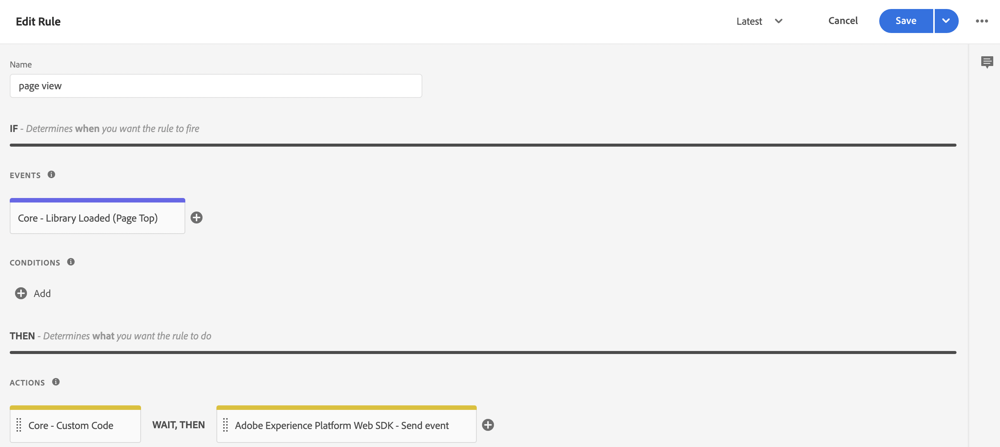
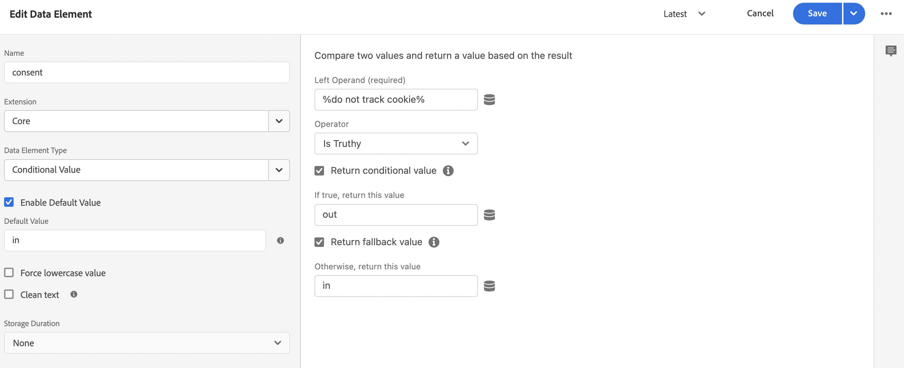
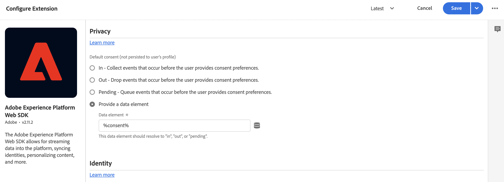

# Collect Commerce Data using Adobe Experience Platform Tags

While you can use the Experience Platform connector to publish and subscribe to storefront events, some merchants might already be using a data collection solution, such as the [Adobe Experience Platform tags](https://experienceleague.adobe.com/docs/platform-learn/data-collection/tags/create-a-property.html?lang=en). For those merchants, Adobe Commerce provides a publishing only option in the Experience Platform connector that uses the Adobe Commerce Event SDK.


_Experience Platform Connector Data Flow with Tags_

In this topic, you will learn how to map the storefront event values provided by the Experience Platform connector to the Adobe Experience Platform tags solution you are already using.

## Collect event data from Adobe Commerce

To collect Commerce event data, you need to:

- Install the [Adobe Commerce Event SDK](https://www.npmjs.com/package/@adobe/magento-storefront-events-sdk). For PHP storefronts, see the [install](install.md) topic. For PWA Studio storefronts, see the [PWA Studio guide](https://developer.adobe.com/commerce/pwa-studio/integrations/adobe-commerce/aep/).

    >[!NOTE]
    >
    > Do **not** [configure](connect-data.md) the Organization ID and Datastream ID.

## Map Commerce storefront data to Adobe Experience Platform

To map Commerce storefront data to Adobe Experience Platform, you need to configure and install the following from within Adobe Experience Platform tags:

1. [Set up a tag property](https://experienceleague.adobe.com/docs/platform-learn/implement-in-websites/configure-tags/create-a-property.html?lang=en) in Adobe Experience Platform Data Collection.

1. Under **Authoring**, select **Extensions** and install and configure the following extensions:

   - [Adobe Client Data Layer](https://experienceleague.adobe.com/docs/experience-platform/tags/extensions/adobe/client-data-layer/overview.html?lang=en)

   - [Adobe Experience Platform Web SDK](https://experienceleague.adobe.com/docs/experience-platform/edge/fundamentals/installing-the-sdk.html?lang=en)

1. [Publish tag](https://experienceleague.adobe.com/docs/experience-platform/tags/publish/overview.html?lang=en) to your development environment.

1. Follow the **Event Mapping** steps below to configure data elements and rules for specific events.

### Event mapping

Because data collection using tags is different from using the Adobe Commerce Event SDK, it is important to understand the equivalent terms used in both frameworks.

|Adobe Experience Platform tags term|Adobe Commerce Event SDK term|
|---|---|
|_data elements_|context|
|_rules_|event|
||_rule conditions_ - event listeners (from ACDL)<br><br>_rule actions_ - event handlers (send to Adobe Experience Platform)|

When you update the data elements and rules in Adobe Experience Platform tags with Adobe Commerce-specific event data, there are some common steps you will take.

For example, let's add the Adobe Commerce `signOut` event to Adobe Experience Platform tags. The steps outlined below, except for specific values you set, describe how to add [data elements](https://experienceleague.adobe.com/docs/experience-platform/collection/e2e.html?lang=en#data-element) and [rules](https://experienceleague.adobe.com/docs/experience-platform/collection/e2e.html?lang=en#create-a-rule), which apply to all Adobe Commerce events you are adding to tags.

1. Create a Data Element:

    
    _Create New Data Element_

1. Set **Name** to `Sign out`.

1. Set **Extension** to `Adobe Experience Platform Web SDK`.

1. Set **Data Element Type** to `XDM object`.

1. Select the **Sandbox** and **Schema** that you want to update.

1. Under **userAccount** > **logout**, set the **value** in **Visitor Logout** to `1`.

     
    _Update Sign out value_

1. Create a Rule:

    
    _Create New Rule_

1. Set **Extension** to `Adobe Client Data Layer`.

1. Set **Event Type** to `Data Pushed`.

1. Select **Specific Event** and set the **Event/Key to register for** to `sign-out`.

1. Add an action.

1. Set **Extension** to `Adobe Experience Platform Web SDK`.

1. Set **Action Type** to `Send Event`.

1. Set **Instance** to `Alloy`.

1. Set **Type** to `userAccount.logout`.

1. Set **XDM data** to `%sign out%`.

1. Click **Save**.

    You now have created a data element in your schema for the `signOut` event from Adobe Commerce. Also, you have created a rule with a specific action that should occur when that event is fired from the Adobe Commerce storefront.

Repeat the above steps in tags for each of the Adobe Commerce events described below.

### Available events

For each of the following events, map the Adobe Commerce events to your XDM by following the above steps.

- [`signOut`](#signout)
- [`signIn`](#signin)
- [`createAccount`](#createaccount)
- [`editAccount`](#editaccount)
- [`pageView`](#pageview)
- [`productView`](#productview)
- [`searchRequestSent`](#searchrequestsent)
- [`searchResponseReceived`](#searchresponsereceived)
- [`addToCart`](#addtocart)
- [`viewCart`](#viewcart)
- [`removeFromCart`](#removefromcart)
- [`initiateCheckout`](#initiatecheckout)
- [`placeOrder`](#placeorder)

### signOut {#signout}

#### Data Elements

Create the following data element:

1. Sign out:

    - **Name**: `Sign out`
    - **Extension**: `Adobe Experience Platform Web SDK`
    - **Data Element Type**: `XDM object`
    - **Field Group**: `userAccount` > `logout`
    - **Visitor Logout**: **Value** = `1`

#### Rules 

- **Name**: `Sign out`
- **Extension**: `Adobe Client Data Layer`
- **Event Type**: `Data Pushed`
- **Specific event**: `sign-out`

##### Actions

- **Extension**: `Adobe Experience Platform Web SDK`
- **Action Type**: `Send event`
- **Type**: `userAccount.logout`
- **XDM data**: `%sign-out%`

### signIn {#signin}

#### Data Elements

Create the following data elements:

1. Account email:

    - **Name**: `Account email`
    - **Extension**: `Adobe Client Data Layer`
    - **Data Element Type**: `Data Layer Computed State`
    - **[Optional] path**: `accountContext.accountEmail`

1. Account type:

    - **Name**: `Account type`
    - **Extension**: `Adobe Client Data Layer`
    - **Data Element Type**: `Data Layer Computed State`
    - **[Optional] path**: `accountContext.accountType` 

1. Account ID:

    - **Name**: `Account ID`
    - **Extension**: `Adobe Client Data Layer`
    - **Data Element Type**: `Data Layer Computed State`
    - **[Optional] path***: `accountContext.accountId` 

1. Sign in:

    - **Name**: `Sign in`
    - **Extension**: `Adobe Experience Platform Web SDK`
    - **Data Element Type**: `XDM object`
    - **Field Group**: `userAccount` > `login`
    - **Visitor Login**: **Value** = `1`

#### Rules 

- **Name**: `Sign in`
- **Extension**: `Adobe Client Data Layer`
- **Event Type**: `Data Pushed`
- **Specific event**: `sign-in`

##### Actions

- **Extension**: `Adobe Experience Platform Web SDK`
- **Action Type**: `Send event`
- **Type**: `userAccount.login`
- **XDM data**: `%sign-in%`

### createAccount {#createaccount}

#### Data Elements

Create the following data elements:

1. Account email:

    - **Name**: `Account email`
    - **Extension**: `Adobe Client Data Layer`
    - **Data Element Type**: `Data Layer Computed State`
    - **[Optional] path**: `accountContext.accountEmail`

1. Account type:

    - **Name**: `Account type`
    - **Extension**: `Adobe Client Data Layer`
    - **Data Element Type**: `Data Layer Computed State`
    - **[Optional] path**: `accountContext.accountType` 

1. Account ID:

    - **Name**: `Account ID`
    - **Extension**: `Adobe Client Data Layer`
    - **Data Element Type**: `Data Layer Computed State`
    - **[Optional] path***: `accountContext.accountId` 

1.  Create account:

    - **Name**: `Create account`
    - **Extension**: `Adobe Experience Platform Web SDK`
    - **Data Element Type**: `XDM object`
    - **Field Group**: `userAccount` > `createProfile`
    - **Account Profile Create**: **Value** = `1`

#### Rules 

- **Name**: `Create account`
- **Extension**: `Adobe Client Data Layer`
- **Event Type**: `Data Pushed`
- **Specific event**: `create-account`

##### Actions

- **Extension**: `Adobe Experience Platform Web SDK`
- **Action Type**: `Send event`
- **Type**: `userAccount.createProfile`
- **XDM data**: `%create account%`

### editAccount {#editaccount}

#### Data Elements

Create the following data elements:

1. Account email:

    - **Name**: `Account email`
    - **Extension**: `Adobe Client Data Layer`
    - **Data Element Type**: `Data Layer Computed State`
    - **[Optional] path**: `accountContext.accountEmail`

1. Account type:

    - **Name**: `Account type`
    - **Extension**: `Adobe Client Data Layer`
    - **Data Element Type**: `Data Layer Computed State`
    - **[Optional] path**: `accountContext.accountType` 

1. Account ID:

    - **Name**: `Account ID`
    - **Extension**: `Adobe Client Data Layer`
    - **Data Element Type**: `Data Layer Computed State`
    - **[Optional] path***: `accountContext.accountId` 

1. Edit account:

    - **Name**: `Edit account`
    - **Extension**: `Adobe Experience Platform Web SDK`
    - **Data Element Type**: `XDM object`
    - **Field Group**: `userAccount` > `updateProfile`
    - **Account Profile Create**: **Value** = `1`

#### Rules

- **Name**: `Edit account`
- **Extension**: `Adobe Client Data Layer`
- **Event Type**: `Data Pushed`
- **Specific event**: `edit-account`

##### Actions

- **Extension**: `Adobe Experience Platform Web SDK`
- **Action Type**: `Send event`
- **Type**: `userAccount.updateProfile`
- **XDM data**: `%edit account%`

### pageView {#pageview}

#### Data Elements

Create the following data elements:

1. Page name:

    - **Name**: `Page name`
    - **Extension**: `Adobe Client Data Layer`
    - **Data Element Type**: `Data Layer Computed State`
    - **[Optional] path**: `pageContext.pageName` 

#### Rules 

- **Name**: `Page view`
- **Extension**: `Adobe Client Data Layer`
- **Event Type**: `Data Pushed`
- **Specific event**: `Core-Library Loaded`

##### Actions

- **Extension**: `Adobe Experience Platform Web SDK`
- **Action Type**: `Send event`
- **Type**: `web.webPageDetails.pageViews`
- **XDM data**: `%page view%`

### productView {#productview}

#### Data Elements

Create the following data elements:
  
1. Product name:

    - **Name**: `Product name`
    - **Extension**: `Adobe Client Data Layer`
    - **Data Element Type**: `Data Layer Computed State`
    - **[Optional] path**: `productContext.name` 

1. Product SKU:

    - **Name**: `Product sku`
    - **Extension**: `Adobe Client Data Layer`
    - **Data Element Type**: `Data Layer Computed State`
    - **[Optional] path**: `productContext.sku` 

1. Currency code:

    - **Name**: `Currency code`
    - **Extension**: `Adobe Client Data Layer`
    - **Data Element Type**: `Data Layer Computed State`
    - **[Optional] path**: `productContext.pricing.currencyCode`

1. Special price:

    - **Name**: `Special price`
    - **Extension**: `Adobe Client Data Layer`
    - **Data Element Type**: `Data Layer Computed State`
    - **[Optional] path**: `productContext.pricing.specialPrice`

1. Regular price:

    - **Name**: `Regular price`
    - **Extension**: `Adobe Client Data Layer`
    - **Data Element Type**: `Data Layer Computed State`
    - **[Optional] path**: `productContext.pricing.regularPrice`

1. Product price:

    - **Name**: `Product price`
    - **Extension**: `Core`
    - **Data Element Type**: `Custom Code`
    - **Open Editor**: `return _satellite.getVar('product regular price') || _satellite.getVar('product special price')`

1. Product view:

    - **Name**: `Product view`
    - **Extension**: `Adobe Experience Platform Web SDK`
    - **Data Element Type**: `XDM object`
    - **Field Group**: `productListItems`. Select **Provide individual items** and click the **Add item** button. Because this view is for a PDP, you can populate with a single item.
  
#### Rules 

- **Name**: `Product view`
- **Extension**: `Adobe Client Data Layer`
- **Event Type**: `Data Pushed`
- **Specific event**: `product-page-view`

##### Actions

- **Extension**: `Adobe Experience Platform Web SDK`
- **Action Type**: `Send event`
- **Type**: `commerce.productViews`
- **XDM data**: `%product view%`

### searchRequestSent {#searchrequestsent}

#### Data Elements

Create the following data elements:

1. Search input

    - **Name**: `Search input`
    - **Extension**: `Adobe Client Data Layer`
    - **Data Element Type**: `Data Layer Computed State`
    - **[Optional] path**: `searchInputContext.units[0]`

1. Search input phrase

    - **Name**: `Search input phrase`
    - **Extension**: `Core`
    - **Data Element Type**: `Custom Code`
    - **Open Editor**:
    
    ```bash
    `return _satellite.getVar('search input').phrase;`
    ```

1. Search input sort

    - **Name**: `Search input sort`
    - **Extension**: `Core`
    - **Data Element Type**: `Custom Code`
    - **Open Editor**:
    
    ```bash
    const searchInput = _satellite.getVar('search input');
    const sortFromInput = searchInput ? searchInput.sort : [];
    const sort = sortFromInput.map((searchSort) => {
        return {
            attribute: searchSort.attribute,
            order: searchSort.direction,
        };
    });
    return sort;
    ```

1. Search input filters

    - **Name**: `Search input filters`
    - **Extension**: `Core`
    - **Data Element Type**: `Custom Code`
    - **Open Editor**:

    ```bash

    const searchInput = _satellite.getVar('search input');
    const filtersFromInput = searchInput ? searchInput.filter : [];
    const filters = filtersFromInput.map(
        (searchFilter) => {
            let value = [];
            let isRange = false;
            if (searchFilter.eq) {
                value.push(searchFilter.eq);
            } else if (searchFilter.in) {
                value = searchFilter.in;
            } else if (searchFilter.range) {
                isRange = true;
                value.push(String(searchFilter.range.from));
                value.push(String(searchFilter.range.to));
            }
            return {
                attribute: searchFilter.attribute,
                value,
                isRange,
            };
        }
    );
    
    return filters;
    ```

1. Search request:   

    - **Name**: `Search request`
    - **Extension**: `Adobe Experience Platform Web SDK`
    - **Data Element Type**: `XDM object`
    - **Field Group**: `siteSearch` > `phrase`
    - **value**: Not yet available
    - **Field Group**: `siteSearch` > `sort`
    - **value**: Select **Provide entire object**
    - **Field Group**: `siteSearch` > `filter`
    - **value**: Select **Provide entire object**
    - **Field Group**: `searchRequest` > `value`
    - **value**: **Value** = `1`

#### Rules 

- **Name**: `Search request sent`
- **Extension**: `Adobe Client Data Layer`
- **Event Type**: `Data Pushed`
- **Specific event**: `search-request-sent`

##### Actions

- **Extension**: `Adobe Experience Platform Web SDK`
- **Action Type**: `Send event`
- **Type**: `searchRequest`
- **XDM data**: `%search request%`

### searchResponseReceived {#searchresponsereceived}

#### Data Elements

Create the following data elements:

1. Search results:

    - **Name**: `Search results`
    - **Extension**: `Adobe Client Data Layer`
    - **Data Element Type**: `Data Layer Computed State`
    - **[Optional] path**: `searchResultsContext.units[0]`

1. Search result number of products:

    - **Name**: `Search result number of products`
    - **Extension**: `Core`
    - **Data Element Type**: `Custom Code`
    - **Open Editor**:

    ```bash
    return _satellite.getVar('search result').productCount;
    ```

1. Search result products:

    - **Name**: `Search result products`
    - **Extension**: `Core`
    - **Data Element Type**: `Custom Code`
    - **Open Editor**:

    ```bash
    const searchResult = _satellite.getVar('search result');
    const productsFromResult = searchResult.products ? searchResult.products : [];
    const products = productsFromResult.map(
        (product) => {
            return { SKU: product.sku, name: product.name };
        }
    );
    return products;
    ```

1. Search result suggestions:

    - **Name**: `Search result products`
    - **Extension**: `Core`
    - **Data Element Type**: `Custom Code`
    - **Open Editor**:

    ```bash
    const searchResult = _satellite.getVar('search result');
    const suggestionsFromResult = searchResult.suggestions ? searchResult.suggestions : [];
    const suggestions = suggestionsFromResult.map((suggestion) => suggestion.suggestion);
    return suggestions;
    ```

1. Search response:

    - **Name**: `Search response`
    - **Extension**: `Adobe Experience Platform Web SDK`
    - **Data Element Type**: `XDM object`
    - **Field Group**: `siteSearch` > `suggestions`
    - **value**: Select **Provide entire object**
    - **Field Group**: `siteSearch` > `numberOfResults`
    - **value**: `%search result number of products%`
    - **Field Group**: `productListItems`
    - **value**: Select **Provide entire object**
    - **Field Group**: `searchResponse` > `value`
    - **value**: **Value** = `1`

#### Rules 

- **Name**: `Search Response Received`
- **Extension**: `Adobe Client Data Layer`
- **Event Type**: `Data Pushed`
- **Specific event**: `search-response-received`

##### Actions

- **Extension**: `Adobe Experience Platform Web SDK`
- **Action Type**: `Send event`
- **Type**: `searchResponse`
- **XDM data**: `%search response%`

### addToCart {#addtocart}

#### Data Elements

Create the following data elements:

1. Product name:

    - **Name**: `Product name`
    - **Extension**: `Adobe Client Data Layer`
    - **Data Element Type**: `Data Layer Computed State`
    - **[Optional] path**: `productContext.name`

1. Product sku:

    - **Name**: `Product sku`
    - **Extension**: `Adobe Client Data Layer`
    - **Data Element Type**: `Data Layer Computed State`
    - **[Optional] path**: `productContext.sku`

1. Currency code:

    - **Name**: `Currency code`
    - **Extension**: `Adobe Client Data Layer`
    - **Data Element Type**: `Data Layer Computed State`
    - **[Optional] path**: `productContext.pricing.currencyCode`

1. Product special price:

    - **Name**: `Product special price`
    - **Extension**: `Adobe Client Data Layer`
    - **Data Element Type**: `Data Layer Computed State`
    - **[Optional] path**: `productContext.pricing.specialPrice`

1. Product regular price:

    - **Name**: `Product regular price`
    - **Extension**: `Adobe Client Data Layer`
    - **Data Element Type**: `Data Layer Computed State`
    - **[Optional] path**: `productContext.pricing.regularPrice`

1. Product  price:

    - **Name**: `Product price`
    - **Extension**: `Core`
    - **Data Element Type**: `Custom Code`
    - **Open Editor**:
    
    ```bash
    return _satellite.getVar('product regular price') || _satellite.getVar('product special price') 
    ```

1. Cart:

    - **Name**: `Cart`
    - **Extension**: `Adobe Client Data Layer`
    - **Data Element Type**: `Data Layer Computed State`
    - **[Optional] path**: `shoppingCartContext`

1. Cart id:

    - **Name**: `Cart id`
    - **Extension**: `Core`
    - **Data Element Type**: `Custom Code`
    - **Open Editor**:
    
    ```bash
    return _satellite.getVar('cart').id
    ```

1. Add to cart:

    - **Name**: `Add to cart`
    - **Extension**: `Adobe Experience Platform Web SDK`
    - **Data Element Type**: `XDM object`
    - **Field Group**: `productListItems`. Select **Provide individual items** and click the **Add item** button. Because this view is for a PDP, you can populate with a single item.
    - **Field Group**: `commerce` > `cart` > `cartID`
    - **Cart ID**: **Value** = `%cart id%`
    - **Field Group**: `commerce` > `productListAdds` > `id`
    - **Unique Identifier**: **value** = `1`

#### Rules 

- **Name**: `Add to cart`
- **Extension**: `Adobe Client Data Layer`
- **Event Type**: `Data Pushed`
- **Specific event**: `add-to-cart`

##### Actions

- **Extension**: `Adobe Experience Platform Web SDK`
- **Action Type**: `Send event`
- **Type**: `commerce.productListAdds`
- **XDM data**: `%add to cart%`

### viewCart {#viewcart}

#### Data Elements

Create the following data elements:

1. Storefront:

    - **Name**: `Storefront`
    - **Extension**: `Adobe Client Data Layer`
    - **Data Element Type**: `Data Layer Computed State`
    - **[Optional] path**: `storefrontInstanceContext`

1. Cart:

    - **Name**: `Cart`
    - **Extension**: `Adobe Client Data Layer`
    - **Data Element Type**: `Data Layer Computed State`
    - **[Optional] path**: `shoppingCartContext`

1. Cart id:

    - **Name**: `Cart id`
    - **Extension**: `Core`
    - **Data Element Type**: `Custom Code`
    - **Open Editor**:

    ```bash
    return _satellite.getVar('cart').id
    ```

1. Product list items:

    - **Name**: `Product list items:`
    - **Extension**: `Core`
    - **Data Element Type**: `Custom Code`
    - **Open Editor**:

    ```bash
    const searchResult = _satellite.getVar('storefront');
    const cart = _satellite.getVar('cart');
    
    const returnList = [];
    cart.items.forEach(item => {
        const selectedOptions = [];
        item.configurableOptions.forEach(option => {
            selectedOptions.push({
                attribute: option.optionLabel,
                value: option.valueLabel,
            });
        });
    
        const productListItem = {
            SKU: item.product.sku,
            name: item.product.name,
            quantity: item.quantity,
            priceTotal: item.prices.price.value * item.quantity,
            currencyCode: item.prices.price.currency ? item.prices.price.currency : storefrontContext.storeViewCurrencyCode,
            selectedOptions: selectedOptions,
        };
    
        returnList.push(productListItem);
    });
    return returnList;
    ```

1. View cart:

    - **Name**: `View cart`
    - **Extension**: `Adobe Experience Platform Web SDK`
    - **Data Element Type**: `XDM object`
    - **Field Group**: `productListItems`. For `productListItems`, there can be multiple items that are precomputed. Select **productListItems** > **Populate entire array**.
    - **Field Group**: `commerce` > `cart` > `cartID`
    - **Cart ID**: **Value** = `%cart id%`
    - **Field Group**: `commerce` > `productListAdds` > `id`
    - **Unique Identifier**: **value** = `1`

#### Rules 

- **Name**: `View cart`
- **Extension**: `Adobe Client Data Layer`
- **Event Type**: `Data Pushed`
- **Specific event**: `shopping-cart-view`

##### Actions

- **Extension**: `Adobe Experience Platform Web SDK`
- **Action Type**: `Send event`
- **Type**: `commerce.productListViews`
- **XDM data**: `%view cart%`

### removeFromCart {#removefromcart}

#### Data Elements

Create the following data elements:

1. Product name:

    - **Name**: `Product name`
    - **Extension**: `Adobe Client Data Layer`
    - **Data Element Type**: `Data Layer Computed State`
    - **[Optional] path**: `productContext.name`

1. Product sku:

    - **Name**: `Product sku`
    - **Extension**: `Adobe Client Data Layer`
    - **Data Element Type**: `Data Layer Computed State`
    - **[Optional] path**: `productContext.sku`

1. Currency code:

    - **Name**: `Currency code`
    - **Extension**: `Adobe Client Data Layer`
    - **Data Element Type**: `Data Layer Computed State`
    - **[Optional] path**: `productContext.pricing.currencyCode`

1. Product special price:

    - **Name**: `Product special price`
    - **Extension**: `Adobe Client Data Layer`
    - **Data Element Type**: `Data Layer Computed State`
    - **[Optional] path**: `productContext.pricing.specialPrice`

1. Product regular price:

    - **Name**: `Product regular price`
    - **Extension**: `Adobe Client Data Layer`
    - **Data Element Type**: `Data Layer Computed State`
    - **[Optional] path**: `productContext.pricing.regularPrice`

1. Product  price:

    - **Name**: `Product price`
    - **Extension**: `Core`
    - **Data Element Type**: `Custom Code`
    - **Open Editor**:
    
    ```bash
    return _satellite.getVar('product regular price') || _satellite.getVar('product special price') 
    ```

1. Cart:

    - **Name**: `Cart`
    - **Extension**: `Adobe Client Data Layer`
    - **Data Element Type**: `Data Layer Computed State`
    - **[Optional] path**: `shoppingCartContext`

1. Cart id:

    - **Name**: `Cart id`
    - **Extension**: `Core`
    - **Data Element Type**: `Custom Code`
    - **Open Editor**:
    
    ```bash
    return _satellite.getVar('cart').id
    ```

1. Remove from cart:

    - **Name**: `Remove from cart`
    - **Extension**: `Adobe Experience Platform Web SDK`
    - **Data Element Type**: `XDM object`
    - **Field Group**: `productListItems`. Select **Provide individual items** and click the **Add item** button. Because this view is for a PDP, you can populate with a single item.
    - **Field Group**: `commerce` > `cart` > `cartID`
    - **Cart ID**: **Value** = `%cart id%`
    - **Field Group**: `commerce` > `productListRemovals`
    - **Unique Identifier**: **value** = `1`

#### Rules 

- **Name**: `Remove from cart`
- **Extension**: `Adobe Client Data Layer`
- **Event Type**: `Data Pushed`
- **Specific event**: `remove-from-cart`

##### Actions

- **Extension**: `Adobe Experience Platform Web SDK`
- **Action Type**: `Send event`
- **Type**: `commerce.productListRemovals`
- **XDM data**: `%remove from cart%`

### initiateCheckout {#initiatecheckout}

#### Data Elements

Create the following data elements:

1. Storefront:

    - **Name**: `Storefront`
    - **Extension**: `Adobe Client Data Layer`
    - **Data Element Type**: `Data Layer Computed State`
    - **[Optional] path**: `storefrontInstanceContext`

1. Cart:

    - **Name**: `Cart`
    - **Extension**: `Adobe Client Data Layer`
    - **Data Element Type**: `Data Layer Computed State`
    - **[Optional] path**: `shoppingCartContext`

1. Cart id:

    - **Name**: `Cart id`
    - **Extension**: `Core`
    - **Data Element Type**: `Custom Code`
    - **Open Editor**:
    
    ```bash
    return _satellite.getVar('cart').id
    ```

1. Product list items:

    - **Name**: `Product list items`
    - **Extension**: `Core`
    - **Data Element Type**: `Custom Code`
    - **Open Editor**:

    ```bash
    const searchResult = _satellite.getVar('storefront');
    const cart = _satellite.getVar('cart');
    
    const returnList = [];
    cart.items.forEach(item => {
        const selectedOptions = [];
        item.configurableOptions.forEach(option => {
            selectedOptions.push({
                attribute: option.optionLabel,
                value: option.valueLabel,
            });
        });
    
        const productListItem = {
            SKU: item.product.sku,
            name: item.product.name,
            quantity: item.quantity,
            priceTotal: item.prices.price.value * item.quantity,
            currencyCode: item.prices.price.currency ? item.prices.price.currency : storefrontContext.storeViewCurrencyCode,
            selectedOptions: selectedOptions,
        };
    
        returnList.push(productListItem);
    });
    return returnList;
    ```

1. Initiate checkout:

    - **Name**: `Initiate checkout`
    - **Extension**: `Adobe Experience Platform Web SDK`
    - **Data Element Type**: `XDM object`
    - **Field Group**: `productListItems`. For `productListItems`, there can be multiple items that are precomputed. Select **productListItems** > **Populate entire array**.
    - **Field Group**: `commerce` > `cart` > `cartID`
    - **Cart ID**: **Value** = `%cart id%`
    - **Field Group**: `commerce` > `checkouts`
    - **Unique Identifier**: **value** = `1`

#### Rules 

- **Name**: `Initiate checkout`
- **Extension**: `Adobe Client Data Layer`
- **Event Type**: `Data Pushed`
- **Specific event**: `initiate-checkout`

##### Actions

- **Extension**: `Adobe Experience Platform Web SDK`
- **Action Type**: `Send event`
- **Type**: `commerce.checkouts`
- **XDM data**: `%initiate checkout%`

### placeOrder {#placeorder}

#### Data Elements

Create the following data elements:

1. Storefront:

    - **Name**: `Storefront`
    - **Extension**: `Adobe Client Data Layer`
    - **Data Element Type**: `Data Layer Computed State`
    - **[Optional] path**: `storefrontInstanceContext`

1. Cart:

    - **Name**: `Cart`
    - **Extension**: `Adobe Client Data Layer`
    - **Data Element Type**: `Data Layer Computed State`
    - **[Optional] path**: `shoppingCartContext`

1. Cart id:

    - **Name**: `Cart id`
    - **Extension**: `Core`
    - **Data Element Type**: `Custom Code`
    - **Open Editor**:

    ```bash
    return _satellite.getVar('cart').id
    ```

1. Order:

    - **Name**: `Order`
    - **Extension**: `Adobe Client Data Layer`
    - **Data Element Type**: `Data Layer Computed State`
    - **[Optional] path**: `orderContext`

1. Commerce order:

    - **Name**: `Commerce order`
    - **Extension**: `Core`
    - **Data Element Type**: `Custom Code`
    - **Open Editor**:
    
    ```bash
    const order = _satellite.getVar('order');
    const storefront = _satellite.getVar('storefront');
    
    if (order.payments && order.payments.length) {
        payments = order.payments.map(payment => {
            return {
                paymentAmount: payment.total,
                paymentType: payment.paymentMethodCode,
                transactionID: order.orderId.toString(),
            };
        });
    } else {
        payments = [
            {
                paymentAmount: order.grandTotal,
                paymentType: order.paymentMethodCode,
                transactionID: order.orderId.toString(),
            },
        ];
    }
    
    return {
        purchaseID: order.orderId.toString(),
        currencyCode: storefront.storeViewCurrencyCode,
        payments,
    };
    ```

1. Order shipping:

    - **Name**: ` Order shipping`
    - **Extension**: `Core`
    - **Data Element Type**: `Custom Code`
    - **Open Editor**:

    ```bash
    const order = _satellite.getVar('order');
    return {
        shippingMethod: order.shipping.shippingMethod,
        shippingAmount: order.shipping.shippingAmount || 0,
    }
    ```

1. Promotion id:

    - **Name**: `Promotion id`
    - **Extension**: `Core`
    - **Data Element Type**: `Custom Code`
    - **Open Editor**:

    ```bash
    return _satellite.getVar('order').appliedCouponCode
    ```

1. Product list items:

    - **Name**: `Product list items`
    - **Extension**: `Core`
    - **Data Element Type**: `Custom Code`
    - **Open Editor**:

    ```bash
    const searchResult = _satellite.getVar('storefront');
    const cart = _satellite.getVar('cart');
    
    const returnList = [];
    cart.items.forEach(item => {
        const selectedOptions = [];
        item.configurableOptions.forEach(option => {
            selectedOptions.push({
                attribute: option.optionLabel,
                value: option.valueLabel,
            });
        });
    
        const productListItem = {
            SKU: item.product.sku,
            name: item.product.name,
            quantity: item.quantity,
            priceTotal: item.prices.price.value * item.quantity,
            currencyCode: item.prices.price.currency ? item.prices.price.currency : storefrontContext.storeViewCurrencyCode,
            selectedOptions: selectedOptions,
        };
    
        returnList.push(productListItem);
    });
    return returnList;
    ```

1. Place order:

    - **Name**: `Place order`
    - **Extension**: `Adobe Experience Platform Web SDK`
    - **Data Element Type**: `XDM object`
    - **Field Group**: `productListItems`. For `productListItems`, there can be multiple items that are precomputed. Select **productListItems** > **Populate entire array**.
    - **Field Group**: `commerce` > `order`
    - **Unique Identifier**: **Value** = `%commerce order%`
    - **Field Group**: `commerce` > `shipping`
    - **Unique Identifier**: **value** = ` %order shipping%`
    - **Field Group**: `commerce` > `promotionID`
    - **Promotion ID**: **Value** = `%promotion id%`
    - **Field Group**: `commerce` > `purchases` > `value`
    - **Value**: **Value** = `1`

#### Rules 

- **Name**: `Place order`
- **Extension**: `Adobe Client Data Layer`
- **Event Type**: `Data Pushed`
- **Specific event**: `place-order`

##### Actions

- **Extension**: `Adobe Experience Platform Web SDK`
- **Action Type**: `Send event`
- **Type**: `commerce.order`
- **XDM data**: `%place order%`

## Setting identity

Experience Platform connector profiles are joined and generated based on the `personID` and the `personalEmail` identity fields in XDM Experience events. 

If you have a previous setup that relies on different fields, you can continue to use those. To set Experience Platform connector profile identity fields, you have to set the following fields:

- `personalEmail` - Account events only - follow the steps under account events
- `personID` - All events:
    
  - If you are already capturing `ECID` in Tags, you can set `personID` in all of your Adobe Experience Platform Web SDK rules to `%ECID%`.
  - To capture `ECID` in Tags, you must add a **Custom Code** action to your send event rules following the [Tags documentation](https://experienceleague.adobe.com/docs/experience-platform/edge/extension/accessing-the-ecid.html?lang=en). 

### Example

The following images show how to configure a `pageView` event with `personID` in Experience Platform connector:

1. Configure data element with custom code for ECID:

    
    _Configure data element with custom code_

1. Add ECID custom code:

    
    _Code to set ECID in data element_

1. Update XDM schema with personID set as ECID:

    
    _Set personID as ECID_

1. Define rule actions that retrieve ECID:

    
    _Retrieve ECID_

## Setting consent

Adobe Commerce and Experience Platform connector data collection consent is enabled by default. Opt-out is managed through the [`mg_dnt` cookie](https://docs.magento.com/user-guide/stores/cookie-reference.html). You can follow the steps outlined here if you choose to use `mg_dnt` to manage consent. The [Adobe Experience Platform Web SDK documentation](https://experienceleague.adobe.com/docs/experience-platform/edge/consent/supporting-consent.html?lang=en) has several additional options for managing consent.

1. Create a **Core Custom Code** data element (`%do not track cookie%`) for the `mg_dnt` cookie:

    
    _Create do not track data element_

1. Create a **Core Custom Code** data element (`%consent%`) that returns `out` if cookie is set and `in` otherwise:

    
    _Create consent data element_

1. Configure Adobe Experience Platform Web SDK Extension with `%consent%` data element:

    
    _Update SDK with consent_

### Risks

- Not following steps to turn off Experience Platform collection results in events being double-counted
- Not setting up mappings/events as described affects Adobe Analytics boards
- Not possible to set up Target through Beacon if data collection is disabled
