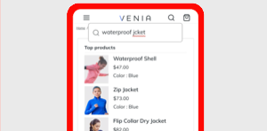
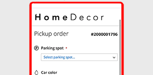

# <!-- use banner as heading --> {#documentation}

Adobe provides a collection of services to help merchants support key components of their business. 

## Available services

<table>
<tr>
   <td valign="top">
       
    
<a href="https://experienceleague.adobe.com/docs/commerce-merchant-services/product-recommendations/overview.html">
    <strong>[!DNL Product Recommendations]</strong></a>
    

    
(Adobe Commerce only) <em>Add AI-fueled recommendations based on shopper behavior, popular trends, product similarity, and more.</em>

     
  </td>
  <td valign="top">
      
    

    <a href="https://experienceleague.adobe.com/docs/commerce-merchant-services/live-search/overview.html"><strong>[!DNL Live Search]</strong></a>
    

    
(Adobe Commerce only) <em>Implement this AI-powered search tool that delivers smarter, faster and relevant results for B2C shoppers.</em>

     
  </td>
</tr>
<tr>
  <td valign="top">
    
    

    <a href="https://experienceleague.adobe.com/docs/commerce-merchant-services/payment-services/guide-overview.html"><strong>[!DNL Payment Services]</strong></a>
    

    <em>Drive customer satisfaction by easily offering various payment methods, including interest-free payment installments, and a single view into payment processing, orders, and invoices right in your Admin dashboard.</em>
     
  </td>
  <td valign="top">
    
    
<a href="https://experienceleague.adobe.com/docs/commerce-merchant-services/store-fulfillment/guide-overview.html">
    <strong>[!DNL Store Fulfillment]</strong></a>
    

    
(Adobe Commerce only) <em>Deliver a superior buy online, pick up in store (BOPIS) customer experience, and maximize store employees' productivity by providing an end to end, seamless omnichannel fulfillment workflow that is enabled through a mobile device.</em>

     
  </td>
  </tr>
  <tr>
   <td valign="top">
    
    

    <a href="https://experienceleague.adobe.com/docs/commerce-channels/channel-manager/guide-overview.html"><strong>[!DNL Channel Manager]</strong></a>
    

    <em>Increase sales, reach new customers, streamline sales operations, and save time by integrating an Adobe Commerce or Magento Open Source product catalog with the Walmart Marketplace. Enable store administrators and operations staff to manage Walmart Marketplace sales, inventory, and product pricing seamlessly from the Commerce environment.</em>
     
  </td>
    <td valign="top">
       
    
<a href="https://experienceleague.adobe.com/docs/commerce-channels/amazon/guide-overview.html">
    <strong>[!DNL Amazon Sales Channel]</strong></a>
    

    
<em>Integrate your stores with the world’s largest global internet shopping destination. This service enables Amazon sales by connecting Commerce with your Amazon Seller Central account and providing both automation and synchronization of catalog and order data. Completely manage all Amazon listings, implement simple or intelligent pricing rules, and maintain your orders and inventory through a single Commerce dashboard.</em>

     
  </td>
</tr>
</table>

## Connect to services

The [Commerce Services Connector](saas.md) provides the integration for your Adobe Commerce or Magento Open Source instance using an API key and a private key. For data services (Adobe Commerce only), you can also specify the data space in the configuration.

## Catalog Service

Increase your conversion rate, boost performance, and improve scalability---*and* give your customers an optimized product experience---with Catalog Service.

## Catalog synching

For services that use catalog data (Product Recommendations and Live Search), the [Catalog Sync](catalog-sync.md) process exports product data from the Commerce server to Commerce Services on an ongoing basis to keep the services up to date.

## What's new

The following items are recent changes to the documentation:

* *Payment Services*---Added instructions for [downloading the extension](https://experienceleague.adobe.com/docs/commerce-merchant-services/payment-services/get-started/install.html#download-the-extension), improved the workflow of [connecting to the Commerce Services Connector](https://experienceleague.adobe.com/docs/commerce-merchant-services/payment-services/get-started/connect.html), and [added info](https://experienceleague.adobe.com/docs/commerce-merchant-services/payment-services/get-started/connect.html) to the Connect the Service topic for the user to determine whether their services are already connected (and what to do if they are not).
* Now available!---[Catalog Service](https://experienceleague.adobe.com/docs/commerce-merchant-services/catalog-service/overview.html) for Adobe Commerce
* *Live Search*---Added new information to [Install Live Search](https://experienceleague.adobe.com/docs/commerce-merchant-services/live-search/onboard/install.html) and [Onboarding Overview](https://experienceleague.adobe.com/docs/commerce-merchant-services/live-search/onboard/install.html) topics about the OpenSearch search engine introduced in new modules (for availability in Adobe Commerce v2.4.6).
* *Experience Platform Connector*---Added [Using tags](https://experienceleague.adobe.com/docs/commerce-merchant-services/experience-platform-connector/event-forwarding/using-tags.html) and [Profile](https://experienceleague.adobe.com/docs/commerce-merchant-services/experience-platform-connector/fundamentals/profile.html) topics that explain how to create profiles and use the AEP tag.
* *Quick Checkout*---Improved [Onboarding topic](https://experienceleague.adobe.com/docs/commerce-merchant-services/quick-checkout/getting-started/onboarding.html) by reordering steps and including latest product changes present in the Admin UI.
* *Payment Services*---[Apple Pay now available](https://experienceleague.adobe.com/docs/commerce-merchant-services/payment-services/payments-options.html#apple-pay-button) in Payment Services.
* *Experience Platform Connector*---Added a new [topic about updating the XDM schema](https://experienceleague.adobe.com/docs/commerce-merchant-services/experience-platform-connector/fundamentals/update-xdm.html) with Adobe Commerce-specific field names.
