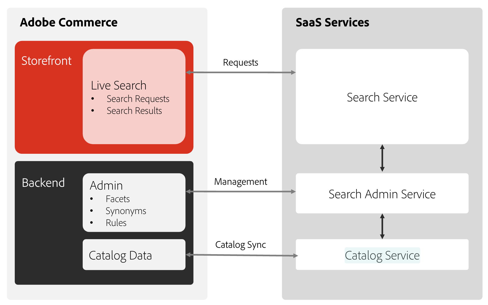
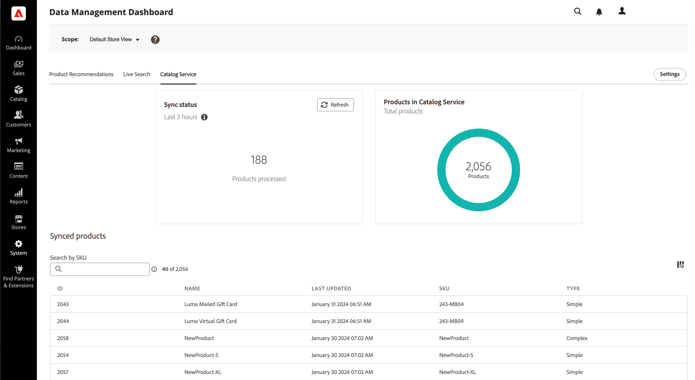

# Set up for success with [!DNL Live Search] and [!DNL Catalog Service]

This article provides step-by-step instructions for integrating Adobe Commerce [!DNL Live Search] and [!DNL Catalog Service] into your commerce platform.

When you install [!DNL Live Search] with [!DNL Catalog Service] you enable a fast, relevant, and intuitive search system that can personalize your customers' shopping experience.

These two services connect your Commerce storefront to the SaaS backend.



## Audience

This article is intended for the developer or systems integrator on your team who is responsible for installing and configuring your Adobe Commerce instance.

## Requirements

- [Adobe Commerce](https://business.adobe.com/products/magento/magento-commerce.html) 2.4.4+
- PHP 8.1 / 8.2 / 8.3
- [!DNL Composer]

## Supported platforms

- Adobe Commerce on-prem (EE) : 2.4.4+
- Adobe Commerce on Cloud (ECE) : 2.4.4+

## Boundaries and limits

Review the following boundaries and limits to ensure [!DNL Live Search] and [!DNL Catalog Service] will meet the needs of your business.

### General

- The [Advanced Search](https://experienceleague.adobe.com/en/docs/commerce-admin/catalog/catalog/search/search) module is disabled when [!DNL Live Search] is installed, and the Advanced Search link in the storefront footer is removed.
- [Tier Pricing](https://experienceleague.adobe.com/en/docs/commerce-admin/catalog/products/pricing/product-price-tier) and [Special Pricing](https://experienceleague.adobe.com/en/docs/commerce-admin/catalog/products/pricing/product-price-special) are not supported in the [!DNL Live Search] field and Product Listing Page Widget.
- [!DNL Live Search] cannot aggregate inventory data from multiple sources.
- Product prices do not include value added tax (VAT).
- Content search is not supported.
- There is a limit of 10k products that can be paginated.

### Indexing

- [!DNL Live Search] [indexes](indexing.md) up to a total of 450 product attributes per storeview. These are distributed as follows:
   - 50 sortable attributes
   - 200 filterable attributes
   - 200 searchable attributes
- Indexes only products from the Adobe Commerce database.
- CMS pages are not indexed.

### Facets

- A maximum of 100 attributes can be configured as facets from the 200 filterable attributes that can be indexed.
- Within a facet, a maximum of 30 buckets can be configured to be returned. If more than 30 buckets need to be returned, [create a support ticket](https://experienceleague.adobe.com/docs/commerce-knowledge-base/kb/help-center-guide/magento-help-center-user-guide.html#submit-ticket) so Adobe can analyze the performance impact and determine if it is feasible to increase this limit for your environment.
- Dynamic facets can cause performance issues in large indexes and indexes with high ordinality. If you have created dynamic facets and notice any performance deterioration or page not loading with timeout errors, try changing your facets to pinned to determine if that resolves your performance issue.
- Stock status (`quantity_and_stock_status`) is not supported as a facet. You can use `inStock: 'true'` to filter out of stock products. This is supported out of the box in the `LiveSearchAdapter` module when "Display out of stock products" is set to "True" in the  [!DNL Commerce] admin.

### Query

- [!DNL Live Search] does not have access to the full taxonomy of the category tree, which makes some layered navigation search scenarios beyond its reach.
- [!DNL Live Search] uses a unique GraphQL endpoint for queries to support features such as dynamic faceting and search-as-you-type. Although similar to the [GraphQL API](https://developer.adobe.com/commerce/webapi/graphql/), there are a few differences and some fields may not be fully compatible.

### Rules

- Maximum number of search merchandising [rules](rules.md) per storeview is 50.
- Category merchandising can have one rule per category.
- Maximum number of conditions per rule is 10.
- Maximum number of events per rule is 25.

### Synonyms

- [!DNL Live Search] can manage up to 200 [synonyms](synonyms.md) per storeview.
- Multiword synonyms are not supported.

### Search merchandising

- A maximum of 50 query rules can be created for each storeview. Each rule can have:
   - Up to ten conditions
   - Up to 25 events

### Category merchandising

- One rule per category can be created for each storeview. Each rule can have:
   - Up to ten conditions
   - Up to 25 events

### B2B and category permissions

- Products are not displayed if they are not added to a default shared catalog.
- To restrict customer groups using Catalog permissions:
   - Products must be assigned to the Root category.
   - The "Not Logged in" customer group must be given "Allow" browsing permissions.
   - To restrict products to the "Not Logged In" customer group, go to each category and set permission for each customer group.
- Support for B2B with Live Search for PWA Studio is not supported at this time.

## Install [!DNL Live Search]

[!DNL Live Search] is installed as an extension from Adobe Marketplace. After you install and configure [!DNL Live Search], Adobe [!DNL Commerce] begins sharing search and catalog data with SaaS services. At this point, *Admin* users can set up, customize, and manage search facets, synonyms, and merchandising rules.

>[!NOTE]
>
>As of [!DNL Live Search] 3.0.2, the [!DNL Catalog Service] extension is bundled in with the [!DNL Live Search] installation.

### Before you begin {#before-you-begin}

Before you install [!DNL Live Search] with the [!DNL Catalog Service] extension, there are a few steps you need to complete in your existing Commerce instance.

1. Confirm that [cron jobs](https://experienceleague.adobe.com/en/docs/commerce-operations/configuration-guide/cli/configure-cron-jobs) and [indexers](https://experienceleague.adobe.com/en/docs/commerce-admin/systems/tools/index-management) are running.

   >[!IMPORTANT]
   >
   >Due to the Elasticsearch 7 end-of-support announcement for August 2023, it is recommended that all Adobe Commerce customers migrate to the OpenSearch 2.x search engine. For information about migrating your search engine during product upgrade, see [Migrating to OpenSearch](https://experienceleague.adobe.com/en/docs/commerce-operations/upgrade-guide/prepare/opensearch-migration) in the _Upgrade Guide_.

1. Choose your installation method:

   - **Install without OpenSearch** - Storefront operations are interrupted while the [!DNL Live Search] service indexes all products in the catalog. During the installation, [!DNL Live Search] modules are enabled and [!DNL OpenSearch] modules are disabled.
   - **Install with OpenSearch** - [!DNL OpenSearch] temporarily manages search requests from the storefront while the [!DNL Live Search] service indexes all products in the background, without any interruption to normal storefront operations. [!DNL OpenSearch] is disabled and [!DNL Live Search] is enabled after all catalog data is indexed and synchronized.

## Method 1: Install without OpenSearch {#method-1}

This onboarding method is recommended when installing [!DNL Live Search] to a:

- New [!DNL Commerce] installation
- Staging environment

1. Download the `live-search` package and run the following from the command line:

   ```bash
   composer require magento/live-search
   ```

1. Run the following commands to disable [!DNL OpenSearch] and related modules, and install [!DNL Live Search]:

   ```bash
   bin/magento module:disable Magento_Elasticsearch Magento_Elasticsearch7 Magento_OpenSearch Magento_ElasticsearchCatalogPermissions Magento_InventoryElasticsearch Magento_ElasticsearchCatalogPermissionsGraphQl
   ```

   ```bash
   bin/magento setup:upgrade
   ```

   >[!WARNING]
   >
   > While the data is indexed and synchronized, the search and category browse operations are not available in the storefront. Depending on the size of your catalog, the process can take at least an hour from the time `cron` runs to synchronize your data to [!DNL Live Search] services.

1. Verify that the following [indexers](https://experienceleague.adobe.com/en/docs/commerce-admin/systems/tools/index-management) are set to "Update by Schedule":

   - Product Feed
   - Product Variant Feed
   - Catalog Attributes Feed
   - Product Prices Feed
   - Scopes Website Data feed
   - Scopes Customer Groups Data feed
   - Categories Feed
   - Category Permissions Feed

1. Configure your [API keys](#configure-api-keys) and verify that your catalog data is [synchronized](#synchronize-catalog-data) with [!DNL Live Search] services.

1. To make facets available as filters in the storefront, add the [facets](facets-add.md) you need, according to the [faceting requirements](facets.md).

   You should be able to add facets after `cron` runs the attribute feeds and exports attribute metadata.

1. Run the following command in this order:

   ```bash
   bin/magento saas:resync --feed productattributes
   bin/magento saas:resync --feed products
   bin/magento saas:resync --feed scopesCustomerGroup
   bin/magento saas:resync --feed scopesWebsite
   bin/magento saas:resync --feed prices
   bin/magento saas:resync --feed productoverrides
   bin/magento saas:resync --feed variants
   bin/magento saas:resync --feed categories
   bin/magento saas:resync --feed categoryPermissions
   ```

1. [Verify](#verify-export) that the data was exported.

1. [Test](#test-the-connection) the connection from the storefront.

## Method 2: Install with OpenSearch {#method-2}

This onboarding method is recommended when installing [!DNL Live Search] to:

- An existing production [!DNL Commerce] installation

1. Download the `live-search` package and run the following from the command line:

   ```bash
   composer require magento/live-search
   ```

1. Run the following command to temporarily disable the [!DNL Live Search] modules that serve storefront search results.

   ```bash
   bin/magento module:disable Magento_LiveSearchAdapter Magento_LiveSearchStorefrontPopover Magento_LiveSearchProductListing 
   ```

   ```bash
   bin/magento setup:upgrade
   ```

   [!DNL Elasticsearch] continues to manage search requests from the storefront while the [!DNL Live Search] service synchronizes catalog data and indexes products in the background.

1. Verify that the following [indexers](https://experienceleague.adobe.com/en/docs/commerce-admin/systems/tools/index-management) are set to "Update by Schedule":

   - Product Feed
   - Product Variant Feed
   - Catalog Attributes Feed
   - Product Prices Feed
   - Scopes website data feed
   - Scopes customer groups data feed

1. Configure your [API keys](#configure-api-keys) and verify that your catalog data is [synchronized](#synchronize-catalog-data) with [!DNL Live Search] services.

1. To make facets available as filters in the storefront, add the [facets](facets-add.md) you need, according to the [faceting requirements](facets.md).

   You should be able to add facets after `cron` runs the product and attribute feeds and exports attribute metadata to [!DNL Live Search] services.

1. Run the following command in this order:

   ```bash
   bin/magento saas:resync --feed productattributes
   bin/magento saas:resync --feed products
   bin/magento saas:resync --feed scopesCustomerGroup
   bin/magento saas:resync --feed scopesWebsite
   bin/magento saas:resync --feed prices
   bin/magento saas:resync --feed productoverrides
   bin/magento saas:resync --feed variants
   bin/magento saas:resync --feed categories
   bin/magento saas:resync --feed categoryPermissions
   ```

1. After the sync is complete, use the [GraphQL playground](https://developer.adobe.com/commerce/services/graphql/live-search/) with the default query to verify the following:

   - The returned product count is close to what you expect for the storeview.
   - Facet(s) are returned.

1. Run the following commands to enable [!DNL Live Search] modules, disable [!DNL OpenSearch], and run `setup`.

   ```bash
   bin/magento module:enable Magento_LiveSearchAdapter Magento_LiveSearchStorefrontPopover  Magento_LiveSearchProductListing 
   ```

   ```bash
   bin/magento module:disable Magento_Elasticsearch Magento_Elasticsearch6 Magento_Elasticsearch7 Magento_ElasticsearchCatalogPermissions Magento_InventoryElasticsearch 
   Magento_ElasticsearchCatalogPermissionsGraphQl
   ```

   ```bash
   bin/magento setup:upgrade
   ```

1. [Test](#test-the-connection) the connection from the storefront.

You have now installed [!DNL Live Search] with [!DNL Catalog Service] based on your chosen method. In the next section, you will configure the extensions.

### Post installation configuration

In this section, you set the scope where the Live Search storefront features are configured and you enable the product listing widgets.

#### Set the scope

[!DNL Live Search] storefront features are configured within the storeview scope.
   Stores > Configuration Managing scopes for LS 

#### Enable Product Listing Widgets

Live Search > Storefront Features > Enable Product Listing Widgets
Product Listing Widgets are enabled by default  (when the module is enabled after installation) for version >= 4.0.0
On changing this configuration, you will see a message that Page Cache is invalidated, navigate to Cache Management page using the link from the message and clean the cache with the button "Flush Magento Cache". Please do so for the changes to take effect on your storefront.

If widgets are enabled, a different UI component will be used for the search results page and category browse product listing page which will make direct calls to Catalog Service API resulting in faster response times. Otherwise, calls are routed through the Adobe Commerce PHP monolith to the Live Search API which is slower.
Options: Yes | No
How long will it take for configuration changes to be reflected in the storefront?
The changes will be immediate after you clear page cache.
Limitations
See this wiki (updates in progress): Live Search Limitations. Note that these limitations are not specific to Luma


## Configure API keys {#configure-api-keys}

The Adobe Commerce API key and its associated private key are required to connect [!DNL Live Search] to an installation of Adobe Commerce. The API key is generated and maintained in the account of the [!DNL Commerce] license holder, who can share it with the developer or SI. The developer can then create and manage the SaaS Data Spaces on behalf of the license holder. If you already have a set of API keys, you do not need to regenerate them.

### Adobe Commerce license holder

To generate an API key and private key, refer to [Commerce Services Connector](../landing/saas.md).

### Adobe Commerce developer or SI

The developer or SI configures the SaaS data space as described in the *Commerce Services- section of the configuration. In the *Admin*, Commerce Services becomes available in the **Configuration** sidebar when a SaaS module is installed.

## Synchronize catalog data {#synchronize-catalog-data}

[!DNL Live Search] requires synchronized product data for search operations, and synchronized attribute data to configure facets. The initial synchronization between the product catalog and the catalog service begins when [!DNL Live Search] is first connected. Depending on the installation method and size of the catalog, it can take up to 30 minutes for the data to be exported and indexed by [!DNL Live Search].

You can view the data that is synchronized and shared with the catalog service using the [Data Management Dashboard](https://experienceleague.adobe.com/en/docs/commerce-admin/systems/data-transfer/data-dashboard). This dashboard provides valuable insights into the availability of product data for your storefront, ensuring it can be promptly displayed to your shoppers.



### Verify export {#verify-export}

To verify that the catalog data has been exported from your Adobe Commerce instance and is synchronized for [!DNL Live Search], look for entries in the following tables:

- `catalog_data_exporter_products`
- `catalog_data_exporter_product_attributes`

For additional help, refer to [[!DNL Live Search] catalog not synchronized](https://experienceleague.adobe.com/en/docs/commerce-knowledge-base/kb/troubleshooting/miscellaneous/live-search-catalog-data-sync) in the Support Knowledge Base.

### Future product updates

After the initial synchronization, it can take up to 15 minutes for incremental product updates to become available to storefront search. To learn more, go to [Indexing - Streaming Product Updates](indexing.md).

## Test the connection {#test-connection}

In the storefront, verify the following:

- The [!UICONTROL Search] box returns results correctly
- Category browse returns results correctly
- Facet(s) are available as filters on search results pages

If everything works correctly, congratulations! [!DNL Live Search] is installed, connected, and ready to use.

If you encounter problems in the storefront, check the `var/log/system.log` file for API communication failures or errors on the services side.

To allow Live Search through a firewall, add `commerce.adobe.io` to the allow list.

## Checking the installed version

Before updating Live Search, run the following from the command line to check the version of Live Search that is installed:

```bash
composer show magento/module-live-search | grep version
```

## Updating [!DNL Live Search] {#update}

To update [!DNL Live Search], run the following from the command line:

```bash
composer update magento/live-search --with-dependencies
```

To update to a major version such as from 3.1.1 to 4.0.0, edit the project's root [!DNL Composer] `.json` file as follows:

1. If your currently installed `magento/live-search` version is `3.1.1` or below, and you are upgrading to version `4.0.0` or higher, run the following command before the upgrade:

   ```bash
   bin/magento module:enable Magento_AdvancedSearch
   ```

   For information about the currently installed `magento/live-search` version, run the following command:

   ```bash
   composer show magento/live-search
   ```

1. Open the root `composer.json` file and search for `magento/live-search`.

1. In the `require` section, update the version number as follows:

   ```json
   "require": {
      ...
      "magento/live-search": "^4.0",
      ...
    }
   ```

1. **Save*- `composer.json`. Then, run the following from the command line:

   ```bash
   composer update magento/live-search --with-dependencies
   ```

## Uninstalling [!DNL Live Search] {#uninstall}

To uninstall [!DNL Live Search], refer to [Uninstall modules](https://experienceleague.adobe.com/en/docs/commerce-operations/installation-guide/tutorials/uninstall-modules).

## [!DNL Live Search] packages {#packages}

| Package | Description |
|--- |--- |
| `module-live-search` | Allows merchants to configure their search settings for faceting, synonyms, query rules, and so on, and provides access to a read-only GraphQL playground to test queries from the *Admin*. |
| `module-live-search-adapter` | Routes search requests from the storefront to the [!DNL Live Search] service and renders the results in the storefront. <br />- Category browse - Routes requests from the storefront [top navigation](https://experienceleague.adobe.com/en/docs/commerce-admin/catalog/catalog/navigation/navigation-top) to the search service.<br />- Global search - Routes requests from the [quick search](https://experienceleague.adobe.com/en/docs/commerce-admin/catalog/catalog/search/search) box in the upper-right of the storefront to the [!DNL Live Search] service. |
| `module-live-search-storefront-popover` | A "search as you type" popover replaces the standard quick search and returns data and thumbnails of top search results. |

## [!DNL Live Search] dependencies {#dependencies}

The following [!DNL Live Search] dependencies are captured by [!DNL Composer].
  
- `magento/module-saas-catalog`
- `magento/module-saas-category`
- `magento/module-saas-category-permissions`
- `magento/module-saas-product-override`
- `magento/module-saas-product-variant`
- `magento/module-saas-price`
- `magento/module-saas-scopes`
- `magento/module-bundle-product-data-exporter`
- `magento/module-catalog-inventory-data-exporter`
- `magento/module-catalog-url-rewrite-data-exporter`
- `magento/module-configurable-product-data-exporter`
- `magento/module-parent-product-data-exporter`
- `magento/module-gift-card-product-data-exporter`
- `magento/module-bundle-product-override-data-exporter`
- `data-services`
- `services-id`


--------------------------------------------------------------------------


TECHNICAL OVERVIEW ARTICLE CONTENT BEGINS HERE


## Endpoint

[!DNL Live Search] communicates through the endpoint at `https://catalog-service.adobe.io/graphql`.

As [!DNL Live Search] does not have access to the complete product database, [!DNL Live Search] GraphQL and Commerce core GraphQL will not have complete parity.

It is recommended to call the SaaS APIs directly - specifically the Catalog Service endpoint.

- Gain performance and reduce processor load by bypassing the Commerce database/Graphql process
- Take advantage of the [!DNL Catalog Service] federation to call [!DNL Live Search], [!DNL Catalog Service], and [!DNL Product Recommendations] from a single endpoint.

For some use cases, it maybe better to call [!DNL Catalog Service] for product details and similar cases. See [refineProduct](https://developer.adobe.com/commerce/services/graphql/catalog-service/refine-product/) for more information.

If you have a custom headless implementation, check out the [!DNL Live Search] reference implementations:

- [PLP widget](https://github.com/adobe/storefront-product-listing-page)
- [Live Search field](https://github.com/adobe/storefront-search-as-you-type)

If you do not use the default components, such as Search Adapter or widgets on Luma, or AEM CIF Widgets, eventing (clickstream data that feeds Adobe Sensei for Intelligent Merchandising and performance metrics) will not work out of the box and requires custom development to implement headless eventing.

The latest version of [!DNL Live Search] already uses [!DNL Catalog Service].

## Language support

[!DNL Live Search] widgets support the following languages:

|||||
|--- |--- |--- |--- |
|Language|Region| Language Code |Magento Locale|
|Bulgarian|Bulgaria|bg_BG|bg_BG|
|Catalan|Spain|ca_ES|ca_ES|
|Czech|Czech Republic|cs_CZ|cs_CZ|
|Danish|Denmark|da_DK|da_DK|
|German|Germany|de_DE|de_DE|
|Greek|Greece|el_GR|el_GR|
|English|United Kingdom|en_GB|en_GB|
|English|United States|en_US|en_US|
|Spanish|Spain|es_ES|es_ES|
|Estonian|Estonia|et_EE|et_EE|
|Basque|Spain|eu_ES|eu_ES|
|Persian|Iran|fa_IR|fa_IR|
|Finnish|Finland|fi_FI|fi_FI|
|French|France|fr_FR|fr_FR|
|Galician|Spain|gl_ES|gl_ES|
|Hindi|India|hi_IN|hi_IN|
|Hungarian|Hungary|hu_HU|hu_HU|
|Indonesian|Indonesia|id_ID|id_ID|
|Italian|Italy|it_IT|it_IT|
|Korean|South Korea|ko_KR|ko_KR|
|Lithuanian|Lithuania|lt_LT|lt_LT|
|Latvian|Latvia|lv_LV|lv_LV|
|Norwegian|Norway Bokmal|nb_NO|nb_NO|
|Dutch|Netherlands|nl_NL|nl_NL|
|Polish|Poland|pl_PL|pl_PL|
|Portuguese|Brazil|pt_BR|pt_BR|
|Portuguese|Portugal|pt_PT|pt_PT|
|Romanian|Romania|ro_RO|ro_RO|
|Russian|Russia|ru_RU|ru_RU|
|Swedish|Sweden|sv_SE|sv_SE|
|Thai|Thailand|th_TH|th_TH|
|Turkish|Turkey|tr_TR|tr_TR|
|Chinese|China|zh_CN|zh_Hans_CN|
|Chinese|Taiwan|zh_TW|zh_Hant_TW|

If the widget detects that the Commerce Admin language setting (_Stores_ > Settings > _Configuration_ > _General_ > Country Options) matches a supported language, it defaults to that language. Otherwise, the widgets default to English.

Admins can also set the language of the [search index](settings.md#language), to help ensure better search results.

## Widget code repository

The Product Listing Page widget and the Live Search field widget are both available for download from their github repository.

This allows developers to fully customize the functionality and styling. These users host the code themselves while still taking advantage of the [!DNL Live Search] service.

- [PLP widget](https://github.com/adobe/storefront-product-listing-page)
- [Search bar](https://github.com/adobe/storefront-search-as-you-type)

## Inventory Management

[!DNL Live Search] supports [Inventory Management](https://experienceleague.adobe.com/en/docs/commerce-admin/inventory/introduction) capabilities in Commerce (formerly knows as Multi-Source Inventory, or MSI). To enable full support, you must [update](install.md#update) the dependency module `commerce-data-export` to version 102.2.0+.

[!DNL Live Search] returns a boolean noting whether a product is available within Inventory Management, but does not contain information about which source has the stock.

## Price indexer

Live Search customers can use the new [SaaS price indexer](../price-index/price-indexing.md), which provides faster price change updates and synchronization time.

## Price support

Live Search widgets support most but not all price types supported by Adobe Commerce.

Currently, basic prices are supported. Advanced prices that are not supported are:

- Cost
- Minimum Advertised Price

Look at [API Mesh](../catalog-service/mesh.md) for more complex price calculations.

The price format supports the locale configuration setting within the Commerce instance: *Stores- > Settings > *Configuration- > General > *General- > Local Options > Locale.

## PWA support

[!DNL Live Search] works with PWA Studio but users may see slight differences compared to other Commerce implementations. Basic functionality such as search and product listing page work in Venia but some permutations of Graphql may not work correctly. There may also be performance differences.

- The current PWA implementation of [!DNL Live Search] requires more processing time to return search results than [!DNL Live Search] with the native Commerce storefront.
- [!DNL Live Search] in PWA does not support [event handling](https://developer.adobe.com/commerce/services/shared-services/storefront-events/sdk/). As a result, search reporting nor intelligent merchandising will work.
- Filtering directly on `description`, `name`, `short_description` is not supported by GraphQL when used with [PWA](https://developer.adobe.com/commerce/pwa-studio/), but they are returned with a more general filter.

To use [!DNL Live Search] with PWA Studio, integrators must also:

1. Install [livesearch-storefront-utils](https://www.npmjs.com/package/@magento/ds-livesearch-storefront-utils).
1. Set the `environmentId` in the `storeDetails` object.

    ```javascript
    const storeDetails: StoreDetailsProps = {
        environmentId: <Storefront_ID>,
        websiteCode: "base",
        storeCode: "main_website_store",
        storeViewCode: "default",
        searchUnitId: searchUnitId,
        config: {
            minQueryLength: 5,
            pageSize: 8,
            currencySymbol: "$",
            },
        };
    ```

## Cookies

[!DNL Live Search] collects user interaction data as part of its base functionality and cookies are used to store this data. When collecting any user information, the user must agree to store cookies. [!DNL Live Search] and [!DNL Product Recommendations] share the data stream and therefore the same cookie mechanism. Read more about it in [Handle Cookie Restrictions](https://experienceleague.adobe.com/en/docs/commerce-merchant-services/product-recommendations/developer/setting-cookie).
