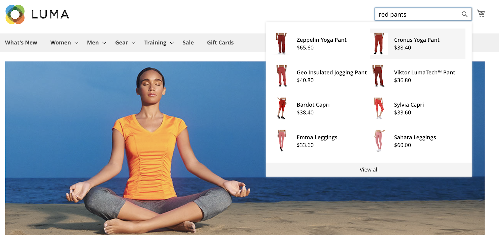
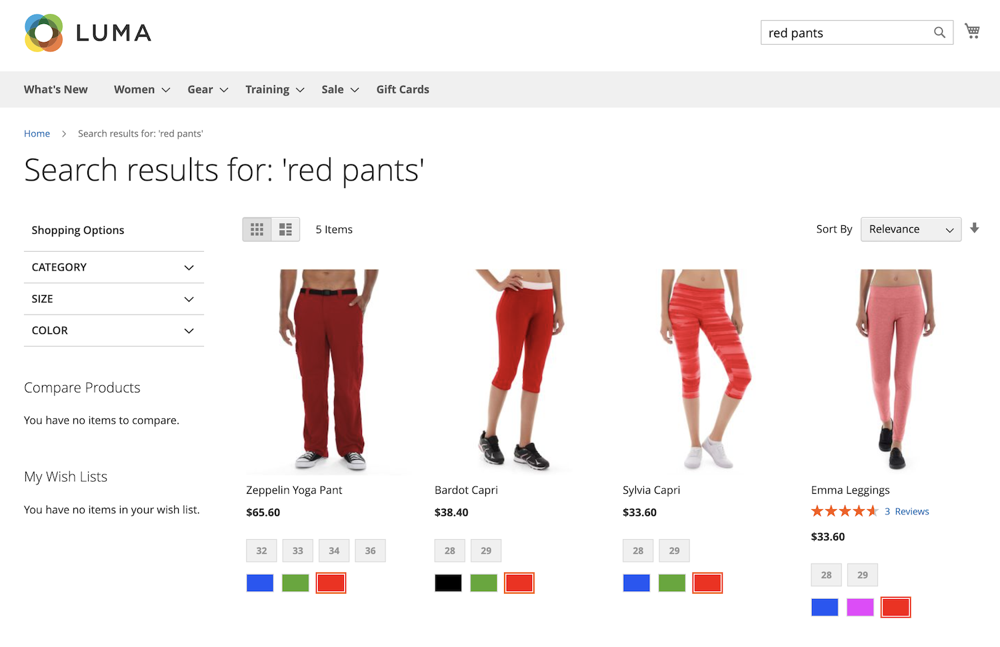

# What is [!DNL Live Search]?

The products on your site are only purchased if they can be found. Many traditional Commerce search experiences:

- Lack dynamic filters to show relevant attriutes
- Require exact jargon
- Lack typo tolerance
- Lack autocomplete
- Do not allow active merchandising so you can sell what you want to sell
- Are slow or lagging

[!DNL Live Search] for Adobe Commerce delivers a fast, relevant, and intuitive search experience at no additional cost. [!DNL Live Search] powered by [Adobe Sensei](https://www.adobe.com/sensei.html) uses artificial intelligence and machine-learning algorithms to perform a deep analysis of aggregated visitor data. This data, when combined with your Adobe Commerce catalog, results in a relevant and personalized shopping experience. 

With [!DNL Live Search], you can:

<table>
<tbody>
<tr style="border: 0;">
<td></td>
<td><b>Fast, intuitive search experience</b></td><td>Create meaningful search experiences to help shoppers and buyers find what they want with as little effort as possible.</td>
</tr>
<tr style="border: 0;">
<td></td><td><b>AI-Powered feature set</b></td><td>Take advantage of AI-powered dynamic faceting and re-ranking of search results in response to in-session shopper behaviors.</td>
</tr>
<tr style="border: 0;">
<td></td>
<td><b>SaaS Service, included with license</b></td>
<td>Use a lightweight SaaS-based service that offers easy updates and is included in your license, reducing TCO.</td>
</tr>
<tr style="border: 0;">
<td></td>
<td><b>Flexible framework for developers</b></td>
<td>Get technical by enabling graphQL API, headless flexibility, API sandbox environments, ultra fast SaaS; storefront widget optionality.</td></tr>
</tbody>
</table>

## Quick Tour

With a focus on speed, relevance, and ease of use, [!DNL Live Search] is a game changer for shoppers and merchants alike. Follow along for a quick tour of [!DNL Live Search] from the storefront.

### Search as you type

[!DNL Live Search] responds with suggested products and a thumbnail image of top search results in a [popover](storefront-popover.md) as shoppers type queries into the [Search](https://experienceleague.adobe.com/docs/commerce-admin/catalog/catalog/search/search.html#quick-search) box. The [product detail](https://experienceleague.adobe.com/docs/commerce-admin/start/storefront/storefront.html#product-page) page appears when shoppers  click a suggested or featured product. A _View all_ link in the footer of the popover displays the search results page.

[!DNL Live Search] returns "search as you type" results for a query of two or more characters. For a partial match, the maximum number of characters per word is 20. The number of characters in the query is not configurable. The following fields are included in the popover: `name`, `sku`, and `category_ids`.

### View all search results

To list all products returned by the "search as you type" query, click _View all_ in the footer of the popover.

### Filtered search with facets

Filtered search uses multiple dimensions of attribute values, or [facets](facets.md), as search criteria. The selection of filters is defined by the merchant and changes according to the products returned, with the most commonly-used facets pinned to the top of the list.

Use facets as URL parameters:`http://yourwebsite.com?color=red`, and Live Search filters results based on these attribute values. 

### Synonyms

[Synonyms](synonyms.md) expand the reach and sharpen the focus of queries by including words shoppers might use that differ from those in the catalog. You can fine tune the synonym dictionary to keep shoppers engaged and on the path to purchase.

### Merchandising rules

Merchandising [rules](rules.md) shape the shopping experience with if-then statements that add logic and events to search. You can easily boost or bury products for a promotion, season, or other period of time.

### Search terms support

[!DNL Live Search] supports Commerce [search term redirects](https://experienceleague.adobe.com/docs/commerce-admin/catalog/catalog/search/search-terms.html). For example, users can search for a term such as "Shipping Rates" and be taken directly to the the shipping rates page.
