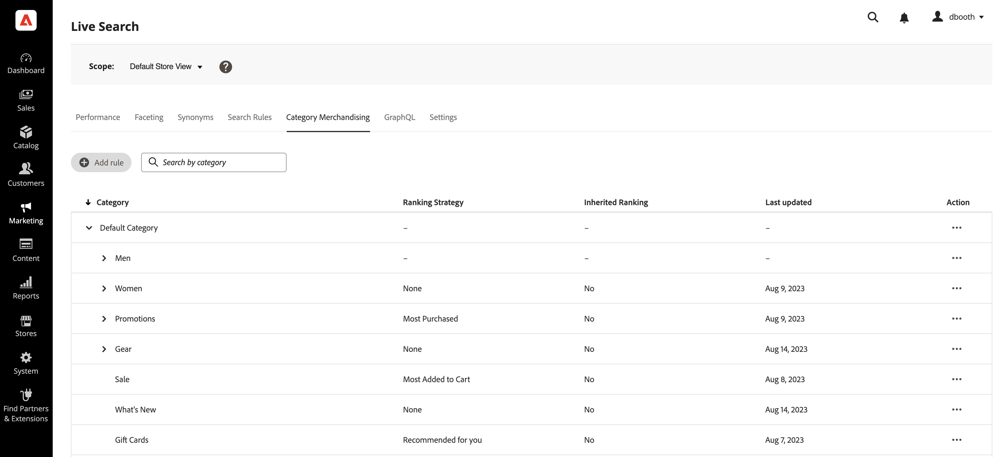
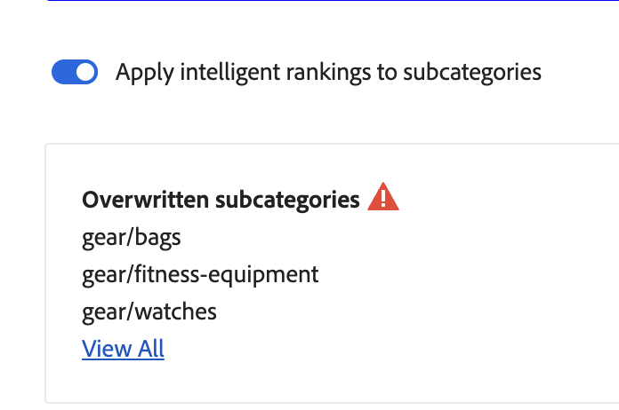
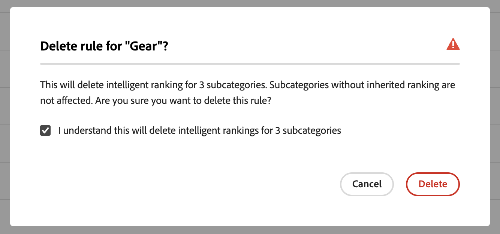
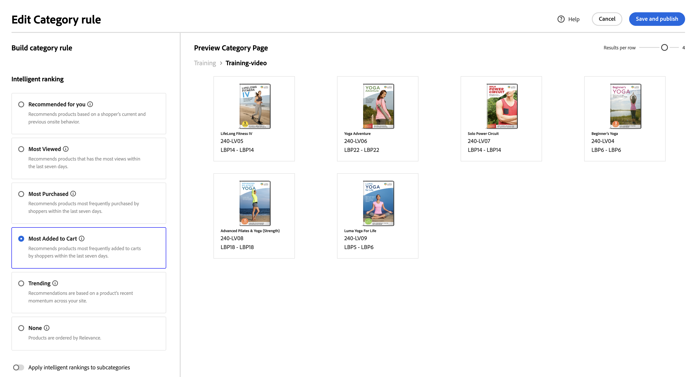

# Category Merchandising

Category Merchandising allows store owners to apply [!DNL Live Search] Intelligent ranking [rules](rules.md) to product categories and subcategories.

The feature is accessed through the Category Merchandising tab on the [!DNL Live Search] area of the admin.

The Category Merchandising tab shows defined category rules, with columns for:

* Category
* Ranking Strategy
* Inherited Ranking
* Last Updated
* Action

You can search for a category or subcategory in the "Search by category" field.

## Ranking strategies

Category Merchandising uses the same ranking types as with [individual products](rules-workspace.md).
There are two types of ranking: Intelligent and Manual.

**Intelligent ranking** uses historical data and [Adobe Sensei](https://www.adobe.com/sensei.html) to do the ranking. 
Intelligent ranking methods are:

* Most purchased: This ranks products by total purchases per SKU in the previous seven days.
* Most added to cart - Ranks in order of total "Add to Cart" activities in the previous seven days.
* Most viewed: Ranks my total views per SKU in the previous seven days.
* Recommended for you - Uses the viewed-viewed data point - Shoppers who viewed this SKU also looked at these other SKUs
* Trending: Looks back at page view events over the past 72 hours for background events and 24 hours for foreground events
* None: Products are ordered by Relevance

**Manual ranking** allows users to define their own product rankings or to pin products.

## Inherited ranking

As a store owner, you might want to be able to select all of Women's wear categories to be sorted by "trending". This includes the subcategories "Women's pants", "Women's shirts", and "Women's accessories". Men's categories should not be affected. You can use inherited rankings to achieve this.

When selecting an Intelligent ranking method for a category or subcategory that has subcategories, you can turn on the **Apply intelligent rankings to subcategories** option. This applies the ranking method to all subcategories.
These subcategories now inherit that rule from the main category, as noted by the "Yes" in the Inherited Ranking column. In the Action column, the only available options are **Edit Rule**, and **View Details**. The **Delete** option is disabled for subcategories inheritance. Deleting subcategory inheritance requires undoing inheritance from the parent category.

Generally, a category or subcategory can only have a single Intelligent ranking applied at any one time. Categories may have additional Manual rankings applied as well.

If you apply an Intelligent ranking to a category and turn on the **Apply intelligent ranking to subcategories** option, any Intelligent ranking already applied to the subcategories are overwritten.

{width="700"}

If you click the "View All" link, a dialog opens with details of the changes to be made.

When adding an Intelligent ranking to a product that has an inherited Intelligent ranking, the inheritance is severed and the new Intelligent ranking is applied to that product. 

When deleting the Intelligent ranking from the product, the inheritance is reestablished.
In both scenarios, any Manual rankings are maintained.

If you remove an Intelligent ranking from a category, and you have the subcategory inheritance selected, only the inherited Intelligent rankings are removed from the subcategories. Manual rankings remain.

A modal dialog appears explaining which inherited subcategories are affected by any changes you make to a higher-level category.

{width="1200"}

## Build a category rule

1. Click the **Add Rule** button.
1. In the "Select Category" window, click through the categories and subcategories.
1. Click the checkbox to select the category you wish to rank.
1. Click the **Apply** button.

1. In the "Add Category rule" window, select the Intelligent ranking method you wish to apply to the category.
   The Category Preview Page shows the actual results of the selected ranking, using your Live Search data.
1. Click the "Save and Publish" button to save the rule.

The [!DNL Live Search] service processes the rule and activates it on the store when finished.

## Modify a category rule

To modify an existing rule:

1. Click the **...** in the Action column and choose **Edit**.
1. In the Edit Category rule window, make any required changes and click **Save and Publish**.

The changes are reflected on the store when [!DNL Live Search] has processed the change.

## Delete a category rule.

To delete a category rule:

1. Click the **...** in the Action column and choose **Delete**.
1. In the "Delete rule" modal, select **Delete** to remove the rule or **Cancel** to cancel the action.

## Manual ranking

Manual ranking allows you to fine-tune where specific products appear within the Intelligent ranking results.

Events are actions that modify the search results when defined conditions are met. A manual ranking can have up to 25 events.

* Boost - Moves a product higher in the search results.
* Bury - Moves a SKU lower in the search results.
* Pin a product - Product is displayed in the selected "Position" on the page.
* Hide a product - Excludes a SKU from the search results.

To do manual ranking:

1. Set up an Intelligent ranking rule for a category as described above. The results of the query will appear in the Preview Category Page window. This uses your actual Live Search data to preview the results.

1. Click and drag a product in the Preview Category Page window. Drag and drop it at the desired position. The Product and Postion fields are automatically populated in the Events pane.
  
  You may also click the pin icon to pin a product to its current location. Use the ellipsis context menu to "Pin to top" or "Pin to bottom".

To manually add an event:

1. Under Manual Ranking, click the **Select an event** menu and choose an event to take place when the associated conditions are met. 
1. Enter the name of the product that you want to affect. Products are suggested as you type.
1. For multiple events, choose any other events that you want to trigger when conditions are met.
