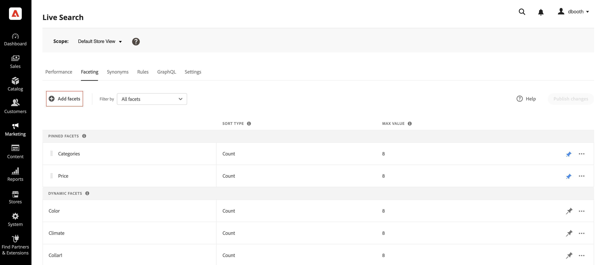
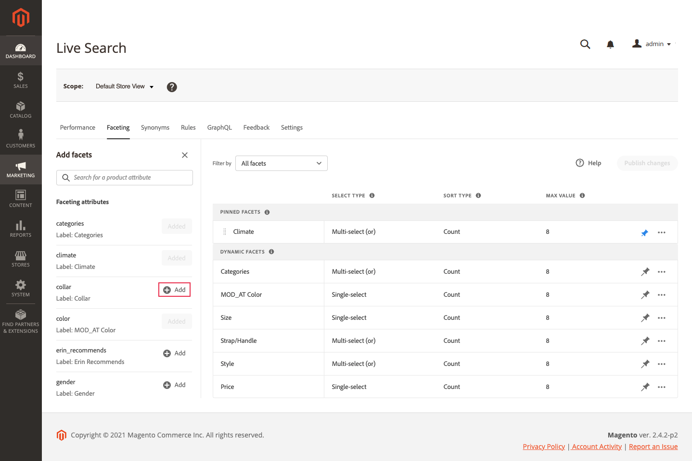
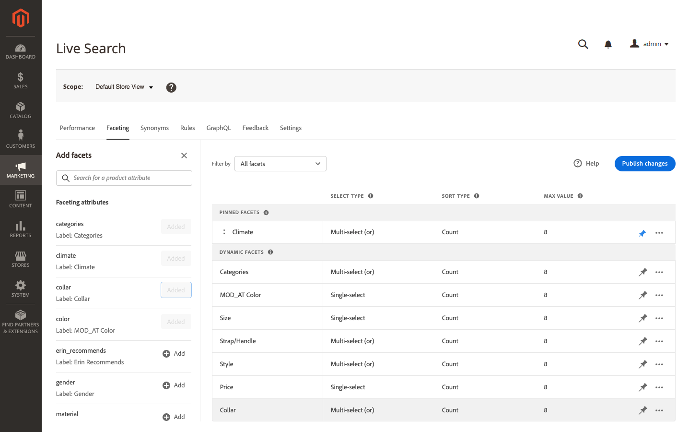
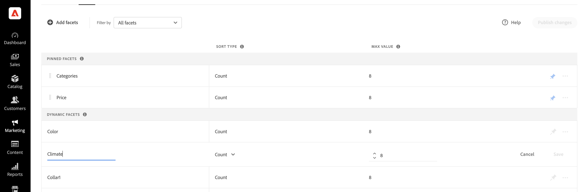

# Add Facets

Any filterable product attribute can be used as a facet. The *Add facets* panel lists the current facets and makes it easy to assign additional product attributes as facets. During this three-step process, an attribute is chosen to be used as a facet, properties are edited if needed, and the changes published to the storefront.

## Step 1: Add a facet

1. In the Admin, go to **Marketing** > SEO & Search > **[!DNL Live Search]**.
1. On the *Faceting* tab, click **Add facets**.
1. In the *Add facets* list, each available attribute has a separate *Add* button. Do one of the following:

   

     * In the *Faceting attributes* list, choose the product attribute that you want to use as a facet and click **Add**.
     * To find a specific product attribute, enter the first few characters of the attribute name in the *Search* box. Then, click **Add**.

       To configure price faceting intervals and groupings, refer to [Settings](settings.md). To learn more, go to [Facet Types](facets-type.md).
       The facet is added to the bottom of the *Dynamic Facets* list and the *Publish changes* button becomes available.

   

1. If the facet you want to add can't be found, go to **Stores** > Attributes > **Product** and verify that the attribute has the [required properties](facets.md) to be used as a facet. If necessary, update the following storefront properties of the attribute:

     * Use in Search - `Yes`
     * Use in Search Results Layered Navigation - `Yes`
     * Use in Layered Navigation - `Filterable (with results)`

1. When prompted, refresh the cache.

   The facet becomes available in the storefront the next time the catalog is synchronized with [!DNL Live Search]. If the facet isn't available after two hours, see [Synchronize catalog data](install.md#synchronize-catalog-data).

## Step 2: Edit facet properties (Optional)

1. To edit the facet properties, click **More** () options in the far-right column.
1. On the menu, click **Edit**. Then, adjust the following properties as needed.

     * Label - ([Headless](facets-type.md) only) Enter the facet label that you want to use.
     * Select type - The *Select type* used for all [!DNL Commerce] storefronts is `single select`. For headless implementations, `multi-select` type can be assigned with a logical operator (`or` or `and`) to determine the set of products returned.
     * Sort type - Facets are sorted alphabetically for all [!DNL Commerce] storefronts. For headless implementations, facets can be sorted either alphabetically or by count. Options: Alphabetical, Count (headless only)
     * Max Value - Enter the maximum number of facet values displayed in the storefront. Valid entries: 0 - 30; Default: 8

1. When complete, click **Save**.

   

1. To pin the facet to the top of the *Filters* list, click the gray pushpin ().
1. To change the order of the pinned facet, click the **Move** () icon and drag the row to a new position in the *Pinned Facets* section.

## Step 3: Publish changes

1. When the facet is complete, click **Publish changes**.
1. Wait for the facet to appear in the store.
   If the facet isn't available after two hours, see [Verify export](install.md#synchronize-catalog-data) in the installation instructions.

## Field descriptions

| Field | Description |
|--- |--- |
| Label | ([Headless](facets-type.md) only) The [facet label](facets-type.md) that is visible in the storefront can be edited for consistency with your brand. |
| Select type | Displays the [selection method](facets-type.md) that is associated with the product attribute. All facets in the [!DNL Commerce] storefronts are `Single select` only. Headless implementations also support `Multi-select` with the logical operators `OR` and `AND`. |
| Sort Type | The method that is used to [sort](facets-type.md) facets. All [!DNL Commerce] storefronts sort facets alphabetically only. Headless implementations can also sort by `Count`. Options: Alphabetical - Sorts facets alphabetically. Count - (Headless only) Sorts facets based on the number of matches found. |
| Max Value | The maximum number of values that can be displayed in the storefront for each facet. Facets that represent a range of values are evenly distributed. Valid entries: 0 - 30; Default: 8 |

### Controls

| Control | Description |
|--- |--- |
|  | Pins or unpins a facet to the top of the *Filters* list. |
|  | Displays a menu of more actions that can be applied to the selected facet. Options: Edit, Delete |
|  | Use the *Move* icon to drag a pinned facet to another place in the *Pinned facets* section. |
