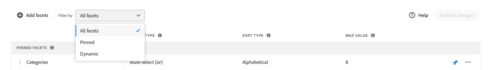
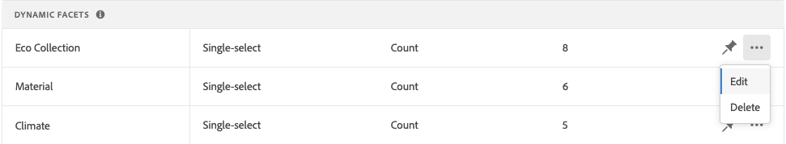
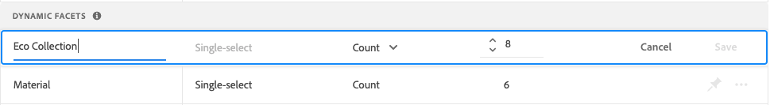
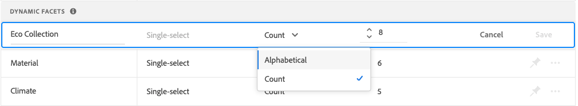
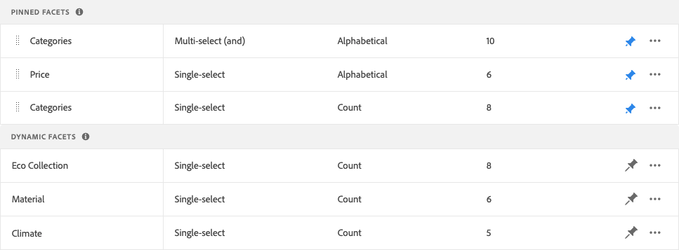

# Manage Facets

Follow these instructions to update the properties of existing facets or change their presentation in the storefront.

## Configure price facet groupings

Refer to [Settings](settings.md) to configure price faceting intervals and groupings.

## Edit facet

1. Find the facet that you want to edit.
1. If there are many facets in the list, set *Filter by* to one of the following:

     * Pinned
     * Dynamic

     To learn more, go to [Facet Types](facets-type.md).

     

1. To edit the facet properties, click **More** (...) options.
1. Click **Edit**

     

1. To edit the facet label, do one of the following:

     * For a [!DNL Commerce] storefront, edit the [attribute label](https://experienceleague.adobe.com/docs/commerce-admin/catalog/product-attributes/product-attributes.html).
     * For a headless implementation, click the value in the first column and edit the text as needed.

     

1. (Headless only) To change the method that is used to sort facet values, click the value in the *Sort Type* column and choose one of the following:

     * Alphabetical
     * Count

      

1. In the **Max Value** column, set the maximum number (from 0 – 10) of facet filter values to show in the storefront.
1. When complete, click **Save**.
      Your changes won't appear in the storefront until after they are published.

## Pin/unpin facet

The pin changes color when clicked and is used to move the facet to either the *Pinned Facets* or the *Dynamic Facets* section.

1. To pin a facet to the top of the *Filters* list, find the facet in the *Dynamic Facets* list and click the gray pin ().
     The pin turns blue and the facet moves to the *Pinned Facets* section.
1. To unpin a facet, find the facet in the *Pinned Facets* list and click the blue pin ().
      The pin turns gray and the facet moves to the *Dynamic Facets* section.

      

## Move pinned facet

>[!NOTE]
>
>The ordering of pinned facets is only supported in headless implementations. If ordered facets are needed, use the Live Search PLP widget.

The order of pinned facets can be changed by moving the row to a different position. Pinned facets have a *Move* icon () at the beginning of the row. Unlike pinned facets, dynamic facets cannot be moved.

1. Find the facet in the *Pinned Facets* section of the list.
1. Use the **Move** () icon to drag the row to a new position in the *Pinned Facets* section.
   After the changes are published, the reordered facets appear in the storefront *Filters* list.

## Delete facet

1. Find the facet in the list and click **More** (...) options.
1. Click **Delete**.
1. When prompted to confirm, click **Delete facet**.
   The facet is removed from the storefront after the changes are published.

## Publish changes

1. To update the storefront with your changes, click **Publish changes**.
1. Wait about 15 minutes for the updates to appear in your store.
