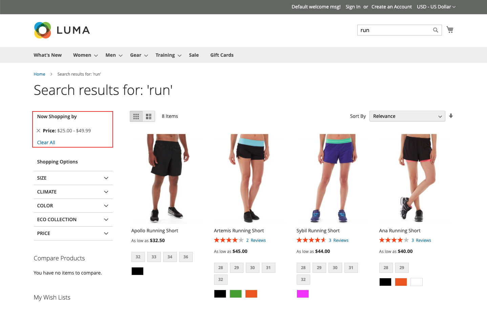

# Types of facets

[!DNL Live Search] uses a variety of facets types and they appear in the *Filters* list only when relevant. The list of available facets changes according to the products returned. The following characteristics affect their presentation and behavior:

* Pinned facets  - The most commonly-used facets can be pinned to the top of the list. The remaining facets are listed in *Sort type* order after the pinned facets.
* Dynamic facets - Product attributes that [Adobe Sensei](https://www.adobe.com/sensei.html) finds most relevant to a product set and query. The calculation takes into account the attribute metadata of the entire catalog and determines at query time the most relevant facets for the query.
* Popular facets - Product attributes that are most often present in search results.
* Price facets - Return products by price range. You can specify the number of selections and the price range interval on the [*Settings*](settings.md) tab.

At query time, [!DNL Live Search] generates the search results in groups of dynamic and popular facets.

## Storefront and headless options

Facets that are rendered for the [!DNL Commerce] storefront are processed by the search adapter, which routes requests and renders the results in the storefront. All [!DNL Commerce] storefront facets are sorted alphabetically with single-select options, regardless of the input type that is assigned to the corresponding attribute. Facets that are available in the storefront are rendered according to the current theme and reflect any customizations made to the presentation of layered navigation.

In contrast, [headless](https://developer.adobe.com/commerce/php/architecture/technical-vision/web-api/) implementations are processed by the API and support additional options. Headless facets can be sorted alphabetically or by count, and can have either single- or multi-select options.

### Facet labels

For [!DNL Commerce] storefronts, the facet label is determined by the [*Attribute Properties*](https://experienceleague.adobe.com/docs/commerce-admin/catalog/product-attributes/create/attribute-product-create.html). For stores with multiple views, additional labels can be defined under *Manage Labels*. For headless implementations, labels are edited from the [faceting workspace](faceting-workspace.md).

### Sort type

All facets rendered for the storefront are sorted alphabetically. For headless implementations, facets can be sorted alphabetically or by count.

| Sort type | Description |
|--- |--- |
| Alphabetic | In the storefront *Filters* list, facets are sorted alphabetically. |
| Count | (Headless only) For headless implementations, facets can also be sorted by the number of values found per facet in the current set of returned products. |
