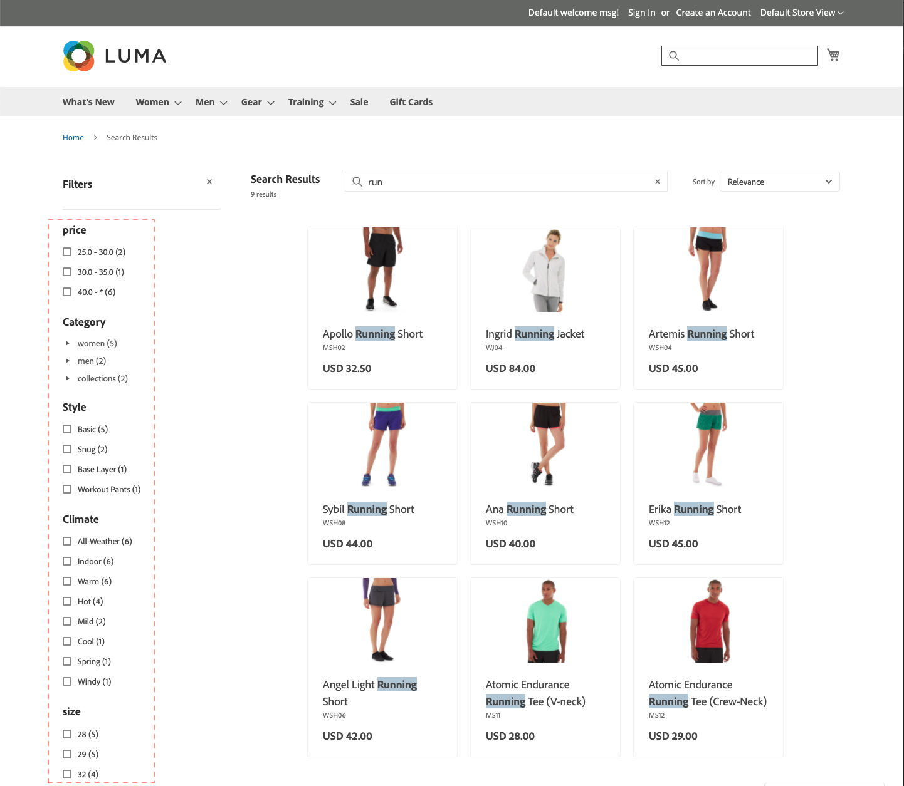

# Facets

Faceting is a method of high-performance filtering that uses multiple dimensions of attribute values as search criteria. Faceted search is similar, but considerably “smarter” than the standard [layered navigation](https://docs.magento.com/user-guide/catalog/navigation-layered.html). The list of available filters is determined by the [filterable attributes](https://docs.magento.com/user-guide/catalog/navigation-layered-filterable-attributes.html) of products returned in the search results. 

## Faceting requirements

The category and product attribute requirements for faceting are similar to the filterable attributes used for layered navigation. The storefront properties of each attribute must be set to `filterable (with results)`.

* Up to 100 attributes can be configured as facets with [!DNL Live Search].
* [!DNL Live Search] indexes up to 300 attributes as filterable/searchable/sortable and visible in search.

| Setting | Description |
|--- |--- |
| [Category display settings](https://docs.magento.com/user-guide/catalog/categories-display-settings.html) | Anchor - `Yes` |
| [Attribute properties](https://docs.magento.com/user-guide/stores/attribute-product-create.html) | [Catalog Input type](https://docs.magento.com/user-guide/stores/attributes-input-types.html) - `Yes/No`, `Dropdown`, `Multiple Select`, `Price` |
| Attribute storefront properties | Use in Layered Navigation - `Filterable (with results)` |

## Default attribute values

The following product attributes have [storefront properties](https://docs.magento.com/user-guide/stores/attributes-product.html) that are used by [!DNL Live Search] and enabled by default.

| Property | Storefront Property | Attribute |
|---|---|---|
| Sortable | Used for Sorting in Product Listing | `price`|
| Searchable | Use in Search | `price`  `sku` `name`|
| FilterableInSearch | Use in Layered Navigation - Filterable (with results)| `price` `visibility` `category_name`|

## Default non-system attribute properties

The following table shows the default search and filterable properties of non-system attributes, including those that are specific to the Luma sample data. Setting the *Use in Search* attribute property to `Yes` makes the attribute searchable in both [!DNL Live Search] and native Adobe Commerce.

| Attribute Code | Searchable | Use in Layered Navigation |
|--- |--- |--- |
| activity | Yes | Filterable (with results) |
| attributes_brand | Yes | No |
| brand | Yes | No |
| climate | Yes | Filterable (with results) |
| collar | Yes | Filterable (with results) |
| color | Yes | Filterable (with results) |
| cost | Yes | No |
| eco_collection | Yes | Filterable (with results) |
| gender | Yes | Filterable (with results) |
| manufacturer | Yes | Filterable (with results) |
| material | Yes | Filterable (with results) |
| purpose | Yes | Filterable (with results) |
| strap_bags | Yes | Filterable (with results) |
| style_general | Yes | Filterable (with results) |

## Default system attribute properties

The following table shows the default search and filterable properties of system attributes.

| Attribute Code | Searchable | Use in Layered Navigation |
|--- |--- |--- |
| allow_open_amount | Yes | Filterable (with results) |
| description | Yes | No |
| name | Yes | No |
| price | Yes | Filterable (with results) |
| short_description | Yes | No |
| sku | Yes | No |
| status | Yes | No |
| tax_class_id | Yes | No |
| url_key | Yes | No |
| weight | Yes | No |
