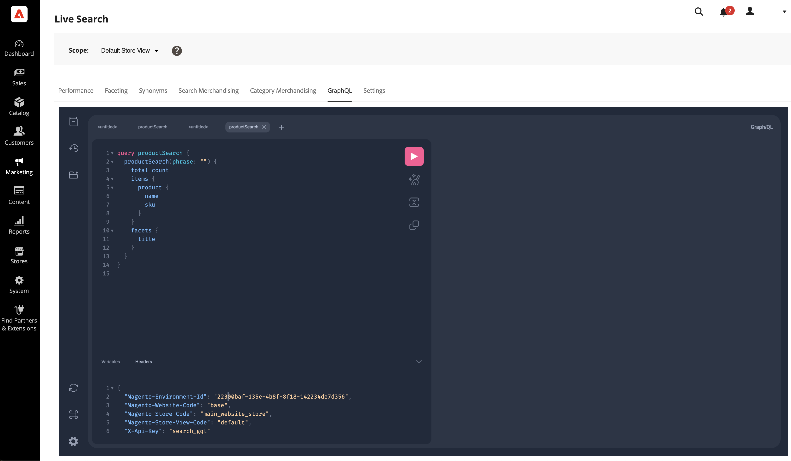

# GraphQL

The [!DNL Live Search] GraphQL tab is an interactive GraphQL workspace that allows administrators to build and test GraphQL queries using their own data.

This workspace supports the [`productSearch`](https://developer.adobe.com/commerce/services/graphql/live-search/product-search/) and [`attributeMetadata`](https://developer.adobe.com/commerce/services/graphql/live-search/attribute-metadata/) queries.

