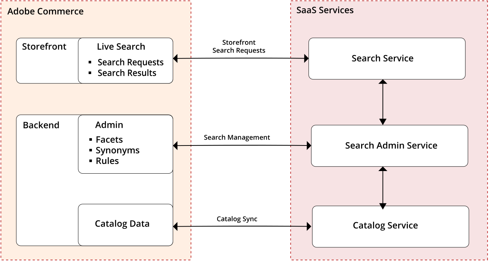

# Install [!DNL Live Search]

[!DNL Live Search] is a set of standalone [packages](#live-search-packages) that replaces standard Magento Open Source and Adobe Commerce search capabilities. The [!DNL Live Search] module is installed from the command line of the server and connects to your Adobe Commerce installation as a [service](https://docs.magento.com/user-guide/system/saas.html). When the process is complete, [!DNL Live Search] appears on the *Marketing* menu under *SEO & Search* in the [!DNL Commerce] `Admin`.

The Adobe Commerce side includes hosting the search `Admin`, syncing catalog data, and running the query service.



After the [!DNL Live Search] module (with catalog modules as dependencies) is installed and configured, [!DNL Commerce] begins sharing search and catalog data with SaaS services. At this point, Admin users can set up, customize, and manage search facets, synonyms, and merchandising rules.

This topic provides instructions to do the following:

* [Install [!DNL Live Search]](#before-you-begin) (Methods 1 and 2)
* [Update [!DNL Live Search]](#update)
* [Uninstall [!DNL Live Search]](#uninstall)

## Requirements {#requirements}

* [Adobe Commerce](https://magento.com/products/magento-commerce) 2.4.x
* PHP 7.3 / 7.4
* [!DNL Composer]

### Supported platforms

* Adobe Commerce on prem (EE) : 2.4.x
* Adobe Commerce on Cloud (ECE) : 2.4.x

## Boundaries and thresholds

At this time, the Live Search search/category API has the following supported limits and static boundaries:

### Indexing

* Indexes up to 300 product attributes per store view
* Indexes only products from the Adobe Commerce database
* Does not index CMS pages

### Query limits

* Live Search does not have access to the full taxonomy of the category tree, which makes some layered navigation search scenarios beyond its reach.
* Live Search uses a unique GraphQL endpoint for queries to support features such as intelligent faceting and search-as-you-type. Although similar to the [Magento GraphQL API](https://devdocs.magento.com/guides/v2.4/graphql), there are a few differences and some fields may not be fully compatible at this time.

### PWA beta release

* The beta release of PWA for Live Search does not support [eventing](https://devdocs.magento.com/shared-services/storefront-events-sdk.html).
* The following product attributes are not supported by GraphQL when used in relation to the beta release of [PWA](https://developer.adobe.com/commerce/pwa-studio/): `description`, `name`, `short_description`

### Not supported at this time

* The [Advanced Search](https://docs.magento.com/user-guide/catalog/search-advanced.html) module is disabled when Live Search is installed, and the Advanced Search link in the storefront footer is removed.
* [Customer groups](https://docs.magento.com/user-guide/customers/customer-groups.html)
* [Custom price groups](https://docs.magento.com/user-guide/catalog/product-price-group.html)
* Multiple inventory locations as used by [MCOM](https://docs.magento.com/user-guide/mcom.html) or other OMS extensions
* [Integrated B2B capabilities](https://business.adobe.com/products/magento/b2b-ecommerce.html)

## Before you begin {#before-you-begin}

Do the following:

1. Confirm that [cron jobs](https://devdocs.magento.com/guides/v2.4/config-guide/cli/config-cli-subcommands-cron.html) and [indexers](https://docs.magento.com/user-guide/system/index-management.html) are running.

1. Choose the onboarding method that meets your requirements and follow the instructions.

   * [Method 1](#method-1): Install without [!DNL Elasticsearch]
   * [Method 2](#method-2): Install with [!DNL Elasticsearch] (No downtime)

## Method 1: Install without Elasticsearch {#method-1}

This onboarding method is recommended when installing [!DNL Live Search] to a:

* New [!DNL Commerce] installation
* Staging environment

In this scenario, storefront operations are interrupted while the [!DNL Live Search] service indexes all products in the catalog. During the installation, [!DNL Live Search] modules are enabled and [!DNL Elasticsearch] modules are disabled.

   >[!TIP]
   >
   >To avoid typing errors, hover over the far right of the code box, click the [!UICONTROL **Copy**] link, and paste it into the command line.

1. Install Adobe Commerce 2.4.x without [!DNL Live Search].

1. To download the `live-search` package, run the following from the command line:

   ```bash
   composer require magento/DNL live-search
   ```

   For more information, refer to the list of [!DNL Live Search] [dependencies](#dependencies) that are captured by [!DNL Composer].

1. Run the following commands to disable [!DNL Elasticsearch] and related modules, and install [!DNL Live Search]:

   ```bash
   bin/magento module:disable Magento_Elasticsearch Magento_Elasticsearch6 Magento_Elasticsearch7 Magento_ElasticsearchCatalogPermissions Magento_InventoryElasticsearch
   ```

   ```bash
   bin/magento setup:upgrade
   ```

   >[!WARNING]
   >
   > While the data is indexed and synchronized, the search and category browse operations are not available in the storefront. Depending on the size of your catalog, the process can take at least an hour from the time `cron` runs to synchronize your data to [!DNL Live Search] services.

1. Verify that the following [indexers](https://docs.magento.com/user-guide/system/index-management.html) are set to `Update by Schedule`:

   * Product Feed
   * Product Variant Feed
   * Catalog Attributes Feed

1. Configure your [API keys](#configure-api-keys) to [synchronize](#synchronize-catalog-data) your catalog data to [!DNL Live Search] services.

1. To make facets available as filters in the storefront, add the [facets](https://docs.magento.com/user-guide/live-search/facets-add.html) you need, according to the [faceting requirements](https://docs.magento.com/user-guide/live-search/facets.html).

   You should be able to add facets after `cron` runs the attribute feeds and exports attribute metadata.

1. Wait at least an hour after `cron` runs to synchronize data. Then, [verify](#verify-export) that the data was exported.

1. [Test](#test-the-connection) the connection from the storefront.

## Method 2: Install with Elasticsearch {#method-2}

This onboarding method is recommended when installing [!DNL Live Search] to:

* An existing production [!DNL Commerce] installation

In this scenario, [!DNL Elasticsearch] temporarily manages search requests from the storefront while the [!DNL Live Search] service indexes all products in the background, without any interruption to normal storefront operations. [!DNL Elasticsearch] is disabled and [!DNL Live Search] enabled after all catalog data is indexed and synchronized.

>[!TIP]
>
>To avoid typing errors, hover over the far right of the code box, click the [!UICONTROL **Copy**] link, and paste it into the command line.

1. To download the `live-search` package, run the following from the command line:

   ```bash
   composer require magento/live-search
   ```

   For more information, refer to the list of [!DNL Live Search] [dependencies](#live-search-dependencies) that are captured by [!DNL Composer].

1. Run the following command to temporarily disable the [!DNL Live Search] modules that serve storefront search results.

   ```bash
   bin/magento module:disable Magento_LiveSearchAdapter Magento_LiveSearchStorefrontPopover
   ```

   ```bash
   bin/magento setup:upgrade
   ```

   [!DNL Elasticsearch] continues to manage search requests from the storefront while the [!DNL Live Search] service synchronizes catalog data and indexes products in the background.

1. Verify that the following [indexers](https://docs.magento.com/user-guide/system/index-management.html) are set to `Update by Schedule`:

   * Product Feed
   * Product Variant Feed
   * Catalog Attributes Feed

1. Configure your [API keys](#configure-api-keys) to [synchronize](#synchronize-catalog-data) your catalog data to [!DNL Live Search] services.

1. To make facets available as filters in the storefront, add the [facets](https://docs.magento.com/user-guide/live-search/facets-add.html) you need, according to the [faceting requirements](https://docs.magento.com/user-guide/live-search/facets.html).

   You should be able to add facets after `cron` runs the product and attribute feeds and exports attribute metadata to [!DNL Live Search] services.

1. Wait at least an hour for the data to be indexed and synchronized. Then, use the [GraphQL playground](https://devdocs.magento.com/live-search/graphql-support.html) with the default query to verify the following:

   * The returned product count is close to what you expect for the store view.
   * Facet(s) are returned.

1. Run the following commands to enable [!DNL Live Search] modules, disable [!DNL Elasticsearch], and run `setup`.

   ```bash
   bin/magento module:enable Magento_LiveSearchAdapter Magento_LiveSearchStorefrontPopover
   ```

   ```bash
   bin/magento module:disable Magento_Elasticsearch Magento_Elasticsearch6 Magento_Elasticsearch7 Magento_ElasticsearchCatalogPermissions Magento_InventoryElasticsearch
   ```

   ```bash
   bin/magento setup:upgrade
   ```

1. [Test](#test-the-connection) the connection from the storefront.

## Configure API keys {#configure-api-keys}

The Adobe Commerce API key and its associated private key are required to connect [!DNL Live Search] to an installation of Adobe Commerce. The API key is generated and maintained in the account of the [!DNL Commerce] license holder, who can share it with the developer or SI. The developer can then create and manage the SaaS Data Spaces on behalf of the license holder.

### Adobe Commerce license holder

To generate an API key and private key, refer to [Commerce Services Connector](https://docs.magento.com/user-guide/system/saas.html).

### Adobe Commerce developer or SI

The developer or SI configures the SaaS data space as described in the Commerce Services section of the configuration. In the `Admin`, Commerce Services becomes available in the Configuration sidebar when a SaaS module is installed.

## Synchronize catalog data {#synchronize-catalog-data}

[!DNL Live Search] requires synchronized product data for search operations, and synchronized attribute data to configure facets. The initial synchronization between the product catalog and the catalog service begins when [!DNL Live Search] is first connected. Depending on the installation method and size of the catalog, it can take up to eight hours for the data to be exported and indexed by [!DNL Live Search]. The list of data that is synchronized and shared with the catalog service can be found in the schema, which is defined in:

`vendor/magento/module-catalog-data-exporter/etc/et_schema.xml`

### Verify export {#verify-export}

To verify that the catalog data has been exported from your Adobe Commerce instance and is synchronized for [!DNL Live Search], look for entries in the following tables:

* `catalog_data_exporter_products`
* `catalog_data_exporter_product_attributes`

For additional help, refer to [[!DNL Live Search] catalog not synchronized](https://support.magento.com/hc/en-us/articles/4405637804301-Live-search-catalog-not-synchronized) in the Support Knowledge Base.

### Future product updates

After the initial synchronization, it can take up to fifteen minutes for incremental product updates to become available to storefront search. To learn more, go to [Streaming Product Updates](https://devdocs.magento.com/live-search/indexing.html).

## Test the connection {#test-connection}

In the storefront, verify the following:

* The [!UICONTROL Search] box returns results correctly
* Category browse returns results correctly
* Facet(s) are available as filters on search results pages

If everything works correctly, congratulations! [!DNL Live Search] is installed, connected, and ready to use.

If you encounter problems in the storefront, check the `var/log/system.log` file for API communication failures or errors on the services side.

## Updating [!DNL Live Search] {#update}

To update [!DNL Live Search], run the following from the command line:

```bash
composer update magento/live-search --with-dependencies
```

To update to a major version such as from 1.0.0 to 2.0.0, edit the project’s root [!DNL Composer] `.json` file as follows:

1. Open the root `composer.json` file and search for `magento/live-search`.

1. In the `require` section, update the version number as follows:

   ```json
   "require": {
      ...
      "magento/live-search": "^2.0",
      ...
    }
   ```

1. **Save** `composer.json`. Then, run the following from the command line:

   ```bash
   composer update magento/live-search –-with-dependencies
   ```

## Uninstalling [!DNL Live Search] {#uninstall}

To uninstall [!DNL Live Search], refer to [Uninstall modules](https://devdocs.magento.com/guides/v2.4/install-gde/install/cli/install-cli-uninstall-mods.html).

## [!DNL Live Search] packages {#packages}

| Package | Description |
|--- |--- |
| `module-live-search` | Allows merchants to configure their search settings for faceting, synonyms, query rules, etc., and provides access to a read-only GraphQL playground to test queries from the `Admin`. |
| `module-live-search-adapter` | Routes search requests from the storefront to the [!DNL Live Search] service and renders the results in the storefront. <br />- Category browse - Routes requests from the storefront [top navigation](https://docs.magento.com/user-guide/catalog/navigation-top.html) to the search service.<br />- Global search - Routes requests from the [quick search](https://docs.magento.com/user-guide/catalog/search-quick.html) box in the upper-right of the storefront to the [!DNL Live Search] service. |
| `module-live-search-storefront-popover` | A "search as you type" popover replaces the standard quick search and returns dynamic product suggestions and thumbnails of top search results. |

## [!DNL Live Search] dependencies {#dependencies}

The following [!DNL Live Search] dependencies are captured by [!DNL Composer]:

| Dependency | Description|
|--- |--- |
| Export modules | The following modules collect and sync catalog data:<br />`saas-export`<br />`module-bundle-product-exporter`<br />`module-catalog-data-exporter`<br />`module-catalog-inventory-data-exporter`<br />`module-catalog-url-rewrite-data-exporter`<br />`module-configurable-product-data-exporter`<br />`module-data-exporter`<br />`module-parent-product-data-exporter` |
| `services-connector` | Required to configure your connection to Commerce Services. |
| `module-services-id` | Required to configure your connection to Commerce Services. |
