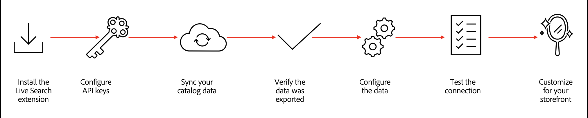
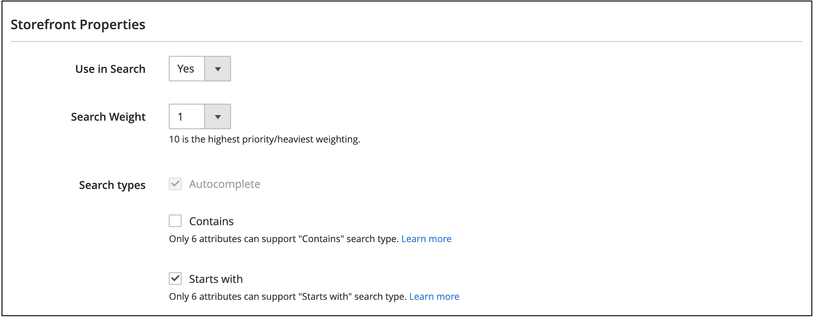
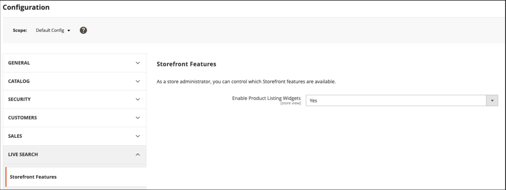

# Set up for success with [!DNL Live Search]

Adobe Commerce [!DNL Live Search] and [[!DNL Catalog Service]](../catalog-service/guide-overview.md) work together to provide a performant, relevant, and intuitive search solution to allow your customers to find exactly what they need, fast. Specifically, [!DNL Catalog Service] surfaces your catalog data for SaaS services, such as [!DNL Live Search] to use.

This article provides step-by-step instructions for implementing [!DNL Live Search] with [!DNL Catalog Service].

>[!IMPORTANT]
>
>When it comes to site search, Adobe Commerce gives you options. Be sure to read [Boundaries and Limits](boundaries-limits.md) before implementing, to ensure that [!DNL Live Search] is a fit for your business needs.

## Audience

This article is intended for the developer or systems integrator on your team who is responsible for installing and configuring your Adobe Commerce instance.

## Requirements

- [Adobe Commerce](https://business.adobe.com/products/magento/magento-commerce.html) 2.4.4+
- PHP version 8.1, 8.2, or 8.3
- [!DNL Composer]

## Supported platforms

- Adobe Commerce on Cloud (ECE) : 2.4.4+
- Adobe Commerce on-prem (EE) : 2.4.4+

## Workflow overview

At a high level, onboarding [!DNL Live Search] requires that you:



## 1. Install the [!DNL Live Search] extension

[!DNL Live Search] is installed as an extension from [Adobe Marketplace](https://commercemarketplace.adobe.com/magento-live-search.html) through [Composer](https://getcomposer.org/). After you install and configure [!DNL Live Search], Adobe [!DNL Commerce] begins sharing search and catalog data with SaaS services. At this point, *Admin* users can set up, customize, and manage search facets, synonyms, and merchandising rules.

>[!NOTE]
>
>As of [!DNL Live Search] 3.0.2, the [!DNL Catalog Service] extension is bundled in with the [!DNL Live Search] installation.

1. Confirm that [cron jobs](https://experienceleague.adobe.com/en/docs/commerce-operations/configuration-guide/cli/configure-cron-jobs) and [indexers](https://experienceleague.adobe.com/en/docs/commerce-admin/systems/tools/index-management) are running.

   >[!IMPORTANT]
   >
   >Due to the Elasticsearch 7 end-of-support announcement for August 2023, it is recommended that all Adobe Commerce customers migrate to the OpenSearch 2.x search engine. For information about migrating your search engine during a product upgrade, see [Migrating to OpenSearch](https://experienceleague.adobe.com/en/docs/commerce-operations/upgrade-guide/prepare/opensearch-migration) in the _Upgrade Guide_.

1. Download the `live-search` package from the [Adobe Marketplace](https://commercemarketplace.adobe.com/magento-live-search.html).

1. Run the following from the command line:

   ```bash
   composer require magento/live-search
   ```

   If you are adding the [!DNL Live Search] extension to a **new** Adobe Commerce installation, run the following command to disable [!DNL OpenSearch] and related modules temporarily, and install [!DNL Live Search]. Then, proceed to step 4.

   ```bash
      bin/magento module:disable Magento_Elasticsearch Magento_Elasticsearch7 Magento_OpenSearch Magento_ElasticsearchCatalogPermissions Magento_InventoryElasticsearch Magento_ElasticsearchCatalogPermissionsGraphQl
   ```

   If you are adding the [!DNL Live Search] extension to an **existing** Adobe Commerce installation, run the following to disable the [!DNL Live Search] modules that serve storefront search results. Then, proceed to step 4:

   ```bash
      bin/magento module:disable Magento_LiveSearchAdapter Magento_LiveSearchStorefrontPopover Magento_LiveSearchProductListing 
   ```

   [!DNL Elasticsearch] continues to manage search requests from the storefront while the [!DNL Live Search] service synchronizes catalog data and indexes products in the background.

1. Run the following:

   ```bash
   bin/magento setup:upgrade
   ```

1. Verify that the following [indexers](https://experienceleague.adobe.com/en/docs/commerce-admin/systems/tools/index-management) are set to "Update by Schedule":

   - Product Feed
   - Product Variant Feed
   - Catalog Attributes Feed
   - Product Prices Feed
   - Scopes Website Data Feed
   - Scopes Customer Groups Data Feed
   - Categories Feed
   - Category Permissions Feed

1. If you are installing [!DNL Live Search] on a new Commerce instance, you are done and can skip to the [2. Configure API keys](#2-configure-api-keys) section. If you are installing Live Search to an existing Commerce instance, proceed to the next step.

1. Run the following commands to enable the [!DNL Live Search] extension, disable [!DNL OpenSearch], and run `setup`.

   ```bash
   bin/magento module:enable Magento_LiveSearchAdapter Magento_LiveSearchStorefrontPopover  Magento_LiveSearchProductListing 
   ```

   ```bash
   bin/magento module:disable Magento_Elasticsearch Magento_Elasticsearch6 Magento_Elasticsearch7 Magento_ElasticsearchCatalogPermissions Magento_InventoryElasticsearch 
   Magento_ElasticsearchCatalogPermissionsGraphQl
   ```

   ```bash
   bin/magento setup:upgrade
   ```

### Install the [!DNL Live Search] beta

>[!IMPORTANT]
>
>If you want to explore new features available in [!DNL Live Search], consider installing the beta.

This beta supports two new capabilities in the [`productSearch` query](https://developer.adobe.com/commerce/services/graphql/live-search/product-search/):

- **Layered search** - Ability to search within another search context. With this capability, you can undertake up to two layers of search for your search queries. For example:
  
  - **Layer 1 search** - Search for "motor" on "product_attribute_1".
  - **Layer 2 search** - Search for "part number 123" on "product_attribute_2". In this example, "part number 123" is searched for within the results for "motor".

- **startsWith search indexation** - Ability to search using `startsWith` indexation. This new capability allows you to:

  - Let shoppers search for products where the attribute value starts with a particular string.
  - Configure an ends with search so shoppers can search for products where the attribute value ends with a particular string. To enable an ends with search, the product attribute needs to be ingested in reverse and the API call should also be a reversed string.

These new conditions enhance the search query filtering mechanism to refine search results. These new conditions do not affect the main search query.

You can implement these new conditions on your search results page. For example, you can add a new section on the page where the shopper can further refine their search results. You can allow shoppers to select specific product attributes, such as "Manufacturer", "Part Number", and "Description". From there, they search within those attributes using the `contains` or `startsWith` conditions. See the Admin guide for a list of searchable [attributes](https://experienceleague.adobe.com/en/docs/commerce-admin/catalog/product-attributes/attributes-input-types).

1. To install the beta, run the following from the command line:

    ```bash
    composer require magento/module-live-search-search-types:"^1.0-beta"
    ```

   This beta adds "Contains" and "Starts with" checkboxes in the Admin. It also updates the `productSearch` GraphQL API to include these new search capabilities.

1. In the Admin, [set a product attribute](https://experienceleague.adobe.com/en/docs/commerce-admin/catalog/product-attributes/product-attributes-add#step-5-describe-the-storefront-properties) to be searchable and specify the search capability for that attribute, such as **Contains** (default) or **Starts with**. You can specify a maximum of 6 attributes to search.

    

1. See the [developer documentation](https://developer.adobe.com/commerce/services/graphql/live-search/product-search/#filtering-using-search-capability) to learn how to update your [!DNL Live Search] API calls using the new `contains` and `startsWith` search capabilities.

## 2. Configure API keys

The Adobe Commerce API key and its associated private key are required to connect [!DNL Live Search] to an installation of Adobe Commerce. The API key is generated and maintained in the account of the [!DNL Commerce] license holder, who can share it with the developer or systems integrator. The developer can then create and manage the SaaS Data Spaces on behalf of the license holder. If you already have a set of API keys, you do not need to regenerate them.

Learn how to configure your API keys in the [Commerce Services Connector](../landing/saas.md) article.

## 3. Sync your catalog data {#synchronize-catalog-data}

[!DNL Live Search] moves catalog data to Adobe's SaaS infrastructure. The data is indexed and search results are delivered from this index directly to the storefront. Depending on the size and complexity, indexing can take from 30 minutes to a couple of hours.

To begin the initial sync of your catalog data to SaaS services, run the following commands in this order:

   ```bash
   bin/magento saas:resync --feed productattributes
   bin/magento saas:resync --feed products
   bin/magento saas:resync --feed scopesCustomerGroup
   bin/magento saas:resync --feed scopesWebsite
   bin/magento saas:resync --feed prices
   bin/magento saas:resync --feed productoverrides
   bin/magento saas:resync --feed variants
   bin/magento saas:resync --feed categories
   bin/magento saas:resync --feed categoryPermissions
   ```

When you run these commands, the initial sync of your catalog data to SaaS services begins.

>[!WARNING]
>
> While the data is indexed and synchronized, the search and category browse operations are not available in the storefront. Depending on the size of your catalog, the process can take at least an hour from the time `cron` runs to synchronize your data to SaaS services.

### Monitor sync progress

You can view the data that is synchronized and shared using the [Data Management Dashboard](https://experienceleague.adobe.com/en/docs/commerce-admin/systems/data-transfer/data-dashboard). This dashboard provides valuable insights into the availability of product data for your storefront, ensuring it can be promptly displayed to your shoppers.


You can also run sync commands and troubleshoot the synchronization process using the [Commerce CLI](../data-export/data-export-cli-commands.md#troubleshooting) and the data export extension logs.

#### Future product updates

After the initial synchronization, it can take up to 15 minutes for incremental product updates to become available to storefront search. To learn more, see [Streaming Product Updates](indexing.md) in the Indexing documentation.

## 4. Verify that the data was exported {#verify-export}

To check if your catalog data has been exported from Adobe Commerce and synced with [!DNL Live Search], you have a few options:

- Look for entries in the following tables:

   - `cde_products_feed`
   - `cde_product_attributes_feed`

  >[!NOTE]
  >
  >If you get a `table does not exist` error, look for entries in the `catalog_data_exporter_products` and `catalog_data_exporter_product_attributes` tables. These table names are used in [!DNL Live Search] versions earlier than 4.2.1.

- Use the [GraphQL playground](https://developer.adobe.com/commerce/services/graphql/live-search/) with the default query to verify the following:

   - The returned product count is close to what you expect for the store view.
   - Facets are returned.

For additional help, see [[!DNL Live Search] catalog not synchronized](https://experienceleague.adobe.com/en/docs/commerce-knowledge-base/kb/troubleshooting/miscellaneous/live-search-catalog-data-sync) in the Support Knowledge Base.

## 5. Configure the data

Getting your product data configured correctly ensures good search results for your customers. In this section, you enable the product listing widgets and assign categories.

### Enable product listing widgets

When you install [!DNL Live Search] 4.0.0+, product listing widgets are enabled by default. When widgets are enabled, a different UI component is used for the search results page and the category browse product listing page. This UI component makes direct calls to the [Catalog Service API](https://developer.adobe.com/commerce/services/graphql/live-search/product-search/), which results in faster response times.

If you have a [!DNL Live Search] version older than 4.0.0+, you must manually enable the Product Listing Widget.

1. From the *Admin*, go to **[!UICONTROL Stores]** > _[!UICONTROL Settings]_ > **[!UICONTROL Configuration]**.
1. Under **[!UICONTROL Live Search]**, select **[!UICONTROL Storefront Features]**.
1. Set **[!UICONTROL Enable Product Listing Widgets]** to `Yes`.

   

When you change this configuration, the message `Page cache is invalidated` appears. You need to flush the Magento Cache to save your change.

1. Access the [Cache Management](https://experienceleague.adobe.com/en/docs/commerce-admin/systems/tools/cache-management) page by doing one of the following:

   - Click the **[!UICONTROL Cache Management]** link in the message above the workspace.
   - On the _Admin_ sidebar, go to **[!UICONTROL System]** > _[!UICONTROL Tools]_ > **[!UICONTROL Cache Management]**.

1. Select the **Configuration** [!UICONTROL Cache Type] and click **[!UICONTROL Flush Magento Cache]**.

   Changes to the storefront are immediate after you flush the cache.

### Assign categories

Products returned in [!DNL Live Search] must be assigned to a [category](https://experienceleague.adobe.com/en/docs/commerce-admin/catalog/categories/categories). In Luma, for example, products are put into categories such as "Men", "Women", and "Gear". Subcategories are also set up for "Tops", "Bottoms", and "Watches". These category assignments improve granularity when filtering.

## 6. Test the connection {#test-connection}

With your catalog data now in SaaS, test to make sure product data is returned in the following scenarios:

- The [!UICONTROL Search] box returns results correctly
- Category browse returns results correctly
- Facets are available as filters on search results pages

If everything works correctly, [!DNL Live Search] is installed, connected, and ready to use.

If you encounter problems in the storefront, check the `var/log/system.log` file for API communication failures or errors on the services side.

To allow [!DNL Live Search] through a firewall, add `commerce.adobe.io` to the allowlist.

## 7. Customize for your storefront

You have installed the [!DNL Live Search] extension, synced, validated, and configured your data. The next step is to ensure that the [!DNL Live Search] widgets conform to your store's look and feel.

You can style the popover and PLP widgets by defining custom CSS rules as needed. See [Styling Popover Elements](storefront-popover.md#styling-popover-example) and [product listing page widget](plp-styling.md#styling-example).

If you wish to extend the functionality of the widgets, the source code for each is available in a public repo.
In this scenario, you can customize the JavaScript for your own needs and then host your custom code on your CDN. This custom script communicates with the [!DNL Live Search] service and returns the results like normal, allowing you to control the functionality of the widget.

- [PLP widget repo](https://github.com/adobe/storefront-product-listing-page)
- [Search bar repo](https://github.com/adobe/storefront-search-as-you-type)

## Updating [!DNL Live Search] {#update}

Before updating Live Search, run the following from the command line to check the version of Live Search that is installed:

```bash
composer show magento/module-live-search | grep version
```

To update [!DNL Live Search], run the following from the command line:

```bash
composer update magento/live-search --with-dependencies
```

To update to a major version such as from 3.1.1 to 4.0.0, edit the project's root [!DNL Composer] `.json` file as follows:

1. If your currently installed `magento/live-search` version is `3.1.1` or below, and you are upgrading to version `4.0.0` or higher, run the following command before the upgrade:

   ```bash
   bin/magento module:enable Magento_AdvancedSearch
   ```

   For information about the currently installed `magento/live-search` version, run the following command:

   ```bash
   composer show magento/live-search
   ```

1. Open the root `composer.json` file and search for `magento/live-search`.

1. In the `require` section, update the version number as follows:

   ```json
   "require": {
      ...
      "magento/live-search": "^4.0",
      ...
    }
   ```

1. Save `composer.json`. Then, run the following from the command line:

   ```bash
   composer update magento/live-search --with-dependencies
   ```

## Uninstalling [!DNL Live Search] {#uninstall}

To uninstall [!DNL Live Search], refer to [Uninstall modules](https://experienceleague.adobe.com/en/docs/commerce-operations/installation-guide/tutorials/uninstall-modules).

## [!DNL Live Search] packages {#packages}

The [!DNL Live Search] extension consists of the following packages:

| Package | Description |
|--- |--- |
| `module-live-search` | Allows merchants to configure their search settings for faceting, synonyms, query rules, and so on, and provides access to a read-only GraphQL playground to test queries from the *Admin*. |
| `module-live-search-adapter` | Routes search requests from the storefront to the [!DNL Live Search] service and renders the results in the storefront. <br />- Category browse - Routes requests from the storefront [top navigation](https://experienceleague.adobe.com/en/docs/commerce-admin/catalog/catalog/navigation/navigation-top) to the search service.<br />- Global search - Routes requests from the [quick search](https://experienceleague.adobe.com/en/docs/commerce-admin/catalog/catalog/search/search) box in the upper-right of the storefront to the [!DNL Live Search] service. |
| `module-live-search-storefront-popover` | A "search as you type" popover replaces the standard quick search and returns data and thumbnails of top search results. |

## [!DNL Live Search] dependencies {#dependencies}

The [!DNL Composer] metapackage to install the [!DNL Live Search] extension includes the following module dependencies.
  
- `magento/module-saas-catalog`
- `magento/module-saas-category`
- `magento/module-saas-category-permissions`
- `magento/module-saas-product-override`
- `magento/module-saas-product-variant`
- `magento/module-saas-price`
- `magento/module-saas-scopes`
- `magento/module-bundle-product-data-exporter`
- `magento/module-catalog-inventory-data-exporter`
- `magento/module-catalog-url-rewrite-data-exporter`
- `magento/module-configurable-product-data-exporter`
- `magento/module-parent-product-data-exporter`
- `magento/module-gift-card-product-data-exporter`
- `magento/module-bundle-product-override-data-exporter`
- `data-services`
- `services-id`

## Advanced concepts

The following sections provide more advanced topics when using [!DNL Live Search] and [!DNL Catalog Service].

### Endpoint

[!DNL Live Search] communicates through the endpoint at `https://catalog-service.adobe.io/graphql`.

As [!DNL Live Search] does not have access to the complete product database, the [!DNL Live Search] GraphQL and Commerce core GraphQL APIs do not have complete parity.

Adobe recommends calling the SaaS APIs directly — specifically the Catalog Service endpoint.

- Gain performance and reduce processor load by bypassing the Commerce database/Graphql process
- Take advantage of the [!DNL Catalog Service] federation to call [!DNL Live Search], [!DNL Catalog Service], and [!DNL Product Recommendations] from a single endpoint.

For some use cases, it maybe better to call [!DNL Catalog Service] for product details and similar cases. See [refineProduct](https://developer.adobe.com/commerce/services/graphql/catalog-service/refine-product/) for more information.

If you have a custom headless implementation, check out the [!DNL Live Search] reference implementations:

- [PLP widget](https://github.com/adobe/storefront-product-listing-page)
- [Live Search field](https://github.com/adobe/storefront-search-as-you-type)

Automatic collection of user interaction data does not work by default when you do not use the standard components like the Search Adapter, Luma widgets, or AEM CIF Widgets. Adobe Sensei uses this collected data for intelligent merchandising and performance tracking. To resolve this issue, you need to develop a custom solution to implement this data collection in a headless manner.

The latest version of [!DNL Live Search] already uses [!DNL Catalog Service].

### Language support

[!DNL Live Search] widgets support the following languages:

|||||
|--- |--- |--- |--- |
|Language|Region| Language Code |Magento Locale|
|Bulgarian|Bulgaria|bg_BG|bg_BG|
|Catalan|Spain|ca_ES|ca_ES|
|Czech|Czech Republic|cs_CZ|cs_CZ|
|Danish|Denmark|da_DK|da_DK|
|German|Germany|de_DE|de_DE|
|Greek|Greece|el_GR|el_GR|
|English|United Kingdom|en_GB|en_GB|
|English|United States|en_US|en_US|
|Spanish|Spain|es_ES|es_ES|
|Estonian|Estonia|et_EE|et_EE|
|Basque|Spain|eu_ES|eu_ES|
|Persian|Iran|fa_IR|fa_IR|
|Finnish|Finland|fi_FI|fi_FI|
|French|France|fr_FR|fr_FR|
|Galician|Spain|gl_ES|gl_ES|
|Hindi|India|hi_IN|hi_IN|
|Hungarian|Hungary|hu_HU|hu_HU|
|Indonesian|Indonesia|id_ID|id_ID|
|Italian|Italy|it_IT|it_IT|
|Korean|South Korea|ko_KR|ko_KR|
|Lithuanian|Lithuania|lt_LT|lt_LT|
|Latvian|Latvia|lv_LV|lv_LV|
|Norwegian|Norway Bokmal|nb_NO|nb_NO|
|Dutch|Netherlands|nl_NL|nl_NL|
|Polish|Poland|pl_PL|pl_PL|
|Portuguese|Brazil|pt_BR|pt_BR|
|Portuguese|Portugal|pt_PT|pt_PT|
|Romanian|Romania|ro_RO|ro_RO|
|Russian|Russia|ru_RU|ru_RU|
|Swedish|Sweden|sv_SE|sv_SE|
|Thai|Thailand|th_TH|th_TH|
|Turkish|Turkey|tr_TR|tr_TR|
|Chinese|China|zh_CN|zh_Hans_CN|
|Chinese|Taiwan|zh_TW|zh_Hant_TW|

If the widget detects that the Commerce Admin language setting matches a supported language, it defaults to that language. Otherwise, the widget default to English. In the Admin, the language setting is configured by navigating to _[!UICONTROL Stores]_ > [!UICONTROL Settings] > _[!UICONTROL Configuration]_ > _[!UICONTROL General]_ > [!UICONTROL Country Options]. 

Admins can also set the language of the [search index](settings.md#language), to help ensure better search results.

### Widget code repository

The code for the product listing page widget and the Live Search field widget is available for download from GitHub.

Developers who have access to the code can completely customize how it works and looks. They host the code on their own servers but still use the [!DNL Live Search] service.

- [PLP widget](https://github.com/adobe/storefront-product-listing-page)
- [Search bar](https://github.com/adobe/storefront-search-as-you-type)

### Data Export extension

After Live Search is enabled, the Data Export extension synchronizes Commerce data between the Commerce application and Live Search. This process ensures that the most current Commerce data is available on the storefront. In the Admin, you can check synchronization status using the Data Management dashboard. You can manage and troubleshoot the data export process using the Commerce CLI and logs. For details, see the [Data Export Guide](../data-export/overview.md).

### Inventory management

[!DNL Live Search] supports [Inventory Management](https://experienceleague.adobe.com/en/docs/commerce-admin/inventory/introduction) capabilities in Commerce (formerly knows as Multi-Source Inventory, or MSI). To enable full support, you must [update](install.md#update) the dependency module `commerce-data-export` to version 102.2.0+.

[!DNL Live Search] returns a boolean noting whether a product is available within Inventory Management, but does not contain information about which source has the stock.

### Price indexer

Live Search customers can use the [SaaS price indexer](../price-index/price-indexing.md), which provides faster price change updates and synchronization time.

### Price support

Live Search widgets support most but not all price types supported by Adobe Commerce.

Currently, basic prices are supported. Advanced prices that are not supported are:

- Cost
- Minimum Advertised Price

Look at [API Mesh](../catalog-service/mesh.md) for more complex price calculations.

The price format supports the locale configuration setting within the Commerce instance: *Stores* > Settings > *Configuration* > General > *General* > Local Options > Locale.

### Headless storefront support

Optionally, you might need to install the `module-data-services-graphql` module that expands the application's existing GraphQL coverage to include fields required for storefront behavioral data collection.

   ```bash
   composer require magento/module-data-services-graphql
   ```

This module adds additional contexts to GraphQL queries:

- `dataServicesStorefrontInstanceContext`
- `dataServicesMagentoExtensionContext`
- `dataServicesStoreConfigurationContext`

### B2B support

[!DNL Live Search] supports [B2B functionality](https://experienceleague.adobe.com/en/docs/commerce-admin/b2b/guide-overview) with additional [limitations](boundaries-limits.md#b2b-and-category-permissions).

### PWA support

[!DNL Live Search] works with PWA Studio but users might see slight differences compared to other Commerce implementations. Basic functionality such as search and product listing page work in Venia but some permutations of Graphql might not work correctly. There might also be performance differences.

- The current PWA implementation of [!DNL Live Search] requires more processing time to return search results than [!DNL Live Search] with the native Commerce storefront.
- [!DNL Live Search] in PWA does not support [event handling](https://developer.adobe.com/commerce/services/shared-services/storefront-events/sdk/). As a result, search reporting and intelligent merchandising do not work on PWA storefronts.
- When using [PWA Studio](https://developer.adobe.com/commerce/pwa-studio/), GraphQL does not support filtering directly on `description`, `name`, `short_description`, but these fields can be returned with a more general filter.

To use [!DNL Live Search] with PWA Studio, integrators must also:

1. Install [livesearch-storefront-utils](https://www.npmjs.com/package/@magento/ds-livesearch-storefront-utils).
1. Set the `environmentId` in the `storeDetails` object.

    ```javascript
    const storeDetails: StoreDetailsProps = {
        environmentId: <Storefront_ID>,
        websiteCode: "base",
        storeCode: "main_website_store",
        storeViewCode: "default",
        searchUnitId: searchUnitId,
        config: {
            minQueryLength: 5,
            pageSize: 8,
            currencySymbol: "$",
            },
        };
    ```

### Cookies

[!DNL Live Search] collects user interaction data as part of its base functionality and cookies are used to store this data. When collecting any user information, the user must agree to store cookies. [!DNL Live Search] and [!DNL Product Recommendations] share the data stream and therefore the same cookie mechanism. Read more about it in [Handle Cookie Restrictions](https://experienceleague.adobe.com/en/docs/commerce-merchant-services/product-recommendations/developer/setting-cookie).
