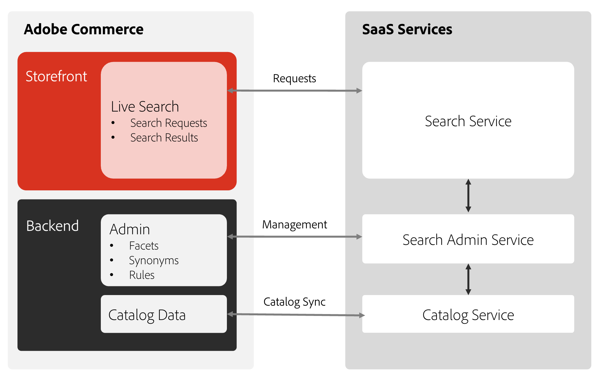
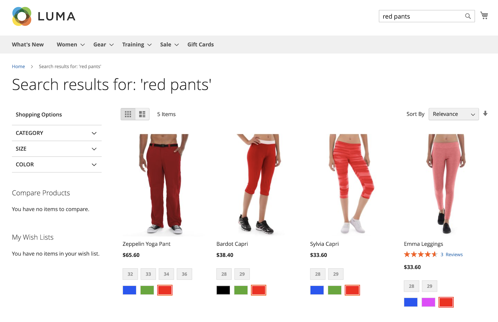

# What is [!DNL Live Search]?

[!DNL Live Search] is a feature that replaces the standard search capabilities in Adobe Commerce. The [!DNL Live Search] feature is installed with Composer and connects your [!DNL Commerce] store to the [Commerce Services Connector](../landing/saas.md). When it is configured, the default search text field is replaced with the [!DNL Live Search] text field. [!DNL Live Search] also installs the Product Listing Page (PLP) widget, which provides robust filtering capabilities when browsing search results.

With [!DNL Live Search], you can:

- Create meaningful search experiences to help shoppers and buyers find what they want with as little effort as possible.
- Take advantage of AI-powered dynamic faceting and re-ranking of search results in response to in-session shopper behaviors.
- Use a lightweight SaaS-based service that offers easy updates and is included in your license, reducing the total cost of ownership.
- Get technical by enabling graphQL API, headless flexibility, API sandbox environments, and ultra fast SaaS.

>[!IMPORTANT]
>
>When it comes to site search, Adobe Commerce gives you options. Be sure to read [Boundaries and Limits](boundaries-limits.md) before implementing, to ensure that [!DNL Live Search] is a fit for your business needs.

## Architecture

The Adobe Commerce side of the architecture includes hosting the search *Admin*, synchronizing catalog data, and running the query service. After [!DNL Live Search] is installed and configured, Adobe Commerce begins sharing search and catalog data with SaaS services. At this point, Admin users can set up, customize, and manage search [facets](facets.md), [synonyms](synonyms.md), and [merchandising rules](category-merch.md).

## Quick Tour

With a focus on speed, relevance, and ease of use, [!DNL Live Search] is a game changer for shoppers and merchants alike. Watch the following video, then take a quick tour of [!DNL Live Search] from the storefront.

>[!VIDEO](https://video.tv.adobe.com/v/3418679?quality=12&learn=on)

For a more in-depth video of how to use and configure Live Search, see the [Full Demonstration on [!DNL Live Search]](https://experienceleague.adobe.com/en/docs/commerce-learn/tutorials/getting-started/capabilities/live-search-full-demonstration) topic.

### Search as you type

[!DNL Live Search] responds with suggested products and a thumbnail image of top search results in a [popover](storefront-popover.md) as shoppers type queries into the [Search](https://experienceleague.adobe.com/en/docs/commerce-admin/catalog/catalog/search/search) box. The [product detail](https://experienceleague.adobe.com/en/docs/commerce-admin/start/storefront/storefront) page appears when shoppers click a suggested or featured product. A _View all_ link in the footer of the popover displays the search results page.

[!DNL Live Search] returns "search as you type" results for a query of two or more characters. For a partial match, the maximum number of characters per word is 20. The number of characters in the query is not configurable. The popover includes the`name`, `sku`, and `category_ids` fields.

### View all search results

To list all products returned by the "search as you type" query, click _View all_ in the footer of the popover.

### Filtered search with facets

Filtered search uses multiple dimensions of attribute values, or [facets](facets.md), as search criteria. The selection of filters is defined by the merchant and changes according to the products returned, with the most commonly used facets pinned to the top of the list.

Use facets as URL parameters:`http://yourwebsite.com?color=red`, and Live Search filters results based on these attribute values. 

### Synonyms

[Synonyms](synonyms.md) expand the reach and sharpen the focus of queries by including words shoppers might use that differ from those in the catalog. You can fine tune the synonym dictionary to keep shoppers engaged and on the path to purchase.

### Merchandising rules

Merchandising [rules](rules.md) shape the shopping experience with if-then statements that add logic and events to search. You can easily boost or bury products for a promotion, season, or other period of time.

### Search terms support

[!DNL Live Search] supports Commerce [search term redirects](https://experienceleague.adobe.com/en/docs/commerce-admin/catalog/catalog/search/search-terms). For example, users can search for a term such as "Shipping Rates" and be taken directly to the shipping rates page.

## Live Search components

- [!DNL Live Search] [popover widget](storefront-popover.md) is the box that opens under the search field that contains the search results.
- [Product Listing Page widget](plp-styling.md) (PLP) provides a searchable product listing page with facets and synonym support. The widget is installed and enabled in Live Search 4.0.0+.
- Search adapter is the precursor to the PLP widget and is installed with Live Search < 4.0.0. The search adapter sends search queries to the Live Search GraphQL API. Product IDs returned in that response are used to get the rest of the information about the products needed to render the search results page listing. The search adapter renders search result pages slower than the Product Listing Page widget due to the time that it takes to retrieve product data from the Commerce database. While it is recommended you upgrade to use the PLP widget, there may be cases where you need the functionality of the search adapter. In this case, you can [disable the PLP widget](plp-styling.md#disabling-the-plp-widget).

## [!DNL Live Search] workspace

The [!DNL Live Search] [workspace](workspace.md) is the area in the Admin where you configure [!DNL Live Search] features such as synonyms, facets, and Category Merchandising.

## Events

[!DNL Live Search] uses [events](events.md) to calculate [Intelligent Merchandising](category-merch.md) and [performance](performance.md) dashboards. Eventing is provided with default implementations. Eventing for headless storefronts should be manually enabled.
