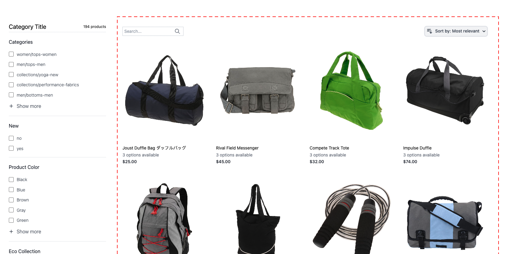
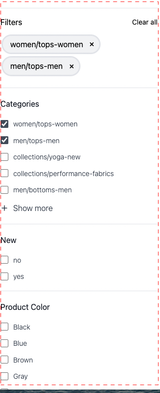
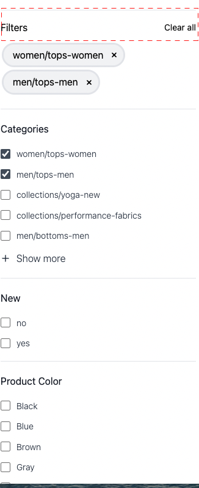
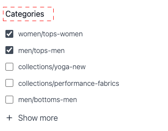
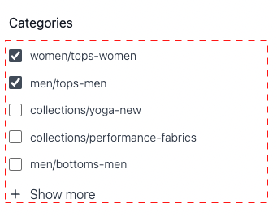
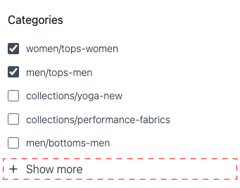
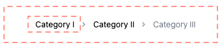

# Styling the Product Listing Page Widget

You can style the Product List Page widget by modifying the supplied classes.

## Product list

* `.ds-sdk-product-list`: Outer div
* `.ds-sdk-product-list__grid`: Inner div

### Product list pagination

* `.ds-plp-pagination`

* `.ds-plp-pagination_item`

* `.ds-plp-pagination_item--current`

## Widgets

* `.ds-widgets`: Outer div
* `.ds-widgets__actions`: Left side inner div

* `.ds-widgets__results`

## Searchbar

* .`ds-sdk-search-bar`

* .`ds-sdk-search-bar__icon--search`

* `.ds-sdk-search-bar__icon--clear`

* `.ds-sdk-search-bar__input`

## Sort dropdown

* `.ds-sdk-sort-dropdown`

* `.ds-sdk-sort-dropdown__button`

* `.ds-sdk-sort-dropdown__items`

* `.ds-sdk-sort-dropdown__items--item`

* `.ds-sdk-sort-dropdown__items--item-selected`

* `.ds-sdk-sort-dropdown__items--item-active`

## Facets

* `.ds-plp-facets`

* `.ds-plp-facets__header`

* `.ds-plp-facets__header_title`
* `.ds-plp-facets__header__clear-all`

* `.ds-plp-facets__pills`
* `.ds-sdk-pill`

* `.ds-sdk-pill__label`
* `.ds-sdk-pill__cta`

* `.ds-plp-facets__list`

* `.ds-sdk-input`

* `.ds-sdk-input__label`

* `.ds-sdk-input__options`

* `.ds-sdk-labelled-input`

* `.ds-sdk-labelled-input__input`
* `.ds-sdk-labelled-input__label`

* `.ds-sdk-input_fieldset_show-more`

## Product item

* `.ds-sdk-product-item`
* `.ds-sdk-product-item__image`
* `.ds-sdk-product-item__product-name`
* `.ds-sdk-product-item__product-options`
* `.ds-sdk-product-price` 
    * `.ds-sdk-product-price--no-discount`
    * `.ds-sdk-product-price--grouped`
    * `.ds-sdk-product-price--bundle`
    * `.ds-sdk-product-price--discount`

## Breadcrumb

* `.ds-sdk-breadcrumbs`
* `.ds-sdk-breadcrumbs__item`

* `.ds-sdk-breadcrumbs__item--current`

## Loading

* `.ds-sdk-loading`
* `.ds-sdk-loading__spinner`
* `.ds-sdk-loading__spinner-label`

