# Product Listing Page Widget

The [!DNL Live Search Product Listing Page Widget] (PLP) uses the Commerce Services platform to provide a performant, searchable, and facetable product listing page. This topic describes how to enable and style the PLP widget.

## Enabling the PLP wiget

When the [!DNL Live Search] service is installed, the default search functionality is converted to [!DNL Live Search] automatically.
The PLP widget must be enabled in the admin.

1. Go to **Stores** > Settings > **Configuration** > **[!DNL Live Search]** > **Storefront Features** and set **Enable Product Listing Widgets** to "Yes".
1. Select **Save Config** to save the setting.

## Styling exmaple

You can customize the look and feel of the PLP widget to match your site using [CSS](https://developer.adobe.com/commerce/frontend-core/guide/css/).

>[!NOTE]
>
>Elements with custom classes within a Magento theme will not be inherited. These elements must be targeted by their specific class to match the custom classes:  primary action classes will not work on a widget button.
>Generic targeted elements within the CSS will be inherited: `button` will apply to widget buttons.

The highlighted divs contain the target class `ds-sdk-product-item__product-name`. 

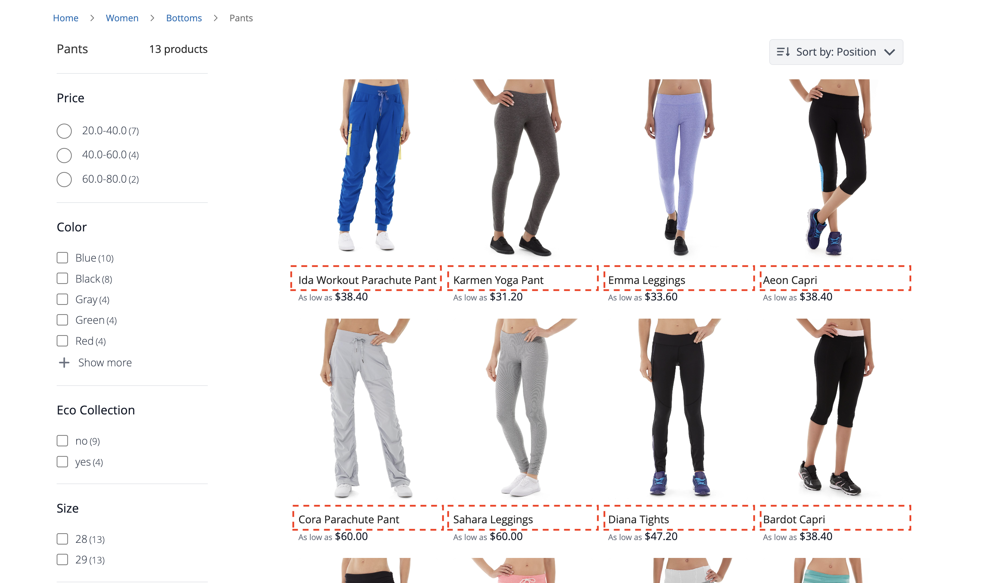

Customize the product name by adding a rule to make them uppercase.

```css
.ds-sdk-product-item__product-name {
 text-transform: uppercase;
}
```

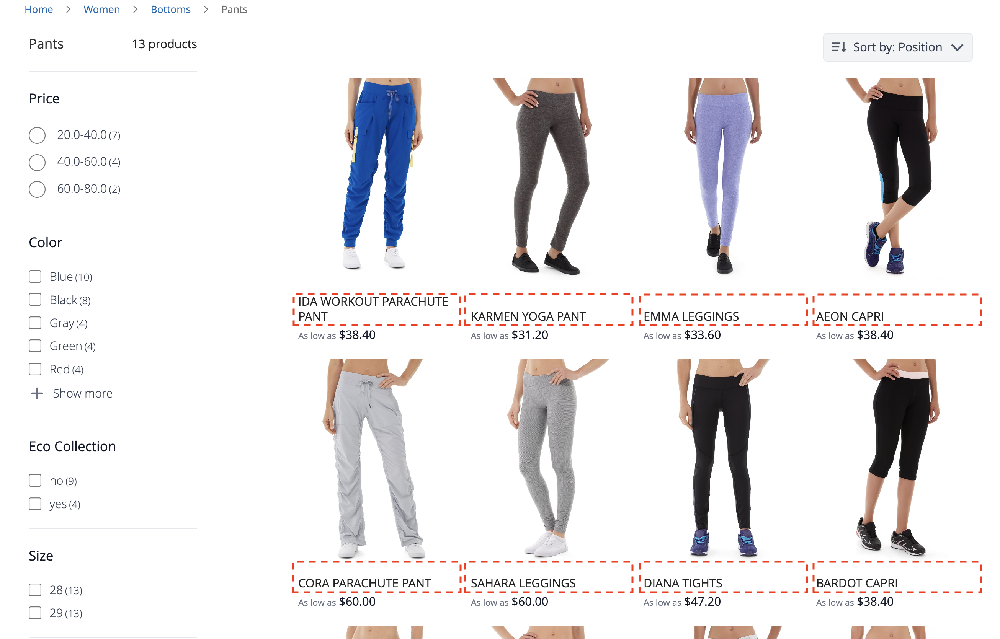

## CSS classes

### Product list

* `.ds-sdk-product-list`: Outer div
* `.ds-sdk-product-list__grid`: Inner div

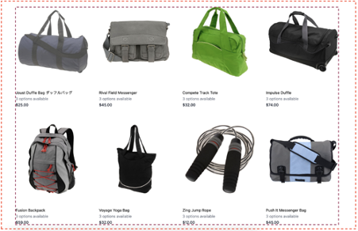

#### Product list pagination

* `.ds-plp-pagination`


* `.ds-plp-pagination_item`


* `.ds-plp-pagination_item--current`

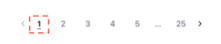

### Widgets

* `.ds-widgets`: Outer div
* `.ds-widgets__actions`: Left side inner div
* `.ds-widgets__results`: Right side inner div


### Sort dropdown

* `.ds-sdk-sort-dropdown`

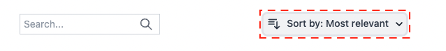

* `.ds-sdk-sort-dropdown__button`

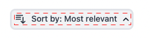

* `.ds-sdk-sort-dropdown__items`

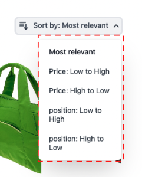

* `.ds-sdk-sort-dropdown__items--item`

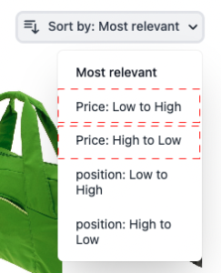

* `.ds-sdk-sort-dropdown__items--item-selected`

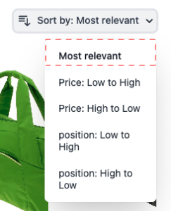

* `.ds-sdk-sort-dropdown__items--item-active`

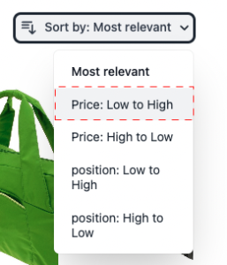

### Facets

* `.ds-plp-facets`
* `.ds-plp-facets__header`
* `.ds-plp-facets__header_title`
* `.ds-plp-facets__header__clear-all`

{width="350"}

* `.ds-plp-facets__pills`
* `.ds-sdk-pill`

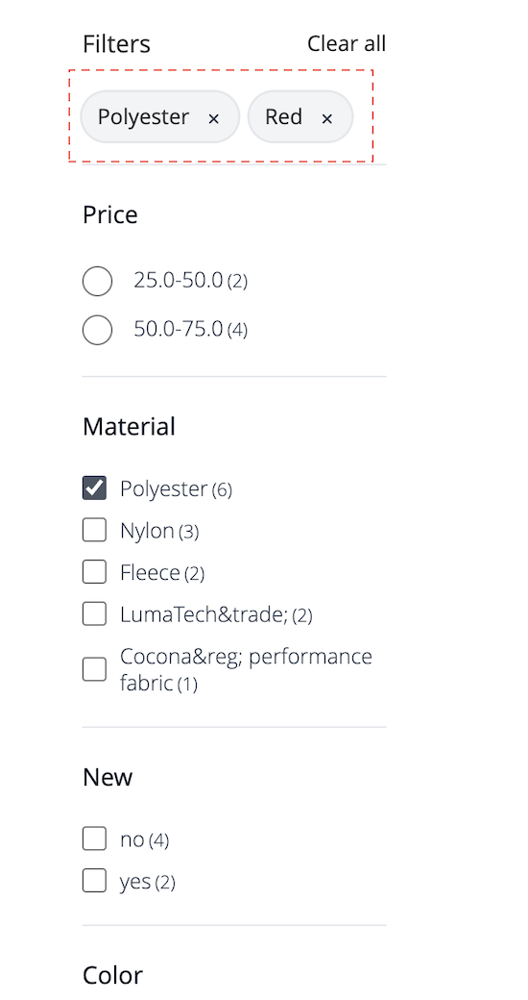{width="350"}

* `.ds-sdk-pill__label`
* `.ds-sdk-pill__cta`

{width="350"}

* `.ds-plp-facets__list`

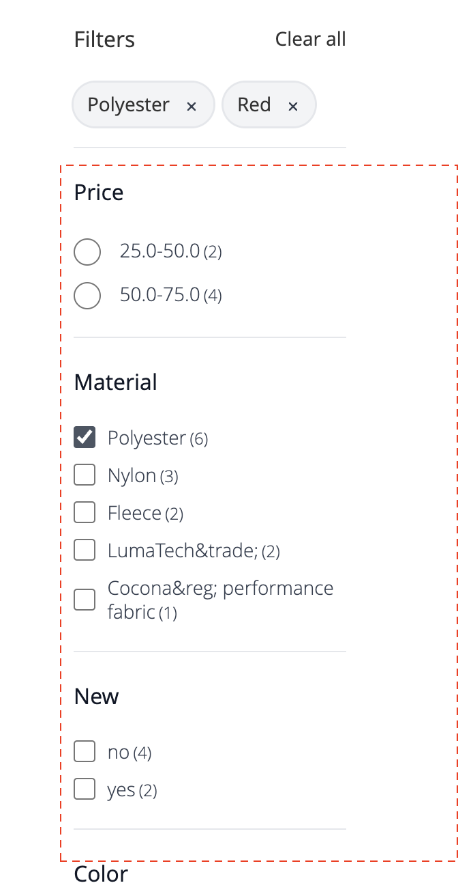{width="350"}

* `.ds-sdk-input`
* `.ds-sdk-input__label`
* `.ds-sdk-input__options`
* `.ds-sdk-input_fieldset_show-more`

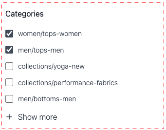

* `.ds-sdk-labelled-input`

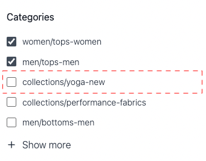

* `.ds-sdk-labelled-input__input`
* `.ds-sdk-labelled-input__label`

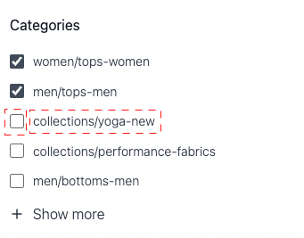

### Product item

* `.ds-sdk-product-item`
* `.ds-sdk-product-item__image`
* `.ds-sdk-product-item__product-name`
* `.ds-sdk-product-item__product-options`
* `.ds-sdk-product-price` 
    * `.ds-sdk-product-price--no-discount`
    * `.ds-sdk-product-price--grouped`
    * `.ds-sdk-product-price--bundle`
    * `.ds-sdk-product-price--discount`

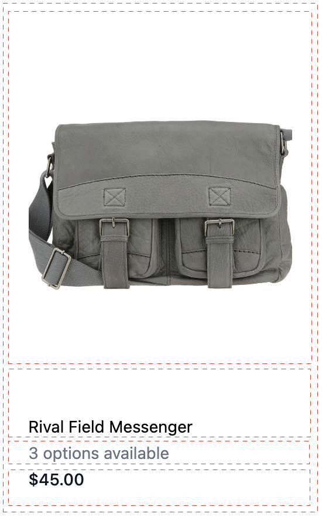

### Loading

* `.ds-sdk-loading`
* `.ds-sdk-loading__spinner`
* `.ds-sdk-loading__spinner-label`

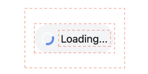
