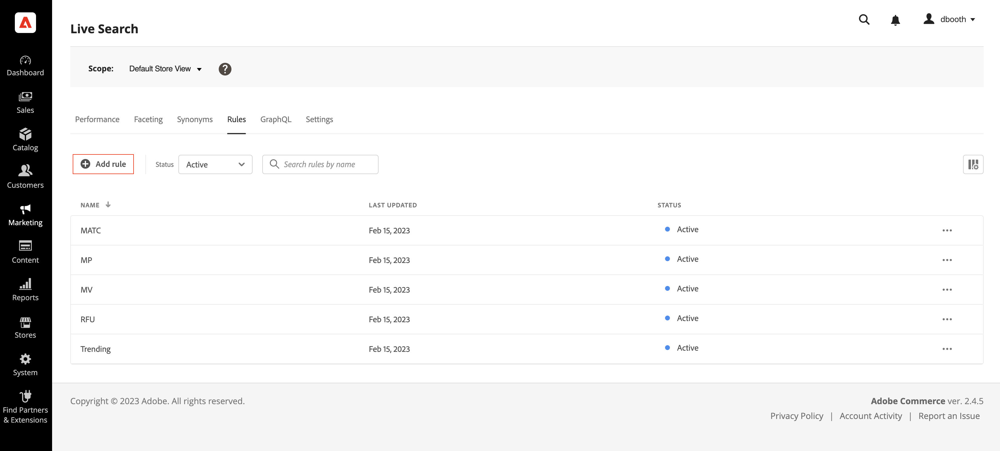
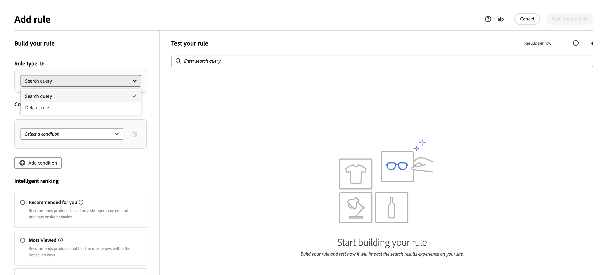
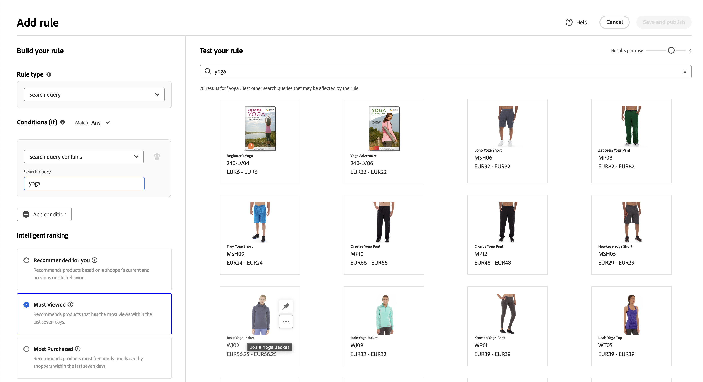
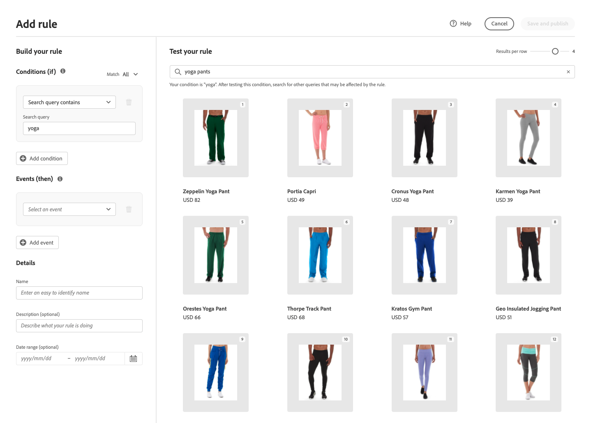
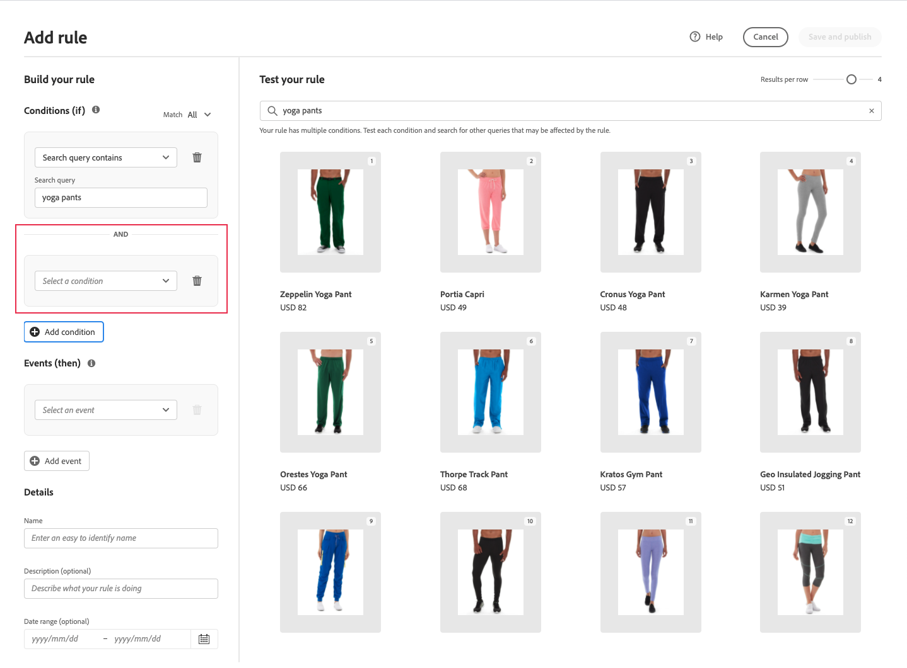
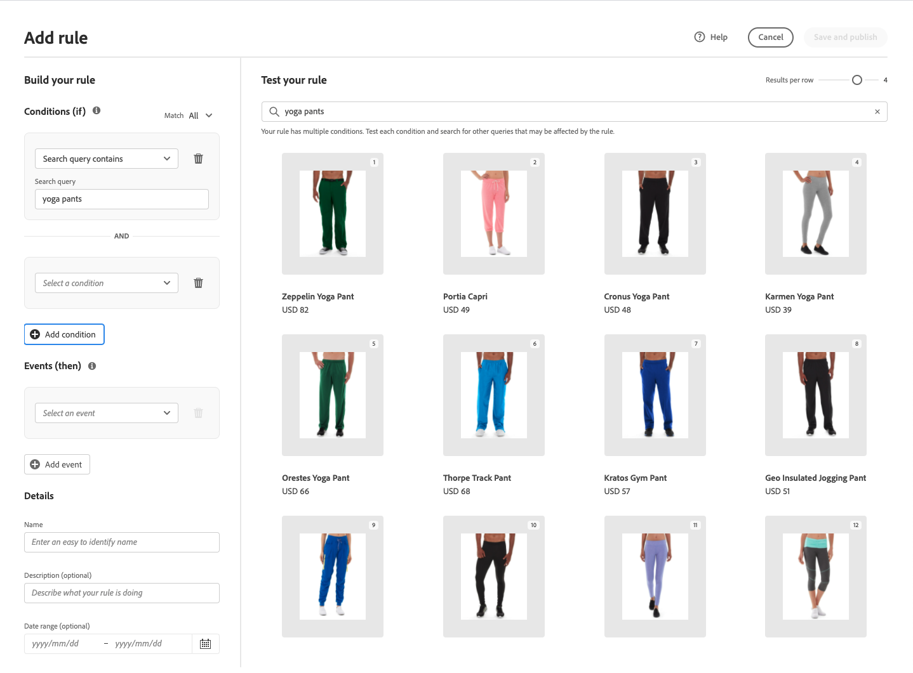
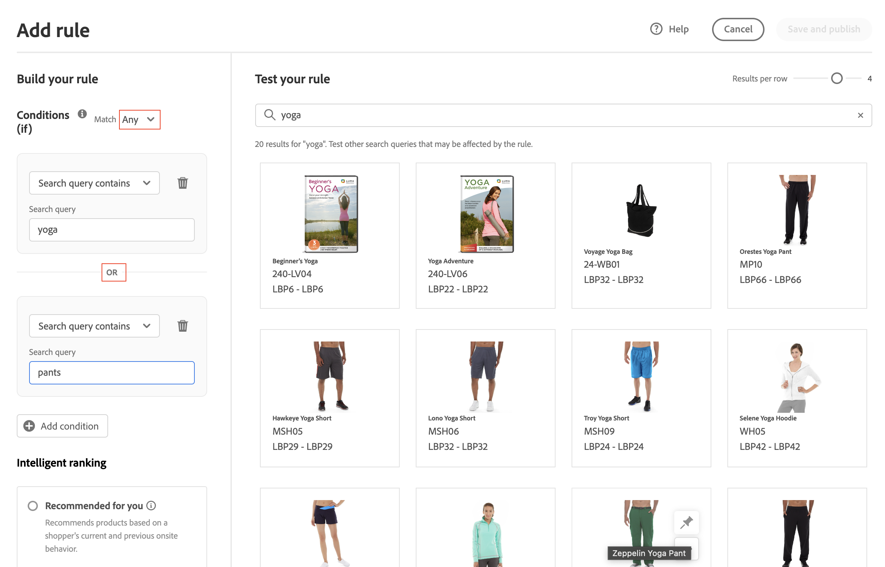
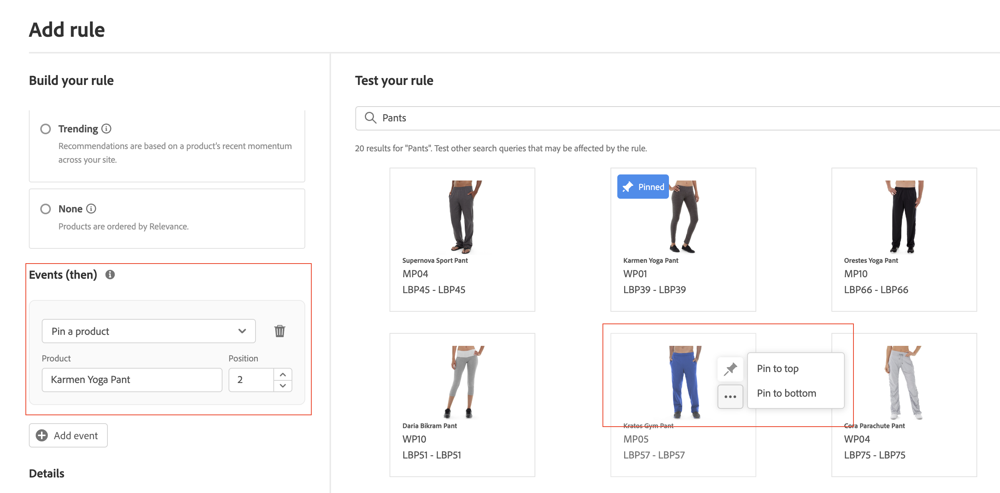
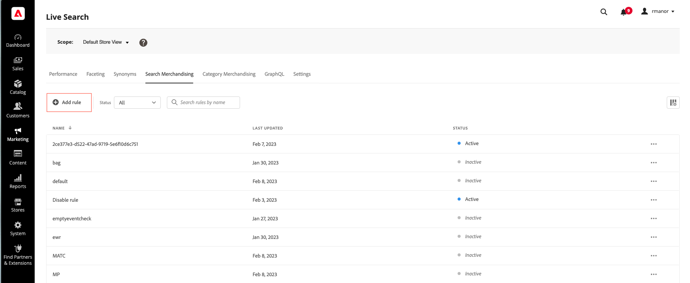

# Add Rules

To build a rule, the first step is to use the rule editor to define the conditions in the shopper's query text that trigger the associated events. Then, complete the rule details, test the results, and publish the rule.

## Step 1: Add a rule

1. In the Admin, go to **Marketing** > SEO & Search > **Live Search**.
1. Set the **Scope** to identify the [store view](https://docs.magento.com/user-guide/configuration/scope.html) where the rule applies.
1. Click the **Rules** tab.
1. Click **Add rule** to launch the rule editor.

   

## Step 2: Describe the conditions

Conditions are the requirements to trigger an event. A rule can have up to ten conditions and 25 events.

   

### Single condition

1. Under *Build your rule*, select the **Condition** to be met, and follow the instructions to complete the statement.

   * Search query contains - Enter the string of text that must be in the shopper's query. The Match setting determines the degree to which the shopper's query matches the catalog. Options:  Any - Any part of the shopper's query text can match the condition. All - All of the shopper's query must match the condition.
   * Search query is - Enter a string of text that exactly matches the shopper's query. For example: "yoga pants". Rules with `Search query is` and Match `All` can have only one condition.
   * Search query starts with - Enter a character or string of text that must be at the beginning of the shopper's query.
   * Search query ends with - Enter a character or string of text that must be at the end of the shopper's query.

   The results appear immediately in the *Test your rule* pane and are numbered by priority. You can use the *Results per row* slider in the upper    right to change the number of products in each row.

   

1. To test other queries, change the query text in the *Test your rule* search box and press **Return**.
   Initially, the test pane renders the query from the Conditions search box. But now it is rendering the query from the test query box. The test pane renders only one query at a time.

   

1. If you like the result, update the text in the *Conditions* search box. Then, click anywhere on the page to update the results in the test pane.
1. To build a simple rule with one condition, go to Step 3: [Add events](#events).

### Multiple conditions

1. To build a rule with multiple conditions, click **Add condition**.
   A rule can have up to ten conditions. The logical operator that joins two conditions is based on the current *Match* setting. By default, *Match* is `All` and the logical operator is `AND`.

   

1. Select the second condition and enter the required query text.

   

1. To change the logic of the rule, change the **Match** setting to determine how closely the shopper's search criteria must match the query condition. Set **Match** to one of the following:

   * Any - (Default) All logical operators in the rule are set to `OR` and the results appear in the test pane.
   * All - All logical operators in the rule are set to `AND` and the results appear in the test pane.

   The *Match* value determines the logical operator that is used to join multiple conditions. Changing the *Match* setting changes all logical operators in the rule. It is not possible to combine `AND` and `OR` in the same rule.

   In this example, rather than searching for "yoga pants", there are two separate queries that search for "yoga" or "pants". This rule is less specific and is triggered more often in the storefront than the other.

   

1. To add another condition, click **Add condition** and repeat the process.

## Step 3: Add events

events are actions that change the search results when the conditions are met. A single rule can have up to 25 events.

1. Under *Events*, choose the **Event** to take place when the associated conditions are met.

   For example, choose `Pin a product`. Then, enter the name of the product that you want to pin. If you need help, you can find the name in the test pane.
   Then, enter the *Position* where the pinned product is to appear. The product is moved to the new position in the test pane, and is marked with a *Pinned* preview badge.
   
   

1. For multiple events, choose any other events that you want to trigger when conditions are met.

   * Boost - Select Boost. Then, enter the product name or SKU that you want to move higher in the search results. In the test pane, each boosted product has a *Boosted* preview badge.
   * Bury - Moves a SKU lower in the search results. Each SKU is marked with a *Buried* preview badge in the test pane.
   * Pin a product - Enter the product name or SKU. Then, select the Position in the search results where the product should appear. The product is marked with a *Pinned* preview badge in the test pane.
   * Hide a product - Excludes a SKU from the search results.

## Step 4: Complete the details

The information that is entered here appears in the [Rule Details](rules-workspace.md) panel.

1. Under *Details*, enter a **Name** for the rule. All rule names must be unique.
1. Enter a brief **Description** of the rule.
1. Enter the **Start Date** and **End Date** for the rule to be active or choose the dates from the calendar.

   To select a range of dates, click the first date and drag to select the range.

   

## Step 5: Test the rule

1. Examine the results of the rule in the test pane.
1. If the rule has multiple queries, test each one that might be affected by the rule.

## Step 6: Save and publish

1. When complete, click **Save and publish**.

   The rule is added to the list in the rules workspace. 

1. Although active rules go into effect immediately, you might have to wait up to 15 minutes for the cached query results in the storefront to be refreshed.

## Field descriptions

### Conditions (if)

| Condition | Description |
|--- |--- |
| Search query contains | A character or string of text that is included in the shopper's query. The shopper's query needs to match only a single character to meet this condition. |
| Search query is | A character or string of text that exactly matches the shopper's query. Complex queries with multiple conditions cannot be composed when this condition is used. |
| Search query starts with | The shopper's query begins with this character or string of text. |
| Search query ends with | The shopper's query ends with this character or string of text. |

### Logical operators

| Operator | Description |
|--- |--- |
| OR | (Default) The logical operator `OR` compares two conditions and meets the requirements to trigger an event if at least one condition is true. |
| AND | The logical operator `AND` compares two conditions and meets the requirements to trigger an event if both conditions are true. |

### Match operators

| Operator | Description |
|--- |--- |
| Any | Changes all logical operators in the rule to `OR` and returns the set of matching products. |
| All | Changes all logical operators in the rule to `AND` and returns the set of matching products. |

### Events

|Event |Description |
|--- |--- |
| Boost | Moves a SKU or range of SKUs higher in the search results. Each is marked with a "boosted" preview badge in the test search results. |
| Bury | Moves a SKU or range of SKUs lower in the search results. Each is marked with a "buried" preview badge in the test search results. |
| Pin a product | Attaches a single SKU to a specific position in the search results. The product is marked with a "pinned" preview badge in the test search results. |
| Hide a product | Excludes a SKU, or range of SKUs, from the search results. |

### Details

|Field |Description |
|--- |--- |
| Name | The name of the rule. Rule names must be unique. |
| Start date | The start date of the rule, if scheduled. |
| End date | The end date of the rule, if scheduled. |
| Description | A brief description of the rule. |
