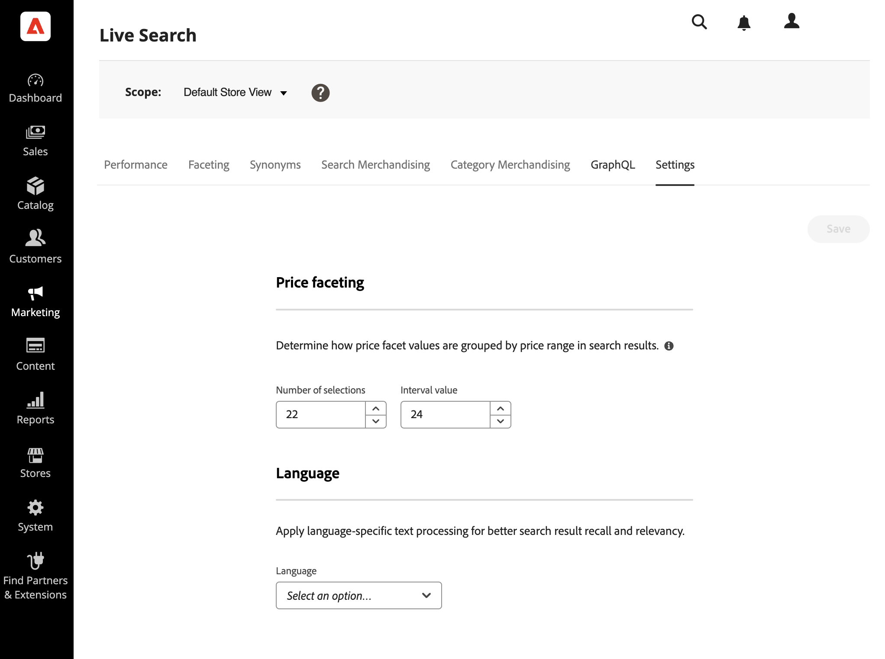

# Settings

Use the *Settings* tab to configure the price facet ranges and intervals that are available as search filters in the storefront. Price facet settings are static rather than dynamic, and are not based on search results.

You can specify the number of price range groups and how price values are distributed among them. Each price range overlaps the previous group by one. For example, five groups with an interval of twenty creates the following price ranges: 0-20, 20-40, 40-60, 60-80, and >80. If there are not enough products in the catalog to fill all defined ranges, the display of the available groups is adjusted accordingly. For example: 0-20, 60-80, >80.

## Configure price facet groupings

1. In the Admin, go to **Marketing** > *SEO & Search* > **Live Search**.
1. On the **Settings** tab under *Price faceting*, do the following:
   * Enter the **Number of selections**, or price groupings to be available. Up to 50 price groupings can be defined.
   * Enter the **Interval value**, or price range for each group. The maximum value is 10,000.
1. Click **Save**.

   It takes about 15 minutes for the updated settings to be available in the storefront.

## Field descriptions

| Field | Description |
|--- |--- |
| Number of selections | Specifies the number of price range groupings that can be used as search filters in the storefront. Default value: 8, Maximum value: 50 |
| Interval value | Specifies the price range interval for each group. For example, five selections with an interval value of twenty creates five groupings of 0-20, 20-40, 40-60, 60-80, and >80. Default value: 5, Maximum value: 10,000 |
