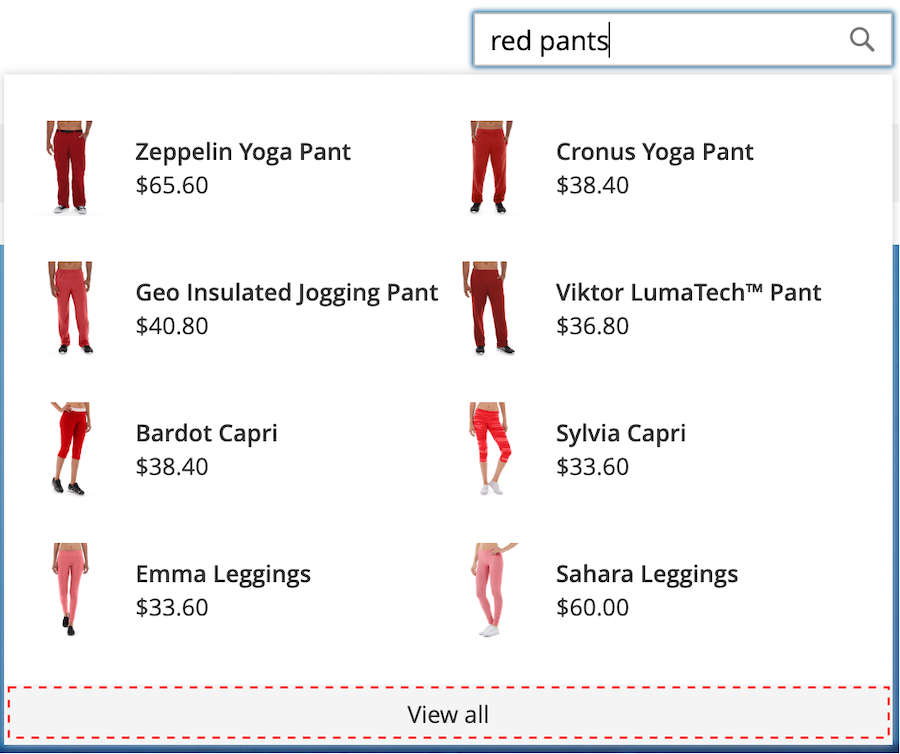
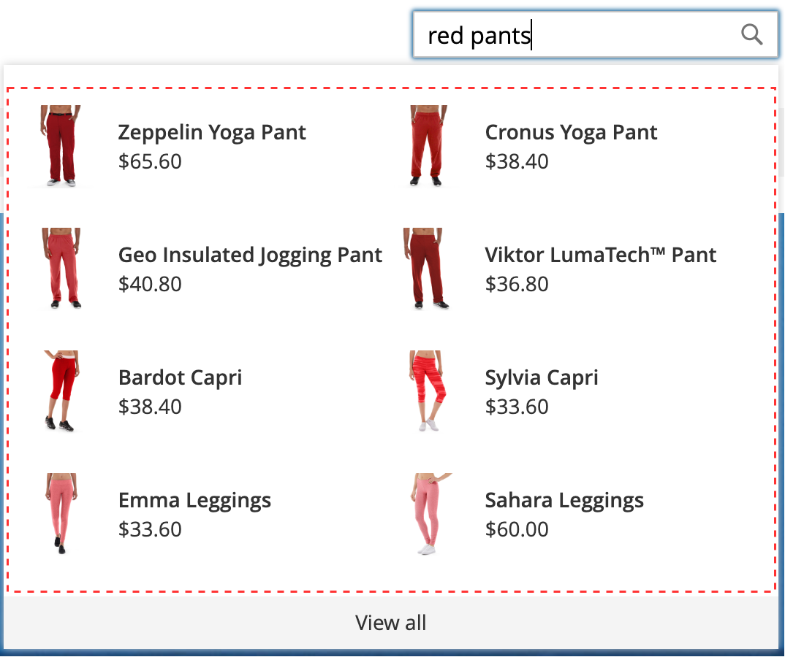
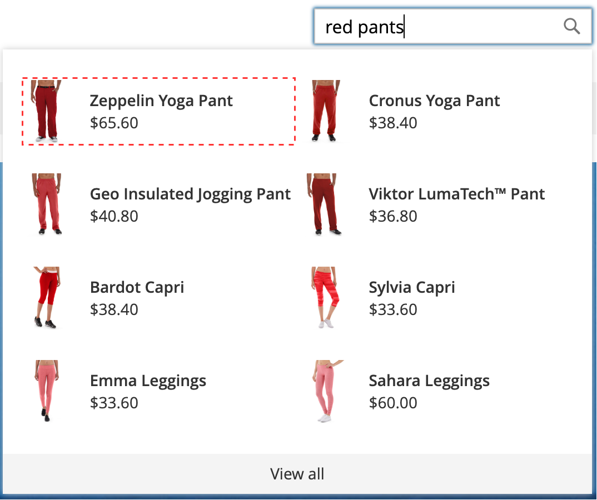
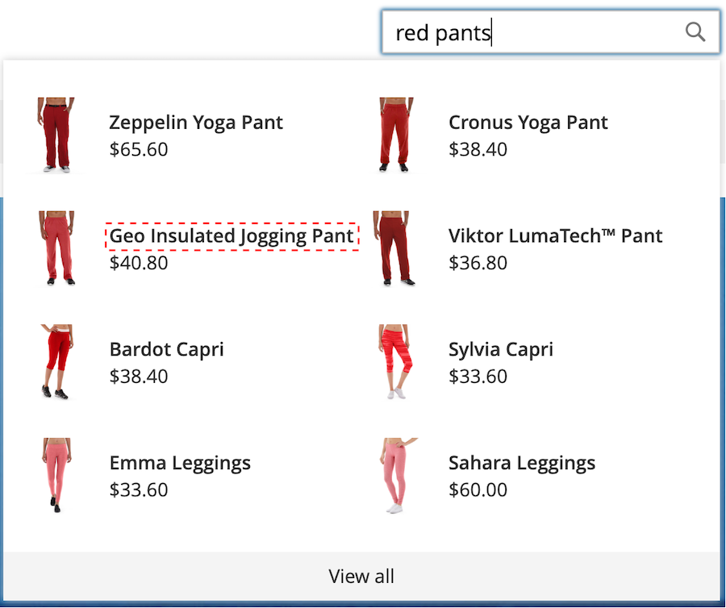
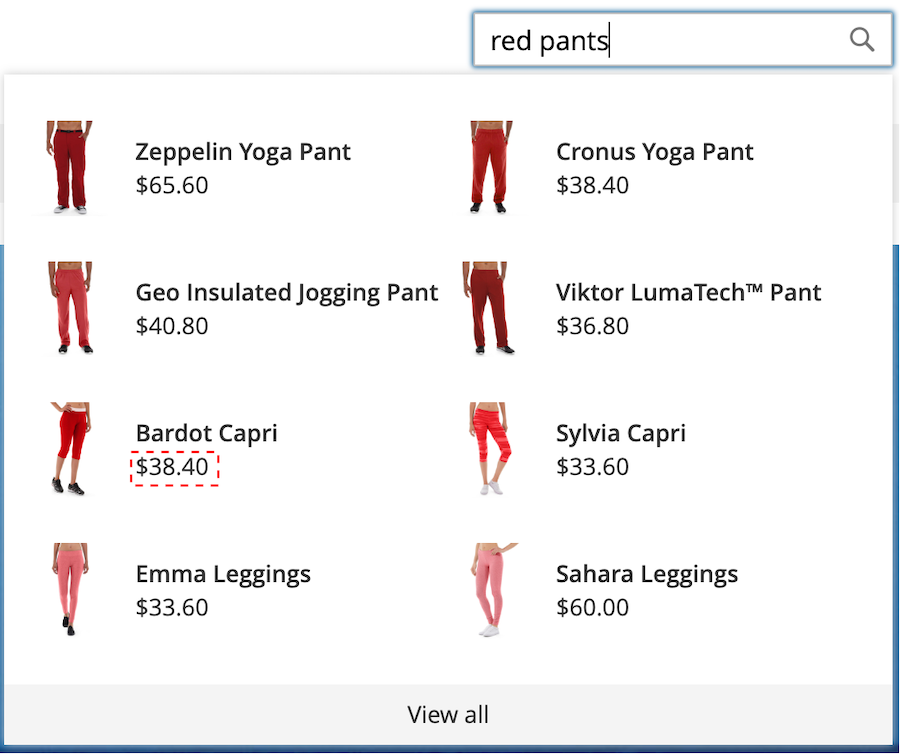

# Styling [!DNL Popover] Elements

The [[!DNL storefront popover]](storefront-popover.md) always displays the product `name` and `price`, and the selection of fields is not configurable. However, [!DNL popover] elements can be styled using CSS classes. For example, the following declarations change the background color of the [!DNL popover] container and footer.

```css
.livesearch.popover-container {
    background-color: lavender;
}

.livesearch.view-all-footer {
    background-color: magenta;
}
```

## Container visibility

The parent component of the `.livesearch.popover-container` is `.search-autocomplete`.  The `.active` class indicates the visibility of the container. The `.active` class is conditionally added when the [!DNL popover] is open.

```css
.search-autocomplete.active   /* visible */
.search-autocomplete          /* not visible */
```

For more information about styling storefront elements, refer to [Cascading style sheets (CSS)](https://developer.adobe.com/commerce/frontend-core/guide/css/) in the [Frontend Developer Guide](https://developer.adobe.com/commerce/frontend-core/guide/).

## Class selectors

The following class selectors can be used to style the container and product elements in the [!DNL popover].

* `.livesearch.popover-container`
* `.livesearch.view-all-footer`
* `.livesearch.products-container`
* `.livesearch.product-result`
* `.livesearch.product-name`
* `.livesearch.product-price`

### Container Class Selectors

#### .livesearch.popover-container

![[!DNL Popover] container](assets/livesearch-popover-container.png)

#### .livesearch.view-all-footer



### Product Class Selectors

#### .livesearch.products-container



#### .livesearch.product-result



#### .livesearch.product-name



#### .livesearch.product-price



#### .livesearch product-link


## Working with a modified theme {#working-with-modified-theme}

The [!DNL storefront popover] can be used with a customized [theme](https://developer.adobe.com/commerce/frontend-core/guide/themes/) that inherits the required files from *Luma*. The `top.search` block in the `header-wrapper` of the `Magento_Search` module must not be modified.

```html
<referenceContainer name="header-wrapper">
   <block class="Magento\Framework\View\Element\Template" name="top.search" as="topSearch" template="Magento_Search::form.mini.phtml">
      <arguments>
         <argument name="configProvider" xsi:type="object">Magento\Search\ViewModel\ConfigProvider</argument>
      </arguments>
   </block>
</referenceContainer>
```

## Disabling the [!DNL popover]

To disable the [!DNL popover] and restore the standard [Quick Search](https://experienceleague.adobe.com/docs/commerce-admin/catalog/catalog/search/search.html#quick-search) functionality, enter the following command:

```bash
bin/magento module:disable Magento_LiveSearchStorefrontPopover
```
