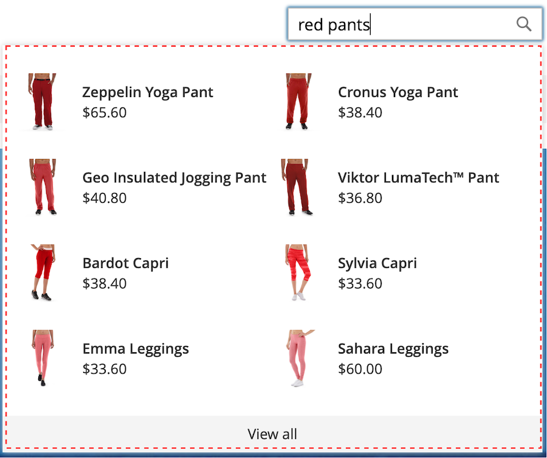
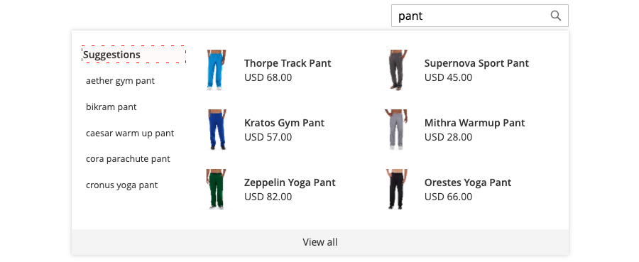

# Storefront Popover

When [!DNL Live Search] is [installed](install.html), a popover appears in the storefront when shoppers type in the [Search](https://docs.magento.com/user-guide/catalog/search-quick.html) box. With each character typed, the popover is updated with suggested products and thumbnail images of the top search results.

[!DNL Live Search] returns results for a query of two characters or more. For a partial match, the maximum number of characters per word is 20. The number of characters in a "search as you type" query is not configurable.

[!NOTE]

The [!DNL Live Search] storefront popover is available only for stores that use the *Luma* theme, or a customized theme that is based on *Luma*. The *Luma* theme is included in the [!DNL Commerce] sample data. The popover does not support the *Blank* theme. See [Working with a modified theme](#working-with-modified-theme) for more information.

## Searchable attributes

To produce highly-targeted results, review the set of [searchable](https://docs.magento.com/user-guide/stores/attributes-product.html#storefront-properties) (`searchable=true`) product attributes. To ensure relevancy, make attributes searchable only if they contain content that has a clear and concise meaning. Avoid using attributes that contain less precise, lengthy text such as `description`, which although search-enabled by default, can reduce the precision of search results. For example, if a person searches for "shorts" and there are shirts with a description that includes the term "short sleeves", then the shirts will be included in the search results.

The following attributes are always searchable:

*  `sku`
*  `name`
*  `categories`


## Styling popover elements

The popover always displays the product `name` and `price`, and the selection of fields is not configurable. However, elements of the popover can be styled using CSS classes. For example, the following declarations change the background color of the popover container and footer.

```css
.livesearch.popover-container {
    background-color: lavender;
}

.livesearch.view-all-footer {
    background-color: magenta;
}
```

### Container visibility

The parent component of the `.livesearch.popover-container` is `.search-autocomplete`.  The `.active` class indicates the visibility of the container. The `.active` class is conditionally added when the popover is open.

```css
.search-autocomplete.active   /* visible */
.search-autocomplete          /* not visible */
```

For more information about styling storefront elements, refer to [Cascading style sheets (CSS)](https://devdocs.magento.com/guides/v2.4/frontend-dev-guide/css-topics/css-overview.html) in the [Frontend Developers Guide](https://devdocs.magento.com/guides/v2.4/frontend-dev-guide/bk-frontend-dev-guide.html).

### Class selectors

The following class selectors can be used to style the container, suggestion, and product elements in the popover.

*  `.livesearch.popover-container`
*  `.livesearch.view-all-footer`
*  `.livesearch.suggestions-container`
*  `.livesearch.suggestions-header`
*  `.livesearch.suggestion`
*  `.livesearch.products-container`
*  `.livesearch.product-result`
*  `.livesearch.product-name`
*  `.livesearch.product-price`

### Container Class Selectors

`.livesearch.popover-container`



`.livesearch.view-all-footer`


### Suggestion Class Selectors

`.livesearch.suggestions-container`


`.livesearch.suggestions-header`


`.livesearch.suggestion`


### Product Class Selectors

`.livesearch.products-container`


`.livesearch.product-result`


`.livesearch.product-name`


`.livesearch.product-price`


## Working with a modified theme {#working-with-modified-theme}

The storefront popover can be used with a customized [theme](https://devdocs.magento.com/guides/v2.3/frontend-dev-guide/themes/theme-overview.html) that inherits the required files from *Luma*. The `top.search` block in the `header-wrapper` of the `Magento_Search` module must not be modified.

```html
<referenceContainer name="header-wrapper">
   <block class="Magento\Framework\View\Element\Template" name="top.search" as="topSearch" template="Magento_Search::form.mini.phtml">
      <arguments>
         <argument name="configProvider" xsi:type="object">Magento\Search\ViewModel\ConfigProvider</argument>
      </arguments>
   </block>
</referenceContainer>
```

## Disabling the popover

To disable the popover and restore the standard [Quick Search](https://docs.magento.com/user-guide/catalog/search-quick.html) functionality, enter the following command:

```bash
bin/magento module:disable Magento_LiveSearchStorefrontPopover
```
