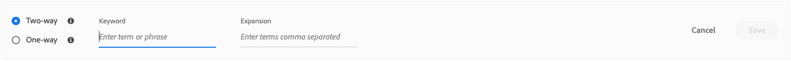
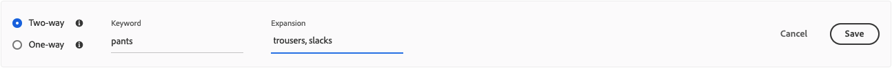
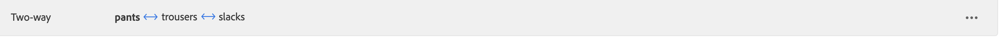
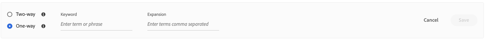
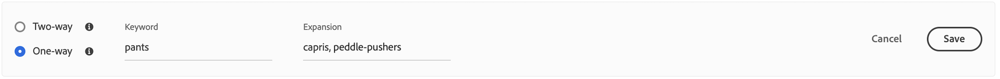
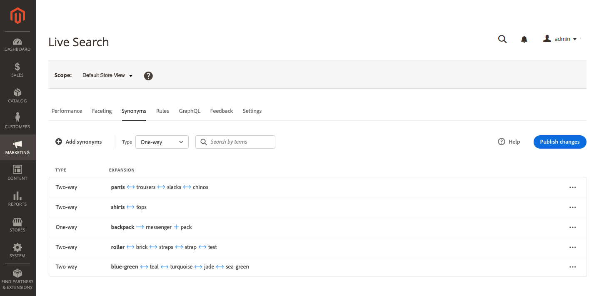

# Add Synonyms

Add your own curated list of [!DNL Live Search] synonyms to improve response to search requests and keep customers engaged.

![[!DNL Live Search] synonyms](assets/synonym-workspace.png)

## Step 1: Add a synonym

1. In the Admin, go to **Marketing** > SEO & Search > **[!DNL Live Search]**.
1. For multiple stores, set **Scope** to the [store view](https://docs.magento.com/user-guide/configuration/scope.html) where the synonym settings apply.
1. Click the **Synonyms** tab.
1. Click the **Add synonyms** button.

## Step 2: Define the synonym by type

Follow the instructions for the [type of synonym](synonyms-type.md) that you want to create.

### Two-way synonym

1. Accept the default **Two-way** option.

   

1. Enter the **Keyword** term or phrase to be matched.
1. Enter the **Expansion** term(s) that you want to add as synonyms for the keyword. Separate multiple terms with a comma.
   In this example, the keyword to match is “pants” and the set of expansion terms are “long pants, trousers, slacks”.

   

1. When complete, click **Save**.
   The set of synonyms appears in the list with a two-way arrow between each term that means the terms are interchangeable.

   

### One-way synonym

1. Click the **One-way** synonym type.

   

1. Enter the **Keyword** and **Expansion** term(s). Separate multiple terms with a comma.

   

   In this example, the keyword is “pants” and the one-way expansion terms “capris, calf-length pants, peddle-pushers” are each a subset of “pants”, but with a specific meaning.

1. When complete, click **Save**.
   The set of synonyms appears in the list with a one-way arrow pointing from the expansion terms to the keyword to indicate the terms are subsets of the keyword. A plus sign separates each expansion term.

   

## Step 3: Publish changes

When your synonym(s) are complete, click **Publish changes**.
It can take up to two hours for your updates to become available in the storefront.

## Field Descriptions

| Field | Description |
|--- |--- |
| [Type](synonyms.md) | Determines if the synonyms have the same meaning as the keyword, or are a subset of the keyword. Options: Two-way (default) - Terms that have the same meaning as the keyword and return the same search results One-way - Terms that are a subset of the keyword. One-way synonyms return a more narrow list of specific products. |
| Keyword | A word that is commonly associated with a selection of products in your catalog. |
| Expansion | Additional terms that have the same or similar meaning as the keyword. |
