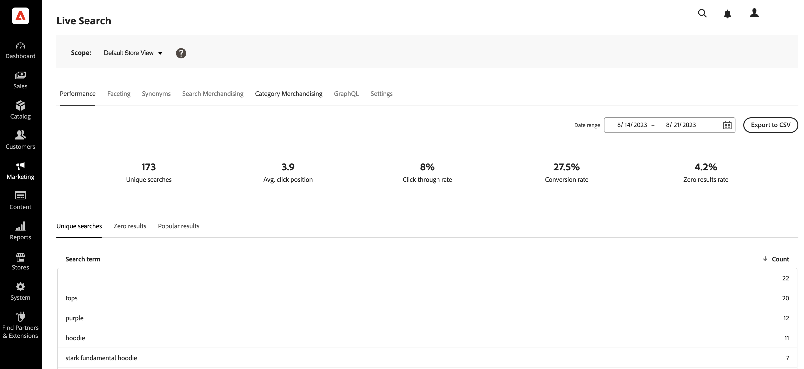
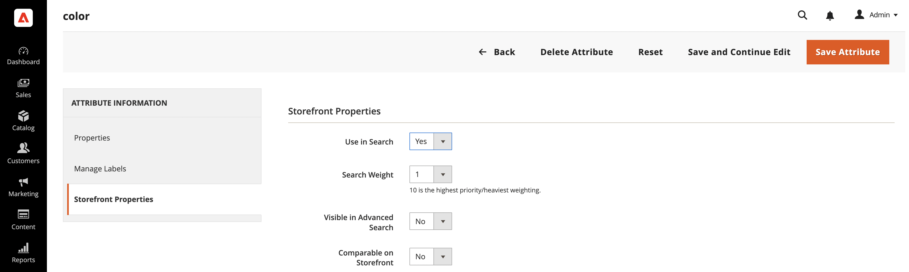

# Setting up Live Search

The workspace is where you configure, manage, and monitor the performance of [!DNL Live Search]. The menu across the top provides access to the tools in each functional area. The available features reflect the current menu selection.

## Set the scope

Initially the [scope](https://experienceleague.adobe.com/docs/commerce-admin/start/setup/websites-stores-views.html#scope-settings) of all [!DNL Live Search] settings is set to `Default Store View`. If your [!DNL Commerce] installation includes multiple store views, set **Scope** to the [store view](https://experienceleague.adobe.com/docs/commerce-admin/start/setup/websites-stores-views.html) where your facet settings apply.

## Menu Options

| Option | Description |
|--- |--- |
| [Performance](performance.md) | Dashboard provides insight into product search performance. | 
| [Faceting](facets.md) | High-performance filtering that uses multiple dimensions of attribute values to refine search criteria. |
| [Synonyms](synonyms.md) | Extend the reach of search to include words shoppers might use to find products that differ from those in your catalog. |
| [Search Merchandising](rules.md) | Shape the search experience with logical rules that trigger scheduled actions. Boost, bury, pin, or hide products to calibrate search results to support your business goals. |
| [Category Merchandising](category-merch.md) | Apply rules and Intelligent Merchandising on the Category level. |
| [GraphQL](graphql.md) | Developers who are logged into the Admin of your store can compose and test queries with actual catalog data. To learn more, go to [GraphQL Overview](https://developer.adobe.com/commerce/webapi/graphql/) in the [!DNL Live Search] developer documentation. |
| [Settings](settings.md) | Determine how price facet values are grouped by price range in the storefront and set the indexing language. |

## Commerce Configuration Settings

The following section describes the supported and unsupported Commerce configuration settings for [!DNL Live Search].

### Supported configuration values

|Commerce Configuration Setting|Description|Supported by Popover|Supported by Adapter|
|---|---|---|---|
|Stores > Configuration > Catalog > Catalog > Catalog Search > Allow All Products per Page|If set to `Yes`, includes the `ALL` option in the "Show per Page" control.| Yes. Max 500 products|Yes. Max 500 products|
|Stores > Configuration > Catalog > Catalog > Catalog Search > Minimal Query Length|The minimum number of characters allowed in a catalog search.|Yes|Yes|
|Stores > Configuration > Catalog > Catalog > Catalog Search > Products per Page on Grid Allowed Values|Determines the number of products displayed in Grid View.|Yes|Yes|
|Stores > Configuration > Catalog > Catalog > Catalog Search > Products per Page on Grid Default Value|Determines the number of products displayed per page by default in grid view.|Yes. Max 500 products|Yes. Max 500 products|
|Stores > Configuration > Catalog > Inventory > Display Out of Stock Products|Displays products that are out of stock.|Yes w/ v2.0.4+|Yes w/ v2.0.4+|
|Stores > Configuration > Currency > Default Display Currency|The primary currency used to display prices.|Yes w/3.1.0+|Yes w/3.1.0+|
|Stores > Configuration > General > Currency Setup > Currency Options > Base Currency|The primary currency used for all online payment transactions.|Yes|Yes|

Prices in the Widget Product Listing Page and Popover are converted to the Default Display Currency using the configured Currency Rates.

### Unsupported configuration values

|Commerce Configuration Setting|Description|Notes|
|---|---|---|
|Stores > Configuration > Catalog > Storefront > List Mode|Determines the format of the search results list.|Renders correctly, but events are not sent for some page interactions|
|Stores > Configuration > Catalog > Catalog > Catalog Search > Maximum Query Length|The maximum number of characters allowed in a catalog search.|Not implemented; Search Services accepts up to 255 characters|
|Configuration > Sales > Tax > Price Display Settings > Display Product Prices In Catalog|Determines if product prices published in the catalog include or exclude tax, or show two versions of the price; one with, and the other without tax||
|Stores > Configuration > Catalog > Storefront > Product Listing Sort By|Determines the sort order of the search results list.|Does not apply to the [!DNL Live Search] [Product Listing Page Widget](plp-styling.md)|

### Search terms

[!DNL Live Search] supports [search term redirects](https://experienceleague.adobe.com/docs/commerce-admin/catalog/catalog/search/search-terms.html) on implementations where Adobe Commerce handles the routing, such as on Luma and other php-based themes.

## Set attributes as searchable

Products are assigned [attributes](https://experienceleague.adobe.com/en/docs/commerce-admin/catalog/product-attributes/product-attributes) that can be used for searching and filtering. Attributes are things such as "Color", "Size", "Material Type". With these attributes, users can look for "green tops". Each product may have many attributes defined in the [!DNL Commerce] Admin.

Each of these attributes can be defined as "searchable" in the Admin. When set as "searchable", those attributes are available to be searched by [!DNL Live Search].

To set an attribute as searchable, complete the following steps:

1. In the Admin, go to **Stores** > *Attribute* > **Product**.
1. Select the attribute you want to be searchable, such as `color`.
1. Select **Storefront Properties** and set **Use in Search** to `yes`.

    

1. (Optional) You can assign a weight to product attributes that are enabled for catalog search to give them a higher value in search results. [Learn more](https://experienceleague.adobe.com/en/docs/commerce-admin/catalog/catalog/search/search-results#weighted-search).

>[!IMPORTANT]
>
>SKU, name, and category attributes are searchable by default and cannot be excluded from the search. Make sure you unassign the products from the categories if they are not intended to be in those categories.

[Facets](facets.md) are product attributes that are defined in [!DNL Live Search] to be filterable. You can set any filterable attribute as a facet in [!DNL Live Search], but there are limits to how many facets you can search for at one time.

[Synonyms](synonyms.md) are terms that you can define to help guide users to the correct product. Users looking for pants might type in "trousers" or "slacks". You can set synonyms so that these search terms will get users to the "pants" results.
