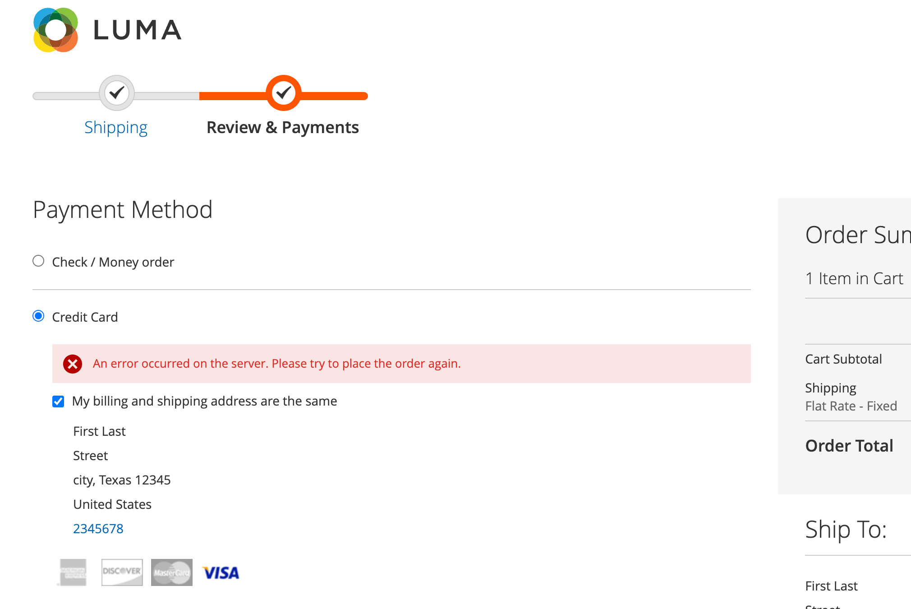
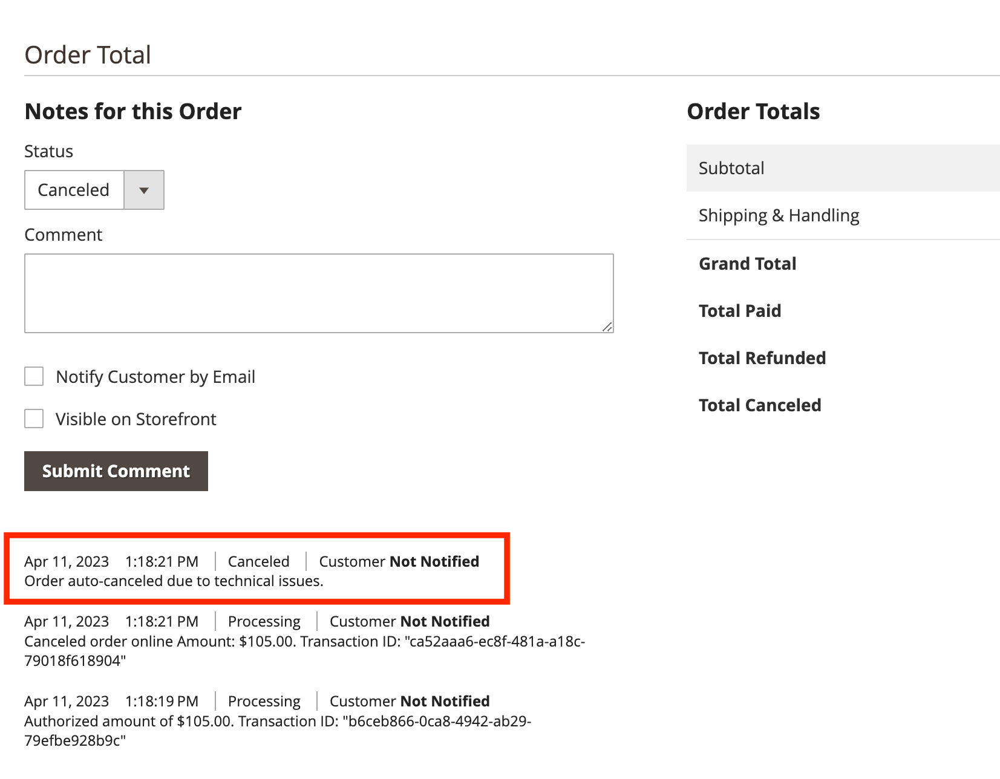

# Checkout in [!DNL Payment Services]

You can configure checkout for Adobe Commerce [!DNL Payment Services] to best suit your shoppers. Functionality such as [order auto-voiding](#order-auto-voided-if-error) and [credit card vaulting](#credit-card-vaulting) ensure your shoppers have a smooth user experience.

## Order auto-voided if error

If an error occurs during checkout, [!DNL Payment Services] automatically voids/cancels the order.

An error message displays on the checkout page for the shopper. The message may vary.

{width="600" zoomable="yes"}

A comment regarding the canceled order also displays in the Admin for a specific [order](https://experienceleague.adobe.com/docs/commerce-admin/stores-sales/order-management/orders/orders.html?lang=en).

{width="600" zoomable="yes"}

If a shopper gets authorization for an order, but the order was not created and converted into a `Capture`, the order is auto-voided. This process ensures no credit is reserved on the shopper's credit card and avoids the payment provider fee that occurs when the authorization is voided at the end of the standard 29 day period.

   >[!NOTE]
   >
   >Order auto-voiding only occurs when the customer uses a payment method that is set to `Authorize` mode, not `Authorize and Capture` mode.

## Checkout from product page

When a customer checks out directly from the product page, using the PayPal or [!DNL Pay Later] buttons, only the item represented on the current product page is purchased. Items already residing in the customer's cart are not added to the checkout flow and are not purchased.

This function allows the customer to quickly purchase the item they are currently viewing, while retaining items previously added to their cart.
If the customer cancels the order, the item in the current product page is added to the customer's cart. 

When a customer enters the checkout flow from the product page, the checkout page is simplified---the view only shows order-related data and options.

## Credit card vaulting

Shoppers can vault---or "save"---their credit card information for future purchases on the website level (any store within the same merchant's account).

See [Credit card vaulting](vaulting.md) for more information
