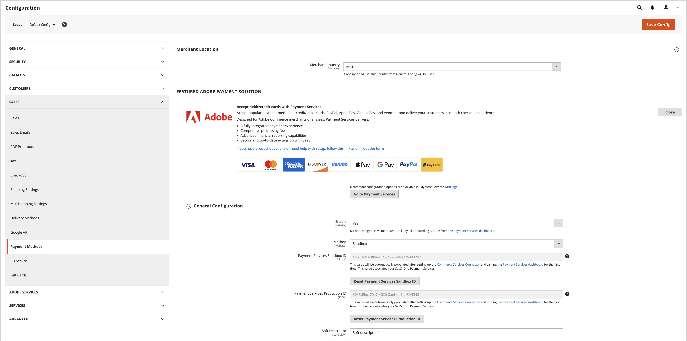

# Legacy [!DNL Payment Services] Configuration

You can customize [!DNL Payment Services] to your needs with helpful configuration options in the Admin.

When you configure [!DNL Payment Services] for [!DNL Adobe Commerce] and [!DNL Magento Open Source] in the Admin, those configurations apply only to the environment that is set in the _[!UICONTROL Method]_ field of _[!UICONTROL General Configuration]_. Any changes you make in the configuration fields are independent of switching the _[!UICONTROL Method]_ selection---if you switch the method, your selections do not reset.

## General configuration

You can enable [!DNL Payment Services] for your store and your  _[!UICONTROL Merchant Location]_, and enable either sandbox testing or live payments in the _[!UICONTROL General Configuration]_ section.

1. On the _Admin_ sidebar, go to **[!UICONTROL Stores]** > _[!UICONTROL Settings]_ > **[!UICONTROL Configuration]**.
1. In the left panel, expand **[!UICONTROL Sales]** and choose **[!UICONTROL Payment Methods]**.
1. Set the _[!UICONTROL Merchant Country]_ field in the _[!UICONTROL Merchant Location]_. If a _[!UICONTROL Merchant Country]_ is not specified, the _[!UICONTROL Default Country]_ from the general configuration is used.
1. Expand the _[!UICONTROL FEATURED ADOBE PAYMENT SOLUTION]_ section to access the _[!UICONTROL [!DNL Payment Services]]_ section.
1. In the _[!UICONTROL [!DNL Payment Services]]_ section, expand the _[!UICONTROL General Configuration]_ section.
1. For **Enable**, set it to `Yes` to enable [!DNL Payment Services] for your store.
1. For **Method**, set it to `Sandbox` if you are still testing [!DNL Payment Services] for your store or `Production` if you are ready to enable live payments.
1. Your **[!UICONTROL Payment Services Sandbox ID]** and **[!UICONTROL Payment Services Production ID]** values are automatically populated once you setup the [Commerce Services Connector](https://experienceleague.adobe.com/en/docs/commerce-merchant-services/user-guides/integration-services/saas){target=_blank} and visit the [!DNL Payment Services] dashboard for the first time. Do this to finish the onboarding for your sandbox and/or production environments. These values associate your SaaS ID to [!DNL Payment Services].

    >[!WARNING]
    >
    > If you need to change your dataspace ID in the Commerce Services Connector, you need to reset your [!DNL Payment Services] ID. Click **Reset Payment Services ID** to reset your Sandbox or Production IDs. If you reset your [!DNL Payment Services] IDs, you must onboard again.

1. For **Soft Descriptor** (custom values which show on customer transaction bank statements to delineate between stores/brands/catalogs), add your custom text (up to 22 characters) in the text field, replacing `Soft descriptor` or the existing value.
1. Click **[!UICONTROL Save Config]** to save your changes.
1. Navigate to **[!UICONTROL System]** > **[!UICONTROL Cache Management]**, and then click **[!UICONTROL Flush Cache]** to refresh all invalid caches.

{width="700" zoomable="yes"}

### Configuration options

| Field | Scope | Description |
|---|---|---|
| [!UICONTROL Enable] | website | Enable or disable [!DNL Payment Services] for your website. Options: `[!UICONTROL Yes]` / `[!UICONTROL No]` |
| [!UICONTROL Method] | store view | Set the method, or environment, for your store. Options: [!UICONTROL Sandbox] / [!UICONTROL Production] |
| [!UICONTROL Payment Services Sandbox ID] | store view | Your sandbox merchant ID, which is auto-generated during sandbox onboarding. |
| [!UICONTROL Payment Services Production ID] | store view | Your production merchant ID, which is auto-generated during production (live) onboarding. |
| [!UICONTROL Soft Descriptor] | website or store view | Add a soft descriptor to your website(s) and store view(s) to add information to customer transactions which delineate brands, stores, or product lines. |

## [!UICONTROL Credit Card Fields]

The [!UICONTROL Credit Card Fields] payment options provide a simple and secure checkout for credit card or debit card payment methods.

See [Payments options](payments-options.md#paypal-smart-buttons) for more information.

1. On the _Admin_ sidebar, go to **[!UICONTROL Stores]** > _[!UICONTROL Settings]_ > **[!UICONTROL Configuration]**.
1. In the left panel, expand **[!UICONTROL Sales]** and choose **[!UICONTROL Payment Methods]**.
1. Expand the _[!UICONTROL FEATURED ADOBE PAYMENT SOLUTION]_ section.
1. In the _[!UICONTROL Payment Services]_ section, expand the _[!UICONTROL Credit Card Fields]_ section.
1. For **[!UICONTROL Title]**, enter text (if needed) to change the name of the payment method as shown during checkout.
1. To [set the payment action](production.md#set-payment-services-as-payment-method), select **[!UICONTROL Authorize]** or **Authorize and Capture**.
1. To prioritize a payment method on the checkout page, provide a `Numeric Only` value in the **[!UICONTROL Sort order]** field.
1. For **[!UICONTROL Show on checkout page]**, choose `Yes` to enable credit card fields on the checkout page.
1. For **[!UICONTROL Vault Enabled]**, choose `Yes` to enable credit card vaulting for checkout.
1. For **[!UICONTROL Vault Enabled in Admin]**, choose `Yes` to enable the merchant to create orders for customers using their vaulted credit card.
1. To enable **[!UICONTROL 3D Secure authentication]** (`Off` by default) choose `Always` or `When required`.
1. For **[!UICONTROL Debug Mode]**, choose `Yes` to enable debug mode, or `No` to disable it.
1. Click **[!UICONTROL Save Config]** to save your changes.
1. Navigate to **[!UICONTROL System]** > **[!UICONTROL Cache Management]**, and then click **[!UICONTROL Flush Cache]** to refresh all invalid caches.

### Configuration options

| Field | Scope | Description |
|---|---|---|
| [!UICONTROL Title] | store view | Add the text to display as the title for this payment option in the Payment Method view during checkout. Options: [!UICONTROL text field] |
| [!UICONTROL Payment Action] | website | The [payment action](https://experienceleague.adobe.com/docs/commerce-admin/config/sales/payment-methods/payment-methods.html) for the specified payment method. Options: [!UICONTROL Authorize] / [!UICONTROL Authorize and Capture] |
| [!UICONTROL Sort order] | store view | The sorting order for the specified payment method on the checkout page. `Numeric Only` value |
| [!UICONTROL Show on checkout page] | website | Enable or disable credit card fields on the checkout page. Options: [!UICONTROL Yes] / [!UICONTROL No] |
| [!UICONTROL Vault enabled] | store view | Enable or disable [credit card vaulting](vaulting.md). Options: [!UICONTROL Yes] / [!UICONTROL No] |
| [!UICONTROL Vault enabled in Admin] | store view | Enable or disable ability for [merchant to complete orders for customers in the Admin](vaulting.md) using a vaulted payment method. Options: [!UICONTROL Yes] / [!UICONTROL No] |
| [!UICONTROL 3D Secure authentication] | website | Enable or disable [3DS Secure authentication](security.md#3ds). Options: [!UICONTROL Always] / [!UICONTROL When Required] / [!UICONTROL Off] |
| [!UICONTROL Debug Mode] | website | Enable or disable Debug Mode. Options: `[!UICONTROL Yes]` / `[!UICONTROL No]` |

## [!UICONTROL Apple Pay]

The [!UICONTROL Apple Pay] payment option allows the merchant to offer Apple Pay to their shoppers, who can use Touch ID on their devices to make purchases from the Safari browser. Merchants can add up to 99 domains per merchant account.

See [Payments options](payments-options.md#apple-pay-button) for more information.

1. On the _Admin_ sidebar, go to **[!UICONTROL Stores]** > _[!UICONTROL Settings]_ > **[!UICONTROL Configuration]**.
1. In the left panel, expand **[!UICONTROL Sales]** and choose **[!UICONTROL Payment Methods]**.
1. Expand the _[!UICONTROL FEATURED ADOBE PAYMENT SOLUTION]_ section.
1. In the _[!UICONTROL Payment Services]_ section, expand the _[!UICONTROL Apple Pay]_ section.
1. For **[!UICONTROL Title]**, enter text (if needed) to change the name of the payment method as shown during checkout.
1. To [set the payment action](production.md#set-payment-services-as-payment-method), select **[!UICONTROL Authorize]** or **[!UICONTROL Authorize and Capture]**.
1. Specify where the [!DNL Apple Pay] option is enabled in Adobe Commerce by selecting `Yes` in the following options as needed:
    * **[!UICONTROL Show Apple Pay on checkout page]**
    * **[!UICONTROL Show Apple Pay on product detail page]**
    * **[!UICONTROL Show Apple Pay in mini cart preview]**
    * **[!UICONTROL Show Apple Pay on cart page]**
1. To enable debug mode, select `Yes` for the **[!UICONTROL Debug Mode]** (`No` disables it).
1. To save your changes, click **[!UICONTROL Save Config]** .
1. Navigate to **[!UICONTROL System]** > **[!UICONTROL Cache Management]**, and then click **[!UICONTROL Flush Cache]** to refresh all invalid caches.

### Configuration options

| Field | Scope | Description |
|---|---|---|
| [!UICONTROL Title] | store view | Add the text to display as the title for this payment option in the Payment Method view during checkout. Options: [!UICONTROL text field] |
| [!UICONTROL Payment Action] | website | The [payment action](https://experienceleague.adobe.com/docs/commerce-admin/config/sales/payment-methods/payment-methods.html) for the specified payment method. Options: [!UICONTROL Authorize] / [!UICONTROL Authorize and Capture] |
| [!UICONTROL Show on checkout page] | website | Enable or disable [!DNL Apple Pay] on the checkout page. Options: `[!UICONTROL Yes]` / `[!UICONTROL No]` |
| [!UICONTROL Sort order] | store view | The sort order for the specified payment method on the checkout page. `Numeric Only` value |
| [!UICONTROL Show buttons on product detail page] | store view | Enable or disable [!DNL Apple Pay] on the product detail page. Options: `[!UICONTROL Yes]` / `[!UICONTROL No]` |
| [!UICONTROL Show buttons in mini-cart preview] | store view | Enable or disable [!DNL Apple Pay] in the mini-cart preview. Options: `[!UICONTROL Yes]` / `[!UICONTROL No]` |
| [!UICONTROL Show buttons on cart page] | store view | Enable or disable [!DNL Apple Pay] in on the cart page. Options: `[!UICONTROL Yes]` / `[!UICONTROL No]` |
| [!UICONTROL Debug Mode] | website | Enable or disable Debug Mode. Options: `[!UICONTROL Yes]` / `[!UICONTROL No]` |

## [!UICONTROL Google Pay]

The [!UICONTROL Google Pay] payment option allows the merchant to offer Google Pay to their shoppers, who can use the Google Wallet on their devices to make purchases.

See [Payments options](payments-options.md#google-pay-button) for more information.

1. On the _Admin_ sidebar, go to **[!UICONTROL Stores]** > _[!UICONTROL Settings]_ > **[!UICONTROL Configuration]**.
1. In the left panel, expand **[!UICONTROL Sales]** and choose **[!UICONTROL Payment Methods]**.
1. Expand the _[!UICONTROL FEATURED ADOBE PAYMENT SOLUTION]_ section.
1. In the _[!UICONTROL Payment Services]_ section, expand the _[!UICONTROL Google Pay]_ section.
1. (Optional) Change the name of the payment method shown during checkout by entering the new name in the **[!UICONTROL Title]** field.
1. [Set the payment action](production.md#set-payment-services-as-payment-method) by selecting **[!UICONTROL Authorize]** or **[!UICONTROL Authorize and Capture]**.
1. Specify where the [!DNL Google Pay] option is enabled in Adobe Commerce by selecting `Yes` in the following options as needed:
    * **[!UICONTROL Show Google Pay on checkout page]**
    * **[!UICONTROL Show Google Pay on product detail page]**
    * **[!UICONTROL Show Google Pay in mini cart preview]**
    * **[!UICONTROL Show Google Pay on cart page]**
1. To enable **[!UICONTROL 3D Secure authentication]** (`Off` by default) choose `Always` or `When required`.
1. To enable debug mode, select `Yes` for the **[!UICONTROL Debug Mode]** (`No` disables it).
1. Configure the appearance of the _[!UICONTROL Google Pay]_ button by selecting the **[!UICONTROL Button Color]**, **[!UICONTROL Button Type]**, and **[!UICONTROL Button Style]** as needed.
1. To set the height, uses the default value for height defined in **[!UICONTROL Button Style]**.
1. To save your changes, click **[!UICONTROL Save Config]** .
1. Navigate to **[!UICONTROL System]** > **[!UICONTROL Cache Management]**, and then click **[!UICONTROL Flush Cache]** to refresh all invalid caches.

### Configuration options

| Field | Scope | Description |
|---|---|---|
| [!UICONTROL Title] | store view | Specifies the text label that displays for this payment option in the Payment Method view during checkout. Options: `[!UICONTROL text field]` |
| [!UICONTROL Payment Action] | website | The [payment action](https://experienceleague.adobe.com/docs/commerce-admin/config/sales/payment-methods/payment-methods.html) for the specified payment method. Options: `[!UICONTROL Authorize]` / `[!UICONTROL Authorize and Capture]` |
| [!UICONTROL Show on checkout page] | website | Enable or disable [!DNL Google Pay] on the checkout page. Options: `[!UICONTROL Yes]` / `[!UICONTROL No]` |
| [!UICONTROL Sort order] | store view | The sort order for the specified payment method on the checkout page. `Numeric Only` value |
| [!UICONTROL Show buttons on product detail page] | store view | Enable or disable [!DNL Google Pay] on the product detail page. Options: `[!UICONTROL Yes]` / `[!UICONTROL No]` |
| [!UICONTROL Show buttons in mini-cart preview] | store view | Enable or disable [!DNL Google Pay] in the mini-cart preview. Options: `[!UICONTROL Yes]` / `[!UICONTROL No]` |
| [!UICONTROL Show buttons on cart page] | store view | Enable or disable [!DNL Google Pay] on the cart page. Options: `[!UICONTROL Yes]` / `[!UICONTROL No]` |
| [!UICONTROL 3D Secure authentication] | store view | Enable or disable [3D Secure authentication](security.md#3ds). Options: [!UICONTROL Always] / [!UICONTROL When Required] / [!UICONTROL Off] |
| [!UICONTROL Debug Mode] | website | Enable or disable Debug Mode. Options: `[!UICONTROL Yes]` / `[!UICONTROL No]` |
| [!UICONTROL Button Color] | Store View | Define color of the [!DNL Google Pay] button. Options: `[!UICONTROL Default]` / `[!UICONTROL Black]` / `[!UICONTROL White]` |
| [!UICONTROL Button Type] | Store View | Define type of the [!DNL Google Pay] button. Options: `[!UICONTROL buy]` / `[!UICONTROL checkout]` / `[!UICONTROL order]` / `[!UICONTROL pay]` / `[!UICONTROL plain]` |

See [Google Pay API request object options](https://developers.google.com/pay/api/web/reference/request-objects) documentation for more information.

## [!DNL PayPal Payment Buttons]

The [!DNL PayPal payment buttons] payment options provide a simple, fast, and secure checkout process for your customer.

See [Payments options](payments-options.md#paypal-smart-buttons) for more information.

Configure [!DNL PayPal payment buttons]

You can enable and configure the PayPal payment buttons payment options within the Admin:

1. On the _Admin_ sidebar, go to **[!UICONTROL Stores]** > _[!UICONTROL Settings]_ > **[!UICONTROL Configuration]**.
1. In the left panel, expand **[!UICONTROL Sales]** and choose **[!UICONTROL Payment Methods]**.
1. Expand the _[!UICONTROL FEATURED ADOBE PAYMENT SOLUTION]_ section.
1. In the _[!UICONTROL Payment Services]_ section, expand the _[!UICONTROL PayPal payment buttons]_ section.
1. To change the name of the payment method as shown during checkout, edit the _[!UICONTROL Title]_ field.
1. To [set the payment action](production.md#set-payment-services-as-payment-method), select **[!UICONTROL Authorize]** or **[!UICONTROL Authorize and Capture]**.
1. To prioritize a payment method on the checkout page, provide a `Numeric Only` value in the **[!UICONTROL Sort order]** field.
1. To enable/disable the [Pay Later messaging](payments-options.md#pay-later-button), select `Yes`/`No` for **[!UICONTROL Display Pay Later Message]**.
1. Specify where the PayPal payment buttons are enabled in Adobe Commerce by selecting `Yes` in the following options as needed:
    * **[!UICONTROL Show buttons on checkout page]**
    * **[!UICONTROL Show buttons on product detail page]**
    * **[!UICONTROL Show buttons in mini cart preview]**
    * **[!UICONTROL Show buttons on cart page]**
1. To enable Venmo as a payment option, select `Yes` for **[!UICONTROL Venmo Enabled]**.
1. To enable credit and debit cards as a payment option (PayPal Smart button), select `Yes` for **[!UICONTROL Credit and Debit Card Enabled]**.
1. To enable/disable the [PayPal Pay Later](payments-options.md#pay-later-button) payment option, select `Yes`/`No` for **[!UICONTROL PayPal Pay Later Enabled]**.
1. To enable debug mode, select `Yes` for the **[!UICONTROL Debug Mode]** (`No` disables it).
1. To save your changes, click **[!UICONTROL Save Config]** .
1. Navigate to **[!UICONTROL System]** > **[!UICONTROL Cache Management]**, and then click **[!UICONTROL Flush Cache]** to refresh all invalid caches.

### Configuration options

| Field | Scope | Description |
|---|---|---|
| [!UICONTROL Title] | store view | Add the text to be displayed as the title for this payment option in the Payment Method view during checkout. Options: text field |
| [!UICONTROL Payment Action] | website | The [payment action](https://experienceleague.adobe.com/en/docs/commerce-admin/config/sales/payment-methods/payment-methods#payment-actions){target="_blank"} for the specified payment method. Options: [!UICONTROL Authorize] / [!UICONTROL Authorize and Capture] |
| [!UICONTROL Display Pay Later Message] | website | Enable or disable the Pay Later messaging in the shopping cart, product page, mini-cart, and during the checkout flow. Options: `[!UICONTROL Yes]` / `[!UICONTROL No]` |
| [!UICONTROL Show buttons on checkout page] | store view | Enable or disable [!DNL PayPal payment buttons] on the checkout page. Options: `[!UICONTROL Yes]` / `[!UICONTROL No]` |
| [!UICONTROL Show buttons on product detail page] | store view | Enable or disable [!DNL PayPal payment buttons] on the product detail page. Options: `[!UICONTROL Yes]` / `[!UICONTROL No]` |
| [!UICONTROL Show buttons in mini-cart preview] | store view | Enable or disable [!DNL PayPal payment buttons] in the mini-cart preview. Options: `[!UICONTROL Yes]` / `[!UICONTROL No]` |
| [!UICONTROL Show buttons on cart page] | store view | Enable or disable [!DNL PayPal payment buttons] in on the cart page. Options: `[!UICONTROL Yes]` / `[!UICONTROL No]` |
| [!UICONTROL Venmo Enabled] | store view | Enable or disable the Venmo payment option where payment buttons are displayed. Options: `[!UICONTROL Yes]` / `[!UICONTROL No]` |
| [!UICONTROL Credit and Debit Card Enabled] | store view | Enable or disable the Credit and Debit card options where payment buttons are displayed. Options: `[!UICONTROL Yes]` / `[!UICONTROL No]` |
| [!UICONTROL PayPal Pay Later Enabled] | store view | Enable or disable PayPal Pay Later payment option appearance where payment buttons are displayed. Options: `[!UICONTROL Yes]` / `[!UICONTROL No]` |
| [!UICONTROL Debug Mode] | website | Enable or disable Debug Mode. Options: `[!UICONTROL Yes]` / `[!UICONTROL No]` |

## Button style

You can also configure the _[!UICONTROL Button style]_ options of the payment buttons:

1. On the _Admin_ sidebar, go to **[!UICONTROL Stores]** > _[!UICONTROL Settings]_ > **[!UICONTROL Configuration]**.
1. In the left panel, expand **[!UICONTROL Sales]** and choose **[!UICONTROL Payment Methods]**.
1. Expand the _[!UICONTROL FEATURED ADOBE PAYMENT SOLUTION]_ section.
1. In the _[!UICONTROL [!DNL Payment Services]]_ section, expand the _[!UICONTROL PayPal Smart Button Styling]_ section.
1. To set the layout, select `Vertical` or `Horizontal` for **[!UICONTROL Layout]**
1. To set the color, select from the available colors in **[!UICONTROL Color]**.
1. To set the shape, select `Rectangular` or `Pill` for **[!UICONTROL Shape]**.
1. To use the default height, select `Yes` or `No` for **[!UICONTROL Use Default Height]**.
1. To set the custom height, add desired pixel height for **[!UICONTROL Height]**.
1. To set the tagline, select `Yes` or `No` for **[!UICONTROL Tagline]**.
1. To save your changes, click **[!UICONTROL Save Config]** .
1. Navigate to **[!UICONTROL System]** > **[!UICONTROL Cache Management]**, and then click **[!UICONTROL Flush Cache]** to refresh all invalid caches.

You can also configure payment button styling [in Settings](settings.md#button-style) from Payment Services Home.

### Configuration options

|Field|Scope|Description|
|--- |--- |--- |
|[!UICONTROL Layout]|Store View|Define style of layout for Paypal payment buttons. Options: `[!UICONTROL Vertical]` / `[!UICONTROL Horizontal]`|
|[!UICONTROL Color]|Store View|Define color of the Paypal payment buttons. Options: [!UICONTROL Blue] / `[!UICONTROL Gold]` / `[!UICONTROL Silver]` / `[!UICONTROL White]` / `[!UICONTROL Black]`|
|[!UICONTROL Shape]|Store View|Define shape of the Paypal payment buttons. Options: `[!UICONTROL Rectangular]` / `[!UICONTROL Pill]`|
|[!UICONTROL Use Default Height]|Store View|Defines if PayPal payment buttons use a default height. Options: `[!UICONTROL Yes]` / `[!UICONTROL No]`|
|[!UICONTROL Height]|Store View|Define height of the PayPal payment buttons. Default value: none|
|[!UICONTROL Label]|Store View|Define label that appears in the PayPal payment buttons. Options: `[!UICONTROL PayPal]` / `[!UICONTROL Checkout]` / `[!UICONTROL Buynow]` / `[!UICONTROL Pay]` / `[!UICONTROL Installment]`|
|[!UICONTROL Tagline]|Store View|Enables tagline. Options: `[!UICONTROL Yes]` / `[!UICONTROL No]`|

## Flush the cache

 If you change the configuration, [manually flush the cache](/help/payment-services/settings.md#flush-the-cache) so that your store shows the latest configuration settings.
