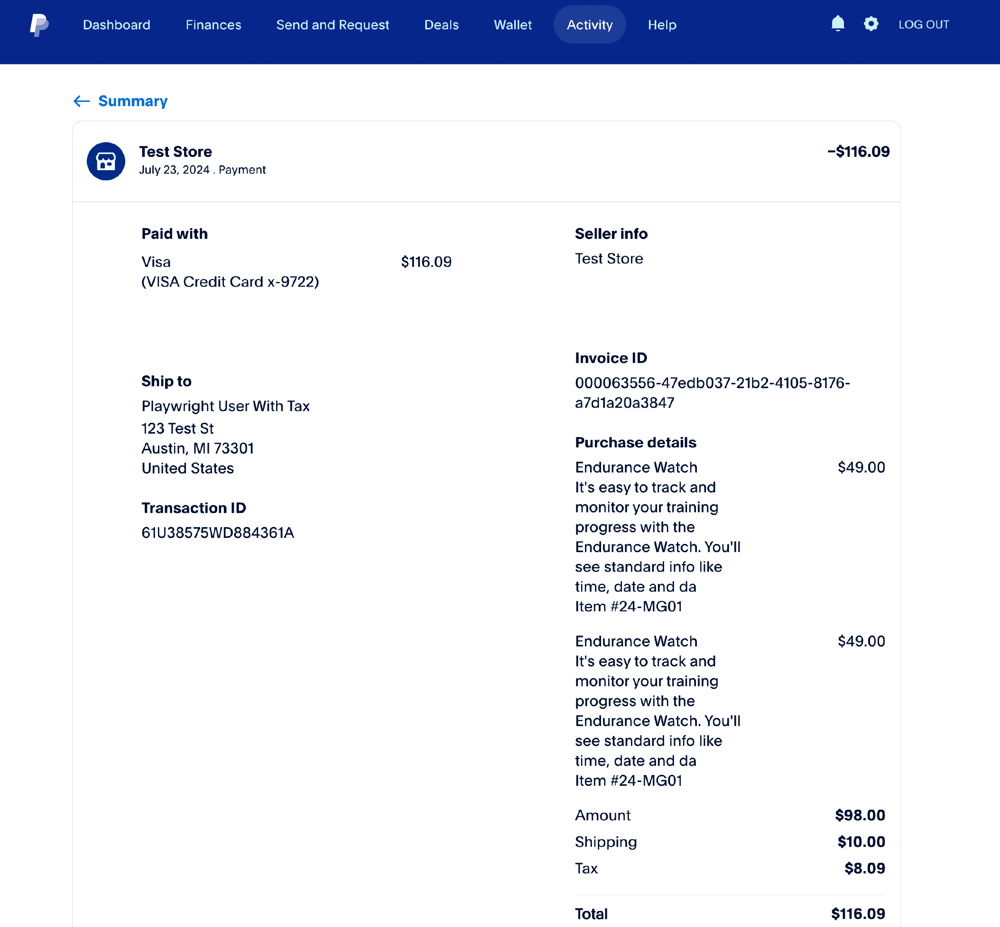
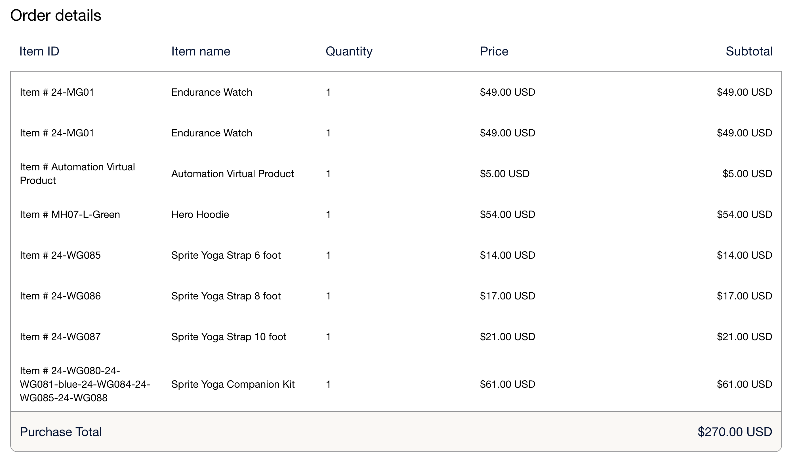

# Line items for [!DNL Payment Services]

Line items for [!DNL Payment Services] are the items included in an order. These line items provide information such as:

* Product details
* Quantity
* Price (including taxes, discounts, and other relevant information)
 
This information is useful for customer service, order management, and proper billing.

This feature is enabled by default for [!DNL Payment Services]. To  view line items:

1. Navigate to your [PayPal merchant dashboard](https://www.paypal.com/merchant/){target=_blank}.

1. Click **Activity** > **All transactions**.

1. Select the desired order and view its line items:

    > Example of line items in the shopper dashboard view

    {width="500" zoomable="yes"}

## Line items attributes

Line items are generated when the order is placed through Adobe Commerce and information is sent to PayPal, with the following attributes:

| Attribute |  Data Type | Description |
| --- | --- | --- |
| `name` | String! | The item name. If an item has more than one line due to multiple quantities or a tax rounding issue, the item name remains the same for all lines, but the displayed price may vary slightly due to rounding. |
| `unit_amount` | Object! | The item price or rate per unit. Includes the following attributes: `currency_code` and `value`. |
| `tax` | Object | The item tax for each unit. Includes the following attributes: `currency_code` and `value`. |
| `quantity` | String! | The item quantity. Will be a whole number. |
| `description` | String | The detailed item description. |
| `sku` | String | The stock keeping unit (or SKU) for the item. |
| `url` | String | The `URL` to the item being purchased. Visible to buyer and used in buyer experiences. |
| `upc` | Object | The Universal Product Code (or UPC) of the item. |
| `category` | String | The item category type. |

### `unit_amount` attributes

The `unit_amount` object contains the following attributes:

| Attribute |  Data Type | Description |
| --- | --- | --- |
| `currency_code` | String! | The [three-character ISO-4217 currency code](https://developer.paypal.com/api/rest/reference/currency-codes/) that identifies the currency. |
| `value` | String! | Indicates the value of the item. The `currency_code` determines the required number of decimal places, if any. |

### `tax` attributes

The `tax` object contains the following attributes:

| Attribute |  Data Type | Description |
| --- | --- | --- |
| `currency_code` | String! | The [three-character ISO-4217 currency code](https://developer.paypal.com/api/rest/reference/currency-codes/) that identifies the currency. |
| `value` | String! | Indicates the value of the item. Depends on each `currency_code` for the required number of decimal places. |

### `upc` attributes

The `upc` object contains the following attributes:

| Attribute |  Data Type | Description |
| --- | --- | --- |
| `type` | string! | The UPC type. |
| `code` | string! | The UPC product code of the item. |

+++Line items example

```json
{
    "name": "Crown Summit Backpack - 1",
    "unit_amount": {
        "currency_code": "USD",
        "value": "38.50"
    },
    "tax": {
        "currency_code": "USD"
        "value": "3.13"
    },
    "quantity": "1",
    "description": "The Crown Summit Backpack is equally at home in a gym locker, study cube or a pup tent, so be sure yours is packed with books,",
    "sku": "24-MB03",
    "url": "https://magento.test/crown-summit-backpack.html",
    "upc": {
        "type": "UPC-A",
        "code": "000003"
    },
    "category": "PHYSICAL_GOODS"
},
{
    "name": "Crown Summit Backpack - 2",
    "unit_amount": {
        "currency_code": "USD",
        "value": "38.50"
    },
    "tax": {
        "currency_code": "USD",
        "value": "3.14"
    },
    "quantity": "1",
    "description": "The Crown Summit Backpack is equally at home in a gym locker, study cube or a pup tent, so be sure yours is packed with books,",
    "sku": "24-MB03",
    "url": "https://magento.test/crown-summit-backpack.html",
    "upc": {
        "type": "UPC-A",
        "code": "000003"
    },
    "category": "PHYSICAL_GOODS"
}
```

+++

See [PayPal developer documentation about line items](https://developer.paypal.com/docs/api/orders/v2/#definition-line_item){target=_blank} for more information about these fields and their limitations.

## Manage line items

Adobe Commerce [calculates tax based on the total amount for each row](https://experienceleague.adobe.com/en/docs/commerce-admin/stores-sales/site-store/taxes/taxes#warning-messages){target=_blank}, which can cause rounding issues if multiple quantities of the same item are ordered or if tax-inclusive prices are displayed in the catalog. In such cases, the total quantity may be split into two lines, but the quantity will equal the total items ordered.

> Example of line items with rounding issues in the merchant dashboard view

{width="600" zoomable="yes"}

+++How Adobe Commerce calculates a rounding issue in line items

Line items for [!DNL Payment Services] balances this rounding issue so that the the `unit_amount` or `unit_tax` value corresponds with the total amount for the order. An item may be split into two lines to resolve this rounding issue:

* When the rounding issue appears on the `unit_amount`, merchant should see a difference on the price on this additional line.
* When the rounding issue appears on the `unit_tax`, no difference will be seen on the individual line items because the `tax` is not displayed in the grid, but only as a total at the bottom.

+++
