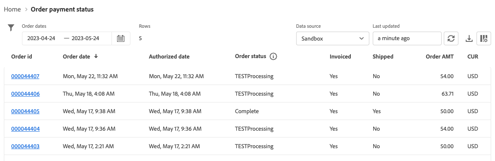

# Order Payment Status Report

[!DNL Payment Services] for [!DNL Adobe Commerce] and [!DNL Magento Open Source] offers you comprehensive reporting so that you can get a clear view of your store's [transactions](transactions.md), orders, and payments.

There are two available Order payment status reporting views to enable you to quickly view the payment status of your orders:

* **[Order payment status visualization view](#order-payment-status-data-visualization-view)**---Chart available on the Payment Services Home that is a visual representation of aggregated payment statuses per day from the Order payment status report view
* **[Order payment status report view](#order-payment-status-report-view)**---Report available in Order payment status that shows detailed payment, invoiced, shipped, refund, and dispute statues for all transactions

The Order payment status views help you easily understand where a specific order is within the order to cash process flow. These reports allow you to quickly view orders---based on their payment status and payment date---and identify any potential issues.

You can [download Order payment statuses](#download-order-payment-statuses) in a .csv file format for use in existing accounting or order management software.

>[!NOTE]
>
>You cannot view financial reports if you have not [onboarded and activated Live mode](production.md#enable-live-payments) for [!DNL Payment Services].

## Order payment status data visualization view

The Order payment status data visualization view is available in the Payment Services Home. It is a visual representation of the aggregated payment statuses per day from the detailed tabular [Order payment status report view](#order-payment-status-report-view).

On the _Admin_ sidebar, go to **Sales** > **Payment Services** > _Orders_ to see the data visualization [chart of payment statuses](#statuses-information).

{width="800" zoomable="yes"}

Click **[!UICONTROL View Report]** to navigate to the detailed tabular [Order payment status report view](#order-payment-status-report-view).

### Customize statuses timeframe

By default, 30 days of payment statuses are shown.

From the Order payment status visualization view, you can customize the timeframe for the payment statuses you want to view by selecting a date range:

1. On the _Admin_ sidebar, go to **[!UICONTROL Sales]** > **[!UICONTROL Payment Services]**. The Order payment status data visualization view is visible in the _Orders_ section.
1. Click the **[!UICONTROL Range]** selector filter.
1. Choose the applicable date range---30 days, 15 days, or 7 days.
1. View the statuses info for your specified dates.

### Statuses information

The payment statuses for a selected date range are shown on the left of the Order payment status data visualization view. The dates for the selected date range are shown on the bottom of the view. If there were no orders on a particular date, that date does not appear.

The Order payment status data visualization view includes the following information.

| Data | Description |
| ------------ | -------------------- |
| [!UICONTROL Orders] | Amount range for orders in specified time frame; data on the Y axis (left) |
| Date range | Date range for the specified time frame; data on the X axis (bottom) |
| Authorized | Order authorized |
| Capture requested | Capture requested for order |
| Capture confirmed | Order capture completed |
| Partial capture | Order partially captured |
| Capture failed | Order capture failed |
| Voided | Order voided |

## Order payment status report view

The Order payment status report view is available in the Home view of Payment Services. It includes detailed statuses---payment, invoiced, shipped, refund, dispute, and more---for all transactions.

On the _Admin_ sidebar, go to **[!UICONTROL Sales]** > **[!UICONTROL Payment Services]** > _[!UICONTROL Orders]_ > **[!UICONTROL View Report]** to see the detailed tabular Order payment status report view.

{width="800" zoomable="yes"}

You can configure this view, per the sections in this topic, to best present the data you desire to see.

You can [download payout transactions](#download-order-payment-statuses) in a .csv file format for use in existing accounting or order management software.

>[!NOTE]
>
>The data shown in this table is sorted in descending order (`DESC`) by default using the `TRANS DATE`. The `TRANS DATE` is the date and time when the transaction was initiated.

### Payment status updates

Certain payment methods require a period of time to capture the payment. [!DNL Payment Services] now detects the pending statuses of a payment transaction in an order by:

* Synchronously detecting `pending capture` transactions
* Asynchronously monitoring `pending capture` transactions

>[!NOTE]
>
>Detecting the pending statuses of payment transactions in an order prevents accidentally shipping orders if the payment has not yet been received. This can occur for e-check and PayPal transactions.

#### Synchronous detection of Pending capture transactions

Automatically detect capture transactions in a `Pending` status and prevent orders from entering a `Processing` status when such a transaction is detected.

During customer checkout or when an admin creates an invoice for a previously authorized payment, [!DNL Payment Services] automatically detects capture transactions in a `Pending` status and shifts corresponding orders into `Payment Review` status.

#### Asynchronous monitoring of Pending capture transactions

Detect when a pending capture transaction enters a `Completed` status so merchants can resume processing the affected order.

To make sure this process works as expected, merchants must configure a new cron job. Once the job is configured to run automatically, no other interventions are expected from the merchant.

See [Configure cron jobs](https://experienceleague.adobe.com/docs/commerce-operations/configuration-guide/cli/configure-cron-jobs.html). Once configured, the new job runs every 30 minutes to fetch updates for orders that are in a `Payment Review` status.

Merchants can check the updated payment status via the Order payment status report view.

### Data used in the report

[!DNL Payment Services] uses order data, and combines it with aggregated payment data from other sources (including PayPal), to provide meaningful and highly useful reports.

Order data is exported and persisted in the payment service. When you [change or add order statuses](https://experienceleague.adobe.com/en/docs/commerce-admin/stores-sales/order-management/orders/order-status#custom-order-status) or [edit a store view](https://experienceleague.adobe.com/en/docs/commerce-admin/stores-sales/site-store/store-views#edit-a-store-view), [store](https://experienceleague.adobe.com/en/docs/commerce-admin/start/setup/store-details#store-information), or website name, that data is combined with payment data and the Order payment status report is populated with the combined info.

There are two steps in this process:

1. The index is changed data either `ON SAVE` (every time order info or store info is changed) or `BY SCHEDULE` (on a pre-configured cron schedule), depending on how it is configured in [Index Management](https://experienceleague.adobe.com/en/docs/commerce-admin/systems/tools/index-management) in the Admin.

    By default, data indexation occurs `ON SAVE`, which means that whenever something changes in the order, the order status, the store view, the store, or the website, the reindexation process happens immediately.

1. The indexed data is sent to the payment service, which then populates into the Order payment status report.

The only data that is exported and collated for reporting purposes is data used by the Order payment status report.

>[!NOTE]
>
>The data shown in this table is sorted in descending order (`DESC`) by default using the `ORDER DATE`. The `ORDER DATE` is the date timestamp when the order was created.

#### Configure data export

Even though, by default, reindexing happens in `ON SAVE` mode, it is recommended that you index in `BY SCHEDULE` mode. The `BY SCHEDULE` index runs on a cron schedule of one minute, and any changed data appears in your Order status report within two minutes of any data change. This scheduled reindexing helps you reduce any strain on your store, especially if you have a large volume of incoming orders, because it happens on a schedule (not as each order is placed).

You can change the index mode---`ON SAVE` or `BY SCHEDULE`---[in the Admin](https://experienceleague.adobe.com/en/docs/commerce-admin/systems/tools/index-management#change-the-index-mode).

To learn how to configure the data export, see [Command-line configuration](configure-cli.md#configure-data-export).

### Select data source

In the Order payment status report view, you can select the data source---**[!UICONTROL Live]** _ or **[!UICONTROL Sandbox]**---for which you want to see report results.

{width="300" zoomable="yes"}

If _[!UICONTROL Live]_ is the selected data source, you can see report information for your stores that use [!DNL Payment Services] in production mode. If _[!UICONTROL Sandbox]_ is the selected data source, you can see report information for sandbox mode.

Data source selections work as follows:

* If you do not have any stores that use [!DNL Payment Services] in Live mode, the data source selection defaults to _[!UICONTROL Sandbox]_.
* If you have any stores (one or multiple) that use [!DNL Payment Services] in Live mode, the data source selection defaults to _[!UICONTROL Live]_.
* Report exports always honor the data source selection.

To select the data source for your [!UICONTROL Order Payment Status] report:

1. On the _Admin_ sidebar, go to **[!UICONTROL Sales]** > **[!UICONTROL [!DNL Payment Services]]** > **[!UICONTROL Orders]** > **[!UICONTROL View Report]**.
1. Click the _[!UICONTROL Data source]_ selector filter and select **[!UICONTROL Live]** or **[!UICONTROL Sandbox]**.

   The report results regenerate based on the data source selected.

### Customize Order dates timeframe

From the Order payment status report view, you can customize the timeframe of the status results you want to view by selecting specific dates. By default, 30 days of order payment statuses are shown in the grid.

1. On the _Admin_ sidebar, go to **[!UICONTROL Sales]** > **[!UICONTROL [!DNL Payment Services]]** > _[!UICONTROL Orders]_ > **[!UICONTROL View Report]**.
1. Click the _[!UICONTROL Order dates]_ calendar selector filter.
1. Choose the applicable date range.
1. View the order payment statuses for your specified dates in the grid.

### Filter report info

From the Order payment status report view, you can filter the statuses results you want to view by selecting filter criteria.

1. On the _Admin_ sidebar, go to **[!UICONTROL Sales]** > **[!UICONTROL [!DNL Payment Services]]** > _[!UICONTROL Orders]_ > **[!UICONTROL View Report]**.
1. Click the **[!UICONTROL Filter]** selector.
1. Toggle the _Pay Status_ options to see report results for only selected order payment statuses.
1. View report results within an order amount range by entering a _[!UICONTROL Min Order Amount]_ or _[!UICONTROL Max Order Amount_].
1. Click **[!UICONTROL Hide filters]** to hide the filter.

### Show and hide columns

The Order Payment Status report shows all available columns of information by default. You can, however, customize which columns you see in your report.

1. On the _Admin_ sidebar, go to **[!UICONTROL Sales]** > **[!UICONTROL [!DNL Payment Services]]** > _[!UICONTROL Orders]_ > **[!UICONTROL View Report]**.
1. Click the _Column settings_ icon ({width="20" zoomable="yes"}).
1. To customize which columns you see in the report, check or uncheck columns in the list.

   The Order payment status report immediately shows any changes that you made in the Column settings menu. The column preferences are saved and remain in effect if you navigate away from the report view.

### View statuses

The Order payment status report view shows comprehensive pay status information for each order.

By default, 30 days of order payment statuses are shown in the grid.

Scroll to the left and right to view [order payment status information](#column-descriptions), including order date, authorized date, invoiced, shipped, pay status, and more.

The number of rows returned in a search, or shown in the default 30 days of order payment statuses, are shown above the Order payment status view grid alongside the Order dates calendar selector filter.

#### Pay status

The Pay status column shows the current status for any payment. A `Capture failed` payment shows a red alert status and a `Voided` payment shows a gray alert status.

#### Refund status

The Refund status column shows the current status for any refund. A `Capture failed` payment shows a red alert status and a `Voided` payment shows a gray alert status.

### Update report data

The Order payment status report view shows a _[!UICONTROL Last updated]_ timestamp that shows the last time that the report information was updated. By default, Order payment status report data is auto-refreshed every three hours.

You can also manually force a refresh of the Order payment status report data to see the most up-to-date report information.

1. On the _Admin_ sidebar, go to **[!UICONTROL Sales]** > **[!UICONTROL [!DNL Payment Services]]** > _[!UICONTROL Orders]_ > **[!UICONTROL View Report]**.
1. Click the _Refresh_ icon ({width="20" zoomable="yes"}).

   The Order payment status report data is refreshed, an *[!UICONTROL Update complete]* confirmation appears, and the latest information is present in the grid.

### View disputes

You can view any disputes on your store's orders, and navigate to the PayPal Resolution Center to take action on them, from within the Order payment status report.

1. On the _Admin_ sidebar, go to **[!UICONTROL Sales]** > **[!UICONTROL [!DNL Payment Services]]** > _[!UICONTROL Orders]_ > **[!UICONTROL View Report]**.
1. Navigate to the **[!UICONTROL Disputes column]**.
1. View any disputes for a specific order and see [the dispute status](#order-payment-status-information).
1. Review dispute details from the [PayPal Resolution Center](https://www.paypal.com/us/cshelp/article/what-is-the-resolution-center-help246) by clicking the dispute ID link that begins with _PP-D-_.
1. Take appropriate action for the dispute, as needed.

   To sort order disputes by status, click the [!UICONTROL Disputes] column header.

### Download order payment statuses

You can download a .csv file with all statuses visible in the Order payment status view grid, whether you are viewing the default 30 days of statuses or a customized timeframe.

1. On the _Admin_ sidebar, go to **[!UICONTROL Sales]** > **[!UICONTROL [!DNL Payment Services]]** > _[!UICONTROL Orders]_ > **[!UICONTROL View Report]**.
1. If you want to see statuses for a timeframe other than the last 30 days, [customize the date range timeframe for your statuses](#customize-dates-timeframe).
1. Click the _Download_ ({width="20" zoomable="yes"}) icon.

Your order payment statuses are downloaded in a .csv format.

### Column descriptions

Order payment status reports include the following information.

| Column | Description |
| ------------ | -------------------- |
| [!UICONTROL Order ID] | Commerce order ID   To see related [order info](https://experienceleague.adobe.com/en/docs/commerce-admin/stores-sales/order-management/orders/orders){target="_blank"}, click the ID. |
| [!UICONTROL Order Date] | Order date timestamp |
| [!UICONTROL Authorized Date] | Date timestamp of payment authorization |
| [!UICONTROL Order Status] | Current Commerce [order status](https://experienceleague.adobe.com/en/docs/commerce-admin/stores-sales/order-management/orders/order-status){target="_blank"} |
| [!UICONTROL Invoiced] | Invoice status of order---*[!UICONTROL No]*, *[!UICONTROL Partial]*, or *[!UICONTROL Yes]* |
| [!UICONTROL Shipped] | Shipping status of order---*[!UICONTROL No]*, *[!UICONTROL Partial]*, or *[!UICONTROL Yes]* |
| [!UICONTROL Order Amt] | Grand total amount of the order |
| [!UICONTROL Cur] | Currency type of order |
| [!UICONTROL Pay Status] | Status of payment for a specific order |
| [!UICONTROL Paid Amt] | Amount paid on an order |
| [!UICONTROL Cur]| Currency type of the amount paid on an order |
| [!UICONTROL Refund Status] | Status of a refund on an order (such as information from returns, RMAs, and credit memos)---   *[!UICONTROL Requires refund]*, *[!UICONTROL Refund requested]*, *[!UICONTROL Refunded]*, *[!UICONTROL Refund failed]*, or *[!UICONTROL Voided]* |
| [!UICONTROL Refund Amount] | Total of refunded amount for an order |
| [!UICONTROL Cur] | Currency type of the amount refunded for an order |
| [!UICONTROL Disputes] | Status of any dispute on an order (information from disputes and chargebacks)---*[!UICONTROL Open]*, *[!UICONTROL Waiting for buyer response]*, *[!UICONTROL Waiting for seller response]*, *[!UICONTROL Under review]*, *[!UICONTROL Resolved]*, or *[!UICONTROL Other]* |
| [!UICONTROL Payment Method] | Payment method used in the Commerce transaction for an order |
| [!UICONTROL Website] | Website from which the order was placed |
| [!UICONTROL Store] | Store from which the order was placed |
| [!UICONTROL Store View] | Store view from which the order was placed |
