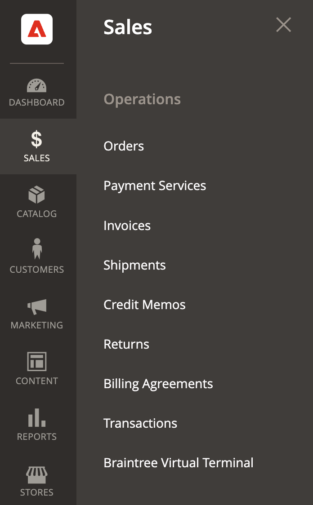

# Payment Services for Commerce

Payment Services for Adobe Commerce and Magento Open Source is your turnkey self-service solution, including sandbox testing and a simple setup, for providing robust and secure payment processing for your Commerce websites.

Whether you are a small business, mid-market contender, or large enterprise, this payments solution helps you reduce operational overhead, increase revenue, and give you useful tools to improve the entire shopper experience. 

Payment Services is:

* Easy to set up and maintain
* Designed to maximize your profit
* Safe and secure
* Designed to meet all your payments needs
* Self-contained within the Admin

## Features

>[!NOTE]
>
>Some of the features mentioned here may not yet be available for the GA (General Availability) release.

Payment Services is your one-stop-shop for online checkout (from settlement and refunds to getting paid). It provides powerful tools to give you the insight and control needed for creating the best experience for your buyers.

* [**Onboarding**](onboard-payments.md)---The process guides you through commercial signup, technical configuration, entitlements, sandbox environment configuration, and live payment enablement.
* [**Payment checkout**](configure-admin.md)---Use pertinent local and region-specific payment methods to best serve your customers.
* [**Cash flow management financial reporting**](financial-reporting.md)---Synchronize payment details with orders to get full transparency to the processed volume, payment balance, and detailed transaction-level reporting for financial reconciliation.
* **Transparent pricing**---Pricing is clear and upfront; what you see is what you get.

## Availability

Payment Services is available for Adobe Commerce and Magento Open Source. The Payment Services extension is now compatible with Adobe Commerce versions 2.4.0 to 2.4.3-p1.

See [Lifecycle policy](https://devdocs.magento.com/release/lifecycle-policy.html){target="_blank"} and the [Payment Services release notes](release-notes.md) pages for more release and version-specific information.s

## Accepted credit cards and currencies

Currently, Payment Services are only available in the United States (US) and accepts United States Dollars (USD) currency.

See the [PayPal currency availability](https://developer.paypal.com/docs/platforms/checkout/reference/country-availability-advanced-cards/) documentation for more information.

## Get started

Onboarding and setting up Payment Services is completed in just a few steps:

1. Get the [Payment Services extension](install.md).
1. Connect your Commerce instance to Magento Commerce Services.
1. Onboard and set up the sandbox service.
1. Enable Payment Services as your payment method and start processing test payments.
1. Complete merchant onboarding to enable live payments for your websites.
1. Activate Payment Services in live mode to begin processing live payments.

To get the full instructions and start the onboarding process, see [Onboard Payment Services](onboard-payments.md).
