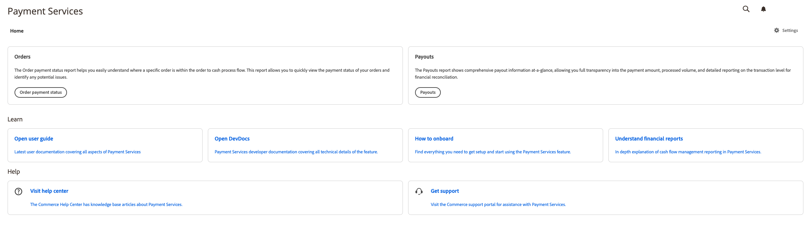

# Introduction to the [!DNL Payment Services] Home

[!DNL Payment Services] for [!DNL Adobe Commerce] and [!DNL Magento Open Source] provides a Home view with all the necessary information to start setting up and using the extension.

1. On the _Admin_ sidebar, go to **[!UICONTROL Sales]** > **[!UICONTROL Payment Services]**:

   {width="700" zoomable="yes"}

1. In this Home view, you can access _Home_ view, _Learn_ about [!DNL Payment Services], configure the extension _Settings_, or get _Help_.

## Home

| Field | Description |
|---|---|
| [!UICONTROL Orders] | These reports allow you to quickly view the payment status of your orders and identify any potential issues. |
| [!UICONTROL Payouts] | The Payouts reports show comprehensive payout information at-a-glance, allowing you full transparency into the payment amount, processed volume, and detailed reporting on the transaction level for financial reconciliation. |

## Learn

| Field | Description |
|---|---|
| [!UICONTROL Read documentation] | See the latest user and developer docs for [!DNL Payment Services]. |
| [!UICONTROL How to onboard] | Find everything you need to get setup and start using the [!DNL Payment Services] feature. |
| [!UICONTROL Understand financial reports] | In-depth explanation of cash flow management reporting in [!DNL Payment Services]. |

## Help

| Field | Description |
|---|---|
| [!UICONTROL Visit help center] | The [!DNL Adobe Commerce] Help Center has knowledge base articles about [!DNL Payment Services]. |
| [!UICONTROL Get support] | Visit the [!DNL Adobe Commerce] support portal for assistance with [!DNL Payment Services.] |

## Settings

In the Home view, click **[!UICONTROL Settings]**. See [Settings](settings.md) for more information.
