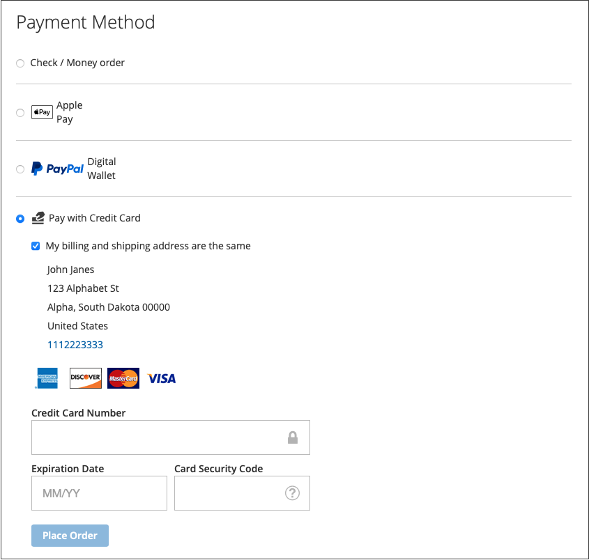
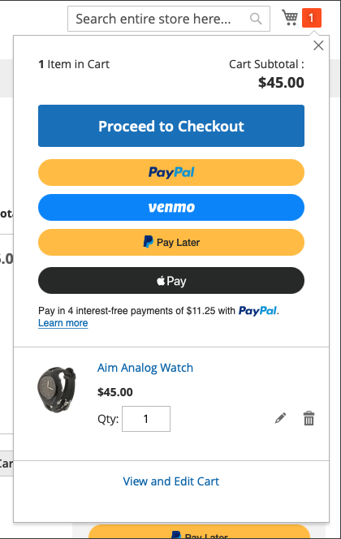

# Payment Options

With [!DNL Adobe Commerce] and [!DNL Magento Open Source] [!DNL Payment Services], you have multiple payment options available to you.

You can configure these payment options in [Home settings](payments-home.md) or [Store configuration](configure-admin.md) (recommended for legacy payment options or a multi-store setup).

There are different behaviors for each payment method depending on where you are in the checkout process:

* Product page---The product page for an item
* Mini cart---Available upon click of the cart icon when a product has been added to the carts
* Shopping cart---Available upon click of _View and edit cart_ from the mini-cart
* Checkout view---Available upon click of _Proceed to Checkout_ from mini-cart or shopping cart

>[!IMPORTANT]
>
>[!DNL Payment Services] onboarding must be completed before payments can be processed.

## Standard vs. Advanced Payments Experience

[!DNL Payment Services] provides **Advanced** (fully supported) and **Standard** (Express Checkout) payment options and onboarding flows, depending on the country in which you operate.

* **Advanced** - All available [payments options](../payment-services/payments-options.md) are available for current [fully supported countries](../payment-services/overview.md#availability). During onboarding to enable live payments, select the [Advanced onboarding option](../payment-services/production.md#advanced-onboarding).
* **Standard** - A subset of payments options (Express Checkout)---PayPal credit and debit cards---is available for other available supported countries. [Credit card fields](#credit-card-fields) and [Apple Pay](#apple-pay-button) are not available for this onboarding option. During onboarding to enable live payments, select the [Standard onboarding option](../payment-services/production.md#standard-onboarding).

See [Enable [!DNL Payment Services] for production](../payment-services/production.md#complete-merchant-onboarding) for for information about completing Advanced and Standard onboarding.

## [!UICONTROL Credit Card Fields]

[!UICONTROL Credit Card Fields] provide a simple and secure checkout for credit card or debit card payment methods. When a shopper checks out using credit card fields, they enter their name, billing address, and credit or debit card information, to place their order. Their customer information is securely used during the purchase session to seamlessly guide them through the checkout flow.

{width="500" zoomable="yes"}

Enable [credit card vaulting](#vaulting) for your stores to allow shoppers to vault (save) their credit card information for a fast checkout later.

You can configure [!UICONTROL Credit Card Fields] in the store configuration or the [!DNL Payment Services] Home. See [Settings](settings.md#credit-card-fields) for more information.

You can also change the layout, width, height, and outer styling of the credit card fields. See [PayPal documentation](https://developer.paypal.com/docs/checkout/advanced/customize/card-field-style/) for more information.

## [!DNL Apple Pay] button

Customers can use [[!DNL Apple Pay]](https://www.apple.com/apple-pay/), which utilizes credit and debit card payment credentials stored on an iOS or macOS device, to make purchases.

[!DNL Apple Pay] is only available in the Safari browser.

{width="500" zoomable="yes"}

The [!DNL Apple Pay] button is visible from the product page, mini-cart, shopping cart, and checkout views.

   >[!NOTE]
   >
   > To use [!DNL Apple Pay] for your stores, complete [self-registration with [!DNL Apple Pay]](https://developer.paypal.com/docs/checkout/apm/apple-pay/#register-your-live-domain) (_Register your live domain_ section only) and [configure it for your stores in [!DNL Payment Services]](settings.md#payment-buttons).

You can configure [!UICONTROL Apple Pay] in the store configuration or the Payment Services Home. See [Settings](settings.md#apple-pay) for more information.

## [!DNL PayPal Payment Buttons]

[!DNL PayPal Payment Buttons], which use PayPal to complete a purchase, stores your shopper's shipping address, billing addresses, and payment details for later use. Shoppers can use any payment method previously stored or offered by PayPal.

{width="350" zoomable="yes"}

You can configure [!UICONTROL PayPal payment buttons] in the store configuration or the [!DNL Payment Services] Home.  See [Settings](settings.md#payment-buttons) for more information.

See PayPal's [Payment methods documentation](https://developer.paypal.com/docs/checkout/payment-methods/) to learn in which countries each payment method is currently available.

### [!DNL PayPal] button

Customers can check out with ease and confidence using the PayPal button.

The [!DNL PayPal] button is visible from the product page, mini-cart, shopping cart, and checkout views.

### [!DNL Venmo] button

Customers can check out using the [Venmo](https://venmo.com/) button.

The [!DNL Venmo] button is visible from the product page, mini-cart, shopping cart, and checkout views.

### PayPal Debit or Credit card button

Customers can check out using the PayPal Debit or Credit card button.

The PayPal Debit or Credit card button is visible from the checkout page.

This option can be used to present a debit or credit card payment option to your shoppers with a PayPal-hosted button as an alternative to a credit card integration.

### [!DNL Pay Later] button

Offer your customers short-term, interest-free payments, and other financing options so that they can buy now and pay later with the [!DNL Pay Later] button.

The [!DNL Pay Later] button is visible from the product page, mini-cart, shopping cart, and checkout views.

See information about the Pay Later offers in [PayPal's Pay Later offers documentation](https://developer.paypal.com/docs/checkout/pay-later/us/). Use the **Country or region** dropdown to select a region of interest.

See [Settings](settings.md#payment-buttons) to learn how to disable/enable the [!DNL Pay Later] messaging.

## Use only PayPal payment buttons

To quickly get your store into production mode you can configure _only_ PayPal payment buttons (Venmo, PayPal, etc.)---instead of also using the PayPal credit card payment option.

This allows you to:

* Provide a variety of payment options for your customers, including Venmo and PayPal payment buttons, with the option to turn off PayPal hosted card fields and use an existing credit card provider.
* Use your existing credit card provider for credit card payments, while also utilizing PayPal's other payment options.
* Use PayPal's payment buttons in a region in which PayPal does not support credit cards as a payment option.

To **capture payments with _only_ PayPal payment buttons (_not_ the PayPal credit card payment option)**:

1. Ensure your store is [in production mode](settings.md#enable-payment-services).
1. [Configure the desired PayPal payment buttons](settings.md#payment-buttons) in Settings.
1. Turn _Off_ the **[[!UICONTROL Show PayPal Credit and Debit card button]](settings.md#payment-buttons)** option in the _[!UICONTROL Payment buttons]_ section.

To **capture payments with your existing credit card provider _and_ PayPal payment buttons**:

1. Ensure your store is [in production mode](settings.md#enable-payment-services).
1. [Configure the desired PayPal payment buttons](settings.md#payment-buttons).
1. Turn _Off_ the **[[!UICONTROL PayPal Show Credit and Debit card button]](settings.md#payment-buttons)** option in the _[!UICONTROL Payment buttons]_ section.
1. Turn _Off_ the **[[!UICONTROL Show on checkout page]](settings.md#credit-card-fields)** option in the _[!UICONTROL Credit card fields]_ section and use your [existing credit card provider account](https://experienceleague.adobe.com/docs/commerce-admin/stores-sales/payments/payments.html#payments).

## Order recalculation

When a customer enters the checkout flow from the mini-cart, shopping cart, or product page, they are directed to an order review page where they can see the selected shipping address in a PayPal popup window. After the customer selects the shipping method, the order amount is recalculated appropriately and the customer can see shipping costs and taxes.

When a customer enters the checkout flow from the checkout page, the system is already aware of the shipping address and final calculated amount, and totals are appropriately represented.

Tax holidays, shipping costs, and sales tax can vary widely from location to location. After [!DNL Payment Services] receives the shipping address and rate, it quickly recalculates all applicable costs and display them appropriately during the last stages of checkout.

## Credit card vaulting

Shoppers can vault---or "save"---their credit card information for future purchases on the website level (any store within the same merchant's account).

See [Credit card vaulting](vaulting.md) for more information.

## Security

See [PCI compliance](security.md#pci-compliance) for more information.
