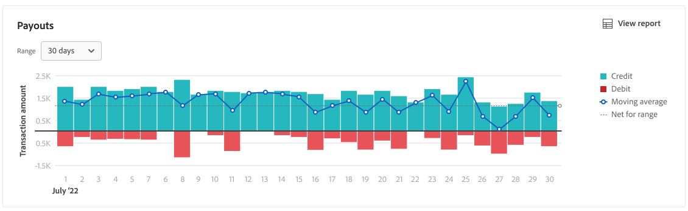
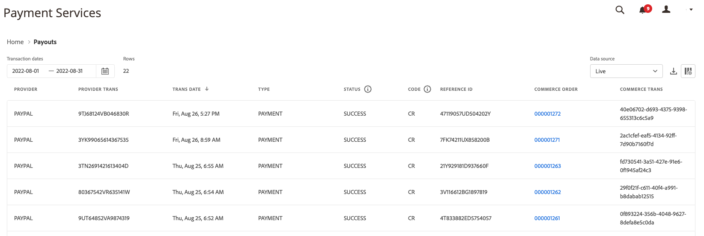

# Payouts Report

[!DNL Payment Services] for [!DNL Adobe Commerce] and [!DNL Magento Open Source] offers you comprehensive reporting so that you can get a clear view of your store's transactions, orders, and payments.

There are two available Payouts reporting views to enable you to see in-depth information about all of your payouts:

* **[Payouts data visualization view](#payouts-data-visualization-view)**---Chart available on the Payment Services Home that is a visual representation of aggregated amounts per day from the Payouts report view
* **[Payouts report view](#payouts-report-view)**---Report available in Payouts that shows detailed payout information for all transactions

The Payouts views show comprehensive payout information at-a-glance, allowing you full transparency into the payment amount, processed volume, and detailed reporting on the transaction level for financial reconciliation.

You can [download payout transactions](#download-transactions) in a .csv file format for use in existing accounting or order management software.

>[!NOTE]
>
>Payouts reports only show orders that are captured (payment action is set to [`Authorize and Capture`](https://experienceleague.adobe.com/docs/commerce-merchant-services/payment-services/get-started/production.html#set-payment-services-as-payment-method))---or [marked as `Invoiced`](https://experienceleague.adobe.com/en/docs/commerce-admin/stores-sales/order-management/invoices#create-an-invoice).

## Payouts data visualization view

The Payouts data visualization view is available in the Payment Services Home. It is a visual representation of the aggregated amounts per day from the detailed tabular [Payouts report view](#payouts-report-view).

On the _Admin_ sidebar, go to **[!UICONTROL Sales]** > **[!UICONTROL Payment Services]** to see the data visualization chart of credits vs. debits and the moving averages over time.

{width="800" zoomable="yes"}

Click **[!UICONTROL View Report]** to navigate to the detailed tabular [Payouts report view](#payouts-report-view).

### Customize transactions timeframe

By default, 30 days of transactions are shown.

From the Payouts data visualization view, you can customize the timeframe for the payout transactions you want to view by selecting a date range:

1. On the _Admin_ sidebar, go to **[!UICONTROL Sales]** > **[!UICONTROL Payment Services]**. The Payouts data visualization view is visible in the Payouts section.
1. Click the **[!UICONTROL Range]** selector filter.
1. Choose the applicable date range---30 days, 15 days, or 7 days.
1. View the transactions info for your specified dates.

### Transactions information

The transaction amounts for a selected date range are shown on the left of the Payouts data visualization view. The dates for the selected date range are shown on the bottom of the view. If there were no payouts on a particular date, that date will not be appear.

The Payouts data visualization view includes the following information.

| Data | Description |
| ------------ | -------------------- |
| [!UICONTROL Transaction amount] | Amount range for transactions in specified time frame; data on the Y axis (left) |
| Date range | Date range for the specified time frame; data on the X axis (bottom) |
| Credit | Payments for the specified time frame |
| Debit | Debits (refunds) for the specified time frame |
| Moving average | Representation of the average payout for each date in the specified time frame |
| Net for range | Net payout amount for the specified time frame (range) |

## Payouts report view

The Payouts report view is available in the Payouts view of Payment Services. It includes all available information about payouts for your store(s).

On the _Admin_ sidebar, go to **[!UICONTROL Sales]** > **[!UICONTROL Payment Services]** > _[!UICONTROL Payouts]_ > **[!UICONTROL View Report]** to see the detailed tabular Payouts report view.

{width="800" zoomable="yes"}

You can configure this view, per the sections in this topic, to best present the data you desire to see.

See linked Commerce order and transaction IDs, transaction amounts, payment method per transaction, and more, all within this report.

You can [download payout transactions](#download-transactions) in a .csv file format for use in existing accounting or order management software.

>[!NOTE]
>
>The data shown in this table is sorted in descending order (`DESC`) by default using the `TRANS DATE`. The `TRANS DATE` is the date and time when the transaction was initiated.

### Select data source

In the Payouts report view, you can select the data source---**[!UICONTROL Live]** or **[!UICONTROL Sandbox]**---for which you want to see report results.

{width="300" zoomable="yes"}

If _[!UICONTROL Live]_ is the selected data source, you can see report information for stores in production mode. If _[!UICONTROL Sandbox]_ is the selected data source, you can see report information stores in sandbox mode.

Data source selections work as follows:

* If you do not have any stores that are in Live mode, the data source selection defaults to _[!UICONTROL Sandbox]_.
* If you have any stores (one or multiple) in Live mode, the data source selection defaults to _[!UICONTROL Live]_.
* Report exports always honor the data source selection.

To select the data source for your Order Payment Status report:

1. On the _Admin_ sidebar, go to **[!UICONTROL Sales]** > **[!UICONTROL Payment Services]** > _[!UICONTROL Payouts]_ > **[!UICONTROL View Report]**.
1. Click **[!UICONTROL Data source]** and select **[!UICONTROL Live]** or **[!UICONTROL Sandbox]**.

   The report results regenerate based on the data source selected.

### View transactions

By default, 30 days of transactions are shown.

The number of rows returned in a search, or shown in the default 30 days of transactions, are shown above the Payouts view grid alongside the Transaction dates calendar selector filter.

Scroll to the left and right to view [information for each payout transaction](#column-descriptions) in the daily report, including transaction date, reference ID, invoice number, and payment method details.

#### Customize transactions timeframe

From the Payouts report view, you can customize the timeframe for the payout transactions you want to view by entering specific dates or selecting a date range from the date picker:

1. On the _Admin_ sidebar, go to **[!UICONTROL Sales]** > **[!UICONTROL Payment Services]** > _[!UICONTROL Payouts]_ > **[!UICONTROL View Report]**.
1. Click the _[!UICONTROL Transaction dates]_ calendar selector filter.
1. Choose the applicable date range.
1. View the payouts statuses in the grid for your specified dates.

### Show and hide columns

The Payouts report view shows most available columns of information by default. You can, however, customize which columns you see in the report.

1. On the _Admin_ sidebar, go to **[!UICONTROL Sales]** > **[!UICONTROL [!DNL Payment Services]]** > _[!UICONTROL Payouts]_ > **[!UICONTROL View Report]**.
1. Click the _Column settings_ icon ({width="20" zoomable="yes"}).
1. To customize which columns you see in the report, check or uncheck columns in the list.

   The Payouts report view will immediately show any changes you made in the Column settings menu. The column preferences will be saved and will remain in effect if you navigate away from the report view.

### Download transactions

You can download a .csv file containing all the transactions visible in the Payouts view grid.

1. On the _Admin_ sidebar, go to **[!UICONTROL Sales]** > **[!UICONTROL Payment Services]** > _[!UICONTROL Payouts]_ > **[!UICONTROL View Report]**.
1. [Customize the date range timeframe for your transactions](#customize-transactions-timeframe).
1. Click the _Download_ ({width="20" zoomable="yes"}) icon.

Your payout transactions are downloaded in a .csv format.

### Column descriptions

Payout reports include the following information.

| Column | Description |
| ------------ | -------------------- |
| [!UICONTROL Provider] | Payment provider |
| [!UICONTROL Provider trans] | Transaction ID |
| [!UICONTROL Trans date] | Date and time transaction was initiated |
| [!UICONTROL Type] | Transaction type---*[!UICONTROL PAYMENT]*, *[!UICONTROL BONUS]*, *[!UICONTROL CHARGEBACK]*, *[!UICONTROL CORRECTION]*, *[!UICONTROL CURRENCY_CONVERSATION]*, *[!UICONTROL DEPOSIT]*, *[!UICONTROL DISBURSEMENT]*, *[!UICONTROL DISPUTE]*, *[!UICONTROL FEES]*, *[!UICONTROL HOLD]*, *[!UICONTROL HOLD_RELEASE]*, *[!UICONTROL INCENTIVES]*, *[!UICONTROL OTHERS]*, *[!UICONTROL RECOUP]*, *[!UICONTROL REFUND]*, *[!UICONTROL REVERSAL]*, *[!UICONTROL WITHDRAWAL]*    See [Transaction types](#transaction-types) for more information. |
| [!UICONTROL Status] | Current status of the transaction---*[!UICONTROL SUCCESS]*, *[!UICONTROL DENIED]*, *[!UICONTROL PENDING]* |
| [!UICONTROL Code] | Transaction code that indicates either Credit (*CR*) or Debit (*DR*) |
| [!UICONTROL Reference ID] | Original transaction ID for which this event is related |
| [!UICONTROL Invoice] | Invoice ID (one per order) of the transaction |
| [!UICONTROL Commerce order] | Commerce order ID    To see related [order info](https://experienceleague.adobe.com/en/docs/commerce-admin/stores-sales/order-management/orders/orders), click the ID. |
| [!UICONTROL Commerce trans] | Commerce transaction ID |
| [!UICONTROL Pay method] | Credit card type---*[!UICONTROL BANK]*, *[!UICONTROL PAYPAL]*, *[!UICONTROL CREDIT_CARD]*---and associated card provider (such as *Visa* or *MasterCard*) |
| [!UICONTROL TRANS AMT] | Amount of the transaction |
| [!UICONTROL CUR] | Currency unit for transaction amount |
| [!UICONTROL PENDING] | Amount yet to be disbursed |
| [!UICONTROL CUR] | Currency unit for the pending amount |
| [!UICONTROL SELLER AMT] | Amount of funds transferred to or from a customer    Funds moving out of the seller account show a dash (-) prefix. |
| [!UICONTROL CUR] | Currency unit for the seller amount |
| [!UICONTROL PARTNER FEE] | Partner fees associated with the transaction    Funds moving out of the partner fee account show a dash (-) prefix. |
| [!UICONTROL CUR] | Currency unit for the partner fee |
| [!UICONTROL PROV FEES] | Fees associated with the transaction    Funds moving out of the provider's fee account show a dash (-) prefix. |
| [!UICONTROL CUR] | Currency unit for the provider fee |
| [!UICONTROL FEE %] | Percentage of the transaction amount charged as a fee |
| [!UICONTROL FIXED FEE] | Fixed provider fee amount |
| [!UICONTROL CHBK FEE] | Chargeback fee associated with the transaction    A dash (-) prefix indicates that the chargeback fee was reversed. |
| [!UICONTROL CUR] | Currency unit for the chargeback fee |
| [!UICONTROL HOLD AMT] | Amount put on hold or released from hold    A dash (-) prefix indicates that on-hold funds are being released. |
| [!UICONTROL CUR] | Currency unit for the hold amount |
| [!UICONTROL RECOUP AMT] | Amount recouped from the recoup account    Funds moving out of the recoup account show a dash (-) prefix. |
| [!UICONTROL CUR] | Currency unit for the recoup amount |

### Transaction types

These transaction types may be noted in the payout transactions.

| Report | Description |
| ------------ | -------------------- |
| [!UICONTROL PAYMENT] | Money moved between a buyer and a seller for an order |
| [!UICONTROL AUTH] | Authorization and authorization void transactions |
| [!UICONTROL BONUS] | -- |
| [!UICONTROL CHARGEBACK] | Chargeback fee and chargeback fee reversal transactions |
| [!UICONTROL CORRECTION] | -- |
| [!UICONTROL CURRENCY_CONVERSION] | -- |
| [!UICONTROL DEPOSIT] | -- |
| [!UICONTROL DISBURSEMENT] | -- |
| [!UICONTROL DISPUTE] | -- |
| [!UICONTROL FEES] | Partner fees, payment fees, and fee reversal transactions |
| [!UICONTROL HOLD] | -- |
| [!UICONTROL HOLD_RELEASE] | -- |
| [!UICONTROL INCENTIVES] | -- |
| [!UICONTROL OTHERS] | -- |
| [!UICONTROL RECOUP] | Recoups from bank or loss accounts |
| [!UICONTROL REFUND] | -- |
| [!UICONTROL REVERSAL] | -- |
| [!UICONTROL WITHDRAWAL] | -- |
