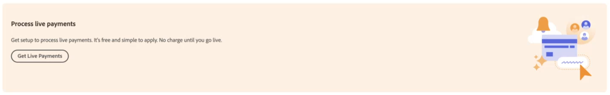

# Enable [!DNL Payment Services] for Production

You can put the service into production and complete the [onboarding process](onboard.md), per the steps in this topic, after you:

* [Install](install.md) the Payment Services extension
* [Configure and connect](connect.md) your instance
* [Set up](sandbox.md) and [test](test-validate.md) your sandbox

## Set [!DNL Payment Services] as payment method

After you [configure your Commerce Services](connect.md#configure-commerce-services) and enable either [sandbox testing](sandbox.md#enable-sandbox-testing) or [live payments](#enable-live-payments), you must set [!DNL Payment Services] as your payment method.

1. On the _Admin_ sidebar, go to **[!UICONTROL Sales]** > **[!UICONTROL Payment Services]**.
1. Click **[!UICONTROL Enable Payment Services]**.

   This option is visible if you have not yet configured [!DNL Payment Services] as the payment method for one or more of your websites.

   You are directed to the settings area in the Home view with the relevant options expanded (**[!UICONTROL Sales]** > **[!UICONTROL Payment Services]** > _[!UICONTROL Settings]_), where you can enable the [!DNL Payment Services] options as your [payment method](https://experienceleague.adobe.com/en/docs/commerce-admin/config/sales/payment-methods/payment-methods){target="_blank"}.

1. In _[!UICONTROL General Configuration]_, set **[!UICONTROL Enable]** to `Yes`.
1. Set **[!UICONTROL Payment Action]**, for both _[!UICONTROL Credit Card Fields]_ and _[!UICONTROL PayPal payment buttons]_, to one of the following:

   |Setting|Description|
   |---|---|
   | `Authorize`  |  Approves the purchase and puts a hold on the funds. The amount is not withdrawn until it is "captured" by the merchant. |
   | `Authorize and Capture`  | Approves the purchase and the merchant "captures" the funds. |

   >[!IMPORTANT]
   >
   >[!DNL Payment Services] supports partial captures. A merchant can partially capture (invoice) parts of an order. For example, you could capture each item individually, or one item now and the rest later.

1. Click **[!UICONTROL Save]**.
1. Click **[!UICONTROL Go to Payment Services]** to be directed back to the [!DNL Payment Services] Home.
1. [Clear your cache](https://experienceleague.adobe.com/docs/commerce-admin/systems/tools/cache-management.html).

   Clearing should be done after every configuration change.

See [Configure Payment Services](settings.md) for more information about configuring Credit Card Fields and PayPal payment buttons.

## Complete merchant onboarding

The next step in enabling your stores to go live with Payment Services is to complete live onboarding.

Payment Services provides [**Advanced** (fully supported) and **Standard** (Express Checkout) payment options](../payment-services/payments-options.md#standard-vs-advanced-payments-experience) and onboarding flows, depending on the country in which you operate and your preferred payment experience.

1. On the _Admin_ sidebar, go to **[!UICONTROL Sales]** > **[!UICONTROL Payment Services]**.
1. Click **[!UICONTROL Live onboarding]**.

   This option is visible if you have not yet completed live onboarding for [!DNL Payment Services].

1. In the _Select your country_ modal, select the country from which you are operating.

   Payment Services provides full support for all payment options in [five countries](../payment-services/overview.md#availability) currently. Payment Services provides Express Checkout capabilities (a subset of payment options) for all other countries represented in the country list.
   
   The country you choose from the list will determine the payment options, and onboarding flow---[Advanced](#advanced-onboarding) (fully supported) or [Standard](#standard-onboarding) (Express Checkout)---available to you.

>[!TIP]
>
> Once you choose and proceed with an onboarding option---Standard or Advanced---you must re-complete onboarding to either upgrade or downgrade from your initial selection.

### Advanced onboarding

This onboarding flow is available for merchants in [fully supported countries](../payment-services/overview.md#availability).

After the country is selected:

1. In the modal that appears, select **Advanced**.

   For the **Standard** option, proceed to the [Standard onboarding flow](#standard-onboarding).

1. Click **Continue**.
1. Continue with the PayPal flow for the fully supported Advanced onboarding, using your PayPal account credentials (not your sandbox account credentials) _or_ sign up for a new PayPal account.

>[!IMPORTANT]
>
>**Advanced onboarding** requires merchants to [request payments entitlement](#request-payments-entitlement-from-adobe) to enable live onboarding.

### Standard onboarding

This Standard onboarding flow is available for merchants in available countries for which [only Express Checkout support](../payment-services/overview.md#availability) is provided.

After the country is selected:

1. In the _Payment Services agreement_ modal that appears, click the **Payment Services agreement** link to view the Adobe Commerce Payment Services agreement.
1. In the _Payment Services agreement_ modal, click **I accept**.
1. Continue with the PayPal flow for Express Checkout onboarding, using your PayPal account credentials (not your sandbox account credentials) or sign up for a new PayPal account.

>[!IMPORTANT]
>
>[Apple Pay and credit card fields](../payment-services/payments-options.md) are not available for **Standard onboarding**.

## Confirm email address

1. On the Admin sidebar, go to **[!UICONTROL Sales]** > **[!UICONTROL Payment Services]**

   The _[!UICONTROL Live onboarding]_ button is no longer visible and you see a "[!UICONTROL Live payments pending]" text box.

   In that text box, you may also be asked to confirm your email address with PayPal to complete onboarding.

1. If you are prompted to confirm your email address, check your email for the confirmation message sent from PayPal and click to confirm your email address.
1. On the Admin sidebar, go to **[!UICONTROL Sales]** > **[!UICONTROL Payment Services]**.
1. Refresh your browser window.

   When your PayPal merchant onboarding is approved, you should see a notification stating that your payment system is in sandbox mode and is not processing live payments.

   >[!IMPORTANT]
   >
   >If you revoke consent to [!DNL Payment Services] for [!DNL Adobe Commerce] and [!DNL Magento Open Source] for processing your payments (in your PayPal account settings), orders in your store cannot be processed by [!DNL Payment Services]. On your Payment Services Home, an alert about the revoked consent appears.

## Request payments entitlement from Adobe

To enable your stores to go live, request payments entitlement from Adobe (for [Advanced onboarding only](#advanced-onboarding)):

1. On the _Admin_ sidebar, go to **[!UICONTROL Sales]** > **[!UICONTROL Payment Services]**.
1. Click **[!UICONTROL Get Live Payments]** in your [!DNL Payment Services] Home.

   {width="500" zoomable="yes"}

1. Complete the form.
1. A member of the sales team will contact you.

Alternatively, you can request payments entitlement from Adobe at [business.adobe.com](https://business.adobe.com/resources/payment-services.html).

>[!IMPORTANT]
>
>**Live onboarding** is not accessible until payments entitlement has been approved.

## Configure pricing tier

Get your [!DNL Payment Services] _Merchant ID_:

1. On the _Admin_ sidebar, go to **[!UICONTROL Sales]** > **[!UICONTROL Payment Services]**.
1. In the Home view, click **[!UICONTROL Settings]**. See [Home](payments-home.md) for more information.
1. Select the required _Merchant ID_ and submit it to your Sales representative, who will configure the correct pricing tier.

See [Level 2 and level 3 processing](levels-card-payment-transactions.md) for more information on payment transactions.

## Enable live payments

A _production merchant ID_ is auto-generated and populated in the [configuration](configure-admin.md). Do not change or alter this ID.

Enable live payments:

1. On the _Admin_ sidebar, go to **[!UICONTROL Sales]** > **[!UICONTROL Payment Services]**.
1. On the Home, click **[!UICONTROL Settings]** at the top right of the page. See [Home](payments-home.md) for more information.
1. In the _[!UICONTROL General Configuration]_ section set **[!UICONTROL Payment mode]** to `Production`.
1. Click **[!UICONTROL Save]**.
1. [Clear your cache](https://experienceleague.adobe.com/en/docs/commerce-admin/systems/tools/cache-management){target="_blank"}.

   >[!IMPORTANT]
   >
   >If you do not clear your cache, customers cannot see PayPal payment options during checkout.

If you navigate back to [!DNL Payment Services] Home, the Sandbox payment mode message no longer appears because you are now processing live payments.

See [Configure in the Admin](configure-admin.md) for legacy configuration options.

>[!IMPORTANT]
>
>If you revoke consent to [!DNL Payment Services] for processing your payments (in your PayPal account settings), orders in your store cannot be processed by [!DNL Payment Services]. If you want to re-enable payment processing, you must complete onboarding again. On your Payment Services Home, an alert about the revoked consent appears.

## Test in production

It is highly recommended that you test Payments in production, with real credit cards and banks, before exposing this functionality to shoppers.

See [Test and validate](test-validate.md) for more information.
