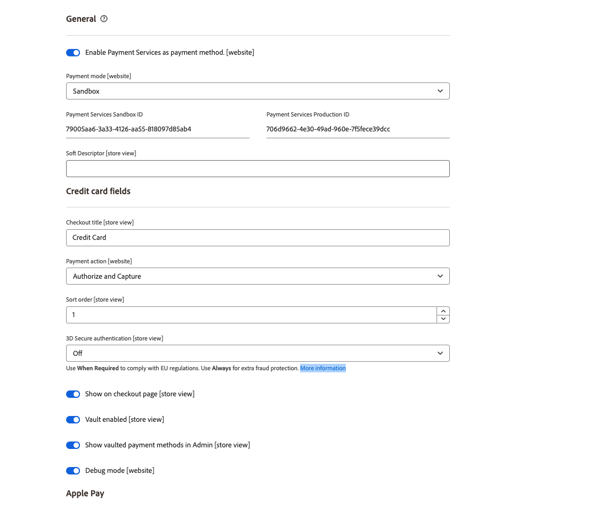
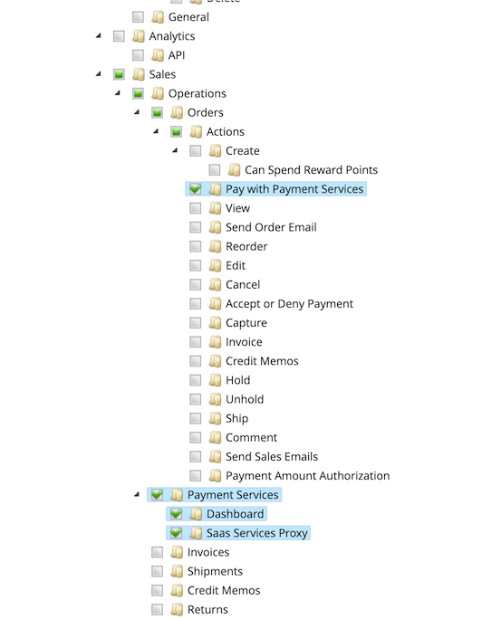

# Settings

You can customize [!DNL Payment Services] to your needs with helpful settings in the [!DNL Payment Services] Home.

To configure [!DNL Payment Services] for [!DNL Adobe Commerce] and [!DNL Magento Open Source] click **[!UICONTROL Settings]**. These configuration options apply only to the environment that is set in the _[!UICONTROL Payment mode]_ field of the [_General_ configuration options](#configure-general-settings).

For multi-store or legacy configuration see [Configure in the Admin](configure-admin.md).

## Configure General settings

The [!UICONTROL General] settings provide the ability to enable or disable Payment Services as your payment method and add information to customer transactions to mark or prefix a website or store view with custom information.

### Enable Payment Services

You can enable [!DNL Payment Services] for your website, and enable either sandbox testing or live payments.

1. On the _Admin_ sidebar, go to **[!UICONTROL Sales]** > **[!UICONTROL Payment Services]**.

1. Click **[!UICONTROL Settings]**. See [Introduction to [!DNL Payment Services] Home](payments-home.md) for more information.

   {width="500" zoomable="yes"}

   The _[!UICONTROL General]_ section includes settings used to enable [!DNL Payment Services] as the payment method.

1. To enable [!DNL Payment Services] as the payment method for your store, in the _[!UICONTROL General]_ section, toggle **[!UICONTROL Enable Payment Services as payment method]** to `Yes`.

1. If you are still testing [!DNL Payment Services] for your store, set **Payment mode** to `Sandbox`. If you are ready to enable live payments, set it to `Production`.

1. Your **[!UICONTROL Payment Services Sandbox ID]** and **[!UICONTROL Payment Services Production ID]** values are automatically populated once you setup the [Commerce Services Connector](https://experienceleague.adobe.com/en/docs/commerce-merchant-services/user-guides/integration-services/saas){target=_blank} and visit the [!DNL Payment Services] dashboard for the first time. Do this to finish the onboarding for your sandbox and/or production environments. These values associate your SaaS ID to [!DNL Payment Services].

    >[!WARNING]
    >
    > If you reset your [!DNL Payment Services] IDs, you must onboard again.

1. Click **[!UICONTROL Save]**.

   If you try to navigate away from this view without saving your changes, a modal appears that prompts you to discard changes, keep editing, or save changes.

1. Navigate to **[!UICONTROL System]** > **[!UICONTROL Cache Management]** and click **[!UICONTROL Flush Cache]** to refresh all invalid caches.

You can now proceed to changing the default settings for [payment options](#configure-payment-options) functions and storefront display.

### Add soft descriptor

You can add a [!UICONTROL Soft Descriptor] to your website(s) or individual store view(s) configuration. Soft descriptors show on customer transaction bank statements. If you have multiple stores/brands/catalogs, for instance, you can easily delineate between those by adding custom text to the [!UICONTROL Soft Descriptor] field.

1. On the _Admin_ sidebar, go to **[!UICONTROL Sales]** > **[!UICONTROL Payment Services]**.
1. Click **[!UICONTROL Settings]**. See [Introduction to [!DNL Payment Services] Home](payments-home.md) for more information.
1. Select the website or store view, in the **[!UICONTROL Scope]** dropdown menu, for which you want to create a soft descriptor. For initial setup, leave this as **[!UICONTROL Default]** to set the default value.
1. Add your custom text (up to 22 characters) in the text field, replacing `Soft descriptor`.
1. Click **[!UICONTROL Save]**.
1. To create a soft descriptor other than the configured default for a website or store view:
   1. Select the website or store view, in the **[!UICONTROL Scope]** dropdown menu, for which you want to create a soft descriptor.
   1. Toggle _off_ **[!UICONTROL Use website]** (or **[!UICONTROL Use default]**, dependant on which scope you selected).
   1. Add your custom text in the text field.
   1. Click **[!UICONTROL Save]**.
1. To enable for a website or store view the default soft descriptor _or_ the soft descriptor used for the parent website:
   1. Select the website or store view, in the **[!UICONTROL Scope]** dropdown menu, for which you want to enable an existing soft descriptor.
   1. Toggle _on_ **[!UICONTROL Use website]** (or **[!UICONTROL Use default]**, depending on the scope you selected).
   1. Click **[!UICONTROL Save]**.

   If you try to navigate away from this view without saving your changes, a modal appears that prompts you to discard changes, keep editing, or save changes.

### Configuration options

| Field | Scope | Description |
|---|---|---|
| [!UICONTROL Enable] | website | Enable or disable [!DNL Payment Services] for your website. Options: [!UICONTROL Off] / [!UICONTROL On] |
| [!UICONTROL Payment mode] | store view | Set the method, or environment, for your store. Options: [!UICONTROL Sandbox] / [!UICONTROL Production] |
| [!UICONTROL Payment Services Sandbox ID] | store view | Your sandbox merchant ID, which is auto-generated during sandbox onboarding. |
| [!UICONTROL Payment Services Production ID] | store view | Your production merchant ID, which is auto-generated during production (live) onboarding. |
| [!UICONTROL Soft Descriptor] | website or store view | Add a soft descriptor to your website(s) and store view(s) to add information to customer transactions which delineate brands, stores, or product lines. The [!UICONTROL Use website] toggle applies any soft descriptor added at the website level. The [!UICONTROL Use default] toggle applies any soft descriptor added as the default.|

## Configure payment options

Now that you have enabled [!UICONTROL Payment Services] for your website, you can change the default settings for payment functions and storefront display.

1. On the _Admin_ sidebar, go to **[!UICONTROL Sales]** > **[!UICONTROL Payment Services]**.
1. Click **[!UICONTROL Settings]**. See [Introduction to [!DNL Payment Services] Home](payments-home.md) for more information.
1. Configure payment options for [credit cards](#credit-card-fields), [payment buttons](#payment-buttons), and [button style](#button-style), per the following sections.

### Credit card fields

The _[!UICONTROL Credit Card Fields]_ settings provide a simple and secure checkout option for credit card or debit card payment methods.

See [Payments options](payments-options.md#credit-card-fields) for more information.

1. On the _Admin_ sidebar, go to **[!UICONTROL Sales]** > **[!UICONTROL Payment Services]**.
1. Select the store view, in the **[!UICONTROL Scope]** dropdown menu, for which you want to enable a payment method.
1. In the **[!UICONTROL Credit card fields]** section, edit the value in the **[!UICONTROL Checkout title]** field to change the name of the payment method displayed during checkout.
1. To [set the payment action](production.md#set-payment-services-as-payment-method), toggle **[!UICONTROL Payment action]** to `Authorize` or `Authorize and Capture`.
1. To prioritize a payment method on the checkout page, provide a `Numeric Only` value in the **[!UICONTROL Sort order]** field.
1. To enable [3DS Secure authentication](security.md#3ds) (`Off` by default) toggle the **[!UICONTROL 3DS Secure authentication]** selector to `Always` or `When required`.
1. To enable or disable credit card fields on the checkout page, toggle the **[!UICONTROL Show on checkout page]** selector.
1. To enable or disable [card vaulting](#card-vaulting), toggle the **[!UICONTROL Vault enabled]** selector.
1. To enable or disable [vaulted payment methods in the Admin](#card-vaulting) (for merchants to complete orders for customers in the Admin using their vaulted payment method), toggle the **[!UICONTROL Show vaulted methods in Admin]** selector.
1. To enable or disable debug mode, toggle the **[!UICONTROL Debug Mode]** selector.
1. Click **[!UICONTROL Save]**.

   If you try to navigate away from this view without saving your changes, a modal appears that prompts you to discard changes, keep editing, or save changes.

1. [Flush the cache](#flush-the-cache).

#### Configuration options

| Field | Scope | Description |
|---|---|---|
| [!UICONTROL Title] | store view | Add the text for display as the title for this payment option in the Payment Method view during checkout. Options: [!UICONTROL text field] |
| [!UICONTROL Payment Action] | website | The [payment action](https://experienceleague.adobe.com/en/docs/commerce-admin/config/sales/payment-methods/payment-methods#payment-actions){target="_blank"} for the specified payment method. Options: [!UICONTROL Authorize] / [!UICONTROL Authorize and Capture] |
| [!UICONTROL Sort order] | store view | The sorting order for the specified payment method on the checkout page. `Numeric Only` value |
| [!UICONTROL 3DS Secure authentication] | website | Enable or disable [3DS Secure authentication](security.md#3ds). Options: [!UICONTROL Always] / [!UICONTROL When Required] / [!UICONTROL Off] |
| [!UICONTROL Show on checkout page] | website | Enable or disable credit card fields to show on checkout page. Options: [!UICONTROL Off] / [!UICONTROL On] |
| [!UICONTROL Vault enabled] | store view | Enable or disable [credit card vaulting](vaulting.md). Options: [!UICONTROL Off] / [!UICONTROL On] |
| [!UICONTROL Show vaulted payment methods in Admin] | store view | Enable or disable ability for merchant to complete orders for customers in the Admin [using a vaulted payment method](vaulting.md). Options: [!UICONTROL Off] / [!UICONTROL On] |
| [!UICONTROL Debug Mode] | website | Enable or disable Debug Mode. Options: [!UICONTROL Off] / [!UICONTROL On] |

### Apple Pay

The [!UICONTROL Apple Pay] button payment option allows you to provide an [!UICONTROL Apple Pay] payment button in your store's checkout from the Safari browser (for up to 99 domains per merchant account).

You can only use Apple Pay if you complete [Apple Pay self-registration via Paypal](https://developer.paypal.com/docs/checkout/apm/apple-pay/#register-your-live-domain) and then [configure Apple Pay](settings.md/#payment-buttons) for your stores. See [Payments options](payments-options.md#apple-pay-button) for more information.

You can enable and configure the [!UICONTROL Apple Pay] button payment option:

1. On the _Admin_ sidebar, go to **[!UICONTROL Sales]** > **[!UICONTROL Payment Services]**.
1. Select the store view, in the **[!UICONTROL Scope]** dropdown menu, for which you want to enable a payment method.
1. In the **[!UICONTROL Apple Pay]** section, edit the value in the _[!UICONTROL Checkout title]_ field to change the name of the payment method displayed during checkout.
1. To [set the payment action](production.md#set-payment-services-as-payment-method), toggle **[!UICONTROL Payment action]** to `Authorize` or `Authorize and Capture`.
1. To enable or disable Apple Pay on the checkout page, toggle the **[!UICONTROL Show Apple Pay on checkout page]** selector.
1. To enable or disable Apple Pay on the product detail page, toggle the **[!UICONTROL Show Apple Pay on product detail page]** selector.
1. To enable or disable Apple Pay on the mini cart preview, toggle the **[!UICONTROL Show Apple Pay on the mini cart preview]** selector.
1. To enable or disable Apple Pay on the cart page, toggle the **[!UICONTROL Show Apple Pay on cart page]** selector.
1. To enable or disable debug mode, toggle the **[!UICONTROL Debug Mode]** selector.
1. Click **[!UICONTROL Save]**.

   If you try to navigate away from this view without saving your changes, a modal appears that prompts you to discard changes, keep editing, or save changes.

1. [Flush the cache](#flush-the-cache).

#### Configuration options

| Field | Scope | Description |
|---|---|---|
| [!UICONTROL Checkout title] | store view | Add the text for display as the title for this payment option in the Payment Method view during checkout. Options: [!UICONTROL text field] |
| [!UICONTROL Payment Action] | website | The [payment action](https://experienceleague.adobe.com/en/docs/commerce-admin/config/sales/payment-methods/payment-methods#payment-actions) for the specified payment method. Options: [!UICONTROL Authorize] / [!UICONTROL Authorize and Capture] |
| [!UICONTROL Show on checkout page] | website | Enable or disable the Apple Pay button to show on checkout page. Options: [!UICONTROL Off] / [!UICONTROL On] |
| [!UICONTROL Show on checkout page] | website | Enable or disable the Apple Pay button to show on product detail page. Options: [!UICONTROL Off] / [!UICONTROL On] |
| [!UICONTROL Show on mini cart preview] | website | Enable or disable the Apple Pay button to show on mini cart preview. Options: [!UICONTROL Off] / [!UICONTROL On] |
| [!UICONTROL Show on cart page] | website | Enable or disable the Apple Pay button to show on cart page. Options: [!UICONTROL Off] / [!UICONTROL On] |
| [!UICONTROL Debug Mode] | website | Enable or disable Debug Mode. Options: [!UICONTROL Off] / [!UICONTROL On] |

### Payment buttons

The [!DNL PayPal payment buttons] payment options provide a simple, fast, and secure checkout process for your customer. See [Payments options](payments-options.md#paypal-smart-buttons) for more information.

You can enable and configure the PayPal payment buttons payment options:

1. Select the store view, in the **[!UICONTROL Scope]** dropdown menu, for which you want to enable a payment method.
1. To change the name of the payment method as shown during checkout, edit the value in the **[!UICONTROL Checkout Title]** field.
1. To [set the payment action](production.md#set-payment-services-as-payment-method), toggle **[!UICONTROL Payment action]** to `Authorize` or `Authorize and Capture`.
1. To prioritize a payment method on the checkout page, provide a `Numeric Only` value in the **[!UICONTROL Sort order]** field.
1. Use the toggle selectors to enable or disable [!DNL PayPal smart button] display features:

   - **[!UICONTROL Show PayPal buttons on product checkout page]**
   - **[!UICONTROL Show PayPal buttons on product detail page]**
   - **[!UICONTROL Show PayPal buttons in mini-cart preview]**
   - **[!UICONTROL Show PayPal buttons on cart page]**
   - **[!UICONTROL Show PayPal Pay Later button]**
   - **[!UICONTROL Show PayPal Pay Later message]**
   - **[!UICONTROL Show Venmo button]**
   - **[!UICONTROL Show Apple Pay button]**
   - **[!UICONTROL Show PayPal Credit and Debit Card button]**

      >[!NOTE]
      >
      > To use Apple Pay you [must have an Apple sandbox tester account](https://developer.apple.com/apple-pay/sandbox-testing/#create-a-sandbox-tester-account) (complete with fake credit card and billing information) to test it. When you are ready to use Apple Pay in sandbox _or_ production mode, after completing any [testing and validation](test-validate.md#test-in-sandbox-environment), complete [self-registration with [!DNL Apple Pay]](https://developer.paypal.com/docs/checkout/apm/apple-pay/#register-your-live-domain) (_Register your live domain_ section only) and [configure it for your stores in [!DNL Payment Services]](settings.md#payment-buttons).

      As you toggle on/off visibility to payment buttons or the PayPal Pay Later message, a visual preview of that configuration shows at the bottom of the Settings page.

1. To enable debug mode, toggle the **[!UICONTROL Debug Mode]** selector.  
1. Click **[!UICONTROL Save]**.

   If you try to navigate away from this view without saving your changes, a modal appears that prompts you to discard changes, keep editing, or save changes.

1. [Flush the cache](#flush-the-cache).

#### Configuration options

| Field | Scope | Description |
|---|---|---|
| [!UICONTROL Title] | store view | Add the text to be displayed as the title for this payment option in the Payment Method view during checkout. Options: text field |
| [!UICONTROL Payment Action] | website | The [payment action](https://experienceleague.adobe.com/en/docs/commerce-admin/config/sales/payment-methods/payment-methods#payment-actions){target="_blank"} for the specified payment method. Options: [!UICONTROL Authorize] / [!UICONTROL Authorize and Capture] |
| [!UICONTROL Sort order] | store view | The sorting order for the specified payment method on the checkout page. `Numeric Only` value |
| [!UICONTROL Show PayPal buttons on checkout page] | store view | Enable or disable [!DNL PayPal payment buttons] on the checkout page. Options: [!UICONTROL  Yes] / [!UICONTROL No] |
| [!UICONTROL Show PayPal buttons on product detail page] | store view | Enable or disable [!DNL PayPal payment buttons] on the product detail page. Options: [!UICONTROL  Yes] / [!UICONTROL No] |
| [!UICONTROL Show PayPal buttons in mini-cart preview] | store view | Enable or disable [!DNL PayPal payment buttons] in the mini-cart preview. Options: [!UICONTROL Off] / [!UICONTROL On] |
| [!UICONTROL Show PayPal buttons on cart page] | store view | Enable or disable [!DNL PayPal payment buttons] on the cart page. Options: [!UICONTROL Off] / [!UICONTROL On] |
| [!UICONTROL Show PayPal Pay Later button] | store view | Enable or disable pay later payment option appearance where payment buttons are displayed. Options: [!UICONTROL Off] / [!UICONTROL On] |
| [!UICONTROL Show PayPal Pay Later Message] | website | Enable or disable the Pay Later messaging in the shopping cart, product page, mini-cart, and during the checkout flow. Options: [!UICONTROL Off] / [!UICONTROL On] |
| [!UICONTROL Show Venmo button] | store view | Enable or disable the Venmo payment option where payment buttons are displayed. Options: [!UICONTROL Off] / [!UICONTROL On] |
| [!UICONTROL Show Apple Pay button] | store view | Enable or disable the Apple Pay payment option where payment buttons are displayed. Options: [!UICONTROL Off] / [!UICONTROL On] |
| [!UICONTROL Show PayPal Credit and Debit card button] | store view | Enable or disable the Credit and Debit card payment option where payment buttons are displayed. Options: [!UICONTROL Off] / [!UICONTROL On] |
| [!UICONTROL Debug Mode] | website | Enable or disable Debug Mode. Options: [!UICONTROL Off] / [!UICONTROL On] |

### Button style

You can also configure the _[!UICONTROL Button style]_ options of the payment buttons:

1. To change the **[!UICONTROL Layout]**, select `Vertical` or `Horizontal`.

   >[!NOTE]
   >
   > If the button style is configured as `Horizontal` and your store is configured to show multiple payment buttons, you may only see two buttons displayed on the product page, checkout page, and mini-cart, and one button displayed in the cart.

1. To enable the tagline in a horizontal layout, toggle the **[!UICONTROL Show tagline]** selector.
1. To modify the **[!UICONTROL Color]**, select the desired color option.
1. To modify the **[!UICONTROL Shape]**, select `Pill` or `Rectangle`.
1. To enable button height selector, toggle the **[!UICONTROL Responsive button height]** selector.
1. To modify the **[!UICONTROL Label]**, select the desired label option.

   As you change configuration options for layout, color, shape, height, and label, a visual preview of that configuration shows at the bottom of the Settings page. In the image below, the **[!UICONTROL Shape]** is set to _Rectangle_ and the **[!UICONTROL Label]** is set to _PayPal (recommended)_.

   ![[!DNL PayPal payment buttons] options](assets/payment-buttons.png){width="400" zoomable="yes"}

1. Click **[!UICONTROL Save]**.

   If you try to navigate away from this view without saving your changes, a modal appears that prompts you to discard changes, keep editing, or save changes.

1. [Flush the cache](#flush-the-cache).

You can configure payment button styling [in the Legacy configuration in the Admin](configure-admin.md#configure-paypal-smart-buttons) or here in [!DNL Payment Services Home]. See [PayPal's Buttons style guide](https://developer.paypal.com/docs/checkout/standard/customize/buttons-style-guide/) for more information about styling PayPal payment buttons.

#### Configuration options

|Field|Scope|Description|
|--- |--- |--- |
|[!UICONTROL Layout]|Store View|Define style of layout for payment buttons. Options: [!UICONTROL Vertical] / [!UICONTROL Horizontal]|
|[!UICONTROL Tagline]|Store View|Enable/disable tagline. Options: [!UICONTROL Off] / [!UICONTROL On]|
|[!UICONTROL Color]|Store View|Define color of the payment buttons. Options: [!UICONTROL Blue] / [!UICONTROL Gold] / [!UICONTROL Silver] / [!UICONTROL White] / [!UICONTROL Black]|
|[!UICONTROL Shape]|Store View|Define shape of the payment buttons. Options: [!UICONTROL Rectangular] / [!UICONTROL Pill]|
|[!UICONTROL Responsive Button Height]|Store View|Defines if payment buttons use a default height. Options: [!UICONTROL Off] / [!UICONTROL On]|
|[!UICONTROL Height]|Store View|Define height of the payment buttons. Default value: none|
|[!UICONTROL Label]|Store View|Define label that appears in the payment buttons. Options: [!UICONTROL PayPal] / [!UICONTROL Checkout] / [!UICONTROL Buynow] / [!UICONTROL Pay] / [!UICONTROL Installment]|

## Configure roles

To ensure that Admin users can create and manage orders in the Commerce Admin, enable [!DNL Payment Services]-specific resources to user roles.

See [User roles](https://experienceleague.adobe.com/docs/commerce-admin/systems/user-accounts/permissions-user-roles.html) to learn how to manage roles.

When assigning resources to the role, you must select:

- **Pay with [!DNL Payment Services]**---This resource ensures that when you create an order in the Admin, [!DNL Payment Services] credit cards are available as a payment method. If you select the **Actions** parent resource, this resource will also be selected.
- **[!DNL Payment Services]**---This resource includes the **Dashboard** and **SaaS Services Proxy** resources, which must also be selected. They ensure that [!DNL Payment Services] appears in the _Sales_ menu.

   {width="400" zoomable="yes"}

## Flush the cache

 If you change the configuration in _Settings_, for example toggling the Apple Pay, Venmo, or PayPal PayLater buttons, manually flush the cache so that your store shows the latest configurations.

 1. On the _Admin_ sidebar, go to **[!UICONTROL System]** > **[!UICONTROL Cache Management]**.
 1. Click **[!UICONTROL Flush Cache]** to refresh all invalid caches.

If any Cache Type in the Cache Management table has an `INVALIDATED` status, your store might not show the most recent configuration for that item. Flush the cache to update your store to show the latest configuration.

To ensure that your store is showing the correct configuration, periodically [flush the cache](https://experienceleague.adobe.com/en/docs/commerce-admin/systems/tools/cache-management).

## Card vaulting

You can enable functionality that allows your customers to vault---or "save"---their credit card information in their My Account to use for future purchases.

You can also use card vaulting in the Admin to complete subsequent orders for existing customers.

Enable or disable card vaulting in the [Credit card field settings](#credit-card-fields).

See [Credit card vaulting](vaulting.md) for more information.

## 3DS

3DS protects customers and merchants from fraudulent activity in their stores, and enables compliance with European Union (EU) standards.

Enable or disable 3DS in the [Credit card field settings](#credit-card-fields).

See [3DS in Security](security.md#3ds) for more information.

## Use multiple PayPal accounts

In [!UICONTROL Payment Services], you can use multiple PayPal accounts within **one** merchant account on the website level. For instance, if you are operating your store(s) in multiple countries (which use different [currencies](https://experienceleague.adobe.com/en/docs/commerce-admin/stores-sales/site-store/currency/currency)) or want to use Adobe Commerce for some parts of your business but not _all_, you can set up your merchant account to use multiple PayPal accounts.

See [Site, Store, and View Scope](https://experienceleague.adobe.com/docs/commerce-admin/start/setup/websites-stores-views.html) for more information about the hierarchy of websites, stores, and store views.

Your Sales representative can create a new [scope](https://experienceleague.adobe.com/docs/commerce-admin/start/setup/websites-stores-views.html#scope-settings) for your merchant account and onboard the additional site with PayPal so that any of the PayPal buttons you configure to appear will show on your site. Contact your Sales representative for assistance with using multiple PayPal accounts for your websites.
