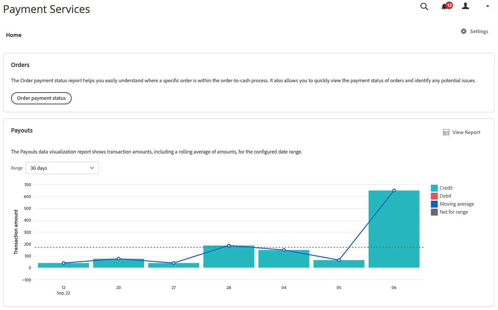

# Transactions Report

[!DNL Payment Services] for [!DNL Adobe Commerce] and [!DNL Magento Open Source] offers you comprehensive reporting so that you can get a clear view of your store's transactions, orders, and payments.

 REPLACE

The Transactions report provides visibility into transaction authorization rates and negative transaction trends so that you can effectively monitor the health of your store and preemptively identify and address any transaction issues.

See individual transactions for orders placed on the storefront and their payment methods, result, payment response codes, and more.

The information provided in the Transactions report is intended only for merchant use. Do not share this info with customers or other potential fraudsters. Transactions information could be used to bypass security checks or place orders that result in chargebacks.

You can download the Transactions report in a .csv file format for use in existing accounting or order management software.

>[!NOTE]
>
>You cannot view financial reports if you have not [onboarded and activated Live mode](production.md#enable-live-payments) for [!DNL Payment Services].

## Transactions report view

The Transactions report view is available in the Transactions view of Payment Services. It includes all available information about transactions for your store(s).

On the _Admin_ sidebar, go to **[!UICONTROL Sales]** > **[!UICONTROL Payment Services]** > _[!UICONTROL Transactions]_ > **[!UICONTROL View Report]** to see the detailed tabular Transactions report view.

{zoomable=yes} REPLACE

You can configure this view, per the sections in this topic, to best present the data you desire to see.

See linked Commerce order and provider transaction IDs, transaction amounts, payment method per transaction, and more, all within this report.

Not all payment methods provide the same granularity of information. For instance, credit card transactions provide response, AVS, and CCV codes in the Transactions report; PayPal Smart buttons do not.

You can [download transactions](#download-transactions) in a .csv file format for use in existing accounting or order management software.

### Select data source

In the Transactions report view, you can select the data source---**[!UICONTROL Live]** or **[!UICONTROL Sandbox]**---for which you want to see report results.

{width="400"}

If _[!UICONTROL Live]_ is the selected data source, you can see report information for your stores that use [!DNL Payment Services] in production mode. If _[!UICONTROL Sandbox]_ is the selected data source, you can see report information for your sandbox mode.

Data source selections work as follows:

* If you do not have any stores that use [!DNL Payment Services] in production mode, the data source selection defaults to _[!UICONTROL Sandbox]_.
* If you have any stores (one or multiple) that use [!DNL Payment Services] in production mode, the data source selection defaults to _[!UICONTROL Live]_.
* Report exports always honor the data source selection.

To select the data source for your [!UICONTROL Transactions] report:

1. On the _Admin_ sidebar, go to **[!UICONTROL Sales]** > **[!UICONTROL [!DNL Payment Services]]** > _[!UICONTROL Transactions]_ > **[!UICONTROL View Report]**.
1. Click **[!UICONTROL Data source]** and select **[!UICONTROL Live]** or **[!UICONTROL Sandbox]**.

   The report results regenerate based on the data source selected.

### Customize dates timeframe

From the Transactions report view, you can customize the timeframe of the transactions you want to view by selecting specific dates. By default, 30 days of transactions are shown in the grid.

1. On the _Admin_ sidebar, go to **[!UICONTROL Sales]** > **[!UICONTROL [!DNL Payment Services]]** > _[!UICONTROL Transactions]_ > **[!UICONTROL View Report]**.
1. Click the **[!UICONTROL Transaction dates]** calendar selector filter.
1. Choose the applicable date range.
1. View the transactions for your specified dates in the grid.

### Filter report info

From the Transactions report view, you can filter the statuses results you want to view by selecting filter criteria.

1. On the _Admin_ sidebar, go to **[!UICONTROL Sales]** > **[!UICONTROL [!DNL Payment Services]]** > _[!UICONTROL Transactions]_ > **[!UICONTROL View Report]**.
1. Click the **[!UICONTROL Filter]** selector.
1. Toggle the _[!UICONTROL Transaction Result]_ options to see report results for only selected order transactions.
1. Toggle the _[!UICONTROL Payment Method]_ options to see report results for only selected payment methods.
1. Enter a _Min Order Amount_ or _Max Order Amount_ to see report results within that order amount range.
1. Enter an _[!UICONTROL Order ID]_ to search for a specific transaction.
1. Click **[!UICONTROL Hide filters]** to hide the filter.

### Show and hide columns

The Transactions report shows all available columns of information by default. You can, however, customize which columns you see in your report.

1. On the _Admin_ sidebar, go to **[!UICONTROL Sales]** > **[!UICONTROL [!DNL Payment Services]]** > _[!UICONTROL Transactions]_ > **[!UICONTROL View Report]**.
1. Click the **[!UICONTROL Column settings]** icon {width="25"}.
1. To customize which columns that you see in the report, check or uncheck columns in the list.

   The Transactions report immediately shows any changes you made in the Column settings menu. The column preferences are saved and remain in effect if you navigate away from the report view.

### Update report data

The Transactions report view shows a _[!UICONTROL Last updated]_ timestamp that shows the last time that the report information was updated. By default, Transactions report data is auto-refreshed every three hours.

You can also manually force a refresh of the report data to see the most up-to-date report information.

1. On the _Admin_ sidebar, go to **[!UICONTROL Sales]** > **[!UICONTROL [!DNL Payment Services]]** > _[!UICONTROL Transactions]_ > **[!UICONTROL View Report]**.
1. Click the _Refresh_ icon ().

   The Transactions report data is refreshed, an *[!UICONTROL Update complete]* confirmation appears, and the latest information is present in the grid.

### Download transactions

You can download a .csv file with all transactions visible in the transactions view grid, whether you are viewing the default 30 days of transactions or a customized timeframe.

1. On the _Admin_ sidebar, go to **[!UICONTROL Sales]** > **[!UICONTROL [!DNL Payment Services]]** > **[!UICONTROL Transactions]**.
1. If you want to see transactions for a timeframe other than the last 30 days, [customize the date range timeframe for your statuses](#customize-dates-timeframe).
1. Click the _Download_ {width="25"} icon.

Your transactions are downloaded in a .csv format.

### Column descriptions

Transactions reports include the following information.

| Column | Description |
| ------------ | -------------------- |
| [!UICONTROL Order ID] | Commerce order ID (contains only values for successful transactions and is empty for rejected transactions)   To see related [order info](https://docs.magento.com/user-guide/sales/orders.html){target="_blank"}, click the ID. |
| [!UICONTROL Provider Transaction ID] | Transaction ID provided by the payment provider; contains only values for successful transactions and contains a dash for rejected transactions. |
| [!UICONTROL Transaction Date] | Transaction date timestamp |
| [!UICONTROL Payment Method] |  Payment method of transaction; available for Payment Services versions 1.6.0 and newer |
| [!UICONTROL Result] | The result of the transaction---*[!UICONTROL OK]* (successful transaction), *[!UICONTROL Rejected by Payment Provider]* (rejected by PayPal), *[!UICONTROL Rejected by Bank]* (rejected by bank that issued card) |
| [!UICONTROL Response Code] | Error code that provides rejection reason from payment provider or bank; see list of possible response codes and descriptions for [`Rejected by Bank` status](https://developer.paypal.com/docs/api/orders/v2/#definition-processor_response) and [`Rejected by Payment Provider` status](https://developer.paypal.com/api/rest/reference/orders/v2/errors/). |
| [!UICONTROL AVS Code] | Address Verification Service code; the processor response information for payment requests. See [list of possible codes and descriptions](https://developer.paypal.com/docs/api/orders/v2/#definition-processor_response) for more information. |
| [!UICONTROL CVV Code] | Card verification value code for credit and debit cards; see [list of possible codes and descriptions](https://developer.paypal.com/docs/api/orders/v2/#definition-processor_response) for more information. |
| [!UICONTROL Amount] | Order amount of transaction |
| [!UICONTROL Currency] | Currency used for order in transaction  |
| [!UICONTROL Type] | [Payment action](../payment-services/production.md#set-payment-services-as-payment-method) for transaction---`Authorize` or `Authorize and Capture` |

### Error response codes

The _Response Code_ column shows a specific error or success code related to the transaction. Some common error codes you might see displayed include:

* `PAYMENT_DENIED`---Transaction was declined by PayPal because it was suspected to be fraud.
* `INTERNAL_SERVER_ERROR`---Transaction was declined by PayPal and incurred a PayPal server error. The transaction can be retried.
* `INSTRUMENT_DECLINED`---Customer was declined by PayPal per selected payment method. Transaction can be retried with a different payment method.
* `9500`---Transaction was declined by the associated bank because it was suspected to be fraud.
* `5120`---Transaction was declined by the associated bank because the customer had insufficient funds for the payment.
* `5650`---Transaction was declined by the associated bank because the bank requires strong customer authentication ([3DS](security.md#3ds)).

Detailed error response codes for failed transactions are available for transactions newer than June 1, 2023. Partial report data will appear for transactions that occurred before June 1, 2023.

