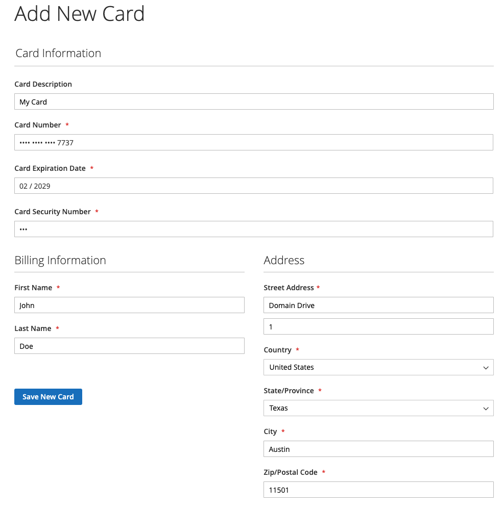
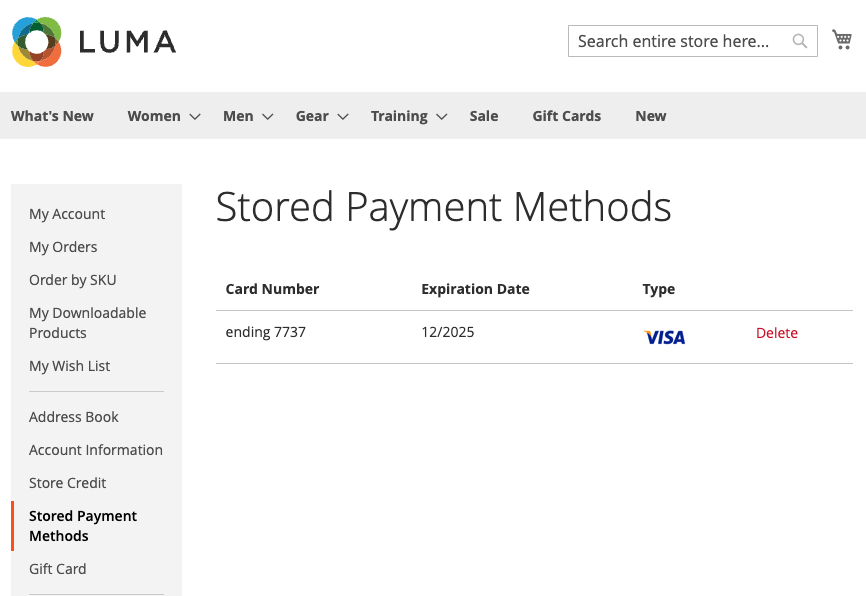
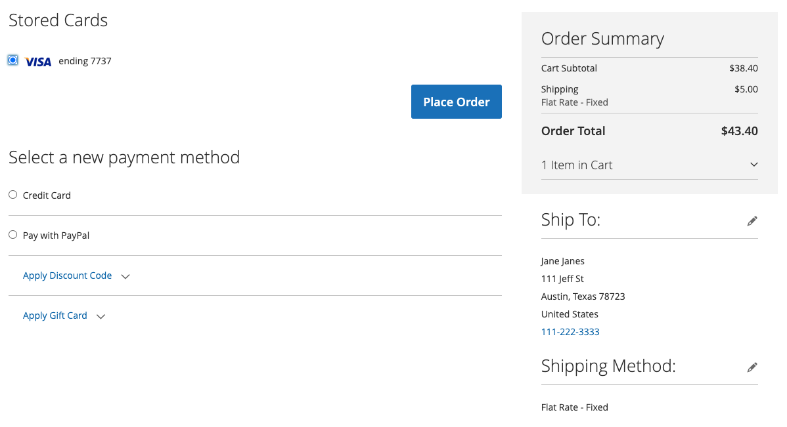
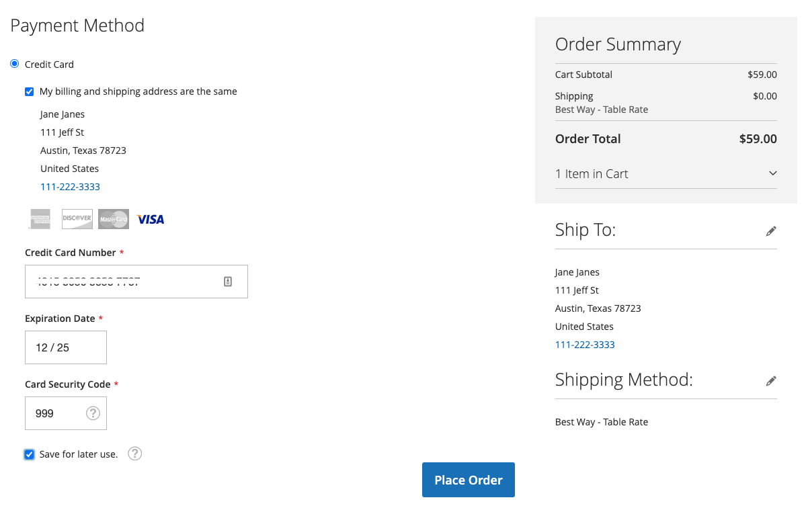
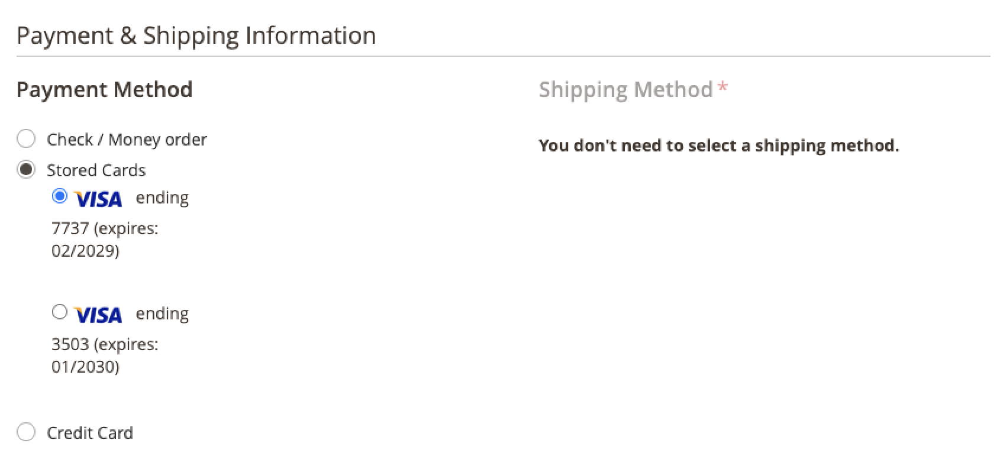

# Credit Card Vaulting

Convert one-time shoppers into loyal customers with credit card vaulting. Logged-in customers can save---or "vault"---their credit card credentials to use in a later purchase for the same, or another, store within the same merchant account.

## Enable vaulting

Merchants can enable credit card vaulting for their stores in the [!DNL Payment Services] [Settings](settings.md#card-vaulting).

1. On the _Admin_ sidebar, go to **[!UICONTROL Sales]** > **[!UICONTROL Payment Services]**.

1. Click **[!UICONTROL Settings]**.

1. Toggle the **[!UICONTROL Vault enabled]** selector. See [Enable [!DNL Payment Services]](settings.md#enable-payment-services) for more information.

## Vaulting without purchase

Logged-in customers can vault a payment method in the **My Account** dashboard by:

1. Logging into their **My Account** on the storefront.

1. Navigating to **[!UICONTROL Stored Payment Methods]** in the left navigation to see all their stored payment methods.

   See [Stored Payment Methods](https://experienceleague.adobe.com/en/docs/commerce-admin/stores-sales/payments/stored-payment-methods) for more information.

1. The customer clicks **[!UICONTROL Add New Card]** to store a new card.

   {width="400" zoomable="yes"}

   The customer must provide all required details, such as card and billing information, to vault the payment method.
   All vaulted payment methods use the billing address set while vaulting the card, which in the shopper's PayPal account. The customer might see a different billing address than the one displayed in Commerce.

1. Click **[!UICONTROL Save New Card]**

   {width="400" zoomable="yes"}

Stored cards are elegible for use when placing an order:

{width="400" zoomable="yes"}

### Delete a stored payment method

Customers can easily delete vaulted credit cards from the **Stored Payment Methods** in the **My Account** by clicking **Delete** for a specific card.

## Vaulting a payment method during checkout

Logged-in customers can vault a credit card during checkout to use in a later purchases in the current store or other stores within the same merchant account:

{width="400" zoomable="yes"}

Commerce stores a token that helps customers complete future checkouts by fetching their saved credit card information. Vaulting a card from the customer account or during checkout will result in different payment tokens.

>[!WARNING]
>
> PayPal can currently store a maximum of five vaulted cards.

## Use vaulting in the Admin

If a customer has a previously vaulted credit card, a merchant can create a subsequent order for that customer in the Admin using any of these vaulted payment methods.

You can only use vaulted cards in the Admin if the customer has both an existing account and a valid token stored in the system from a previously completed payment.

To create an order in the Admin for a customer using their vaulted credit card:

1. [Create an order and add products](https://experienceleague.adobe.com/docs/commerce-admin/stores-sales/point-of-purchase/assist/customer-account-create-order.html).
1. In _[!UICONTROL Payment & Shipping Information]_, select **[!UICONTROL Stored Cards]** as the payment method.
1. Select the desired vaulted credit card payment method.
1. After completing any other necessary steps for the order, [submit it](https://experienceleague.adobe.com/docs/commerce-admin/stores-sales/point-of-purchase/assist/customer-account-create-order.html?lang=en#step-3%3A-submit-the-order).

   {width="600" zoomable="yes"}

## Security

Minimal credit card information is shared with the shopper; they only see the last four digits, expiration date, and brand of their vaulted credit card. Credit card information is stored with the payment provider to satisfy [PCI](security.md#PCI-compliance) compliance standards.
